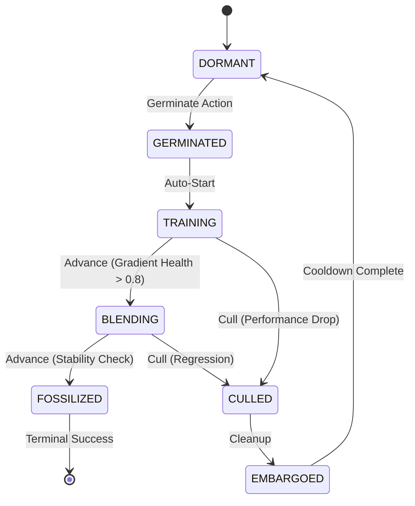

# Esper: Morphogenetic Neural Networks

**Grow capabilities, don't just train weights.**

Esper is a framework for **Morphogenetic AI**—neural networks that dynamically grow, prune, and adapt their own topology during training. Instead of a static architecture, Esper uses a lifecycle-driven approach where "seed" modules are germinated in isolation, trained on residuals, and carefully grafted into a stable host model only when they prove their worth.

## 🚀 Key Features

* **🛡️ Gradient Isolation:** Seeds train in an "incubator" state, learning from the host's errors without destabilizing its existing knowledge (catastrophic forgetting prevention).
* **🧠 Dual-Mode Control:**
  * **Tamiyo (Heuristic):** A rule-based baseline controller for stable, predictable growth.
  * **Simic (RL):** A PPO reinforcement learning agent that learns optimal growth strategies by observing training dynamics.
* **⚡ Vectorized Training:** High-performance, multi-GPU RL environment using CUDA streams and inverted control flow for massive parallel throughput.
* **🔍 Rich Telemetry:** The **Nissa** subsystem provides profile-based diagnostics (gradient health, loss landscape sharpness) for deep debugging.

---

## 🏗️ Architecture

The system is organized into six decoupled domains:

| Domain | Role | Analogy | Description |
| :--- | :--- | :--- | :--- |
| **Kasmina** | **Body** | The Plant | The neural network model, slot management, and grafting mechanics. |
| **Leyline** | **Nervous System** | Signals | Shared data contracts, enums (`SeedStage`), and tensor schemas. |
| **Tamiyo** | **Brain** | The Gardener | Strategic decision-making logic (heuristic or neural policy). |
| **Tolaria** | **Hands** | Tools | Execution engine that runs the PyTorch training loops and optimizers. |
| **Simic** | **Gym** | Simulator | RL infrastructure (PPO, IQL) for training the strategic brain. |
| **Nissa** | **Senses** | Sensors | Observability hub for routing telemetry and generating narratives. |

---

## ⚡ Quick Start

### 1. Installation

Requires Python 3.11+ and PyTorch.

```bash
# Clone and setup
git clone https://github.com/yourusername/esper.git
cd esper

# Recommended: use uv
uv sync
```

### 2\. Run a Heuristic Baseline

Train a CIFAR-10 model where `Tamiyo` (the rule-based system) manages the growth.

```bash
PYTHONPATH=src uv run python -m esper.scripts.train heuristic --task cifar10 --episodes 1
```

### 3\. Train the Brain (Reinforcement Learning)

Train the **Simic** agent using PPO to discover better growth strategies than the heuristic.

```bash
PYTHONPATH=src uv run python -m esper.scripts.train ppo \
    --task cifar10 \
    --episodes 100 \
    --n-envs 4 \
    --device cuda:0 \
    --max-epochs 25 \
    --entropy-coef 0.05
```

-----

## 🌱 The Seed Lifecycle

Esper treats neural modules like living organisms. They must earn their place in the network.



1. **Germinated:** Module created. Input connected, output detached.
2. **Training:** Module trains on host errors. Host weights frozen relative to this path.
3. **Blending:** Module output is alpha-blended into host stream.
4. **Fossilized:** Weights permanently integrated. Module becomes part of the "Host" for future seeds.

-----

## 📊 Results (POC)

Preliminary results on CIFAR-10 (ResNet-style Host):

| Approach | Final Accuracy | Notes |
| :--- | :--- | :--- |
| **Static Baseline** | 69.31% | Standard training, no growth. |
| **From-Scratch** | 65.97% | Re-initializing larger model (poor convergence). |
| **Esper (Heuristic)** | **82.16%** | Staged growth managed by Tamiyo. |
| **Esper (PPO)** | *Training...* | Learning to optimize the fossilization timing. |

-----

## 🛠️ Development

**Project Structure:**

```text
src/esper/
├── kasmina/      # Model & Slot mechanics
├── leyline/      # Shared types & contracts
├── tamiyo/       # Decision logic
├── tolaria/      # PyTorch training loops
├── simic/        # RL Algorithms (PPO, IQL)
├── nissa/        # Telemetry & Logging
└── scripts/      # CLI Entry points
```

**Run Tests:**

```bash
uv run pytest -q
```
