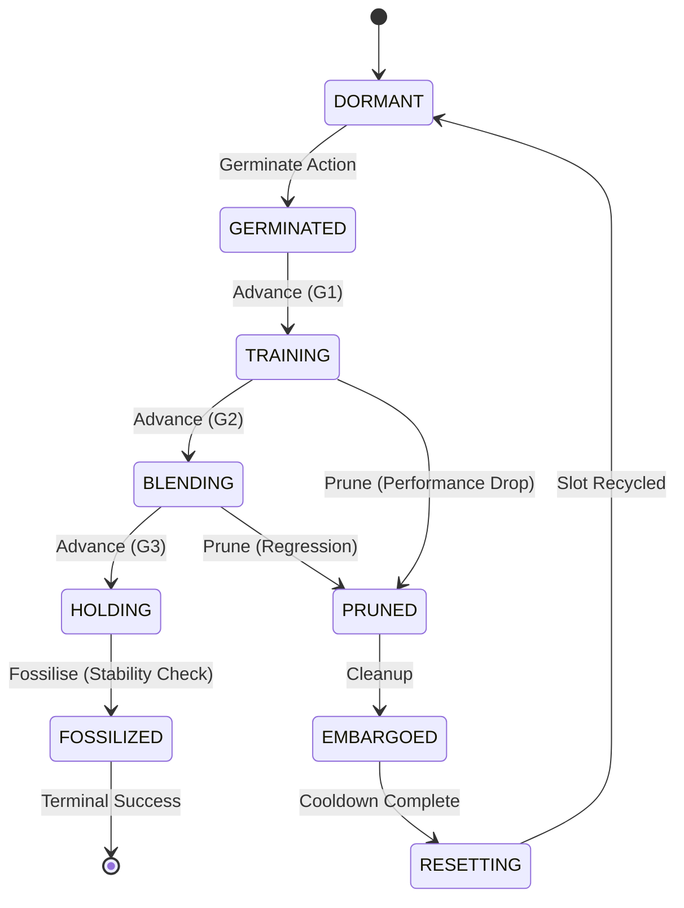

# Esper: Morphogenetic Neural Networks

**Grow capabilities — don’t just train weights.**

Esper is a framework for **Morphogenetic AI**: neural networks that dynamically grow, prune, and stabilise their own topology during training. Instead of committing up-front to a single static architecture, Esper treats new capacity as **candidate “seed” modules** that must earn their place in a stable **host** via a lifecycle of isolation, evaluation, and controlled integration.

At a glance:

- **Host** = your stable model (kept safe from destabilising updates)
- **Seeds** = new candidate modules trained on the host’s residual errors
- **Slots** = places where seeds can be germinated / trained / grafted

---

## 🚀 Key Features

- **🛡️ Gradient Isolation (Incubation):** Seeds train in an “incubator” state, learning from the host’s errors while preventing catastrophic forgetting in the host.
- **🧠 Dual-Mode Control (Same interface, different brains):**
  - **Tamiyo (Heuristic):** Rule-based controller for stable, predictable growth.
  - **Simic (PPO):** RL infrastructure that trains a neural Tamiyo-style policy to discover better growth strategies from telemetry.
- **⚡ Vectorised RL Training:** High-throughput, multi-environment PPO with CUDA-friendly execution and parallelism.
- **🔍 Rich Telemetry:** The **Nissa** subsystem provides profile-based diagnostics (gradient health, loss landscape sharpness) for deep debugging, while **Karn** surfaces that telemetry via TUIs and dashboards.

---

## 🏗️ Architecture

Esper is organised into seven decoupled domains:

| Domain | Biological Role | Description |
| :--- | :--- | :--- |
| **Kasmina** | Stem Cells | Pluripotent slots that differentiate into neural modules. Manages grafting mechanics. |
| **Leyline** | DNA/Genome | Shared data contracts, enums (`SeedStage`), tensor schemas — the genetic code. |
| **Tamiyo** | Brain/Cortex | Strategic decision-making logic (heuristic rules or a learned policy). |
| **Tolaria** | Metabolism | Execution engine that converts data into trained weights (energy conversion). |
| **Simic** | Evolution | RL infrastructure (PPO) enabling adaptation through selection pressure. |
| **Nissa** | Sensory Organs | Observability hub — perceives training dynamics and routes telemetry. |
| **Karn** | Memory | Research telemetry system with analytics, health monitoring, TUI, and web dashboard. |

> **📝 Metaphor note:** Esper uses *body/organism* terminology for system architecture (domains as organs) and *botanical* terminology for the seed lifecycle (germinate, graft, cull). Think: “stem cells undergoing a botanical development process”.

---

## ⚡ Quick Start

### 1. Installation

Requires Python 3.11+ and PyTorch.

```bash
git clone https://github.com/yourusername/esper.git
cd esper

# Recommended: use uv
uv sync
````

> If you’re not using `uv`, run with your preferred venv tooling. The commands below assume the code is under `src/`.

### 2. Run a Heuristic Baseline

Train a CIFAR-10 model where **Tamiyo (heuristic)** manages growth.

```bash
PYTHONPATH=src uv run python -m esper.scripts.train heuristic --task cifar10 --episodes 1
```

### 3. Train a Learned Controller (PPO)

Train a PPO policy via **Simic**, learning lifecycle decisions from training dynamics.

```bash
PYTHONPATH=src uv run python -m esper.scripts.train ppo \
  --task cifar10 \
  --episodes 100 \
  --n-envs 4 \
  --device cuda:0 \
  --max-epochs 25 \
  --entropy-coef 0.05
```

---

## 🌱 The Seed Lifecycle

Esper treats neural modules like living organisms. They must earn their place in the network.



Lifecycle stages (high-level):

1. **Germinated:** Module created. Input connected, output detached.
2. **Training:** Module trains on host errors; host is protected from destabilising updates along this path.
3. **Blending:** Module output is alpha-blended into the host stream (gradual exposure).
4. **Holding:** Full-amplitude hold (alpha≈1.0); stability is evaluated.
5. **Fossilised:** Weights permanently integrated; module becomes part of the “host” for future seeds.

---

## 📊 Results (POC)

Preliminary results on CIFAR-10 (ResNet-style host):

| Approach              | Final Accuracy | Notes                                              |
| :-------------------- | :------------- | :------------------------------------------------- |
| **Static Baseline**   | 69.31%         | Standard training, no growth.                      |
| **From-Scratch**      | 65.97%         | Re-initialising a larger model (poor convergence). |
| **Esper (Heuristic)** | **82.16%**     | Staged growth managed by Tamiyo.                   |
| **Esper (PPO)**       | *Training…*    | Learns when to advance, prune, and fossilise.      |

> Results are sensitive to seed budget, slot availability, reward shaping, and stability gates. Always record `--seed` and save telemetry for comparisons.

---

## 🔭 Telemetry & Monitoring

Esper supports multiple monitoring surfaces:

- **Rich TUI (default):** Full-screen terminal dashboard showing rewards, policy health (entropy, clip fraction, explained variance, KL divergence), seed states, action distribution, and losses.
- **`--sanctum`:** Textual TUI for developer debugging (replaces the Rich TUI).
- **`--overwatch`:** Vue 3 web dashboard for training monitoring. Access at `http://localhost:<port>` (default `8080`).
  Features: environment grid, seed swimlanes, health gauges, contribution waterfall, and policy diagnostics.
  Shortcuts: `1-9` (select env), `j/k` (navigate leaderboard), `h/l` (switch panels), `?` (help).

---

## 🛠️ Development

### Project Structure

```text
src/esper/
├── kasmina/      # Model & Slot mechanics
├── leyline/      # Shared types & contracts
├── tamiyo/       # Decision logic (heuristic + learned-policy interface)
├── tolaria/      # PyTorch training loops
├── simic/        # RL algorithms (PPO) + vectorised env
├── nissa/        # Telemetry & logging
├── karn/         # Research telemetry (TUI, dashboard, analytics)
└── scripts/      # CLI entry points
```

### Run Tests

```bash
uv run pytest -q
```

### Overwatch Dashboard Development

```bash
cd src/esper/karn/overwatch/web
npm install
npm run dev   # default: http://localhost:5173
npm test
```

---

## 📖 CLI Reference

> All examples below work with `uv run ...` as well as plain `python ...` if your environment is set up.

### PPO Training (`esper.scripts.train ppo`)

Train a PPO agent (via **Simic**) to learn seed lifecycle management.

```bash
PYTHONPATH=src python -m esper.scripts.train ppo [OPTIONS]
```

#### Training Scale

These flags control rollout scale and PPO update cadence.

| Flag               | Default | Description                                              |
| ------------------ | ------- | -------------------------------------------------------- |
| `--episodes N`     | 100     | PPO training iterations (policy update rounds)           |
| `--n-envs K`       | 4       | Parallel environments (vectorised rollouts)              |
| `--max-epochs L`   | 25      | Timesteps per environment per episode (training horizon) |
| `--ppo-epochs E`   | 1       | Gradient passes per PPO update                           |
| `--memory-size H`  | 128     | Policy LSTM hidden dimension (if enabled by preset)      |
| `--entropy-coef C` | 0.05    | Entropy regularisation strength                          |

Each episode produces approximately `K × L` transitions for PPO updates.

#### Config & Presets

| Flag            | Default          | Description                                                                                        |
| --------------- | ---------------- | -------------------------------------------------------------------------------------------------- |
| `--preset`      | `cifar10`        | Hyperparameter preset: `cifar10`, `cifar10_stable`, `cifar10_deep`, `cifar10_blind`, `tinystories` |
| `--config-json` | (none)           | Path to strict JSON config (unknown keys fail)                                                     |
| `--task`        | `cifar10`        | Task preset for dataloaders/topology                                                               |
| `--seed`        | (config default) | Override run seed                                                                                  |

#### Hardware & Performance

| Flag            | Default        | Description                                          |
| --------------- | -------------- | ---------------------------------------------------- |
| `--device`      | `cuda:0`       | Primary compute device                               |
| `--devices`     | (none)         | Multi-GPU devices (e.g., `cuda:0 cuda:1`)            |
| `--amp`         | off            | Automatic mixed precision                            |
| `--num-workers` | (task default) | DataLoader workers per environment                   |
| `--gpu-preload` | off            | Preload dataset to GPU (CIFAR-10 only, ~0.75GB VRAM) |

#### Checkpointing

| Flag       | Default | Description             |
| ---------- | ------- | ----------------------- |
| `--save`   | (none)  | Save checkpoint to path |
| `--resume` | (none)  | Resume from checkpoint  |

#### Telemetry & Monitoring

| Flag                         | Default  | Description                                                              |
| ---------------------------- | -------- | ------------------------------------------------------------------------ |
| `--telemetry-file`           | (none)   | Save telemetry to JSONL file                                             |
| `--telemetry-dir`            | (none)   | Save telemetry to a timestamped folder                                   |
| `--telemetry-level`          | `normal` | Verbosity: `off`, `minimal`, `normal`, `debug`                           |
| `--telemetry-lifecycle-only` | off      | Keep lightweight lifecycle telemetry even when ops telemetry is disabled |
| `--no-tui`                   | off      | Disable Rich terminal UI                                                 |
| `--sanctum`                  | off      | Launch Sanctum TUI (mutually exclusive with `--overwatch`)               |
| `--overwatch`                | off      | Launch Overwatch web dashboard                                           |
| `--overwatch-port`           | 8080     | Overwatch dashboard port                                                 |
| `--dashboard`                | off      | Enable web dashboard (requires `pip install esper-lite[dashboard]`)      |
| `--dashboard-port`           | 8000     | Dashboard server port                                                    |

---

### Heuristic Training (`esper.scripts.train heuristic`)

Run the rule-based Tamiyo controller baseline.

```bash
PYTHONPATH=src python -m esper.scripts.train heuristic [OPTIONS]
```

| Flag                          | Default          | Description                                          |
| ----------------------------- | ---------------- | ---------------------------------------------------- |
| `--episodes`                  | 1                | Number of episodes                                   |
| `--max-epochs`                | 75               | Maximum epochs per episode                           |
| `--max-batches`               | 50               | Batches per epoch (`0` = all)                        |
| `--task`                      | `cifar10`        | Task preset                                          |
| `--device`                    | `cuda:0`         | Compute device                                       |
| `--seed`                      | 42               | Random seed                                          |
| `--slots`                     | `r0c0 r0c1 r0c2` | Canonical slot IDs to enable                         |
| `--max-seeds`                 | (none)           | Maximum total seeds (omit for no limit)              |
| `--min-fossilise-improvement` | (task default)   | Minimum improvement (%) required to fossilise a seed |

Telemetry flags (`--telemetry-file`, `--telemetry-dir`, `--telemetry-level`, plus UI flags) are also available.

---

## 🧪 Example Commands

```bash
# CIFAR-10 preset (default hyperparameters)
PYTHONPATH=src python -m esper.scripts.train ppo --preset cifar10 --task cifar10

# CIFAR-10 stable preset (slower, more reliable PPO updates)
PYTHONPATH=src python -m esper.scripts.train ppo --preset cifar10_stable --task cifar10

# Tinystories preset with AMP
PYTHONPATH=src python -m esper.scripts.train ppo \
  --preset tinystories \
  --task tinystories \
  --amp

# Multi-GPU training (deep CIFAR)
PYTHONPATH=src python -m esper.scripts.train ppo \
  --preset cifar10_deep \
  --task cifar10_deep \
  --devices cuda:0 cuda:1

# Load a strict JSON config
PYTHONPATH=src python -m esper.scripts.train ppo \
  --config-json configs/ppo_config.json \
  --task cifar10

# Training with the web dashboard (default port 8000)
PYTHONPATH=src python -m esper.scripts.train ppo \
  --preset cifar10 \
  --dashboard \
  --dashboard-port 8000

# Training with the Overwatch monitoring dashboard (default port 8080)
PYTHONPATH=src python -m esper.scripts.train ppo \
  --preset cifar10 \
  --overwatch
```

---

## 🧬 TrainingConfig Reference

All PPO hyperparameters are managed through `TrainingConfig`. Key parameters beyond CLI flags:

### Quality Gates

| Parameter          | Default | Description                                                         |
| ------------------ | ------- | ------------------------------------------------------------------- |
| `permissive_gates` | `true`  | Controls how strictly seeds are evaluated for lifecycle transitions |

**Permissive gates** (`permissive_gates: true`) let the learned policy discover thresholds via reward:

- **G2 (TRAINING → BLENDING):** Passes after 1 training epoch
- **G3 (BLENDING → HOLDING):** Passes when alpha blending completes
- **G5 (HOLDING → FOSSILISED):** Passes if seed is healthy (no hard contribution threshold)

**Strict gates** (`permissive_gates: false`) enforce hard-coded thresholds for gradient ratios, improvement metrics, stability, and contribution. Use this when you want deterministic guardrails.

```json
{
  "permissive_gates": true,
  "n_episodes": 100,
  "n_envs": 4
}
```

### Reward Configuration

| Parameter              | Default          | Description                                                           |
| ---------------------- | ---------------- | --------------------------------------------------------------------- |
| `reward_mode`          | `"shaped"`       | `"shaped"` (dense), `"simplified"` (cleaner gradients), or `"sparse"` |
| `reward_family`        | `"contribution"` | `"contribution"` (counterfactual) or `"loss"` (direct loss delta)     |
| `param_budget`         | `500000`         | Parameter budget for seeds (penalise if exceeded)                     |
| `param_penalty_weight` | `0.1`            | Weight of parameter budget penalty in reward                          |

### A/B/n Reward Testing

| Parameter             | Default | Description                                                           |
| --------------------- | ------- | --------------------------------------------------------------------- |
| `reward_mode_per_env` | `null`  | Per-environment reward mode override (tuple matching `n_envs` length) |

```json
{
  "n_envs": 8,
  "reward_mode_per_env": ["shaped", "shaped", "shaped", "shaped", "simplified", "simplified", "simplified", "simplified"]
}
```

For programmatic configuration, use the `with_reward_split()` factory:

```python
from esper.simic.training import TrainingConfig
from esper.simic.rewards import RewardMode

# A/B test: 4 envs each with SHAPED and SIMPLIFIED
cfg = TrainingConfig.with_reward_split(8, [RewardMode.SHAPED, RewardMode.SIMPLIFIED])

# A/B/C test: 3-way split across 6 envs
cfg = TrainingConfig.with_reward_split(6, [RewardMode.SHAPED, RewardMode.SIMPLIFIED, RewardMode.SPARSE])
```
