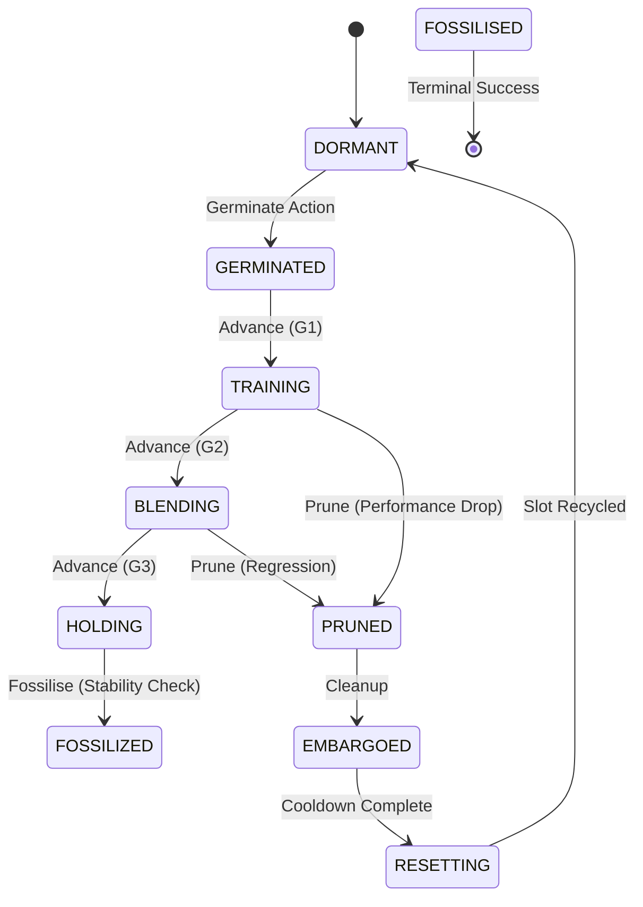

# Esper: Morphogenetic Neural Networks

**Grow capabilities, don't just train weights.**

Esper is a framework for **Morphogenetic AI**—neural networks that dynamically grow, prune, and adapt their own topology during training. Instead of a static architecture, Esper uses a lifecycle-driven approach where "seed" modules are germinated in isolation, trained on residuals, and carefully grafted into a stable host model only when they prove their worth.

## ✅ Current Architecture Baseline (Tamiyo Next: Obs V3 + Policy V2)

As of **Tamiyo Next**, the RL-controlled policy stack has been upgraded to support long-horizon, multi-seed scaffolding:

- **Obs V3:** reduced observation redundancy and moved blueprint identity to **learned embeddings**
  - Non-blueprint obs: **116 dims** (23 base + 31 per-slot × 3 slots)
  - Blueprint embedding: **4 × slots** (e.g., 12 dims for 3 slots)
  - Total policy input: **128 dims**
- **Policy V2:** **512-dim feature net + 512 hidden LSTM**, designed for ~150-epoch decision horizons
- **Critic:** action-conditioned **Q(s, op)** baseline (removes value aliasing)
- **Q-values telemetry:** Op-conditioned Q(s,op) values now visible in Sanctum UI with variance diagnostic
- **Episode length:** default **150** epochs/steps per rollout horizon

---

## 🚀 Key Features

- **🛡️ Gradient Isolation:** Seeds train in an "incubator" state, learning from the host's errors without destabilising its existing knowledge (catastrophic forgetting prevention).
- **🧠 Dual-Mode Control:**
  - **Tamiyo (Heuristic):** A rule-based baseline controller for stable, predictable growth.
  - **Simic (RL):** A PPO reinforcement learning agent that learns optimal growth strategies by observing training dynamics.
- **⚡ Vectorised Training:** High-performance, multi-GPU RL environment using CUDA streams and inverted control flow for massive parallel throughput.
- **🔍 Rich Telemetry:** The **Nissa** subsystem provides profile-based diagnostics (gradient health, loss landscape sharpness) for deep debugging. **Karn** telemetry now includes op-conditioned Q-values visible in Sanctum UI.
- **🧬 Obs V3 + Blueprint Embeddings:** Compact observation space with learned blueprint embeddings (no one-hot blueprint explosion).
- **🎯 Q(s,op) Critic:** Op-conditioned value head aligns rollout values, bootstrap values, and PPO update values.

---

## 🏗️ Architecture

The system is organised into seven decoupled domains:

| Domain | Biological Role | Description |
| :--- | :--- | :--- |
| **Kasmina** | Stem Cells | Pluripotent slots that differentiate into neural modules. Manages grafting mechanics. |
| **Leyline** | DNA/Genome | Shared data contracts, enums (`SeedStage`), tensor schemas — the genetic code. |
| **Tamiyo** | Brain/Cortex | Strategic decision-making logic (heuristic or neural policy). |
| **Tolaria** | Metabolism | Execution engine that converts data into trained weights (energy conversion). |
| **Simic** | Evolution | RL infrastructure (PPO) enabling adaptation through selection pressure. |
| **Nissa** | Sensory Organs | Observability hub — perceives training dynamics and routes telemetry. |
| **Karn** | Memory | Research telemetry system with analytics, health monitoring, TUI, and web dashboard. |

> **📝 Metaphor Note:** Esper uses *body/organism* terminology for system architecture (domains as organs) and *botanical* terminology for seed lifecycle (germinate, graft, prune). Think of it as: "The organism's stem cells undergo a botanical development process."

---

## 📚 Terminology: Nested Training Loops

Esper uses PPO to control *another neural network's training process*—an unusual meta-learning setup that creates terminology overlap. Here's how the nested loops work:

```
Outer loop: 200 batches (PPO updates)
├── Each batch: n_envs environments run in parallel
│   └── Each environment: 1 episode = 150 steps
│       └── Each step: host trains 1 epoch, Tamiyo takes 1 action
└── After batch completes: PPO update on collected trajectories
```

| Term | Meaning |
|------|---------|
| **Episode** | One complete host training run (e.g., 150 steps). The RL trajectory. |
| **Step** | One policy decision point. Tamiyo observes host state and chooses an action (WAIT, GERMINATE, PRUNE, etc.). |
| **Batch** | Collection of parallel episodes used for one PPO update. With `n_envs=10`, one batch = 10 episodes. |
| **Host epoch** | One training iteration of the host neural network (domain term, not RL term). |

> **Why the confusion?** In standard RL, "step" is unambiguous (one game frame, one physics tick). Here, each RL step is synchronized with one host training epoch—the "environment" is literally a neural network mid-training. So: *"At step 75 of episode 3, the host finished its 75th training epoch and Tamiyo decided to GERMINATE."*

---

## ⚡ Quick Start

### 1. Installation

Requires Python 3.11+ and PyTorch.

```bash
# Clone and setup
git clone https://github.com/yourusername/esper.git
cd esper

# Recommended: use uv
uv sync
````

### 2. Run a Heuristic Baseline

Train a CIFAR-10 model where `Tamiyo` (the rule-based system) manages the growth.

```bash
PYTHONPATH=src uv run python -m esper.scripts.train heuristic --task cifar10 --episodes 1
```

### 3. Train the Brain (Reinforcement Learning)

Train the **Simic** agent using PPO to discover better growth strategies than the heuristic.

```bash
PYTHONPATH=src uv run python -m esper.scripts.train ppo \
    --task cifar10 \
    --rounds 100 \
    --envs 4 \
    --episode-length 150 \
    --device cuda:0 \
```

---

## 🌱 The Seed Lifecycle

Esper treats neural modules like living organisms. They must earn their place in the network.



1. **Germinated:** Module created. Input connected, output detached.
2. **Training:** Module trains on host errors. Host weights frozen relative to this path.
3. **Blending:** Module output is alpha-blended into host stream.
4. **Holding:** Full-amplitude hold (alpha≈1.0). Stable decision point for fossilisation.
5. **Fossilised:** Weights permanently integrated. Module becomes part of the "Host" for future seeds.

---

## 🛠️ Development

**Project Structure:**

```text
src/esper/
├── kasmina/      # Model & Slot mechanics
├── leyline/      # Shared types & contracts
├── tamiyo/       # Decision logic
├── tolaria/      # PyTorch training loops
├── simic/        # RL Algorithms (PPO)
├── nissa/        # Telemetry & Logging
├── karn/         # Research telemetry (TUI, dashboard, analytics)
└── scripts/      # CLI Entry points
```

**Run Tests:**

```bash
uv run pytest -q
```

**Overwatch Dashboard Development:**

```bash
# Navigate to Overwatch web directory
cd src/esper/karn/overwatch/web

# Install dependencies
npm install

# Run dev server with hot reload (default: http://localhost:5173)
npm run dev

# Run tests
npm test
```

---

## 📖 CLI Reference

### PPO Training (`esper.scripts.train ppo`)

Train a PPO agent to learn optimal seed lifecycle management.

```bash
PYTHONPATH=src python -m esper.scripts.train ppo [OPTIONS]
```

#### Training Scale (Tamiyo-Centric)

These flags control Tamiyo's training directly. All are optional - presets provide sensible defaults.

| Flag                        | Default | Description                                              |
| --------------------------- | ------- | -------------------------------------------------------- |
| `--rounds N`                | 100     | Tamiyo PPO training iterations                           |
| `--envs K`                  | 4       | Parallel CIFAR environments (sample diversity per round) |
| `--episode-length L`        | 150     | Epochs per environment per round; also sets LSTM horizon |
| `--ppo-epochs E`            | 1       | Gradient steps per round (passes over rollout data)      |
| `--memory-size H`           | 512     | Tamiyo LSTM hidden dimension                             |
| `--entropy-anneal-episodes N` | 0     | Env-episodes for entropy annealing (N/K batches with K envs) |

Each round produces `K × L` transitions for Tamiyo's PPO update.
Doubling `--rounds` = 2× training time. Doubling `--envs` = richer data per round, same training time.

Episode length also defines Tamiyo's LSTM sequence length (`chunk_length == max_epochs`), so longer
episodes increase the temporal memory burden.

#### Config & Presets

| Flag            | Default          | Description                                                                                        |
| --------------- | ---------------- | -------------------------------------------------------------------------------------------------- |
| `--preset`      | `cifar10`        | Hyperparameter preset: `cifar10`, `cifar10_stable`, `cifar10_deep`, `cifar10_blind`, `tinystories` |
| `--config-json` | (none)           | Path to JSON config (strict: unknown keys fail)                                                    |
| `--task`        | `cifar10`        | Task preset for dataloaders/topology                                                               |
| `--seed`        | (config default) | Override run seed                                                                                  |

#### Hardware & Performance

| Flag            | Default        | Description                                          |
| --------------- | -------------- | ---------------------------------------------------- |
| `--device`      | `cuda:0`       | Primary compute device                               |
| `--devices`     | (none)         | Multi-GPU devices (e.g., `cuda:0 cuda:1`)            |
| `--num-workers` | (task default) | DataLoader workers per environment                   |
| `--gpu-preload` | off            | Preload dataset to GPU (CIFAR-10 only, ~0.75GB VRAM) |
| `--experimental-gpu-preload-gather` | off | EXPERIMENTAL: DataLoader-free gather iterator for `--gpu-preload` (CIFAR-10 only) |
| `--compile-mode` | `default`     | torch.compile mode: `default`, `max-autotune`, `reduce-overhead`, or `off` |
| `--force-compile` | off          | Force torch.compile even in TUI mode (normally disabled for debuggability) |

> **Note:** When using Sanctum TUI (`--sanctum`) or Overwatch (`--overwatch`), torch.compile is disabled by default to avoid TorchInductor errors in interactive sessions. Use `--force-compile` to override this when testing compilation performance.

#### Checkpointing

| Flag       | Default | Description                       |
| ---------- | ------- | --------------------------------- |
| `--save`   | (none)  | Path to save model checkpoint     |
| `--resume` | (none)  | Path to checkpoint to resume from |

#### Telemetry & Monitoring

| Flag                         | Default    | Description                                                                         |
| ---------------------------- | ---------- | ----------------------------------------------------------------------------------- |
| `--telemetry-file`           | (none)     | Save telemetry to JSONL file                                                        |
| `--telemetry-dir`            | (none)     | Save telemetry to timestamped folder                                                |
| `--telemetry-level`          | `normal`   | Verbosity: `off`, `minimal`, `normal`, `debug`                                      |
| `--telemetry-lifecycle-only` | off        | Keep lightweight seed lifecycle telemetry even when ops telemetry is disabled       |
| `--no-tui`                   | off        | Disable Rich terminal UI (uses console output instead)                              |
| `--sanctum`                  | off        | Launch Sanctum TUI for developer debugging (replaces Rich TUI)                      |
| `--overwatch`                | off        | Launch Overwatch web dashboard (mutually exclusive with --sanctum)                  |
| `--overwatch-port`           | 8080       | Overwatch dashboard port                                                            |
| `--dashboard`                | off        | Enable real-time WebSocket dashboard (requires `pip install esper-lite[dashboard]`) |
| `--dashboard-port`           | 8000       | Dashboard server port                                                               |
| `--wandb`                    | off        | Enable Weights & Biases logging (requires `uv sync --extra wandb`)                  |
| `--wandb-project`            | `esper`    | Wandb project name                                                                  |
| `--wandb-entity`             | (none)     | Wandb team/user name                                                                |
| `--wandb-tags`               | (none)     | Space-separated tags for this run                                                   |
| `--wandb-group`              | (none)     | Group name for related runs (e.g., ablation study)                                  |
| `--wandb-name`               | (none)     | Custom run name (auto-generated if not specified)                                   |
| `--wandb-mode`               | `online`   | Wandb mode: `online`, `offline`, or `disabled`                                      |
| `--wandb-no-code`            | off        | Disable git commit and code diff logging                                            |
| `--wandb-no-system`          | off        | Disable system metrics (GPU, CPU, memory)                                           |

**Monitoring Interfaces:**

- **Rich TUI (default)**: Full-screen terminal dashboard showing rewards, policy health (entropy, clip fraction, explained variance, KL divergence), seed states, action distribution, reward components, and losses. Disable with `--no-tui`.
- **`--sanctum`**: Textual TUI for developer debugging.
- **`--overwatch`**: Vue 3 web dashboard for training monitoring. Access at `http://localhost:8080` (or custom port). Features environment grid, seed swimlanes, health gauges, contribution waterfall, and policy diagnostics. Keyboard shortcuts: `1-9` (select env), `j/k` (navigate leaderboard), `h/l` (switch panels), `?` (help).
- **`--dashboard`**: Web-based dashboard accessible at `http://localhost:8000`. Listens on all network interfaces for remote access (e.g., `http://192.168.1.x:8000` on LAN). Displays clickable links for all available interfaces on startup.
- **`--wandb`**: Weights & Biases integration for experiment tracking and remote monitoring. Logs training metrics (loss, accuracy), PPO health (policy loss, entropy, KL divergence, clip fraction), seed lifecycle events (germination, fossilization, pruning), anomaly alerts, and system metrics (GPU/CPU/memory). Requires installation: `uv sync --extra wandb`. See [wandb.ai](https://wandb.ai) for web dashboard features.

### Heuristic Training (`esper.scripts.train heuristic`)

Run the rule-based Tamiyo controller as a baseline.

```bash
PYTHONPATH=src python -m esper.scripts.train heuristic [OPTIONS]
```

| Flag                          | Default          | Description                                           |
| ----------------------------- | ---------------- | ----------------------------------------------------- |
| `--episodes`                  | 1                | Number of episodes                                    |
| `--max-epochs`                | 75               | Maximum epochs per episode                            |
| `--max-batches`               | 50               | Batches per epoch (0=all)                             |
| `--task`                      | `cifar10`        | Task preset                                           |
| `--device`                    | `cuda:0`         | Compute device                                        |
| `--seed`                      | 42               | Random seed                                           |
| `--slots`                     | `r0c0 r0c1 r0c2` | Canonical slot IDs to enable (e.g., `r0c0 r0c1 r0c2`) |
| `--max-seeds`                 | unlimited        | Maximum total seeds                                   |
| `--min-fossilize-improvement` | (task default)   | Min improvement (%) required to fossilise a seed      |

Telemetry flags (`--telemetry-file`, `--telemetry-dir`, `--telemetry-level`) are also available.

### Example Commands

```bash
# CIFAR-10 preset (default hyperparameters)
PYTHONPATH=src python -m esper.scripts.train ppo --preset cifar10 --task cifar10

# CIFAR-10 stable preset (slower, more reliable PPO updates)
PYTHONPATH=src python -m esper.scripts.train ppo --preset cifar10_stable --task cifar10

# Tinystories preset with AMP
PYTHONPATH=src python -m esper.scripts.train ppo \
    --preset tinystories \
    --task tinystories \
    --amp

# Multi-GPU training (deep CIFAR)
PYTHONPATH=src python -m esper.scripts.train ppo \
    --preset cifar10_deep \
    --task cifar10_deep \
    --devices cuda:0 cuda:1

# Load a strict JSON config
PYTHONPATH=src python -m esper.scripts.train ppo \
    --config-json configs/ppo_config.json \
    --task cifar10

# Training with web dashboard (accessible from browser/remote)
PYTHONPATH=src python -m esper.scripts.train ppo \
    --preset cifar10 \
    --dashboard \
    --dashboard-port 8080

# Training with Overwatch monitoring dashboard
PYTHONPATH=src python -m esper.scripts.train ppo \
    --preset cifar10 \
    --overwatch

# Training with Weights & Biases experiment tracking
uv sync --extra wandb  # Install wandb first
PYTHONPATH=src python -m esper.scripts.train ppo \
    --preset cifar10 \
    --wandb \
    --wandb-project esper-morphogenesis \
    --wandb-tags ppo cifar10 baseline
```

### TrainingConfig Reference

All PPO hyperparameters are managed through `TrainingConfig`. Key parameters beyond the CLI flags:

#### Quality Gates

| Parameter          | Default | Description                                                         |
| ------------------ | ------- | ------------------------------------------------------------------- |
| `permissive_gates` | `true`  | Controls how strictly seeds are evaluated for lifecycle transitions |
| `auto_forward_g1`  | `false` | Auto-forward `GERMINATED → TRAINING` when G1 passes                 |
| `auto_forward_g2`  | `false` | Auto-forward `TRAINING → BLENDING` when G2 passes                   |
| `auto_forward_g3`  | `false` | Auto-forward `BLENDING → HOLDING` when G3 passes                    |

**Permissive Gates Mode** (`permissive_gates: true`):

Quality gates (G2, G3, G5) only check structural requirements, allowing Tamiyo to learn quality thresholds through reward signals:

- **G2 (TRAINING → BLENDING)**: Passes after 1 training epoch
- **G3 (BLENDING → HOLDING)**: Passes when alpha blending completes
- **G5 (HOLDING → FOSSILISED)**: Passes if seed is healthy (no contribution threshold)

**Strict Gates Mode** (`permissive_gates: false`):

Gates enforce hard-coded thresholds for gradient ratios, improvement metrics, stability, and contribution levels. Use this for production deployments where you want deterministic quality control.

**Auto-Forward Gates** (`auto_forward_g1/g2/g3: true`):

When enabled, Kasmina will automatically advance through the configured gated transitions at the end of each epoch (via `SeedSlot.step_epoch()`), removing `ADVANCE` as a learned decision for those stages. Fossilization remains an explicit `FOSSILIZE` decision (no auto-fossilize).

`n_episodes` counts PPO update rounds; total env episodes per run = `n_episodes * n_envs`.

```json
{
  "permissive_gates": true,
  "n_episodes": 100,
  "n_envs": 4
}
```

#### Reward Configuration

| Parameter              | Default          | Description                                                                   |
| ---------------------- | ---------------- | ----------------------------------------------------------------------------- |
| `reward_mode`          | `"shaped"`       | Reward signal strategy (see modes below)                                      |
| `reward_family`        | `"contribution"` | `"contribution"` (counterfactual) or `"loss"` (direct loss delta)             |
| `param_budget`         | `500000`         | Parameter budget for seeds (penalty if exceeded)                              |
| `param_penalty_weight` | `0.1`            | Weight of parameter budget penalty in reward                                  |
| `rent_host_params_floor` | `200`          | Host-size normalization floor for rent/alpha-shock (prevents tiny hosts being crushed) |

**Reward Modes:**

| Mode | Description | Use Case |
|------|-------------|----------|
| `shaped` | 7-component dense signals (PBRS + attribution + rent + warnings) | Default; rich feedback but potential Goodhart risk |
| `simplified` | 3-component (PBRS + intervention cost + terminal bonus) | Cleaner gradients for temporal credit assignment |
| `basic` | Minimal viable reward: contribution + rent | Baseline for ablation |
| `basic_plus` | BASIC + post-fossilization drip accountability | Prevents early-fossilization gaming |
| `sparse` | Terminal-only: final accuracy minus rent | Hard mode; theoretically perfect alignment |
| `minimal` | Sparse + early-cull penalty | Penalises wasted compute |
| `escrow` | Delayed attribution via escrow accounts | Experimental |

> **Drip Mechanism (BASIC_PLUS):** After a seed fossilizes, rewards continue to "drip" based on ongoing contribution. Controlled by `drip_fraction` (default 0.7 = 70% drip, 30% immediate). Prevents gaming where seeds are fossilized to lock in short-term gains before regression.

#### A/B Testing (True)

Use `--dual-ab` to train separate policies on separate GPUs (e.g. `shaped-vs-simplified`).
