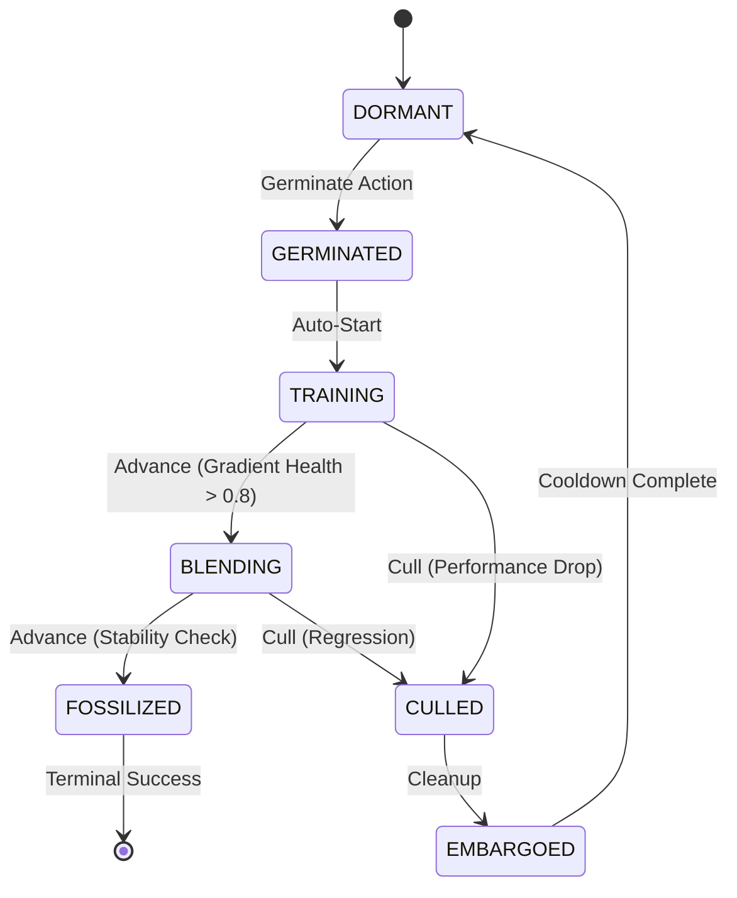

# Esper: Morphogenetic Neural Networks

**Grow capabilities, don't just train weights.**

Esper is a framework for **Morphogenetic AI**—neural networks that dynamically grow, prune, and adapt their own topology during training. Instead of a static architecture, Esper uses a lifecycle-driven approach where "seed" modules are germinated in isolation, trained on residuals, and carefully grafted into a stable host model only when they prove their worth.

## 🚀 Key Features

* **🛡️ Gradient Isolation:** Seeds train in an "incubator" state, learning from the host's errors without destabilizing its existing knowledge (catastrophic forgetting prevention).
* **🧠 Dual-Mode Control:**
  * **Tamiyo (Heuristic):** A rule-based baseline controller for stable, predictable growth.
  * **Simic (RL):** A PPO reinforcement learning agent that learns optimal growth strategies by observing training dynamics.
* **⚡ Vectorized Training:** High-performance, multi-GPU RL environment using CUDA streams and inverted control flow for massive parallel throughput.
* **🔍 Rich Telemetry:** The **Nissa** subsystem provides profile-based diagnostics (gradient health, loss landscape sharpness) for deep debugging.

---

## 🏗️ Architecture

The system is organized into seven decoupled domains:

| Domain | Biological Role | Description |
| :--- | :--- | :--- |
| **Kasmina** | Stem Cells | Pluripotent slots that differentiate into neural modules. Manages grafting mechanics. |
| **Leyline** | DNA/Genome | Shared data contracts, enums (`SeedStage`), tensor schemas — the genetic code. |
| **Tamiyo** | Brain/Cortex | Strategic decision-making logic (heuristic or neural policy). |
| **Tolaria** | Metabolism | Execution engine that converts data into trained weights (energy conversion). |
| **Simic** | Evolution | RL infrastructure (PPO) enabling adaptation through selection pressure. |
| **Nissa** | Sensory Organs | Observability hub — perceives training dynamics and routes telemetry. |
| **Karn** | Memory | Research telemetry system with analytics, health monitoring, TUI, and web dashboard. |

> **📝 Metaphor Note:** Esper uses *body/organism* terminology for system architecture (domains as organs) and *botanical* terminology for seed lifecycle (germinate, graft, cull). Think of it as: "The organism's stem cells undergo a botanical development process."

---

## ⚡ Quick Start

### 1. Installation

Requires Python 3.11+ and PyTorch.

```bash
# Clone and setup
git clone https://github.com/yourusername/esper.git
cd esper

# Recommended: use uv
uv sync
```

### 2\. Run a Heuristic Baseline

Train a CIFAR-10 model where `Tamiyo` (the rule-based system) manages the growth.

```bash
PYTHONPATH=src uv run python -m esper.scripts.train heuristic --task cifar10 --episodes 1
```

### 3\. Train the Brain (Reinforcement Learning)

Train the **Simic** agent using PPO to discover better growth strategies than the heuristic.

```bash
PYTHONPATH=src uv run python -m esper.scripts.train ppo \
    --task cifar10 \
    --episodes 100 \
    --n-envs 4 \
    --device cuda:0 \
    --max-epochs 25 \
    --entropy-coef 0.05
```

-----

## 🌱 The Seed Lifecycle

Esper treats neural modules like living organisms. They must earn their place in the network.



1. **Germinated:** Module created. Input connected, output detached.
2. **Training:** Module trains on host errors. Host weights frozen relative to this path.
3. **Blending:** Module output is alpha-blended into host stream.
4. **Fossilized:** Weights permanently integrated. Module becomes part of the "Host" for future seeds.

-----

## 📊 Results (POC)

Preliminary results on CIFAR-10 (ResNet-style Host):

| Approach | Final Accuracy | Notes |
| :--- | :--- | :--- |
| **Static Baseline** | 69.31% | Standard training, no growth. |
| **From-Scratch** | 65.97% | Re-initializing larger model (poor convergence). |
| **Esper (Heuristic)** | **82.16%** | Staged growth managed by Tamiyo. |
| **Esper (PPO)** | *Training...* | Learning to optimize the fossilization timing. |

-----

## 🛠️ Development

**Project Structure:**

```text
src/esper/
├── kasmina/      # Model & Slot mechanics
├── leyline/      # Shared types & contracts
├── tamiyo/       # Decision logic
├── tolaria/      # PyTorch training loops
├── simic/        # RL Algorithms (PPO)
├── nissa/        # Telemetry & Logging
├── karn/         # Research telemetry (TUI, dashboard, analytics)
└── scripts/      # CLI Entry points
```

**Run Tests:**

```bash
uv run pytest -q
```

---

## 📖 CLI Reference

### PPO Training (`esper.scripts.train ppo`)

Train a PPO agent to learn optimal seed lifecycle management.

```bash
PYTHONPATH=src python -m esper.scripts.train ppo [OPTIONS]
```

#### Core Training Options

| Flag | Default | Description |
|------|---------|-------------|
| `--episodes` | 100 | Number of training episodes |
| `--max-epochs` | 75 | Maximum epochs per episode |
| `--n-envs` | 4 | Number of parallel environments |
| `--update-every` | 5 | PPO update frequency (episodes) |
| `--seed` | 42 | Random seed for reproducibility |

#### PPO Hyperparameters

| Flag | Default | Description |
|------|---------|-------------|
| `--lr` | 3e-4 | Learning rate |
| `--clip-ratio` | 0.2 | PPO clipping parameter |
| `--gamma` | 0.99 | Discount factor |
| `--entropy-coef` | 0.05 | Entropy bonus coefficient |
| `--entropy-coef-start` | (uses `--entropy-coef`) | Initial entropy coefficient for annealing |
| `--entropy-coef-end` | (uses `--entropy-coef`) | Final entropy coefficient for annealing |
| `--entropy-coef-min` | 0.1 | Minimum entropy floor (prevents collapse) |
| `--entropy-anneal-episodes` | 0 | Episodes to anneal entropy (0=fixed) |

#### Reward Shaping (Sparse Reward Experiment)

| Flag | Default | Description |
|------|---------|-------------|
| `--reward-mode` | `shaped` | Reward mode: `shaped` (dense), `sparse` (terminal-only), `minimal` (sparse + early-cull penalty) |
| `--param-budget` | 500000 | Parameter budget for efficiency calculation |
| `--param-penalty` | 0.1 | Parameter overage penalty weight |
| `--sparse-scale` | 1.0 | Reward scaling for sparse modes (try 2.0-3.0 if learning is slow) |

**Reward Modes Explained:**
- **`shaped`** (default): Dense rewards with counterfactual contribution signals at every timestep. Best for initial training.
- **`sparse`**: Terminal-only rewards based on final accuracy. Tests credit assignment over long horizons.
- **`minimal`**: Sparse rewards plus penalty for early culling. Discourages wasteful seed germination.

#### Task Configuration

| Flag | Default | Description |
|------|---------|-------------|
| `--task` | `cifar10` | Task preset: `cifar10`, `cifar10_deep`, `tinystories` |
| `--slots` | `mid` | Seed slots to enable: `early`, `mid`, `late` (space-separated) |
| `--max-seeds` | unlimited | Maximum total seeds across all slots |

#### Hardware & Performance

| Flag | Default | Description |
|------|---------|-------------|
| `--device` | `cuda:0` | Primary compute device |
| `--devices` | (none) | Multi-GPU devices (e.g., `cuda:0 cuda:1`) |
| `--num-workers` | (task default) | DataLoader workers per environment |
| `--gpu-preload` | off | Preload dataset to GPU (CIFAR-10 only, ~0.75GB VRAM) |

#### Checkpointing

| Flag | Default | Description |
|------|---------|-------------|
| `--save` | (none) | Path to save model checkpoint |
| `--resume` | (none) | Path to checkpoint to resume from |

#### Telemetry & Monitoring

| Flag | Default | Description |
|------|---------|-------------|
| `--telemetry-file` | (none) | Save telemetry to JSONL file |
| `--telemetry-dir` | (none) | Save telemetry to timestamped folder |
| `--telemetry-level` | `normal` | Verbosity: `off`, `minimal`, `normal`, `debug` |
| `--no-telemetry` | off | Disable telemetry features (50-dim obs instead of 60-dim) |
| `--tui` | off | Enable Rich terminal UI for live training monitoring |
| `--dashboard` | off | Enable real-time WebSocket dashboard (requires `pip install esper-lite[dashboard]`) |
| `--dashboard-port` | 8000 | Dashboard server port |

**Monitoring Interfaces:**
- **`--tui`**: Full-screen terminal dashboard showing rewards, policy health (entropy, clip fraction, explained variance, KL divergence), seed states, action distribution, reward components, and losses. Color-coded health indicators (green/yellow/red) highlight training issues.
- **`--dashboard`**: Web-based dashboard accessible at `http://localhost:8000`. Listens on all network interfaces for remote access (e.g., `http://192.168.1.x:8000` on LAN). Displays clickable links for all available interfaces on startup.

### Heuristic Training (`esper.scripts.train heuristic`)

Run the rule-based Tamiyo controller as a baseline.

```bash
PYTHONPATH=src python -m esper.scripts.train heuristic [OPTIONS]
```

| Flag | Default | Description |
|------|---------|-------------|
| `--episodes` | 1 | Number of episodes |
| `--max-epochs` | 75 | Maximum epochs per episode |
| `--max-batches` | 50 | Batches per epoch (0=all) |
| `--task` | `cifar10` | Task preset |
| `--device` | `cuda:0` | Compute device |
| `--seed` | 42 | Random seed |
| `--slots` | `mid` | Seed slots to enable |
| `--max-seeds` | unlimited | Maximum total seeds |

Telemetry flags (`--telemetry-file`, `--telemetry-dir`, `--telemetry-level`) are also available.

### Example Commands

```bash
# Basic PPO training
PYTHONPATH=src python -m esper.scripts.train ppo --episodes 100 --n-envs 4

# Multi-GPU training with telemetry
PYTHONPATH=src python -m esper.scripts.train ppo \
    --episodes 200 \
    --devices cuda:0 cuda:1 \
    --telemetry-dir ./runs

# Sparse reward experiment (test credit assignment)
PYTHONPATH=src python -m esper.scripts.train ppo \
    --reward-mode sparse \
    --sparse-scale 2.0 \
    --episodes 100

# Multi-slot training with seed limits
PYTHONPATH=src python -m esper.scripts.train ppo \
    --slots early mid late \
    --max-seeds 5

# Fast iteration with GPU preload
PYTHONPATH=src python -m esper.scripts.train ppo \
    --gpu-preload \
    --n-envs 8 \
    --episodes 50

# Training with terminal UI (live dashboard in terminal)
PYTHONPATH=src python -m esper.scripts.train ppo \
    --tui \
    --episodes 100 \
    --n-envs 4

# Training with web dashboard (accessible from browser/remote)
PYTHONPATH=src python -m esper.scripts.train ppo \
    --dashboard \
    --dashboard-port 8080 \
    --episodes 100

# TUI with telemetry file logging
PYTHONPATH=src python -m esper.scripts.train ppo \
    --tui \
    --telemetry-file training.jsonl \
    --episodes 100
```
