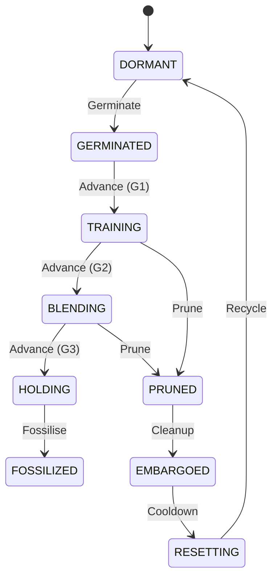

# Esper: Morphogenetic Neural Networks

**Grow capabilities, don’t just train weights.**

Esper is a framework for **morphogenetic AI**: neural networks that can **grow, prune, and adapt their own topology during training**. Instead of committing to a static architecture up front, Esper uses a lifecycle-driven approach where “seed” modules are germinated, trained safely, and only blended into the host when they earn their keep.

---

## What exists today

Esper is built as a set of decoupled subsystems. The ones you will see in the codebase and tooling right now are:

* **Kasmina** (host + slots): the morphogenetic model and the mechanics for inserting, training, blending, and fossilising seeds.
* **Tamiyo** (decision-maker): chooses lifecycle actions (germinate, blend, prune, fossilise, etc.) using either heuristics or a learned policy.
* **Simic** (selection pressure): reward, accounting, PPO training loop, and the “economy” (rent, churn, contribution signals).
* **Tolaria** (execution engine): high-throughput, deterministic training/evaluation substrate; governs safety rollback.
* **Nissa** (telemetry backends): emits structured diagnostics and run artefacts for analysis.
* **Karn** (operator UI + analytics): Sanctum TUI, Overwatch dashboard, logs, aggregation, and “flight recorder” style visibility.

Planned subsystems (designed but not yet fully shipped as first-class controllers):

* **Emrakul** (maintenance/decay policy): evidence-led probe/sedate/lyse of committed structure; long-horizon efficiency.
* **Narset** (allocator): slow-timescale budget allocator coordinating multiple Tamiyo/Emrakul pairs.
* **Esika** (host superstructure): container/ruleset that deconflicts Kasmina “cells” and hosts Narset at scale.

---

## Current architecture baseline

As of the current “Tamiyo Next” baseline, the RL-controlled stack supports long-horizon, multi-seed behaviour:

* **Obs V3**: reduced redundancy; blueprint identity moved to learned embeddings

  * Non-blueprint obs: **116 dims** (23 base + 31 per-slot × 3 slots)
  * Blueprint embedding: **4 × slots** (e.g. 12 dims for 3 slots)
  * Total policy input: **128 dims**
* **Policy V2**: **512-dim feature net + 512 hidden LSTM**, designed for ~150-step horizons
* **Critic**: action-conditioned baseline (**Q(s, op)** style), reducing value aliasing
* **Default episode length**: **150** steps (epochs) per rollout horizon

---

## Key ideas

### Seed lifecycle (Kasmina)

Seeds are introduced and evaluated under a controlled state machine:

* **Germinated**: module exists, influence is isolated
* **Training**: learns “behind the host” (safe, no destabilising contribution)
* **Blending**: alpha ramps in under controlled schedules
* **Holding**: stabilisation window before committing
* **Fossilised**: accepted as part of the model’s committed structure

### Gradient isolation

Seeds can learn from task gradients without immediately altering the host’s forward behaviour, reducing destabilisation during early growth.

### Vectorised training (Tolaria + Simic)

Esper’s training loop is designed for high throughput:

* parallel environments
* GPU-first execution
* deterministic replay principles
* “inverted control flow” (batches drive environments, not the other way around)

### Telemetry as an API (Nissa + Karn)

Telemetry is treated like a contract:

* typed payloads
* schema validation
* explicit provenance
* UI panels reflect real signals (no silent fallback)

---

## Quick start

### Installation

Requires Python 3.11+ and PyTorch.

```bash
git clone https://github.com/yourusername/esper.git
cd esper
uv sync
```

### Heuristic baseline (Tamiyo heuristic)

```bash
PYTHONPATH=src uv run python -m esper.scripts.train heuristic \
  --task cifar_baseline --episodes 1
```

### PPO training (Simic RL)

```bash
PYTHONPATH=src uv run python -m esper.scripts.train ppo \
  --task cifar_baseline \
  --rounds 100 \
  --envs 4 \
  --episode-length 150 \
  --device cuda:0
```

---

## System map

| Domain      | Role                                      | Exists today | Notes                                                     |
| ----------- | ----------------------------------------- | ------------ | --------------------------------------------------------- |
| **Kasmina** | Host + SeedSlots + lifecycle mechanics    | ✅            | “Where topology changes happen” under strict contracts    |
| **Leyline** | Shared enums/contracts/schemas            | ✅            | Source of truth for types and ordering invariants         |
| **Tamiyo**  | Growth policy (heuristic or learned)      | ✅            | Manages seeds pre-commit                                  |
| **Simic**   | Reward + PPO + accounting                 | ✅            | Selection pressure, credit signals, and training loop     |
| **Tolaria** | Execution engine + determinism + rollback | ✅            | High-throughput substrate and safety governor             |
| **Nissa**   | Telemetry backends                        | ✅            | Structured emission and artefact routing                  |
| **Karn**    | Operator UI + analytics                   | ✅            | Sanctum/Overwatch and aggregation                         |
| **Emrakul** | Decay/maintenance policy                  | 🧭 Planned   | Probe/sedate/lyse for efficiency and consolidation        |
| **Narset**  | Budget allocator over regions             | 🧭 Planned   | Slow coordinator based on coarse health signals           |
| **Esika**   | Host superstructure                       | 🧭 Planned   | Deconfliction + safe-boundary scheduling + Narset hosting |

---

## CLI overview

### PPO training (`esper.scripts.train ppo`)

Core scaling knobs:

| Flag                 | Default | Meaning                                     |
| -------------------- | ------- | ------------------------------------------- |
| `--rounds N`         | 100     | PPO update rounds                           |
| `--envs K`           | 4       | Parallel environments per round             |
| `--episode-length L` | 150     | Steps per env per round (also LSTM horizon) |
| `--ppo-epochs E`     | 1       | PPO update passes over rollout data         |
| `--memory-size H`    | 512     | LSTM hidden size                            |

Config/presets:

| Flag                 | Default          | Meaning                                |
| -------------------- | ---------------- | -------------------------------------- |
| `--task`             | `cifar_baseline` | Host + dataloaders + topology preset   |
| `--preset`           | `cifar_baseline` | Hyperparameter preset                  |
| `--config-json PATH` | (none)           | Strict config file (unknown keys fail) |
| `--seed N`           | (config)         | Run seed override                      |

Hardware/perf:

| Flag              | Default   | Meaning                                     |
| ----------------- | --------- | ------------------------------------------- |
| `--device`        | `cuda:0`  | Policy device                               |
| `--devices`       | (none)    | Multi-GPU env devices (`cuda:0 cuda:1 ...`) |
| `--num-workers`   | (task)    | DataLoader workers                          |
| `--gpu-preload`   | off       | CIFAR GPU preload (VRAM trade)              |
| `--compile-mode`  | `default` | torch.compile mode                          |
| `--force-compile` | off       | Compile even in TUI mode                    |

Telemetry/monitoring:

| Flag                   | Meaning                                  |
| ---------------------- | ---------------------------------------- |
| `--sanctum`            | Textual TUI for debugging                |
| `--overwatch`          | Web dashboard                            |
| `--telemetry-dir PATH` | Write telemetry artefacts                |
| `--wandb`              | Enable Weights & Biases (optional extra) |

---

## Seed lifecycle diagram



---

## Results notes

Esper’s performance is best evaluated as a **frontier**: quality vs cost vs stability. Peak accuracy matters, but reliability and growth ratio matter more. The system is designed to support:

* “capable host augmentation” (baseline CIFAR)
* “rescue a broken host” (impaired/minimal CIFAR)
* scaling pressure tests (deep/multi-slot hosts)

---

## Development

Run tests:

```bash
uv run pytest -q
```

Project structure:

```text
src/esper/
├── kasmina/      # Host + slots + seed mechanics
├── leyline/      # Shared contracts and schemas
├── tamiyo/       # Policies and action masks
├── tolaria/      # Execution engine + safety governor
├── simic/        # PPO + reward/accounting
├── nissa/        # Telemetry backends and outputs
├── karn/         # UI, dashboards, analytics
└── scripts/      # CLI entry points
```
