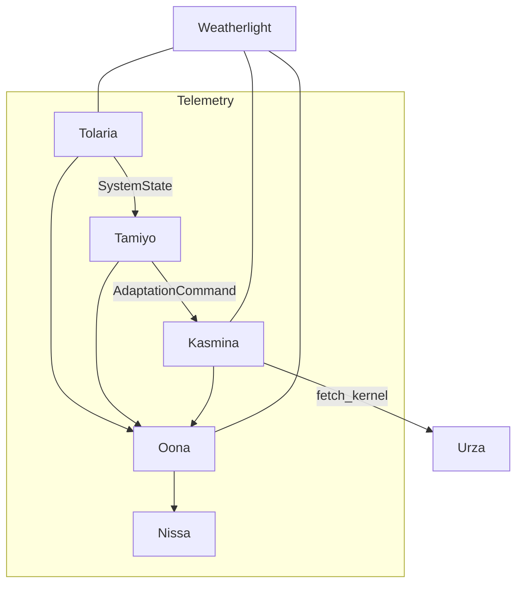

# Esper-Lite Project Scaffold

Esper-Lite is a streamlined morphogenetic control stack centred on a PyTorch 2.8 runtime. This scaffold establishes the shared tooling, package layout, and subsystem contracts needed to begin feature development across Tolaria, Kasmina, Tamiyo, Simic, and the blueprint and infrastructure services.

[](https://app.codacy.com/gh/tachyon-beep/esper-lite/dashboard?utm_source=gh&utm_medium=referral&utm_content=&utm_campaign=Badge_grade)
[](https://app.codacy.com/gh/tachyon-beep/esper-lite/dashboard?utm_source=gh&utm_medium=referral&utm_content=&utm_campaign=Badge_coverage)

## Architecture Summary

For an end-to-end view of subsystems, contracts, flows, telemetry, and operational guardrails, see `docs/architecture_summary.md`. Visual diagrams of integrations and flows live in `docs/architecture_diagrams.md`.

### Architecture At a Glance

- Tolaria trains and emits `SystemStatePacket`s; Tamiyo evaluates state and issues `AdaptationCommand`s; Kasmina enforces lifecycle/gates and grafts kernels.
- Karn defines blueprint descriptors; Tezzeret compiles them into artifacts; Urza stores/serves artifacts and prefetches.
- Oona is the message fabric (Redis Streams) for commands, telemetry, policy updates, and prefetch; Nissa ingests into Prometheus/Elasticsearch; Weatherlight supervises the above for a runnable prototype.

### Design Principles

- Contracts first: Leyline protobufs are the source of truth; avoid shadow enums.
- Safety built-in: circuit breakers, lifecycle gates, latency budgets, readiness/rollback, signature+nonce freshness.
- Observability by default: structured telemetry with health summary/indicators; important events are explicit.
- Durability where it matters: WAL/checkpoints for Tolaria/Tezzeret/Urza and Tamiyo field reports.
- Extensibility: protocols/interfaces keep subsystems loosely coupled.

### Key Leyline Contracts

- `SystemStatePacket` (Tolaria → Tamiyo), `AdaptationCommand` (Tamiyo → Kasmina), `SeedState` (Kasmina export).
- `TelemetryPacket` (metrics/events/health), `FieldReport` (Tamiyo → Simic).
- Prefetch: `KernelPrefetchRequest` / `KernelArtifactReady` / `KernelArtifactError`.
- `KernelCatalogUpdate` (Tezzeret → Urza; optional notify via Oona).

### Core Flows & Diagrams

- System context and integrations: see section 1 in `docs/architecture_diagrams.md`.
- Epoch sequence (training → decision → execution): see section 2.
- Kernel prefetch flow: see section 3.
- Tezzeret compilation pipeline: see section 4.
- Offline policy improvement (Simic): see section 5.
- Observability & SLOs: see section 6.

### Observability Model

- Standardized telemetry via `build_telemetry_packet` with metrics and events.
- Health status/summary/indicators encode synthetic service health.
- Nissa drains Oona streams to Prometheus/Elasticsearch, applies default alert rules, and tracks SLO burn via `slo.*` metrics.

### System Context (Mermaid)

GitHub renders Mermaid diagrams inline. This minimal context view matches the full diagrams in `docs/architecture_diagrams.md`:



### Prototype Delta (Green‑for‑Prototype Scope)

This repo tracks a pragmatic prototype scope distinct from the full detailed design. The living diff is documented per subsystem here:

- docs/prototype-delta/README.md

Use the prototype‑delta docs and rubric to judge readiness for the “green for prototype” build. Only adopt full detailed‑design features when explicitly called out by the delta.

## Prototype Policies for Human Developers

To keep the prototype simple, deterministic, and easy to reason about, we apply these cross‑cutting policies across the repo. These mirror the agent guidelines but are phrased for human contributors.

- Strict dependencies (no pseudo‑optional deps)
  - If a package is needed for normal operation, declare it in `pyproject.toml` and import it directly. Do not wrap imports in `try/except` unless the feature is truly optional and fully gated.
  - Service startup performs a “preflight” to validate core imports and basic connectivity (e.g., Elasticsearch ping), and GPU prerequisites (NVML when CUDA is available). Fail fast on missing deps rather than limping along.
  - Tests must provide mandatory collaborators explicitly (e.g., pass an `UrzaLibrary` to `TamiyoService`). Avoid hidden defaults.

- No backwards compatibility pre‑1.0
  - As a prototype, we prioritise removing complexity over maintaining compatibility shims. Prefer breaking changes that simplify code and remove dead paths.
  - When changing behaviour, update tests and docs in the same PR so the repo stays “green for prototype”.

- No “helpful masking” of failures
  - Do not auto‑construct or silently substitute critical components (e.g., defaulting to a stub Urza or in‑memory ES) in live codepaths. These mask real system faults and complicate diagnosis.
  - Emit clear, actionable errors and telemetry, and stop early when preconditions are not met.

- No partial degradation
  - Assume all subsystems are available and healthy; otherwise treat the system as fully degraded. Avoid threading “partial availability” branches through core paths.
  - Weatherlight emits a `system_mode` indicator (`operational`/`degraded`) based on worker health/backoff; startup preflight rejects missing deps outright.

- Code hygiene (remove dead code)
  - Delete unused toggles and fallback code once a feature is in place. Prefer one authoritative implementation over multiple conditional paths.

- Testing & CI posture
  - Unit tests: assert both success paths and guard‑rail failures; don’t depend on masked defaults. Use explicit fakes (FakeRedis) and minimal real collaborators (e.g., `UrzaLibrary` rooted under `tmp_path`).
  - Integration tests: exercise cross‑subsystem flows with real contracts (Leyline) under strict preflight. CI disables `torch.compile` to avoid spurious timeouts.

- Documentation duties
  - When enforcing strictness (e.g., ES mandatory, Tamiyo requires Urza), update the relevant subsystem README under `docs/prototype-delta/*/` and the operator runbook. Keep the cross‑system plan (`docs/prototype-delta/cross-system/STRICT_DEPENDENCIES_PLAN.md`) up to date.

Pointers

- Cross‑system plan: `docs/prototype-delta/cross-system/STRICT_DEPENDENCIES_PLAN.md`
- Agent guidelines (deeper detail for AI devs): `AGENTS.md`

## Getting Started

1. **Create a virtual environment**

   ```bash
   python3.11 -m venv .venv
   source .venv/bin/activate
   pip install --upgrade pip
   pip install -e .[dev]
   ```

2. **Run quality gates**

   ```bash
   pytest tests
   pylint --rcfile .codacy/tools-configs/pylint.rc src/esper
   ruff check src tests
   mypy src/esper
   # CI runs the following focused suites as well:
   pytest -m "not integration and not performance"
   pytest -m integration
   pytest tests/leyline/test_contracts.py
   pytest -m "not performance" tests/leyline/test_serialization.py
   ```

3. **Launch local infrastructure (placeholder)**
   - Docker compose definitions live under `infra/`. Use `docker compose -f infra/docker-compose.redis.yml up -d` to start Redis bound to the host.
   - Redis, Prometheus, and Elasticsearch endpoints are documented in `docs/project/implementation_plan.md`.

### Redis for Oona integration tests

Spin up the local Redis instance used by the Oona integration suite:

```bash
docker compose -f infra/docker-compose.redis.yml up -d
pytest -m integration tests/oona/test_messaging_integration.py
docker compose -f infra/docker-compose.redis.yml down
```

Set `REDIS_URL` if you expose Redis on a non-default port.

Or run all integration tests with automatic Redis bring-up/teardown:

```bash
scripts/run_integration.sh
```

### Telemetry & Policy Streams

- `OONA_NORMAL_STREAM`, `OONA_EMERGENCY_STREAM`, `OONA_TELEMETRY_STREAM`, and `OONA_POLICY_STREAM` define the Redis Streams used for Tolaria system state, Tamiyo telemetry, and Simic policy updates. Defaults are provided in `.env.example`.
- Nissa exposes Prometheus metrics via the ASGI helper in `src/esper/nissa/server.py`. Run `uvicorn esper.nissa.server:create_app --factory` with a configured `NissaIngestor` to scrape metrics and feed dashboards/alerts.

### Observability Stack (Prometheus + Grafana + Elasticsearch)

Bring up the local observability stack and wire it to the Nissa runner:

```bash
docker compose -f infra/docker-compose.observability.yml up -d
esper-nissa-service  # in a separate shell
```

The compose file launches Prometheus (host networking), Grafana (port `3000`),
and a single-node Elasticsearch instance at `http://localhost:9200`. The
`esper-nissa-service` entry point (also accessible via
`scripts/run_nissa_service.py`) drains telemetry from Oona and exposes
`/metrics` and `/healthz` on `http://localhost:9100`.

Prometheus is preconfigured via `infra/prometheus/prometheus.yml` to scrape
`localhost:9100/metrics`. Grafana ships with provisioning in `infra/grafana/`
and is available on <http://localhost:3000> (admin/admin). Operational
procedures and teardown steps live in
`docs/project/observability_runbook.md`.

Always-on local infra (recommended)

```bash
# Start all containers (Redis, Prometheus, Grafana, Elasticsearch) and leave them running
scripts/start_all_infra.sh

# When you need to stop them
scripts/stop_all_infra.sh
```

All services are configured with `restart: unless-stopped`, so they’ll auto-restart on reboot.

### Leyline Contracts

- Protobuf definitions live under `contracts/leyline/leyline.proto`.
- Regenerate Python bindings with:

  ```bash
  scripts/generate_leyline.py
  ```

- Validate serialization semantics:

  ```bash
  pytest tests/leyline/test_serialization.py
  ESPER_RUN_PERF_TESTS=1 pytest tests/leyline/test_serialization.py -m performance  # optional
  ```

The generated files are stored in `src/esper/leyline/_generated/` and include
`.pyi` type stubs for static analysis.

### Simic Offline Training

- Field reports collected from Tamiyo populate the replay buffer used by Simic
  (`esper.simic.replay`).
- Run the smoke tests with:

  ```bash
  pytest tests/simic/test_replay.py tests/simic/test_trainer.py
  ```

- `scripts/run_demo.py` demonstrates the full loop: Tolaria → Tamiyo → Kasmina
  followed by Simic PPO training with feature-rich replay vectors (numeric,
  metric sequence, persistent embeddings, attention), optional LoRA adapters,
  and policy hot-reload via Oona. Tamiyo consumes the same shared features to
  produce multi-head actions which are observable through new telemetry fields.
- Simic automatically executes a validation harness after each training run;
  tweak thresholds via `SimicTrainerConfig` (e.g., `validation_min_reward`,
  `validation_max_policy_loss`) to suit your scenario. Policy updates are only
  published if validation succeeds, and failures emit telemetry warnings.
- Nissa now evaluates alert rules (`training_latency_high`,
  `kasmina_isolation_violation`, `oona_queue_depth`,
  `tezzeret_compile_retry_high`) and exposes a `/metrics/summary` endpoint with
  active alerts and SLO burn rates. Feed SLO metrics via telemetry using
  `slo.<name>_actual`/`slo.<name>_objective` pairs.

### Blueprint Catalog

- Karn ships with 50 pre-approved blueprints spanning safe (BP001–BP035),
  experimental (BP036–BP042), and high-risk quarantine (BP043–BP050) tiers.
  Instantiate `KarnCatalog()` to load the full library, or pass
  `load_defaults=False` in tests to start with an empty catalog. Use
  `choose_template(...)` for deterministic selection—context strings hash to
  stable templates and conservative mode restricts results to the safe pool.

- Kasmina uses those same blueprint ids when grafting seeds. The seed manager
  requests kernels from Urza via `UrzaRuntime.fetch_kernel`, enforces a
  10 ms latency budget, and automatically falls back to a conservative
  blueprint (`BP001` by default) or an identity kernel if the fetch fails.

### Tezzeret Compilation Forge

- `TezzeretForge` orchestrates blueprint compilation at startup. Provide a
  `KarnCatalog`, `UrzaLibrary`, and `TezzeretCompiler`—it will queue every
  blueprint, compile missing artifacts, and resume from interruptions via a
  simple JSON WAL. Use `CompileJobConfig(max_retries=...)` to control retry
  behaviour; failures leave the WAL intact for the next run.

### Urza Catalog

- `UrzaLibrary` now stores artifacts in SQLite with an LRU cache and WAL-based
  crash recovery. Save operations copy artifacts into the Urza root, log a WAL
  entry, upsert the catalog row, and then clear the WAL. On restart any
  residual WAL entry is replayed automatically. Use `fetch_by_tier`/`get` for
  low-latency lookups or run TezzeretForge to populate missing artifacts.

### Tamiyo Blueprint Awareness

- When Tamiyo issues a seed command, it fetches blueprint metadata from Urza
  (tier, risk, stage, quarantine flag). High-risk or quarantined blueprints
  automatically trigger a pause command, and telemetry emits
  `tamiyo.blueprint.*` metrics for Nissa. Metadata lookups are cached for
  five minutes and respect Urza’s persisted risk data.

### Field Report Persistence

- Tamiyo writes every generated field report to `var/tamiyo/field_reports.log`
  using a WAL-style binary log. Entries are retained for 24 hours by default
  (override with `TAMIYO_FIELD_REPORT_RETENTION_HOURS`) and are reloaded on
  startup so Simic always has a consistent replay source after a restart.
Delete the log file if you need a clean slate for local testing.

### Urabrask — BSDS Producer CLI (Prototype)

Use the Urabrask CLI to compute a BSDS via the Crucible and attach it to an existing Urza blueprint record. The CLI prints a concise JSON summary to stdout.

Run via module (no install needed):

```bash
PYTHONPATH=src \
python -m esper.urabrask.cli \
  --urza-root ./var/urza \
  --blueprint-id BP001 \
  --resource-profile gpu
```

Example output JSON:

```json
{
  "blueprint_id": "BP001",
  "risk_score": 0.62,
  "hazard_band": "HIGH",
  "handling_class": "restricted",
  "resource_profile": "gpu",
  "provenance": "URABRASK",
  "issued_at": "2025-09-23T21:30:00Z"
}
```

Notes

- The BSDS JSON mirror is also persisted to Urza `extras["bsds"]` for Tamiyo to consume.
- Optional signing + WAL: set `ESPER_LEYLINE_SECRET` and `URABRASK_SIGNING_ENABLED=true` to attach `extras["bsds_sig"]` and append to the WAL (`URABRASK_WAL_PATH`).
- Crucible result bundles: per‑run JSON artifacts are written under `URABRASK_CRUCIBLE_ARTIFACTS_DIR` with retention (`URABRASK_CRUCIBLE_ARTIFACTS_KEEP`).

## Repository Layout

- `src/esper/` — Python packages for Esper subsystems, organised by lifecycle phase.
- `tests/` — Pytest suites mirroring the source tree (`tests/tolaria`, `tests/kasmina`, etc.).
- `docs/` — Design references, implementation plans, and backlog materials.
- `.codacy/` — Shared linting and CI bootstrap configuration.

## Tooling

- Regenerate Leyline bindings (requires `grpcio-tools` in your environment):

  ```bash
  # Optional: install tools in your venv
  pip install grpcio-tools
  # Generate python stubs into src/esper/leyline/_generated
  esper-leyline-generate \
    --proto-dir contracts/leyline \
    --out-dir src/esper/leyline/_generated
  ```

  The same logic is also available as a script: `scripts/generate_leyline.py`.

## Subsystem Overview

Each subsystem module exposes a narrow public API under `src/esper/<subsystem>/__init__.py` and includes placeholder classes that cite the authoritative detailed design section:

- **Tolaria** (`docs/design/detailed_design/01-tolaria.md`) — Training orchestrator and epoch control loop.
- **Kasmina** (`docs/design/detailed_design/02-kasmina.md`) — Seed lifecycle manager and kernel executor.
- **Tamiyo** (`docs/design/detailed_design/03-tamiyo.md`) — Strategic controller, risk governance, and telemetry hub.
- **Simic** (`docs/design/detailed_design/04-simic.md`) — Offline policy trainer using PPO + LoRA on PyTorch 2.8.
- **Karn, Tezzeret, Urza** (`docs/design/detailed_design/05-karn.md`, `06-tezzeret.md`, `08-urza.md`) — Blueprint catalog, compiler, and artifact library.
- **Leyline, Oona, Nissa** (`docs/design/detailed_design/00-leyline.md`, `09-oona.md`, `10-nissa.md`) — Contracts, messaging fabric, and observability stack.

## Next Steps

The backlog in `docs/project/backlog.md` decomposes the first implementation sprints. Slice 0 focuses on CI/tooling and Leyline contracts. Slice 1 establishes the control loop with Tolaria, Kasmina, and Tamiyo, followed by blueprint management, observability, and offline learning in subsequent slices.

Refer to `docs/project/implementation_plan.md` for full sequencing and ownership recommendations.

## Gotchas & Best Practices

- Always use Leyline enums/messages; avoid re-defining states or codes.
- Treat publish/consume paths as potentially lossy; keep handlers idempotent and rely on retries.
- Keep breakers conservative—prefer safe degradation and explicit telemetry over silent failures.
- When adding telemetry, include clear descriptions and useful attributes; keep metric naming consistent.
- Update `docs/` when behavior diverges from the canonical design; keep `.env.example` in sync for new config.

### Pre-commit hooks

This repository includes a pre-commit check that prevents introducing local Python Enums that shadow Leyline contracts.

Setup:

1) Install pre-commit

```
pip install pre-commit
```

2) Install hooks in your clone

```
pre-commit install
```

The hook runs `scripts/check_shared_types.py` to fail commits that add Enums under `src/esper/**` (except the generated Leyline stubs under `src/esper/leyline/_generated`).
