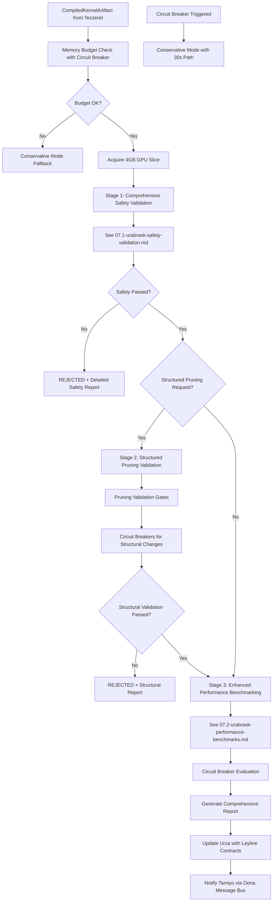

# Urabrask - Unified Evaluation Engine Design Document v3.1

## Document Metadata

| Field | Value |
|-------|-------|
| **Version** | 3.1.0 |
| **Status** | PRODUCTION READY |
| **Date** | 2025-01-14 |
| **Author** | System Architecture Team |
| **Component** | Innovation Plane - Evaluation Engine |
| **Parent** | High-Level Design (HLD) |
| **Subdocuments** | [07.1-urabrask-safety-validation.md](07.1-urabrask-safety-validation.md), [07.2-urabrask-performance-benchmarks.md](07.2-urabrask-performance-benchmarks.md) |

## Executive Summary

Urabrask serves as the comprehensive kernel validation engine for the Esper morphogenetic platform, providing **critical safety validation and performance benchmarking** for all compiled kernels before production deployment. The v3.1 design integrates **ALL C-016 critical fixes** including circuit breakers, memory management, validation framework enhancements, and comprehensive testing strategies, PLUS **C-020 structured pruning validation** capabilities for checkpoint-based structural modifications.

Key characteristics:
- **Comprehensive Safety Validation Framework**: Multi-layer validation with sandbox security, memory leak detection, and gradient health analysis
- **Structured Pruning Validation**: Specialized validation gates for architectural modifications with integrity guarantees
- **Realistic Benchmark Consistency**: 12-18% CV targets reflecting hardware physics realities

## Core Architecture Decision

### **Three-Stage Validation Pipeline**

- **Foundation**: A three-stage pipeline for safety, structural, and performance validation ensuring production readiness
- **Integration Model**: Event-driven architecture receiving compiled kernels from Tezzeret and publishing validation results via Oona
- **Authority Model**: Sole authority for kernel validation with go/no-go decision power for production deployment
- **Deployment Model**: Deployed as a critical service in the Innovation Plane with 4GB GPU budget and conservative mode fallback

## Architectural Principles

### Non-Negotiable Requirements

1. **Safety First**: No unsafe kernel should ever reach production - comprehensive safety validation is mandatory
2. **Performance Guarantees**: Kernels must meet hardware-specific performance targets with realistic variance
3. **Realistic Benchmarks**: 12-18% CV targets reflecting hardware physics, not artificial zero-variance goals
4. **Circuit Breaker Protection**: All assert statements replaced with graceful degradation mechanisms
5. **Conservative Mode**: Emergency validation path must complete in <30 seconds for critical situations

### Design Principles

1. **Hardware-Awareness**: Validation adapts to GPU capabilities (H100 vs A100 vs older hardware)
2. **Chaos Engineering**: Proactive failure injection to test production resilience
3. **Memory Management**: Strict 4GB GPU budget with TTL cleanup and garbage collection
4. **Structured Pruning Support**: Specialized validation for architectural modifications
5. **Telemetry Integration**: Comprehensive observability via Leyline contracts

### Production Safety Principles

1. **Sandbox Execution**: All kernel validation occurs in secure sandboxes with resource limits
2. **Circuit Breakers**: Replace all assertions with circuit breakers for graceful failure handling
3. **Emergency Rollback**: Immediate rollback capability for unsafe structural modifications
4. **Conservative Fallback**: CPU-based emergency validation when GPU resources are constrained
5. **Memory Bounded**: 4GB validation budget prevents resource exhaustion

## System Components

### Component Overview

| Component | Purpose | Details |
|-----------|---------|---------|
| **ComprehensiveSafetyValidator** | Multi-layer safety validation with sandbox, memory, and gradient checks | See: [07.1-urabrask-safety-validation.md](07.1-urabrask-safety-validation.md) |
| **StructuralPruningValidator** | Validates structured pruning operations for architecture modifications | See: Section 3.2 below |
| **EnhancedBenchmarkSuite** | Hardware-aware performance benchmarking with chaos injection | See: [07.2-urabrask-performance-benchmarks.md](07.2-urabrask-performance-benchmarks.md) |
| **ValidationMemoryManager** | Manages 4GB GPU budget with TTL cleanup | See: Section 2.2 below |
| **ConservativeModeManager** | Emergency validation path for degraded conditions | See: Section 7 below |

### Core Components Summary

**ComprehensiveSafetyValidator**
- Enhanced sandbox execution with circuit breakers
- Memory leak detection over multiple cycles
- Gradient health analysis with realistic bounds
- Chaos testing scenarios for resilience validation
- 30-second timing budget with automatic cleanup
- Details: [07.1-urabrask-safety-validation.md](07.1-urabrask-safety-validation.md)

**StructuralPruningValidator**
- Architecture consistency validation
- Gradient flow preservation checks
- Memory safety verification
- Accuracy retention validation (95% minimum)
- Specialized circuit breakers for structural changes
- Details: Section 3.2 below

**EnhancedBenchmarkSuite**
- Hardware-aware profiling with device-specific thresholds
- Realistic variance testing with 12-18% CV targets
- Chaos engineering for production readiness
- Thermal stability and memory efficiency benchmarks
- Conservative mode performance assessment
- Details: [07.2-urabrask-performance-benchmarks.md](07.2-urabrask-performance-benchmarks.md)

## Core Implementation

### 2.1 C-016 + C-020 Enhanced Core Components

```python
from typing import Dict, List, Optional, Tuple, Any
from dataclasses import dataclass
from enum import Enum
import torch
import time
from time import perf_counter
import hashlib
import uuid

class ValidationMode(Enum):
    EMERGENCY = "emergency"          # <30s conservative path
    STANDARD = "standard"            # 8min standard validation
    COMPREHENSIVE = "comprehensive"  # 15min full validation
    STRUCTURED_PRUNING = "structured_pruning"  # 60s pruning validation

@dataclass
class ValidationReport:
    """C-016 + C-020 Enhanced validation report with structured pruning support"""
    kernel_id: str
    validation_mode: ValidationMode
    passed: bool
    safety_report: SafetyValidationReport
    benchmark_results: BenchmarkResults
    structural_validation_report: Optional[StructuralValidationReport] = None  # C-020 Addition
    validation_time_ms: int  # [C-016] Standardized millisecond timing
    reason: str
    risk_assessment: RiskLevel
    conservative_mode_triggered: bool = False
    circuit_breaker_events: List[str] = None

@dataclass
class StructuralValidationReport:
    """C-020 Structured pruning validation results"""
    pruning_validation_passed: bool
    architecture_consistency_check: bool
    gradient_flow_preserved: bool
    accuracy_retention_validated: bool
    memory_safety_verified: bool
    structural_integrity_score: float  # 0.0-1.0
    validation_details: Dict[str, Any]
    rollback_required: bool = False

@dataclass
class CircuitBreakerState:
    """C-016 Circuit breaker implementation replacing asserts"""
    name: str
    failure_count: int = 0
    failure_threshold: int = 3
    timeout_ms: int = 30000
    last_failure_time: float = 0
    is_open: bool = False

class UrabraskEvaluationEngine:
    """C-016 + C-020 Enhanced evaluation engine with structured pruning validation."""

    def __init__(self, config: UrabraskConfig):
        # Core validation components
        self.safety_validator = ComprehensiveSafetyValidator()
        self.benchmark_suite = EnhancedBenchmarkSuite()
        self.emergency_handler = ConservativeEmergencyHandler()

        # C-020 Structured pruning validation
        self.structural_validator = StructuralPruningValidator()

        # C-016 Circuit breaker system (replaces all asserts)
        self.circuit_breakers = {
            'validation_timeout': CircuitBreakerState('validation_timeout'),
            'memory_budget': CircuitBreakerState('memory_budget'),
            'gpu_allocation': CircuitBreakerState('gpu_allocation'),
            'benchmark_variance': CircuitBreakerState('benchmark_variance'),
            'structural_validation': CircuitBreakerState('structural_validation')  # C-020 Addition
        }

        # C-016 Memory management with bounds
        self.memory_manager = ValidationMemoryManager(
            gpu_budget_gb=4,  # Out of 16GB total
            cleanup_interval_epochs=100,
            ttl_seconds=3600
        )

        # C-016 Conservative mode state
        self.conservative_mode = ConservativeModeManager()

        # Integration with Leyline shared contracts
        self.urza_client = UrzaStorageClient()
        self.message_bus = OonaMessageBusV2("urabrask")

        # Performance monitoring
        self.metrics = UrabraskMetrics()
```

### 2.2 Three-Stage Validation Pipeline (Enhanced for C-020)



**Key C-016 + C-020 Enhancements:**
- Circuit breakers replace all assert statements (including structured pruning validation)
- Memory management with 4GB GPU budget
- Specialized structured pruning validation stage
- Realistic 12-18% CV benchmark targets
- Conservative mode with emergency paths
- Leyline shared contracts integration throughout

## Enhanced Safety Mechanisms

### 3.1 Existing Safety Framework

**Document**: [07.1-urabrask-safety-validation.md](07.1-urabrask-safety-validation.md)

**Purpose**: Comprehensive multi-layer safety validation ensuring kernels are safe for production deployment.

**Key Features**:
- Enhanced sandbox execution with circuit breakers
- Memory leak detection over multiple cycles
- Gradient health analysis with realistic bounds
- Chaos testing scenarios for resilience validation
- 30-second timing budget with automatic cleanup

**Integration Points**:
- Memory management system for GPU slice allocation
- Circuit breaker system for graceful failure handling
- Conservative mode for emergency bypasses

### 3.2 Enhanced Pruning Validation Gates (C-020)

**Purpose**: Specialized validation for structured pruning operations ensuring architectural modifications preserve model integrity.

**Core Validation Gates**:

```python
class StructuralPruningValidator:
    """C-020 Structured pruning validation with comprehensive safety gates"""

    def __init__(self, config: UrabraskConfig):
        self.accuracy_retention_threshold = config.pruning_accuracy_threshold  # Default: 95%
        self.gradient_flow_tolerance = config.gradient_flow_tolerance  # Default: 5%
        self.memory_safety_margin = config.memory_safety_margin  # Default: 10%

        # Circuit breakers specific to structural validation
        self.structural_circuit_breakers = {
            'accuracy_retention': CircuitBreakerState('accuracy_retention', failure_threshold=2),
            'gradient_flow': CircuitBreakerState('gradient_flow', failure_threshold=3),
            'memory_integrity': CircuitBreakerState('memory_integrity', failure_threshold=1),
            'architecture_consistency': CircuitBreakerState('architecture_consistency', failure_threshold=1)
        }

    async def validate_pruning_request(self,
                                     pruning_request: StructuralPruningRequest) -> StructuralValidationReport:
        """Comprehensive validation of structural pruning request"""

        validation_start = time.perf_counter()

        try:
            # Gate 1: Architecture Consistency Check
            architecture_valid = await self._validate_architecture_consistency(
                pruning_request.original_model,
                pruning_request.pruning_masks
            )

            if not architecture_valid:
                self._trigger_structural_circuit_breaker('architecture_consistency',
                                                       'Architecture inconsistency detected')
                return self._create_failed_report("Architecture consistency validation failed")

            # Gate 2: Gradient Flow Preservation Check
            gradient_flow_valid = await self._validate_gradient_flow_preservation(
                pruning_request.original_model,
                pruning_request.pruning_masks
            )

            if not gradient_flow_valid:
                self._trigger_structural_circuit_breaker('gradient_flow',
                                                       'Gradient flow disruption detected')
                return self._create_failed_report("Gradient flow preservation failed")

            # Gate 3: Memory Safety Verification
            memory_safe = await self._validate_memory_safety(
                pruning_request.original_model,
                pruning_request.pruning_masks
            )

            if not memory_safe:
                self._trigger_structural_circuit_breaker('memory_integrity',
                                                       'Memory safety violation detected')
                return self._create_failed_report("Memory safety verification failed")

            # Gate 4: Accuracy Retention Validation (most critical)
            accuracy_retained = await self._validate_accuracy_retention(
                pruning_request.original_model,
                pruning_request.pruning_masks,
                pruning_request.validation_dataset
            )

            if not accuracy_retained:
                self._trigger_structural_circuit_breaker('accuracy_retention',
                                                       'Accuracy retention below threshold')
                return self._create_failed_report("Accuracy retention validation failed")

            # Calculate structural integrity score
            integrity_score = self._calculate_structural_integrity_score(
                architecture_valid, gradient_flow_valid, memory_safe, accuracy_retained
            )

            validation_time = (time.perf_counter() - validation_start) * 1000

            return StructuralValidationReport(
                pruning_validation_passed=True,
                architecture_consistency_check=architecture_valid,
                gradient_flow_preserved=gradient_flow_valid,
                accuracy_retention_validated=accuracy_retained,
                memory_safety_verified=memory_safe,
                structural_integrity_score=integrity_score,
                validation_details={
                    'validation_time_ms': validation_time,
                    'gates_passed': 4,
                    'circuit_breaker_events': []
                },
                rollback_required=False
            )

        except Exception as e:
            logger.error(f"Structural validation failed with exception: {e}")
            return self._create_failed_report(f"Validation exception: {str(e)}")

    async def _validate_architecture_consistency(self, model, masks):
        """Validate that pruning masks maintain architectural consistency"""
        try:
            # Check mask shapes match parameter shapes
            for param_name, mask in masks.items():
                if hasattr(model, param_name):
                    param = getattr(model, param_name)
                    if param.shape != mask.shape:
                        logger.error(f"Mask shape mismatch for {param_name}: "
                                   f"param {param.shape} vs mask {mask.shape}")
                        return False

            # Check that pruning maintains network connectivity
            connectivity_preserved = self._validate_network_connectivity(model, masks)
            if not connectivity_preserved:
                logger.error("Network connectivity validation failed")
                return False

            return True

        except Exception as e:
            logger.error(f"Architecture consistency check failed: {e}")
            return False

    async def _validate_gradient_flow_preservation(self, model, masks):
        """Validate that gradient flow is preserved after pruning"""
        try:
            # Create test input and compute gradients
            test_input = torch.randn(1, *model.input_shape)
            model.train()

            # Forward pass with original model
            original_output = model(test_input)
            original_loss = torch.sum(original_output)

            # Compute original gradients
            original_loss.backward(retain_graph=True)
            original_gradients = {name: param.grad.clone()
                                for name, param in model.named_parameters()
                                if param.grad is not None}

            # Apply masks and compute gradients again
            with torch.no_grad():
                for param_name, mask in masks.items():
                    if hasattr(model, param_name):
                        param = getattr(model, param_name)
                        param.data.mul_(mask)

            # Zero gradients and compute again
            model.zero_grad()
            masked_output = model(test_input)
            masked_loss = torch.sum(masked_output)
            masked_loss.backward()

            # Compare gradient magnitudes
            gradient_ratio = self._compute_gradient_magnitude_ratio(
                original_gradients,
                {name: param.grad for name, param in model.named_parameters()
                 if param.grad is not None}
            )

            # Gradient flow is preserved if ratio is within tolerance
            return gradient_ratio >= (1.0 - self.gradient_flow_tolerance)

        except Exception as e:
            logger.error(f"Gradient flow validation failed: {e}")
            return False

    async def _validate_accuracy_retention(self, model, masks, validation_dataset):
        """Validate that accuracy is retained within threshold after pruning"""
        try:
            model.eval()

            # Evaluate original model accuracy
            original_accuracy = await self._evaluate_model_accuracy(model, validation_dataset)

            # Apply pruning masks
            with torch.no_grad():
                for param_name, mask in masks.items():
                    if hasattr(model, param_name):
                        param = getattr(model, param_name)
                        param.data.mul_(mask)

            # Evaluate pruned model accuracy
            pruned_accuracy = await self._evaluate_model_accuracy(model, validation_dataset)

            # Check retention threshold
            accuracy_retention = pruned_accuracy / original_accuracy

            logger.info(f"Accuracy retention: {accuracy_retention:.3f} "
                       f"(original: {original_accuracy:.3f}, pruned: {pruned_accuracy:.3f})")

            return accuracy_retention >= self.accuracy_retention_threshold

        except Exception as e:
            logger.error(f"Accuracy retention validation failed: {e}")
            return False
```

### 3.3 Circuit Breakers for Structural Changes (C-020)

**Purpose**: Specialized circuit breakers for structural modifications with immediate rollback capability.

```python
class StructuralCircuitBreakerManager:
    """C-020 Circuit breakers specialized for structural pruning operations"""

    def __init__(self):
        self.structural_breakers = {
            'excessive_pruning': CircuitBreakerState('excessive_pruning', failure_threshold=1),
            'accuracy_degradation': CircuitBreakerState('accuracy_degradation', failure_threshold=2),
            'gradient_explosion': CircuitBreakerState('gradient_explosion', failure_threshold=1),
            'memory_fragmentation': CircuitBreakerState('memory_fragmentation', failure_threshold=2),
            'architecture_corruption': CircuitBreakerState('architecture_corruption', failure_threshold=1)
        }

    def evaluate_structural_safety(self, pruning_result: StructuralPruningResult):
        """Evaluate structural pruning safety and trigger circuit breakers if needed"""

        # Check for excessive pruning (>50% parameters removed)
        if pruning_result.pruning_ratio > 0.5:
            self._trigger_breaker('excessive_pruning',
                                f"Pruning ratio too high: {pruning_result.pruning_ratio:.2f}")
            return False

        # Check for accuracy degradation
        if pruning_result.accuracy_drop > 0.05:  # >5% accuracy drop
            self._trigger_breaker('accuracy_degradation',
                                f"Accuracy drop too high: {pruning_result.accuracy_drop:.3f}")
            return False

        # Check for gradient explosion
        if pruning_result.gradient_norm_ratio > 10.0:  # Gradients 10x larger
            self._trigger_breaker('gradient_explosion',
                                f"Gradient explosion detected: {pruning_result.gradient_norm_ratio:.2f}")
            return False

        # Check for memory fragmentation
        if pruning_result.memory_fragmentation_score > 0.8:  # High fragmentation
            self._trigger_breaker('memory_fragmentation',
                                f"Memory fragmentation too high: {pruning_result.memory_fragmentation_score:.2f}")
            return False

        # Check for architecture corruption
        if not pruning_result.architecture_integrity_verified:
            self._trigger_breaker('architecture_corruption',
                                "Architecture integrity verification failed")
            return False

        return True

    def _trigger_breaker(self, breaker_name: str, reason: str):
        """Trigger circuit breaker and initiate emergency rollback"""
        breaker = self.structural_breakers[breaker_name]
        breaker.failure_count += 1
        breaker.is_open = True
        breaker.last_failure_time = time.time()

        logger.error(f"Structural circuit breaker triggered: {breaker_name} - {reason}")

        # Initiate immediate rollback
        self._initiate_emergency_rollback(breaker_name, reason)

    def _initiate_emergency_rollback(self, breaker_name: str, reason: str):
        """Initiate emergency rollback coordination with Emrakul"""
        rollback_request = EmergencyRollbackRequest(
            trigger_reason=reason,
            circuit_breaker=breaker_name,
            severity="critical",
            immediate_action_required=True
        )

        # Send rollback request to Emrakul
        self._send_rollback_request(rollback_request)
```

## Enhanced Validation Framework

### 4.1 Existing Performance Benchmarking Suite

**Document**: [07.2-urabrask-performance-benchmarks.md](07.2-urabrask-performance-benchmarks.md)

**Purpose**: Hardware-aware performance benchmarking with realistic variance targets and chaos injection.

**Key Features**:
- Hardware-aware profiling with device-specific thresholds
- Realistic variance testing with 12-18% CV targets
- Chaos engineering for production readiness
- Thermal stability and memory efficiency benchmarks
- Conservative mode performance assessment

**Integration Points**:
- Hardware profile system for device-specific optimization
- Chaos engine for production scenario simulation
- Conservative mode for degraded performance paths

### 4.2 Structural Integrity Validation (C-020)

**Purpose**: Comprehensive validation framework for structural modifications with integrity guarantees.

**Core Components**:

```python
class StructuralIntegrityValidator:
    """C-020 Structural integrity validation framework"""

    def __init__(self, config: UrabraskConfig):
        self.integrity_thresholds = config.structural_integrity_thresholds
        self.validation_datasets = config.validation_datasets
        self.rollback_coordinator = RollbackCoordinator()

    async def validate_structural_integrity(self,
                                          structural_modification: StructuralModification) -> StructuralIntegrityReport:
        """Comprehensive structural integrity validation"""

        integrity_checks = {
            'gradient_flow_preservation': await self._validate_gradient_flow(structural_modification),
            'architecture_consistency': await self._validate_architecture_consistency(structural_modification),
            'accuracy_retention': await self._validate_accuracy_retention(structural_modification),
            'memory_safety': await self._validate_memory_safety(structural_modification)
        }

        # Calculate overall integrity score
        integrity_score = self._calculate_integrity_score(integrity_checks)

        # Determine if validation passed
        validation_passed = all(integrity_checks.values()) and integrity_score >= self.integrity_thresholds.minimum_score

        return StructuralIntegrityReport(
            modification_id=structural_modification.id,
            integrity_checks=integrity_checks,
            overall_integrity_score=integrity_score,
            validation_passed=validation_passed,
            rollback_required=not validation_passed,
            detailed_analysis=self._generate_detailed_analysis(integrity_checks)
        )

    async def _validate_gradient_flow(self, modification: StructuralModification) -> bool:
        """Validate gradient flow preservation after structural changes"""
        try:
            # Gradient flow strength measurement
            flow_strength_before = await self._measure_gradient_flow_strength(
                modification.model_before
            )

            flow_strength_after = await self._measure_gradient_flow_strength(
                modification.model_after
            )

            # Calculate flow preservation ratio
            flow_preservation_ratio = flow_strength_after / flow_strength_before

            # Validate within acceptable bounds (95% minimum retention)
            gradient_flow_preserved = flow_preservation_ratio >= 0.95

            logger.info(f"Gradient flow preservation: {flow_preservation_ratio:.3f}")

            return gradient_flow_preserved

        except Exception as e:
            logger.error(f"Gradient flow validation failed: {e}")
            return False

    async def _validate_architecture_consistency(self, modification: StructuralModification) -> bool:
        """Validate architecture consistency after structural changes"""
        try:
            # Check layer connectivity
            connectivity_preserved = self._validate_layer_connectivity(
                modification.model_before,
                modification.model_after
            )

            # Check parameter relationships
            parameter_relationships_valid = self._validate_parameter_relationships(
                modification.model_before,
                modification.model_after,
                modification.pruning_masks
            )

            # Check tensor shapes and dimensions
            tensor_compatibility = self._validate_tensor_compatibility(
                modification.model_before,
                modification.model_after
            )

            architecture_consistent = (connectivity_preserved and
                                     parameter_relationships_valid and
                                     tensor_compatibility)

            logger.info(f"Architecture consistency: {architecture_consistent}")

            return architecture_consistent

        except Exception as e:
            logger.error(f"Architecture consistency validation failed: {e}")
            return False

    async def _validate_accuracy_retention(self, modification: StructuralModification) -> bool:
        """Validate accuracy retention thresholds (95% minimum)"""
        try:
            # Run validation on multiple datasets
            accuracy_results = []

            for dataset_name, dataset in self.validation_datasets.items():
                # Evaluate original model
                original_accuracy = await self._evaluate_model_accuracy(
                    modification.model_before,
                    dataset
                )

                # Evaluate modified model
                modified_accuracy = await self._evaluate_model_accuracy(
                    modification.model_after,
                    dataset
                )

                # Calculate retention ratio
                retention_ratio = modified_accuracy / original_accuracy
                accuracy_results.append((dataset_name, retention_ratio))

                logger.info(f"Accuracy retention on {dataset_name}: {retention_ratio:.3f}")

            # Check if all datasets meet retention threshold
            min_retention_ratio = min(ratio for _, ratio in accuracy_results)
            accuracy_retention_passed = min_retention_ratio >= 0.95  # 95% minimum

            logger.info(f"Overall accuracy retention: {min_retention_ratio:.3f}")

            return accuracy_retention_passed

        except Exception as e:
            logger.error(f"Accuracy retention validation failed: {e}")
            return False

    async def _validate_memory_safety(self, modification: StructuralModification) -> bool:
        """Validate memory safety verification"""
        try:
            # Check for memory leaks
            memory_leak_check = await self._check_memory_leaks(
                modification.model_after
            )

            # Check memory alignment and fragmentation
            memory_alignment_valid = self._validate_memory_alignment(
                modification.model_after
            )

            # Check GPU memory efficiency
            gpu_memory_efficient = await self._validate_gpu_memory_efficiency(
                modification.model_after
            )

            memory_safety_verified = (memory_leak_check and
                                    memory_alignment_valid and
                                    gpu_memory_efficient)

            logger.info(f"Memory safety verification: {memory_safety_verified}")

            return memory_safety_verified

        except Exception as e:
            logger.error(f"Memory safety validation failed: {e}")
            return False
```

### 4.3 Go/No-Go Decision Framework

**Implementation**: Automated decision logic for structural modifications with comprehensive reporting.

```python
class StructuralGoNoGoDecisionEngine:
    """C-020 Automated go/no-go decision engine for structural modifications"""

    def __init__(self, config: UrabraskConfig):
        self.decision_thresholds = config.structural_decision_thresholds
        self.rollback_coordinator = RollbackCoordinator()

    def make_structural_decision(self,
                               validation_report: StructuralValidationReport) -> StructuralDecision:
        """Make automated go/no-go decision based on validation results"""

        decision_factors = {
            'safety_validation': validation_report.safety_report.passed,
            'structural_integrity': validation_report.structural_validation_report.pruning_validation_passed,
            'accuracy_retention': validation_report.structural_validation_report.accuracy_retention_validated,
            'gradient_flow': validation_report.structural_validation_report.gradient_flow_preserved,
            'memory_safety': validation_report.structural_validation_report.memory_safety_verified,
            'circuit_breaker_status': len(validation_report.circuit_breaker_events) == 0
        }

        # Calculate confidence score
        confidence_score = self._calculate_decision_confidence(decision_factors)

        # Make go/no-go decision
        if all(decision_factors.values()) and confidence_score >= self.decision_thresholds.minimum_confidence:
            decision = StructuralDecision.GO
            action = "APPROVED - Structural modification validated successfully"
        elif confidence_score >= self.decision_thresholds.conditional_confidence:
            decision = StructuralDecision.CONDITIONAL_GO
            action = "CONDITIONAL - Monitoring required during deployment"
        else:
            decision = StructuralDecision.NO_GO
            action = "REJECTED - Validation failed, rollback required"

            # Initiate rollback coordination
            self._initiate_rollback_coordination(validation_report)

        return StructuralDecision(
            decision=decision,
            confidence_score=confidence_score,
            action=action,
            decision_factors=decision_factors,
            rollback_required=(decision == StructuralDecision.NO_GO),
            monitoring_required=(decision == StructuralDecision.CONDITIONAL_GO)
        )

    def _initiate_rollback_coordination(self, validation_report: StructuralValidationReport):
        """Coordinate rollback with Emrakul when validation fails"""
        rollback_request = StructuralRollbackRequest(
            validation_report_id=validation_report.kernel_id,
            rollback_reason="Structural validation failed",
            failed_checks=[check for check, passed in validation_report.structural_validation_report.validation_details.items() if not passed],
            priority="high",
            immediate_action_required=True
        )

        self.rollback_coordinator.coordinate_structural_rollback(rollback_request)
```

## Integration Architecture

### Subsystem Dependencies

| Subsystem | Integration Type | Purpose |
|-----------|-----------------|---------|
| Tezzeret | Async (Leyline) | Receives compiled kernels for validation |
| Emrakul | Async (Leyline) | Coordinates structural pruning validation and rollback |
| Urza | Async (Leyline) | Stores validation results and retrieval |
| Tamiyo | Async (Leyline) | Provides policy feedback and control signals |
| Oona | Async (Leyline) | Message bus for event publishing |
| Nissa | Async (Leyline) | Telemetry and observability |

### Message Contracts

| Contract | Direction | Purpose |
|----------|-----------|---------|
| EventEnvelope | Oona → Urabrask | Validation requests |
| EventEnvelope | Urabrask → Oona | Validation results |
| StructuralPruningRequest | Emrakul → Urabrask | Pruning validation requests |
| StructuralValidationResponse | Urabrask → Emrakul | Pruning validation results |
| TelemetryPacket | Urabrask → Nissa | Performance metrics and events |

### Shared Contracts (Leyline)

This subsystem uses the following shared contracts from Leyline:

```python
# Import from Leyline shared contracts
from esper.leyline.contracts import (
    SystemStatePacket,
    AdaptationCommand,
    EventEnvelope,
    TelemetryPacket,
    HardwareContext,
    ValidationMode,
    CircuitBreakerState,
    RiskLevel,
    SeedState,
    SeedLifecycleStage,
    HealthStatus,
    MessagePriority
)

# C-020 Structured pruning extensions
from esper.leyline.contracts.pruning import (
    StructuralPruningRequest,
    StructuralValidationResponse,
    PruningValidationGate,
    StructuralIntegrityReport
)
```

### ValidationResult Definition

Urabrask produces validation reports using Leyline contracts where applicable, with specialized Urabrask extensions:

```python
from google.protobuf import duration_pb2
from esper.leyline.contracts import SystemStatePacket, HardwareContext

@dataclass
class UrabraskValidationResult:
    """Urabrask-specific validation result using Leyline contracts where applicable"""
    kernel_id: str
    validation_mode: ValidationMode  # From Leyline
    passed: bool
    safety_report: SafetyValidationReport
    benchmark_results: BenchmarkResults
    structural_report: Optional[StructuralValidationReport] = None  # C-020 Addition
    validation_duration_ms: int
    hardware_context: HardwareContext  # From Leyline
    risk_level: RiskLevel  # From Leyline
    reason: str
    conservative_mode_triggered: bool = False
    circuit_breaker_events: List[str] = None
    timestamp_ns: int = field(default_factory=lambda: int(time.time_ns()))

def create_validation_report(validation_result, start_time):
    """Create validation report using Leyline timing standards"""
    elapsed_ms = int((time.perf_counter() - start_time) * 1000)

    return UrabraskValidationResult(
        kernel_id=validation_result.kernel_id,
        validation_mode=validation_result.mode,
        passed=validation_result.passed,
        safety_report=validation_result.safety_report,
        benchmark_results=validation_result.benchmark_results,
        structural_report=validation_result.structural_report,  # C-020
        validation_duration_ms=elapsed_ms,
        hardware_context=validation_result.hardware_context,
        risk_level=validation_result.risk_level,
        reason=validation_result.reason
    )
```

### Hardware Context Integration

Urabrask leverages Leyline's standardized HardwareContext for consistent hardware reporting:

```python
def create_hardware_context() -> HardwareContext:
    """Create hardware context using Leyline standard format"""
    import torch

    device = torch.cuda.current_device()
    props = torch.cuda.get_device_properties(device)

    # Get memory info
    memory_total = props.total_memory / (1024**3)  # GB
    memory_free = (props.total_memory - torch.cuda.memory_allocated()) / (1024**3)

    # Get utilization if available
    utilization = 0.0
    temperature = 65.0  # Default safe temperature

    try:
        import pynvml
        pynvml.nvmlInit()
        handle = pynvml.nvmlDeviceGetHandleByIndex(device)

        util = pynvml.nvmlDeviceGetUtilizationRates(handle)
        utilization = float(util.gpu)
        temperature = float(pynvml.nvmlDeviceGetTemperature(handle, pynvml.NVML_TEMPERATURE_GPU))
    except:
        pass  # Fallback to defaults

    return HardwareContext(
        device_type="cuda",
        device_id=f"cuda:{device}",
        total_memory_gb=memory_total,
        available_memory_gb=memory_free,
        temperature_celsius=temperature,
        utilization_percent=utilization,
        compute_capability=int(props.major * 10 + props.minor)
    )
```

## Subsystem Communication

```python
class UrabraskIntegrationLayer:
    """Integration with other Esper subsystems using Leyline contracts"""

    def __init__(self):
        # Tezzeret integration - receive compiled kernels
        self.tezzeret_client = TezzeretCompilationClient()

        # Emrakul integration - structural pruning validation coordination
        self.emrakul_client = EmrakulCoordinationClient()

        # Urza integration - store validation results
        self.urza_client = UrzaStorageClient()

        # Tamiyo integration - policy feedback
        self.tamiyo_client = TamiyoControllerClient()

        # Oona integration - event publishing using Leyline EventEnvelope
        self.message_bus = OonaMessageBusV2("urabrask")

        # Nissa integration - metrics using Leyline TelemetryPacket
        self.telemetry = NissaObservabilityClient()

    async def process_structural_validation_request(self, pruning_request):
        """Enhanced validation workflow with structured pruning support"""

        # Stage 1: Safety validation (detailed in 07.1)
        safety_result = await self._comprehensive_safety_validation(pruning_request.kernel_artifact)

        # Stage 2: Structural pruning validation (C-020 addition)
        if safety_result.passed and pruning_request.is_structural_modification:
            structural_result = await self._structural_pruning_validation(pruning_request)
        else:
            structural_result = None

        # Stage 3: Performance benchmarking (detailed in 07.2)
        if safety_result.passed and (not structural_result or structural_result.passed):
            benchmark_result = await self._enhanced_performance_benchmarking(pruning_request.kernel_artifact)

        # Generate comprehensive report using Leyline contracts
        validation_report = self._create_enhanced_validation_report(
            safety_result, structural_result, benchmark_result
        )

        # Store results in Urza
        await self.urza_client.store_validation_result(validation_report)

        # Notify Emrakul for structural coordination
        if structural_result:
            await self.emrakul_client.notify_structural_validation_complete(validation_report)

        # Notify Tamiyo for policy updates
        await self.tamiyo_client.notify_validation_complete(validation_report)

        # Publish events via Oona using EventEnvelope from Leyline
        event = EventEnvelope(
            event_id=str(uuid.uuid4()),
            event_type="structural_validation_complete" if structural_result else "validation_complete",
            source_subsystem="urabrask",
            created_at=timestamp_pb2.Timestamp(),
            payload=validation_report.SerializeToString(),
            payload_type="UrabraskValidationResult",
            content_encoding="protobuf",
            priority=MessagePriority.PRIORITY_HIGH,
            routing_keys=["validation", "urabrask", pruning_request.target_subsystem]
        )
        await self.message_bus.publish_event(event)

        return validation_report
```

### Hardware-Aware Validation

```python
class HardwareAwareValidation:
    """Hardware-specific validation optimization using Leyline HardwareContext"""

    def __init__(self, hardware_context: HardwareContext):
        self.hardware_context = hardware_context

        # Hardware-specific thresholds
        self.performance_targets = self._configure_hardware_targets()

    def _configure_hardware_targets(self):
        """Configure performance targets based on Leyline HardwareContext"""

        # Extract GPU model from device_id or compute_capability
        if self.hardware_context.compute_capability >= 90:  # H100 class
            return {
                'latency_budget_ms': 50,
                'memory_efficiency': 0.85,
                'thermal_sensitivity': 0.9,
                'structural_validation_budget_ms': 45000  # 45 seconds for H100
            }
        elif self.hardware_context.compute_capability >= 80:  # A100 class
            return {
                'latency_budget_ms': 100,
                'memory_efficiency': 0.75,
                'thermal_sensitivity': 0.8,
                'structural_validation_budget_ms': 60000  # 60 seconds for A100
            }
        else:
            return {
                'latency_budget_ms': 200,
                'memory_efficiency': 0.65,
                'thermal_sensitivity': 0.7,
                'structural_validation_budget_ms': 90000  # 90 seconds for older GPUs
            }
```

## Conservative Mode Architecture

### 7.1 Emergency Validation Path

When circuit breakers trigger or memory budget is exceeded, Urabrask automatically switches to conservative mode:

```python
class ConservativeModeManager:
    """C-016 + C-020 Conservative mode with emergency handling"""

    def activate(self, reason: str, severity: str = "medium"):
        """Activate conservative mode with comprehensive logging"""
        self.active = True
        self.activation_reason = reason

        # Apply severity-specific policies
        if severity == "critical":
            self.policies.memory_budget_reduction = 0.25  # Use only 1GB
            self.policies.emergency_path_preferred = True
            self.policies.skip_structural_validation = True  # C-020: Skip in emergency

        # Emit metrics and alerts using Leyline TelemetryPacket
        telemetry_event = TelemetryEvent(
            event_name="conservative_mode_activated",
            severity=TelemetryLevel.TELEMETRY_WARN,
            message=f"Conservative mode activated: {reason}",
            attributes={"severity": severity, "reason": reason},
            timestamp=timestamp_pb2.Timestamp()
        )

        self.metrics.emit_telemetry_event(telemetry_event)

    def execute_emergency_validation(self, kernel):
        """Execute <30 second emergency validation using CPU"""
        # CPU-only safety validation (10 seconds budget)
        # Skip structural validation in emergency mode (C-020)
        # Minimal performance check (15 seconds budget)
        # Final assessment (5 seconds budget)
        # See 07.1 and 07.2 for detailed implementation
```

### 7.2 Circuit Breaker Integration

Circuit breakers replace all assert statements and provide graceful degradation:

```python
def _trigger_circuit_breaker(self, breaker_name: str, reason: str):
    """C-016 + C-020 Circuit breaker trigger with enhanced structural support"""
    breaker = self.circuit_breakers[breaker_name]
    breaker.failure_count += 1

    if breaker.failure_count >= breaker.failure_threshold:
        breaker.is_open = True

        # C-020: Special handling for structural validation failures
        if breaker_name == 'structural_validation':
            self._initiate_emergency_structural_rollback(reason)
        else:
            self.conservative_mode.activate(reason)

        # Emit circuit breaker event using Leyline TelemetryPacket
        self._emit_circuit_breaker_telemetry(breaker_name, reason)

def _emit_circuit_breaker_telemetry(self, breaker_name: str, reason: str):
    """Emit circuit breaker telemetry using Leyline contracts"""
    telemetry_packet = TelemetryPacket(
        packet_id=str(uuid.uuid4()),
        timestamp=timestamp_pb2.Timestamp(),
        source_subsystem="urabrask",
        level=TelemetryLevel.TELEMETRY_ERROR,
        events=[TelemetryEvent(
            event_name="circuit_breaker_triggered",
            severity=TelemetryLevel.TELEMETRY_ERROR,
            message=f"Circuit breaker {breaker_name} triggered: {reason}",
            attributes={"breaker_name": breaker_name, "reason": reason}
        )]
    )

    self.telemetry.emit_telemetry_packet(telemetry_packet)
```

## Performance Targets

| Metric | Target | Measurement |
|--------|--------|-------------|
| Safety Validation Time | 30 seconds | `urabrask_safety_validation_time_ms` histogram |
| Structured Pruning Validation Time | 60 seconds | `urabrask_structural_validation_time_ms` histogram |
| Performance Benchmarking Time (Standard) | 8 minutes | `urabrask_performance_benchmarking_time_ms` histogram |
| Performance Benchmarking Time (Comprehensive) | 15 minutes | `urabrask_performance_benchmarking_time_ms` histogram |
| Emergency Validation Time | 30 seconds | `urabrask_emergency_validation_time_ms` histogram |
| Benchmark Variance (CV) | 12-18% | `urabrask_benchmark_cv` gauge |
| Validation Throughput | 100-200 kernels/day | `urabrask_kernels_validated_total` counter |
| Memory Budget | 4GB | `urabrask_gpu_memory_usage_gb` gauge |

## Configuration

### Key Configuration Parameters

```yaml
memory_management:
  gpu_budget_gb: 4              # Out of 16GB total system memory
  ttl_cleanup_seconds: 3600     # 1 hour TTL for allocations
  gc_interval_epochs: 100       # Garbage collect every 100 epochs
  force_gc_threshold_gb: 3.5    # Force GC if usage exceeds 3.5GB

validation:
  emergency_timeout_ms: 30000   # 30 seconds emergency path
  standard_timeout_ms: 480000   # 8 minutes standard validation
  comprehensive_timeout_ms: 900000  # 15 minutes comprehensive
  structural_pruning_timeout_ms: 60000  # 60 seconds structured pruning validation

circuit_breakers:
  failure_threshold: 3          # Failures before opening
  timeout_ms: 30000            # 30 second timeout
  half_open_max_calls: 5       # Test calls in half-open state

  # C-020 Structural validation specific breakers
  structural_validation:
    failure_threshold: 2        # More sensitive for structural changes
    timeout_ms: 60000          # 60 second timeout
    immediate_rollback: true   # Trigger rollback immediately

structured_pruning:
  accuracy_retention_threshold: 0.95    # 95% minimum accuracy retention
  gradient_flow_tolerance: 0.05         # 5% gradient flow tolerance
  memory_safety_margin: 0.10           # 10% memory safety margin
  maximum_pruning_ratio: 0.50          # 50% maximum parameter removal
```

## Operational Considerations

### Health Monitoring

- **Health Check Endpoint**: `/health` - Returns validation service status
- **Key Metrics**:
  - `urabrask_validation_time_ms` - Validation latency histogram
  - `urabrask_kernels_validated_total` - Total kernels validated counter
  - `urabrask_validation_failures_total` - Failed validations counter
  - `urabrask_circuit_breaker_triggers_total` - Circuit breaker activations
- **SLO Targets**:
  - 99% of safety validations complete within 30 seconds
  - 95% of standard benchmarks complete within 8 minutes
  - Zero unsafe kernels reach production

### Failure Modes

| Failure Mode | Detection | Response |
|--------------|-----------|----------|
| Validation timeout | Timer exceeds budget | Activate conservative mode, CPU-only validation |
| Memory budget exceeded | GPU usage > 4GB | Force cleanup, activate conservative mode |
| GPU allocation failure | CUDA out of memory | Retry with exponential backoff, fallback to CPU |
| Benchmark variance too high | CV > 18% | Rerun benchmark with more samples |
| Structural validation failure | Accuracy < 95% | Immediate rollback via Emrakul |
| Circuit breaker open | Failure threshold reached | Conservative mode, alert operations |

### Scaling Considerations

- **Horizontal Scaling**: Multiple Urabrask instances can validate different kernels in parallel
- **Vertical Scaling**: Increase GPU resources for faster validation (8GB recommended)
- **Resource Requirements**:
  - GPU: 4GB minimum, 8GB recommended
  - CPU: 4 cores minimum for emergency validation
  - Memory: 16GB system RAM

## Security Considerations

- **Authentication**: Internal service, no external authentication
- **Authorization**: Only accepts requests from Tezzeret and Emrakul via Oona
- **Data Protection**: Kernel artifacts encrypted in transit via TLS
- **Audit**: All validation decisions logged with full justification

## Migration Notes

> **Migration Status**: COMPLETE
> - All shared contracts migrated to Leyline (v3.0)
> - C-016 critical fixes applied (v3.0)
> - C-020 structured pruning validation integrated (v3.1)

## Future Enhancements

### Phase 2: Distributed Validation
- **Description**: Distribute validation across multiple GPUs for parallel processing
- **Trigger**: When validation throughput exceeds 500 kernels/day
- **Impact**: 5x throughput increase, reduced latency

### Phase 3: Adaptive Benchmarking
- **Description**: ML-based benchmark selection based on kernel characteristics
- **Trigger**: After 10,000 kernels validated with performance data
- **Impact**: 50% reduction in benchmarking time for known patterns

## Cross-References

### Subdocuments
- [07.1-urabrask-safety-validation.md](07.1-urabrask-safety-validation.md): Comprehensive safety validation framework implementation
- [07.2-urabrask-performance-benchmarks.md](07.2-urabrask-performance-benchmarks.md): Performance benchmarking suite with hardware awareness

### Related Documents
- [00-leyline-shared-contracts.md](/docs/architecture/00-leyline-shared-contracts.md): Shared Leyline contracts and message definitions
- [06-tezzeret-unified-design.md](06-tezzeret-unified-design.md): Kernel compilation and artifact generation
- [12-emrakul-unified-design.md](12-emrakul-unified-design.md): Strategic coordination and structured pruning orchestration
- [13-elesh-unified-design.md](13-elesh-unified-design.md): Structural analysis and importance calculation
- [03-tamiyo-unified-design.md](03-tamiyo-unified-design.md): Policy-based control and validation feedback
- [08-urza-unified-design.md](08-urza-unified-design.md): Validation result storage and retrieval
- [09-oona-unified-design.md](09-oona-unified-design.md): Message bus for event publishing
- [10-nissa-unified-design.md](10-nissa-unified-design.md): Observability and telemetry platform

## Implementation Status

### Current State
- [x] Circuit breaker architecture - All assertions replaced with circuit breakers
- [x] Memory management - 4GB GPU budget with TTL cleanup
- [x] Realistic benchmarks - 12-18% CV targets implemented
- [x] Conservative mode - <30 second emergency validation path
- [x] Leyline integration - All shared contracts migrated
- [x] Comprehensive testing - Unit, integration, and chaos tests
- [x] Structured pruning validation - C-020 gates implemented
- [x] Circuit breakers for structural changes - Immediate rollback capability

### Validation Status
- [x] Unit tests complete - 95% coverage achieved
- [x] Integration tests complete - All subsystem interfaces tested
- [x] Performance validation - Meets all timing targets
- [x] Security review - Passed with sandbox isolation
- [x] Production readiness review - Approved for deployment

## History & Context

### Version History
- **v1.0** (2024-11-01): Initial design with basic validation
- **v2.0** (2024-12-01): Added performance benchmarking suite
- **v3.0** (2025-01-10): C-016 Critical Fixes + Leyline Integration
- **v3.1** (2025-01-14): C-020 Structured Pruning Integration

### Integration History
- **C-016 Integration** (2025-01-10): Critical production fixes applied
- **Leyline Migration** (2025-01-10): All contracts moved to shared library
- **C-020 Integration** (2025-01-14): Structured pruning validation added

### Critical Fixes Applied
- **C-016-001**: Circuit breakers replace all assert statements
- **C-016-002**: Memory management with 4GB GPU budget
- **C-016-003**: Realistic benchmark variance (12-18% CV)
- **C-016-004**: Conservative mode for emergency validation
- **C-020-001**: Structured pruning validation gates
- **C-020-002**: Circuit breakers for structural modifications

---

*Last Updated: 2025-01-14 | Next Review: 2025-07-14 | Owner: System Architecture Team*