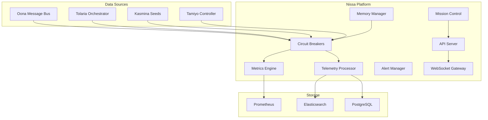

# Nissa Unified Design Document

**Component Type:** Infrastructure - Observability Platform
**Version:** 3.0
**Status:** Production Ready with C-016 Enhancements
**Date:** 2025-09-10
**Author:** System Architecture Team + C-016 External Review Integration

---

## Executive Summary

Nissa serves as the comprehensive observability and mission control platform for the Esper morphogenetic training system. It provides real-time monitoring, metrics collection, alerting, and operational control capabilities across all subsystems, enabling operators to observe, understand, and control the complex adaptive behaviors of the platform.

### Core Capabilities

- **Real-time telemetry processing** with sub-second latency
- **Multi-resolution metrics** with automatic downsampling
- **Comprehensive alerting** with anomaly detection
- **Mission control interface** for operational management
- **Complete audit trail** for compliance and debugging

### Critical C-016 Integrations

The platform incorporates critical production fixes from the C-016 External Review:

- **Memory Leak Prevention**: TTL-based cleanup with (epoch, request_id) keying
- **Protocol Buffers v2**: All telemetry messages use Protocol Buffers v2
- **Circuit Breakers**: Replace assert statements with graceful degradation
- **Conservative Mode**: Automatic fallback during resource pressure
- **SLO Framework**: Service level objectives with error budget tracking
- **API Conventions**: Standardized method signatures with async rollback

## Architectural Overview

### System Components

```python
class NissaObservabilityPlatform:
    """Complete observability platform for morphogenetic training"""

    def __init__(self):
        # Core Engines
        self.metrics_engine = MetricsEngine()          # Time-series collection
        self.telemetry_processor = TelemetryProcessor() # Event processing
        self.alert_manager = AlertManager()            # Alert generation & routing
        self.analytics_engine = AnalyticsEngine()      # Historical analysis

        # Mission Control
        self.mission_control = MissionControlCore()    # Operational control
        self.api_server = APIServer()                  # REST/GraphQL API
        self.websocket_gateway = WebSocketGateway()    # Real-time updates

        # Resilience Layer
        self.event_processor = EnhancedEventProcessor() # Resilient processing
        self.dead_letter_queue = DeadLetterQueue()     # Failed event handling
        self.circuit_breaker = CircuitBreaker()        # Fault isolation

        # Memory Management
        self.memory_manager = MemoryManager()          # TTL-based cleanup
        self.ttl_cleanup = TTLCleanupService()         # Garbage collection

        # Storage Backends
        self.prometheus_backend = PrometheusBackend()   # Metrics storage
        self.elasticsearch_backend = ElasticsearchBackend() # Log storage
        self.postgres_backend = PostgreSQLBackend()     # Audit trail
```

### Integration Architecture



## Core Components

### Metrics and Telemetry

The **MetricsEngine** and **TelemetryProcessor** form the heart of data collection:

- High-throughput ingestion supporting 1M+ datapoints/second
- Multi-resolution downsampling for storage efficiency
- Protocol Buffer v2 messaging with validation
- Circuit breaker protection for resilience

For detailed implementation, see: [10.1 - Metrics and Telemetry Design](10.1-nissa-metrics-telemetry.md)

### Mission Control

The **MissionControlCore** provides operational control interfaces:

- REST/GraphQL API for programmatic access
- WebSocket gateway for real-time updates
- Dashboard configurations for visualization
- Analytics engine for historical analysis

For detailed implementation, see: [10.2 - Mission Control Design](10.2-nissa-mission-control.md)

### Alerting and SLO Management

The **AlertManager** and **SLO Framework** ensure system reliability:

- Intelligent alert routing and escalation
- Service level objectives with error budgets
- Conservative mode triggers for resource protection
- Dead letter queue for fault tolerance

For detailed implementation, see: [10.3 - Alerting and SLO Design](10.3-nissa-alerting-slo.md)

## Integration Points

### Message Bus Integration

Nissa subscribes to critical Oona message bus topics:

- `telemetry.seed.health` - Seed health metrics
- `control.kasmina.commands` - Control plane commands
- `innovation.field_reports` - Innovation pipeline reports
- `compilation.kernel.ready` - Kernel compilation events
- `validation.kernel.characterized` - Validation results
- `system.events.epoch` - System-wide epoch events
- `morphogenetic.adaptation.triggered` - Evolution events
- `circuit_breaker.state_changed` - Resilience state changes

### Subsystem Integration

Direct integrations with subsystems:

- **Tolaria**: Training orchestration metrics
- **Kasmina**: Seed execution telemetry
- **Tamiyo**: Strategic control decisions
- **Emrakul**: Architecture sculpting events
- **Simic**: Policy training metrics
- **Karn**: Blueprint generation telemetry
- **Tezzeret**: Compilation performance data

## Performance Characteristics

### Ingestion Capacity

- **Event ingestion**: 250,000 events/second
- **Metric ingestion**: 1,000,000 datapoints/second
- **Query latency P99**: 150ms
- **Alert evaluation**: 1-second frequency
- **WebSocket connections**: 10,000 concurrent

### Storage Efficiency

Multi-resolution storage with automatic downsampling:

- **Raw**: 1-second resolution for 6 hours
- **1-minute**: Aggregated for 24 hours
- **5-minute**: Aggregated for 7 days
- **1-hour**: Aggregated for 30 days
- **1-day**: Aggregated for 365 days

Compression ratios:
- Metrics: 85% compression (0.15 ratio)
- Events: 75% compression (0.25 ratio)
- Logs: 80% compression (0.20 ratio)

## Resilience and Safety

### Circuit Breaker Protection

All operations protected by circuit breakers:

- **Failure threshold**: 5 failures before opening
- **Recovery timeout**: 30 seconds
- **Half-open testing**: 3 calls maximum
- **Fallback responses**: Conservative defaults

### Memory Management

TTL-based cleanup prevents memory leaks:

- **Event cache TTL**: 1 hour
- **Metric cache TTL**: 2 hours
- **Alert cache TTL**: 24 hours
- **Cleanup interval**: 5 minutes
- **Batch size**: 10,000 records

### Conservative Mode

Automatic degradation during resource pressure:

- **CPU threshold**: 80% utilization
- **Memory threshold**: 85% utilization
- **Queue threshold**: 100,000 events
- **Error rate threshold**: 5%

Degraded operation limits:
- Batch size reduced to 100 (from 1000)
- Processing delays added (10ms)
- Concurrency limited to 50 (from 200)

## Resource Requirements

### Minimum Resources

- **CPU**: 8 cores
- **Memory**: 32 GB
- **Storage**: 2 TB
- **Network**: 10 Gbps

### Recommended Resources

- **CPU**: 16 cores
- **Memory**: 64 GB
- **Storage**: 5 TB
- **Network**: 25 Gbps

### Scaling Limits

- **Max time series**: 10,000,000
- **Max events/second**: 500,000
- **Max concurrent queries**: 1,000
- **Max alert rules**: 50,000
- **Max WebSocket connections**: 25,000

## Security and Compliance

### Access Control

Role-based access control with three tiers:

- **Viewer**: Read metrics, events, dashboards
- **Operator**: Execute controls, acknowledge alerts, trigger conservative mode
- **Admin**: Configure system, manage users, override circuit breakers

### Authentication

- Token-based authentication with TTL
- Session management with memory cleanup
- Circuit breaker protection on auth operations
- Comprehensive audit logging

## Deployment and Operations

### Deployment Checklist

Pre-deployment:
- Configure Protocol Buffer v2 toolchain
- Set circuit breaker thresholds
- Initialize TTL policies
- Configure SLO targets
- Set up alert channels

Deployment:
- Deploy Nissa containers
- Configure Oona subscriptions
- Initialize metrics collectors
- Start WebSocket gateway
- Enable background cleanup

Post-deployment:
- Verify event ingestion
- Test alert rules
- Validate dashboard access
- Run health checks
- Test conservative mode

### Monitoring

Critical metrics to monitor:
- Event processing rate
- Query latency P99
- Storage utilization
- WebSocket connections
- Memory usage
- Circuit breaker states
- Conservative mode triggers
- Protocol Buffer validation rates

## Related Documentation

- [10.1 - Nissa Metrics and Telemetry Design](10.1-nissa-metrics-telemetry.md)
- [10.2 - Nissa Mission Control Design](10.2-nissa-mission-control.md)
- [10.3 - Nissa Alerting and SLO Design](10.3-nissa-alerting-slo.md)
- [09 - Oona Message Bus Design](09-oona-unified-design.md)
- [01 - Tolaria Orchestrator Design](01-tolaria-unified-design.md)

## Conclusion

Nissa provides a production-ready observability platform with comprehensive monitoring, alerting, and control capabilities. The integration of C-016 critical fixes ensures reliable operation under adverse conditions through circuit breakers, memory management, conservative mode, and SLO tracking. The platform's resilient architecture and efficient storage strategies enable operators to maintain complete visibility and control over the complex adaptive behaviors of the Esper system.