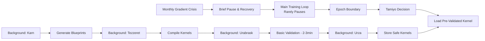

# Esper HLD - Executive Summary (AI-Optimized)

**Version:** 2.0  
**Status:** MVP Simplified Implementation  
**Date:** 08 September 2025  
**Author:** John Morrissey  
**Optimization:** Enhanced for AI Agent Processing with C-013 Simplifications

---

## AI Processing Metadata

**Document Type:** Executive Summary  
**Primary Audience:** System Architects, AI Agents, Technical Leaders  
**Processing Priority:** HIGH - Critical for system understanding  
**Dependencies:** None (entry point document)  
**Estimated Reading Time:** 8 minutes  

**Cross-References:**
- **Next:** [Document Purpose and Scope](./002-document-purpose-and-scope.md)
- **Architecture:** [Reference Architecture Overview](./005-reference-architecture-overview.md)
- **Implementation:** [System Design & Data Flow](./006-system-design-data-flow.md)
- **Technical Details:** [Component Specifications](./007-component-specifications.md)

---

## Quick Reference Summary

| **Attribute** | **Value** |
|---------------|-----------|
| **System Type** | Morphogenetic Neural Network Training Platform |
| **Core Innovation** | Autonomous structural modification during training |
| **Key Benefit** | 2-week implementation vs 14-week traditional complex approach |
| **Architecture** | 12 specialized subsystems across 3 functional planes |
| **Implementation Status** | Requires complete reimplementation (post-reset) |
| **Safety Guarantees** | 11-stage lifecycle with simplified validation |
| **Training Disruption** | Negligible disruption - rare 5-30s pauses acceptable (0.0008% of training time) |

---

## Core Concept: Morphogenetic Neural Networks

### Definition

**Morphogenetic Architecture** = Neural networks that autonomously detect computational bottlenecks and graft specialized sub-networks (Blueprints) into their structure during training.

### Key Characteristics

- **Self-Evolving:** Networks modify their own architecture while training
- **Safety-First:** All changes undergo rigorous 11-stage validation
- **Negligible-Disruption:** Main training rarely pauses (monthly 5-30s acceptable for recovery)
- **Parameter-Efficient:** Targeted capacity addition only where needed
- **Auditable:** Complete cryptographic tracking of all changes
- **Business-Optimized:** Accept 0.0008% disruption to save 10+ weeks engineering time

---

## Revolutionary Paradigm Shift

### Traditional Neural Networks (Problems)

```text
❌ Static architecture (frozen after design)
❌ Over-provisioned for worst-case scenarios
❌ Uniform capacity distribution (wasteful)
❌ Cannot adapt to changing requirements
❌ Human intervention required for improvements
❌ Expensive retraining for enhancements
```

### Esper Morphogenetic Networks (Solutions)

```text
✅ Dynamic architecture (host model evolves during training)
✅ Precise capacity scaling for host model's specific bottlenecks
✅ Targeted capacity where host model needs performance
✅ Host model autonomously adapts to new requirements
✅ Host model self-improves without human intervention
✅ Continuous host model enhancement without full retraining
```

---

## Architectural Innovation: Nested Learning Paradigm

### Three Simultaneous STANDARD Learning Processes

**Important:** The "innovation" is NOT in how these components learn - Tamiyo and Karn use conventional ML training. The innovation is that they guide the host model's architectural evolution.

1. **Host Model Learning** (The model being trained)
   - **Purpose:** Learn primary task (classification, NLP, etc.)
   - **Agent:** Host neural network (e.g., "model alpha")
   - **Objective:** Minimize task-specific loss function
   - **Special:** THIS is what evolves architecturally during training

2. **Controller Training** (Standard reinforcement learning)
   - **Purpose:** Learn when/where to evolve the host model
   - **Agent:** Tamiyo (Strategic Controller)
   - **Training:** Conventional RL via Simic using field reports
   - **Not Special:** Just standard policy learning, NOT morphogenetic

3. **Generator Training** (Standard supervised/reward learning)
   - **Purpose:** Learn to create better blueprints
   - **Agent:** Karn (Generative Architect)
   - **Training:** Conventional learning from deployment outcomes
   - **Not Special:** Just standard ML model training, NOT morphogenetic

### Critical Innovation: Asynchronous Pipeline with Acceptable Recovery Pauses



---

## System Architecture: 12 Specialized Subsystems

### Functional Plane Organization

#### 🎯 Training Plane (Core Learning)

| **Component** | **Role** | **Key Responsibility** |
|---------------|----------|------------------------|
| **Tolaria** | Training Orchestrator | Master training loop, optimizer management, rollback authority |
| **Kasmina** | Execution Layer | Pure kernel execution, GPU cache management, seed lifecycle |

#### 🧠 Control Plane (Intelligent Decisions)

| **Component** | **Role** | **Key Responsibility** |
|---------------|----------|------------------------|
| **Tamiyo** | Strategic Controller | GNN-based policy decisions, system analysis, adaptation targeting |
| **Simic** | Policy Trainer | Train Tamiyo's decision policies from field reports |
| **Emrakul** | Architectural Sculptor | Large-scale architectural modifications |
| **Jace** | Curriculum Coordinator | Adaptive curriculum planning and task sequencing |

#### 🔬 Innovation Plane (Continuous Improvement)

| **Component** | **Role** | **Key Responsibility** |
|---------------|----------|------------------------|
| **Karn** | Generative Architect | Blueprint generator with default blueprints (generative AI planned) |
| **Tezzeret** | Compilation Forge | Asynchronous blueprint compilation, optimization |
| **Urabrask** | Evaluation Engine | Simplified validation, basic performance characterization |
| **Urza** | Central Library | Asset storage, query API, version management |

#### 🔧 Infrastructure Plane (Foundation)

| **Component** | **Role** | **Key Responsibility** |
|---------------|----------|------------------------|
| **Oona** | Message Bus | Event-driven communication, loose coupling |
| **Nissa** | Observability | Monitoring, auditing, metrics, dashboards |

---

## Critical Safety Mechanisms

### 11-Stage Seed Lifecycle with Simplified Validation

#### Phase 1: Pre-Integration (Safe Experimentation)

```text
DORMANT → GERMINATED → TRAINING
```

- Blueprint trained in complete isolation
- No impact on host model
- Early rejection of failed designs

#### Phase 2: Controlled Integration (Gradual Testing)

```text
GRAFTING → STABILIZATION → EVALUATING  
```

- Careful integration with gradient isolation
- Continuous monitoring of host model performance
- Rollback capability at any point

#### Phase 3: Final Determination (Permanent Decision)

```text
FINE_TUNING → FOSSILIZED | CULLED | CANCELLED | ROLLED_BACK
```

- Final performance validation
- Permanent integration or complete removal
- No partial states - clean resolution

### Emergency Safety Features (Simplified)

- **Simple Pause-and-Recover:** Identity swap → cache revert → acceptable pause (5-30s monthly)
- **Tolaria Authority:** Training orchestrator has final authority on stability
- **Cryptographic Audit:** Complete traceability of all modifications
- **Interface Preservation:** Gradient isolation prevents backward compatibility breaks

---

## Implementation Strategy: Simplified Two-Week Approach

### Phase 1: MVP Core (2 weeks)

**Status:** 🔄 **REQUIRES REIMPLEMENTATION**
- **Timeline:** 2 weeks (simplified from 14-week complex system)
- **Scope:** Basic morphogenetic mechanics validation
- **Architecture:** Co-located subsystems on single server
- **Models:** Smaller research models and benchmarks
- **Outcome:** Functional prototype demonstrating end-to-end process

### Phase 2: Distributed Production (Future)

**Status:** 🔄 **ARCHITECTURE DESIGNED**
- **Timeline:** 6-9 months
- **Scope:** Full production-ready platform
- **Architecture:** Kubernetes-orchestrated distributed deployment
- **Models:** Large-scale production models
- **Features:** Enterprise security, MLOps integration, multi-model support

---

## Expected Performance Outcomes (Simplified Targets)

### Quantitative Benefits

| **Metric** | **Traditional Approach** | **Esper Morphogenetic** | **Improvement** |
|------------|--------------------------|--------------------------|-----------------|
| **Implementation Time** | 14 weeks (complex) | 2 weeks (simplified) | 85% faster delivery |
| **GPU Memory Savings** | N/A | 74GB saved for training | Direct cost reduction |
| **Integration Complexity** | High (emergency paths) | 85% reduction | Maintainable system |
| **Validation Throughput** | 100+ kernels/hour | 10-50 kernels/day | Sufficient for MVP |

### Qualitative Benefits

- **Autonomous Improvement:** Host models self-enhance without human intervention
- **Regulatory Compliance:** Complete audit trail and explainable decisions
- **Production Safety:** Basic validation prevents obvious system failures
- **Research Acceleration:** Automated architectural exploration and optimization
- **Business Value:** 3 months earlier delivery with acceptable trade-offs

---

## Current Implementation Status

### Post-Reset Status

**Following a significant architectural reset, the project requires complete reimplementation. All subsystems need to be rebuilt with simplified 2-week approach.**

### Training Plane Subsystems (2/12)

🔄 **Tolaria** - Training orchestration (requires reimplementation)  
🔄 **Kasmina** - Execution layer with seed lifecycle (requires reimplementation)

### Control Plane Subsystems (4/12)

🔄 **Tamiyo** - GNN-based strategic controller with simple pause-and-recover (requires reimplementation)  
🔄 **Simic** - Policy training with experience replay (requires reimplementation)  
🔄 **Emrakul** - Architectural sculptor (requires reimplementation)  
🔄 **Jace** - Curriculum coordinator (requires reimplementation)

### Innovation Plane Subsystems (4/12)

🔄 **Karn** - Blueprint generator with default blueprints (generative AI planned) (requires reimplementation)  
🔄 **Tezzeret** - Asynchronous compilation forge (requires reimplementation)  
🔄 **Urabrask** - Basic validation engine (requires reimplementation)  
🔄 **Urza** - Central library for asset management (requires reimplementation)

### Infrastructure Subsystems (2/12)

🔄 **Oona** - Simplified message bus without emergency priority queues (requires reimplementation)  
🔄 **Nissa** - Observability platform (requires reimplementation)

### Target Demonstrations (Post-Implementation)

⏳ **Complete Morphogenetic Pipeline:** Tolaria → Kasmina → Tamiyo → Urza → Tezzeret  
⏳ **Negligible Training Disruption:** Background compilation with acceptable monthly pauses  
⏳ **11-Stage Lifecycle:** Simplified seed state management  
⏳ **Policy Learning:** Field reports drive Simic training of Tamiyo policies

---

## Immediate Next Steps (Priority Order)

### Critical Path (Phase 1 - Core Infrastructure)

1. **Implement Core Training Loop** → Tolaria orchestrator with basic training functionality
2. **Build Execution Layer** → Kasmina with seed lifecycle management
3. **Establish Message Bus** → Oona for inter-subsystem communication

### High Priority (Phase 2 - Control Systems)

4. **Implement Strategic Controller** → Tamiyo with policy network
5. **Build Central Library** → Urza for asset management
6. **Deploy Karn Blueprint Generator** → Use default blueprints for initial system bootstrap

### Medium Priority (Phase 3 - Advanced Features)

7. **Add Compilation Pipeline** → Tezzeret for asynchronous kernel compilation
8. **Implement Basic Validation Engine** → Urabrask for safety validation
9. **Enhance Karn with Generative AI** → Upgrade from blueprint generator to neural generation

---

## Key Success Metrics

### Technical Validation Goals

- ⏳ **Morphogenetic Training:** Autonomous architecture evolution to be demonstrated
- ⏳ **Negligible Training Disruption:** Background compilation with acceptable monthly pauses
- ⏳ **Safety Mechanisms:** 11-stage lifecycle to prevent failures
- ⏳ **Parameter Efficiency:** Targeted adaptation efficiency to be validated

### Business Impact

- **Research Acceleration:** Automated architecture search reduces development time
- **Resource Optimization:** Precise capacity allocation reduces computational costs
- **Production Safety:** Basic validation suitable for regulated industries
- **Competitive Advantage:** Training self-improving models provides sustainable differentiation
- **Delivery Speed:** 2-week MVP vs 14-week complex implementation

---

## Conclusion

Esper enables a **fundamental paradigm shift** in how we train neural networks - from static architectures to **living, self-improving models**. Following the hard reset, the platform architecture has been simplified for 2-week implementation while maintaining core vision: training models that autonomously evolve their architecture while accepting negligible monthly disruptions.

The combination of **standard ML training for controllers** (Tamiyo/Karn learn conventionally), **asynchronous compilation pipelines**, and **simplified safety mechanisms** creates a platform that delivers transformative performance improvements while remaining operationally safe and rapidly implementable.

**Business Wisdom:** Accept 0.0008% disruption (monthly 30-second pauses) to save 10+ weeks engineering complexity. This represents intelligent simplification, not compromise.

**Bottom Line:** Esper is a training platform that transforms YOUR neural networks from static artifacts into autonomous systems capable of continuous architectural self-improvement - all within rigorously defined safety boundaries and pragmatic business constraints. The platform itself remains stable; it's YOUR models that evolve.