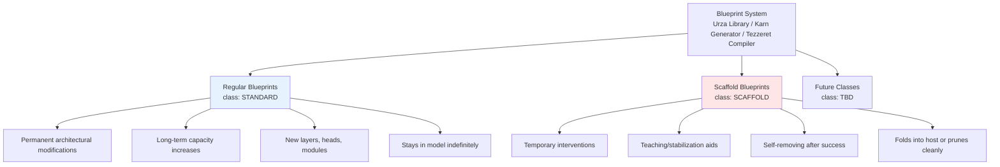

# Scaffolds: A Temporary, Foldable Blueprint Class

**Version:** 1.0 (Kasmina v3.3–compatible)
**Audience:** Conclave reviewers, platform leads, SRE, safety & performance owners
**Scope:** Specifies *scaffold* blueprints as a **policy overlay** on the existing Kasmina seed lifecycle (Leyline 11-state enum), plus Urza/Karn/Tezzeret metadata, Tamiyo control hooks, and Emrakul/Elesh checkpoint behavior.
**Non-negotiable:** **No lifecycle state is added or removed.** Scaffolds reuse the same seed wrapper and states; they differ only by **blueprint metadata** and **policies** (α schedule, TTL, exit).

> Agents should read **Urza (blueprint library), Karn (blueprint generator)** and **Tezzeret (blueprint compiler)** as additional context when reading the scaffold component.

---

## Blueprint Taxonomy - Critical Context

**IMPORTANT**: Scaffolds are ONE class of blueprint, not a replacement for regular blueprints. The Esper platform supports multiple blueprint classes that work together:



### Key Principles

1. **Regular blueprints** drive the primary evolution of the model - adding permanent capacity, new architectures, long-term improvements
2. **Scaffold blueprints** provide temporary assistance during difficult training phases - they help, teach, then disappear
3. **Both use the same infrastructure** - Urza library, Karn generation, Tezzeret compilation
4. **They complement each other** - Regular blueprints for growth, scaffolds for temporary help
5. **Scaffolds are optional** - A model can evolve using only regular blueprints; scaffolds are an additional tool when needed

### When to Use Each

| Scenario | Use Regular Blueprint | Use Scaffold Blueprint |
|----------|----------------------|------------------------|
| Adding new capability | ✅ | ❌ |
| Permanent capacity increase | ✅ | ❌ |
| Fixing training instability | ❌ | ✅ |
| Temporary learning assistance | ❌ | ✅ |
| Exploring risky changes | ❌ | ✅ |
| Production model enhancement | ✅ | ❌ |

---

## 1) What is a scaffold?

A **scaffold** is a **temporary, foldable blueprint** designed to *improve learning dynamics now* and then **get out of the way** later. It can be anything from a micro adapter to a macro routing module — the key is it carries metadata that:

* sets a **TTL in checkpoints** (how long to exist before an exit decision),
* defines an **α warm-up / hold / decay policy** during standard grafting/stabilization states,
* declares **foldability** (how to fuse deltas back into the host) and **prunability** (how to remove cleanly),
* pins **teaching losses** (KD/feature-match/probes) to maximize knowledge transfer while active.

Scaffolds are **blueprints** (Urza/Karn/Tezzeret) that any seed can germinate; the Kasmina runtime wrapper is unchanged.

---

## 2) Where scaffolds sit in the existing lifecycle

Kasmina v3.3 uses an 11-state Leyline enum (e.g., `SEED_DORMANT`, `SEED_TRAIN_ISOLATED`, `SEED_GRAFTING`, `SEED_STABILIZATION`, `SEED_EVALUATING`, `SEED_FINE_TUNING`, `SEED_ACTIVE`, `SEED_FOSSILIZED`, `SEED_CULLED`, `SEED_PAUSED/EMBARGO`, etc.). **Scaffolds do not add states.** They apply a **policy overlay** to selected states:

| Lifecycle state (Leyline)         | Scaffold overlay (policy only)                                                                   | Purpose                 |
| --------------------------------- | ------------------------------------------------------------------------------------------------ | ----------------------- |
| **SEED\_DORMANT**                 | Declare TTL + exit policy; pre-register fold paths                                               | Zero runtime impact     |
| **SEED\_TRAIN\_ISOLATED**         | Enable **teacher losses** (KD/feature MSE/probes) from host path                                 | Safe pre-alignment      |
| **SEED\_GRAFTING**                | **α warm-up** to small value; **host branch MUST be detached** in blend                          | Gentle introduction     |
| **SEED\_STABILIZATION**           | **Hold α**, then **decay α→0** (policy-driven); keep teaching losses on                          | Teach while withdrawing |
| **SEED\_EVALUATING**              | Run **exit gates** (see §4) to choose **FUSE** vs **PRUNE** vs **PERSIST**                       | Decision point          |
| **SEED\_FINE\_TUNING** (optional) | Short, seed-only finetune if fuse-worthy but below threshold                                     | Squeeze last gains      |
| **SEED\_ACTIVE / FOSSILIZED**     | If **FUSE**: convert to host deltas and mark **FOSSILIZED** (no-op). If **PRUNE**: cull cleanly. | Clean end-state         |
| **SEED\_CULLED / EMBARGO**        | Cooldown if gates fail hard; prevent immediate regrowth                                          | Blast-radius control    |

**Invariant stays:** `∇L_host ∩ ∇L_seed = ∅` until explicit joint training.
**Blend requirement:** during grafting, compute `out = α·seed + (1−α)·host.detach()`. (If any snippets still use `host` without `.detach()`, fix during hygiene pass.)

---

## 3) Blueprint metadata (Urza/Karn/Tezzeret)

Add a scaffold class to your existing blueprint schema — this is the only place “scaffold” is *special*.

```yaml
class: SCAFFOLD                 # blueprint class (not a different seed)
intent_tags: [teaching, temporary, foldable]
ttl_ckpts: 15                   # checkpoints before exit decision
alpha_schedule:                 # policy overlay (lifecycle unchanged)
  warmup_ckpts: 2
  hold_ckpts: 3
  decay_ckpts: 10
  floor: 0.0
teach_losses:                   # optional but recommended
  kd_logits: {tau: 2.0, weight: 1.0}
  feat_mse:  {weight: 0.3, taps: ["L12.h","L16.h"]}
foldability:                    # declares fuse mechanisms available
  supports_linear_fold: true    # e.g., weight delta projection
  supports_lora_fold:   true    # LoRA merge path
  supports_router_fold: false   # if MoE/router
exit_policy: prefer_fuse        # {prefer_fuse|prefer_prune|persist_if_wins}
risk:
  bsds_overall: 0.32            # Urabrask BSDS overall risk
disruption:
  level: moderate               # feeds Tamiyo cost model
```

**Tezzeret**: emit **fold descriptors** (e.g., LoRA basis, linearization Jacobian taps, maskable boundaries) with the compiled artifact so Emrakul/Elesh can act at checkpoint without recomputing heavy analysis.

---

## 4) Exit gates (checkpoint-time decision)

Evaluated by **Emrakul** (strategy) with **Elesh** (workers) **offline at checkpoint**; if the window hits `ttl_ckpts` or an early-exit condition triggers:

**Gates (all must pass for FUSE; any hard-fail → PRUNE; soft-pass → PERSIST)**

1. **Transfer Verified:** Post-decay task metrics within ε of pre-decay, and **host-only** path maintains capability (no scaffold at inference).
   - Window size K = 20 batches (configurable per device)
   - `host_only_parity_delta ≤ ε` where ε = 0.01 (default)

2. **Attribution / Residual Gain:** `Δhost_quality_with_scaffold – Δhost_quality_without_scaffold ≥ γ`.
   - γ = 0.001 (default residual threshold)

3. **Foldability Score ≥ θ:** Based on artifact fold descriptors (LoRA rank adequacy; linearization error bounds).
   - θ = 0.9 (default foldability threshold)
   - Computed from fold descriptor metadata emitted by Tezzeret

4. **Stability Check:** Model stability metrics within acceptable bounds.
   - `stability_p95_jitter ≤ 5%` where jitter = p95(|Δy_t| / (|y_t| + ε)), ε=1e-6
   - `loss_drift_window ≤ 0.05` where drift = |E_t[L] − E_{t−K}[L]|
   - `feature_diversity_idx ≥ 0.6` on specified layer (sample ≤ 1/64 batches)

5. **Latency/Mem Check (safety):** Fusing does not violate serving envelopes; PRUNE restores headroom if needed.
   - Serving latency p99 must stay within SLO
   - Memory usage must not exceed 90% of available

**Outcomes**

* **FUSE:** Apply selected fold (Linear / LoRA / Structured). Mark seed as **FOSSILIZED** with `alpha=0` and a no-op kernel. Keep a reversible **diff** in checkpoint metadata for 1–2 cycles for rollback capability.

* **PRUNE:** Remove weights + buffers; seed enters **CULLED** then **EMBARGO** cooldown.
  - Cooldown period: 3 epochs default (`cooldown_epochs_on_fail`)
  - Region cannot spawn new scaffolds during cooldown
  - Prevents thrashing and resource waste

* **PERSIST:** If it still yields net benefit with α>0 and gates not yet met, extend `ttl_ckpts` by a small, bounded amount (e.g., +3) under Tamiyo budget.
  - Maximum 2 extensions per scaffold (`max_retries_per_region`)
  - Total TTL cannot exceed 2x original allocation

---

## 5) α-policy overlay (per scaffold)

A simple, deterministic schedule that runs **entirely within existing states**:

```text
TRAIN_ISOLATED:   α = 0.0 (teach via KD/feat only)
GRAFTING:         α: 0 → α_warm (e.g., 0.1) over warmup_ckpts
STABILIZATION:    hold α = α_warm for hold_ckpts
STABILIZATION:    decay α_warm → 0 over decay_ckpts (cosine or linear)
EVALUATING:       α = 0.0; run exit gates
```

* **Micro scaffolds** (adapters/normalisers): `α_warm≈0.5`, short `ttl_ckpts`.
* **Meso scaffolds** (blocks/attn variants): `α_warm≈0.1–0.25`, medium TTL.
* **Macro scaffolds** (routing/heads): `α_warm≈canary + mirroring`, long TTL, manual dwell.

---

## 6) Control-plane integration

### 6.1 Tamiyo (Prime / Sub-Tamiyos)

* **Energy & Stability Budget:** Each Sub-Tamiyo receives a budget; **Emrakul’s budget is inversely coupled**:
  `budget_emrakul = k / (ε + Σ budget_subtamiyo_activity)` so large tactical rollouts automatically **throttle** fuse/prune operations, and quiet periods **free** Emrakul to act.
* **Allowance to Emrakul:** Tamiyo exposes **volatility** (`σ_loss`, `lr_jitter`, breaker flaps, gate churn) and a **per-cycle allowance**: max fold/prune ops or max “disruption points”.
* **SOP hook (optional):** Sub-Tamiyo can request extra TTL for a scaffold (persist) or early fuse if ROI is exceptional.

### 6.2 Emrakul/Elesh (checkpoint-time)

* **Elesh** computes foldability metrics (LoRA merge residuals, linearization error bounds, structured-mask accuracy) and drafts `PruningMasks` or `FoldOps`.
* **Emrakul** applies **Strategy Engine** thresholds and Tamiyo allowance, then returns `CheckpointUpdate` to Kasmina.
* **Rollback-first:** Diff metadata (pre/post weights or LoRA factors) is logged so a single checkpoint restore reverts a fold.

---

## 7) Kasmina hooks (what changes, what doesn’t)

**Unchanged:** seed wrapper, states, GPU cache, Leyline handlers, two-optimizer policy, breaker semantics.

**Additions (small and local):**

* **Scaffold policy carrier** on the seed instance (read-only fields from blueprint metadata): `ttl_ckpts`, α schedule, foldability flags.
* **State tensor usage**: reuse `EPOCHS_IN_STATE`, `ALPHA_BLEND`, `GRAFTING_STRATEGY`; use `EMBARGO_COUNTER` on cull cooldown.
* **Blend correctness:** **Ensure grafting uses `host_activations.detach()`** in the α blend branch.
* **Teach losses registry**: a light registry keyed by `seed_id` that attaches KD/feature losses during `SEED_TRAIN_ISOLATED` & `SEED_STABILIZATION`.

---

## 8) Telemetry (Leyline) — minimal but sufficient

Metrics (rate-limited, per scaffold):

* `scaffold_alpha{seed_id}`; `epochs_in_state`; `ttl_remaining_ckpts`
* `foldability_score`, `fuse_candidate` (0/1), `prune_candidate` (0/1)
* `kd_loss`, `feat_mse`, `parity_error_p95`
* `fuse_success` / `prune_success` events with residuals and time

Breaker-worthy events:

* `isolation_violation` (any leak), `fold_residual_exceeded`, `latency_budget_risk`

---

## 9) Safety & invariants

* **Gradient isolation** until explicit joint training: `∇L_host ∩ ∇L_seed = ∅`.
* **Detach discipline** in blends (see above).
* **Serving envelopes** are first-class: no fuse/prune may breach latency/memory SLOs.
* **One-touch rollback**: last checkpoint + diff metadata are sufficient to revert.
* **Anti-thrash protection**: Failed scaffolds trigger cooldown periods to prevent repeated failures.
* **Resource bounds**: Maximum concurrent scaffolds limited (default: 3 global, 1 per region).

### Failure Modes & Recovery

| Failure Mode | Detection | Automatic Response |
|-------------|-----------|-------------------|
| Gates fail at TTL | Exit gates evaluated | Auto-sunset to NOOP, enter cooldown |
| Training destabilized | Loss spike > threshold | Immediate α → 0, attempt graceful removal |
| Memory pressure | >90% GPU memory | Force PRUNE decision, no PERSIST option |
| Fold incompatible | Foldability score < θ | Convert to PRUNE, log for analysis |
| Repeated failures | Same region fails 2x | Extended cooldown (2x duration) |

---

## 10) CI & verification (scaffold-specific)

1. **Property tests:** synthetic graphs covering TRAIN\_ISOLATED→GRAFTING→STABILIZATION with **host-detach asserted** in blend.
2. **α schedule tests:** determinism of warm-up/hold/decay across TTL windows.
3. **Fold simulation:** inject known deltas; verify LoRA/linear fold reaches ≤ residual bound θ and replays correctly from diff.
4. **Exit-gate harness:** mock Tamiyo budget/Elesh foldability to drive FUSE/PRUNE/PERSIST branches.
5. **Breaker tests:** forced isolation violation raises event and reverts to identity path.

---

## 11) Defaults (illustrative; tune per device/task)

```yaml
scaffold_defaults:
  ttl_ckpts: 12
  alpha:
    warmup_ckpts: 2
    hold_ckpts:   3
    decay_ckpts:  7
    warm_level:   {micro: 0.5, meso: 0.25, macro: 0.1}
  exit_gates:
    epsilon_task_abs:   0.02
    epsilon_task_delta: 0.002
    foldability_theta:  0.9
    residual_gamma:     0.001
  budgets:
    max_folds_per_ckpt: 2
    max_prunes_per_ckpt:4
```

---

## 12) Operational checklists

**Scaffold start (TRAIN\_ISOLATED → GRAFTING):**

* [ ] KD/feat losses registered
* [ ] Isolation counters clean; host branch detached in blend path
* [ ] α schedule loaded; TTL started

**Each checkpoint:**

* [ ] TTL decremented; if TTL=0 → run exit gates
* [ ] Emrakul allowance available; inverse budget not throttling actions
* [ ] If FUSE: diff written; Leyline events emitted
* [ ] If PRUNE: memory reclaimed; EMBARGO set

**Hygiene pass items:**

* [ ] Replace any `α·seed + (1−α)·host` with `host.detach()`
* [ ] Confirm Leyline maps (Option B) used in scaffold telemetry/events
* [ ] Ensure Tezzeret emits fold descriptors with compiled artifacts

---

## 13) Why this works (intuition)

A scaffold **raises model capacity temporarily** to flatten optimization cliffs (better conditioning, richer signals), and **teaches the host** via KD/feature alignment while it’s active. The **decay phase** forces the host to carry the capability without the scaffold. **Checkpoint-time fusing** converts transient help into permanent parameters; **pruning** removes dead weight. Tamiyo’s **inverse budget coupling** ensures this doesn’t collide with large tactical rollouts.

---

### One-line redlines you can add to the code docs during the hygiene pass

* “During `SEED_GRAFTING`, compute blends as `α·seed + (1−α)·host.detach()` to preserve `∇L_host ∩ ∇L_seed = ∅`.”
* “Scaffold is a **blueprint class** (Urza/Karn/Tezzeret). Seeds are unchanged.”
* “Exit gates run **offline at checkpoint** via Emrakul/Elesh; actions are **FUSE**, **PRUNE**, or **PERSIST** under Tamiyo budget.”

---
