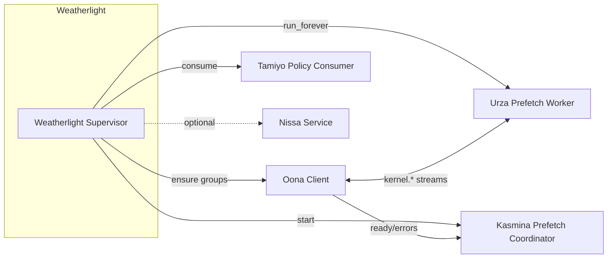

# Weatherlight — Foundation Orchestrator (Prototype‑Delta)

Purpose

- Provide a single, process‑level supervisor that boots and coordinates Esper‑Lite subsystems (Oona, Urza prefetch, Tezzeret notifications, Kasmina prefetch coordination, Tamiyo policy consumers; Nissa runs as its own service).
- Deliver a deterministic boot order, health/backoff, and uniform telemetry without altering Leyline contracts or adding cross‑subsystem tech debt.

Scope (prototype)

- One async service that:
  - Initialises Oona (ensures consumer groups/streams) and verifies HMAC signing is configured (ESPER_LEYLINE_SECRET present).
  - Starts Urza’s `UrzaPrefetchWorker.run_forever()` to serve async kernel fetch.
  - Attaches Kasmina’s `KasminaPrefetchCoordinator` and starts ready/error consumers.
  - Starts Tamiyo’s policy‑update consumer.
  - Optionally monitors Nissa (runs as separate process via existing `esper-nissa-service`).
  - Aggregates health/metrics and handles graceful shutdown.

Non‑Goals

- No business logic changes inside subsystems; Weatherlight only composes them.
- No new Leyline enums or messages; re‑use existing bus envelopes and kernel messages.

Invariants

- Leyline remains the single source of truth for data classes and enums (no mappings).
- Host branch must stay detached in Kasmina blend paths; Weatherlight does not change execution semantics.
- Async kernel data path: bus carries references only (no binaries on Oona).

Status

- Implemented as `WeatherlightService` with CLI `esper-weatherlight-service`.
- Compose file available at `infra/docker-compose.weatherlight.yml`.
- Oona freshness/nonce enforcement and TTL housekeeping are enabled and tunable via `EsperSettings`.

High‑Level Boot Sequence

1) Load `EsperSettings` → log config, validate required env vars (ESPER_LEYLINE_SECRET, REDIS_URL).
2) Create `OonaClient` with streams and ensure consumer group exists.
3) Build Urza library/runtime and spawn `UrzaPrefetchWorker.run_forever()`.
4) Build Kasmina manager and start `KasminaPrefetchCoordinator` (ready/error consumers).
5) Start Tamiyo policy‑update consumer.
6) Optionally: confirm Nissa service reachable (health ping) or leave to separate deployment.
7) Register signal handlers; on shutdown: cancel tasks, drain, and close clients cleanly.

How to Run (prototype)
- CLI: `esper-weatherlight-service`
- Compose: `docker compose -f infra/docker-compose.weatherlight.yml up -d`
- Env (see Operations): `ESPER_LEYLINE_SECRET`, `REDIS_URL`, TTL/freshness tunables.

Mermaid (conceptual)

Design Sources

- Oona unified design and contracts: `docs/design/detailed_design/09-oona-unified-design.md`, `00-leyline-shared-contracts.md`.
- Kernel prefetch contracts: `KernelPrefetchRequest`, `KernelArtifactReady`, `KernelArtifactError` (Leyline bundle).
- Urza storage + prefetch worker: `docs/design/detailed_design/08-urza.md` (scaffold), implementation in `src/esper/urza/*`.
- Kasmina async attach path: `02-kasmina-unified-design.md` and prefetch coordinator scaffold.
- Tamiyo policy consumer: `03-tamiyo` series; service exposes consumer helper.
- Observability: `11-nissa` series; separate service runner exists.

Status at a glance

- Core mechanics exist across subsystems (clients/workers), but no unified boot service yet. See `delta-matrix.md` for details.

Outstanding Items (for coders)

- Unified supervisor implementation
  - Finalise `WeatherlightService` as the single async supervisor (start/stop, backoff/jitter, signal handling) and expose `esper-weatherlight-service` CLI.
  - Pointers: `src/esper/weatherlight/service_runner.py` (implementation scaffold already present; wire into packaging/CLI).

- Periodic telemetry + health
  - Publish Weatherlight health/metrics (workers running/backoff/restarts, uptime, last error) to Oona at a fixed cadence; attach Tezzeret telemetry if provider set.
  - Pointers: `WeatherlightService._build_telemetry_packet/_flush_telemetry_once` (present), ensure routing via Oona.

- Housekeeping integration
  - Invoke Oona housekeeping and Urza maintenance periodically; ensure errors are logged and non‑fatal; expose counters.
  - Pointers: `WeatherlightService._housekeeping_loop()` (present).

- Kasmina telemetry forwarding
  - Drain KasminaSeedManager telemetry and publish with proper priority mapping (present); add tests for priority routing.
  - Pointers: `WeatherlightService._kasmina_telemetry_loop()`.

- Boot guards & secrets
  - Validate `ESPER_LEYLINE_SECRET` presence at start (present) and redis connectivity; fail fast with clear error.
  - Pointers: `WeatherlightService._ensure_secret_present()`.

- Nissa integration (optional)
  - Optionally detect running Nissa and forward a lightweight heartbeat or enrich metrics; keep decoupled.
  - Pointers: service runner and operations docs.
