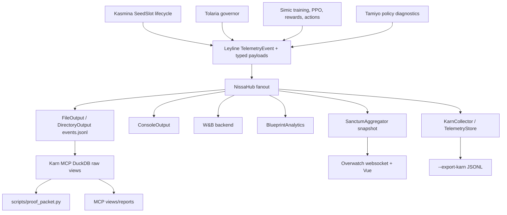

# Telemetry Feed Inventory

Date: 2026-06-13

This inventory traces the main telemetry feeds from producer to Leyline payload, Nissa/Karn backends, and consumers. Source line evidence is in the subagent reports under `temp/`; this file consolidates the network shape.

## Data Flow

## Feed Table

| Feed | Producer -> payload | Backend/store path | Consumer path | Health assessment |
| --- | --- | --- | --- | --- |
| `TRAINING_STARTED` | Simic vectorized/heuristic startup -> `TrainingStartedPayload` | Nissa JSONL, W&B subset, KarnCollector, Sanctum | run context, W&B config, Karn export, UI run state | Real in raw JSONL. Karn export lost `host_params` in smoke: Nissa had `host_params=164`, export context/host snapshot had `0`. |
| `EPOCH_COMPLETED` | Simic emitters/helpers -> `EpochCompletedPayload` | Nissa JSONL, W&B subset, KarnCollector, Sanctum, MCP views | epoch progress, UI host state, proof context | Real metrics, but `to_dict()` drops `episode_idx`; Karn import/export can default missing fields to zero. |
| `BATCH_EPOCH_COMPLETED` | Simic emitters -> `BatchEpochCompletedPayload` | Nissa JSONL, W&B subset, KarnCollector, Sanctum, MCP views | progress/batch stats | Real when emitted. Missing rolling accuracy defaults to displayed `0.0%`; skipped finiteness batches can emit nothing before continue. |
| `PPO_UPDATE_COMPLETED` | PPO update metrics -> `PPOUpdatePayload` | Nissa JSONL, W&B subset, KarnCollector, Sanctum, MCP `ppo_updates` | policy health, learnability gate, UI Tamiyo state | Real for successful updates. W&B drops many critical fields; LSTM health can be overwritten by rollout hidden-state health; first/second finiteness skips are absent. |
| `ANALYTICS_SNAPSHOT(kind=last_action)` | Simic action execution/emitter -> `AnalyticsSnapshotPayload` | Nissa JSONL, KarnCollector partial policy snapshot, Sanctum, MCP decisions/rewards | decision/reward diagnostics | Real on normal actions. Mask booleans mean "some options restricted" while contract says "forced"; rollback actions skip normal action analytics. |
| Reward components | Simic reward calculator -> `RewardComponentsTelemetry` nested in last action | Nissa JSONL, MCP rewards view, partial Karn store | reward proof and decision diagnostics | Real for component-enabled paths. Rich raw view exists; stateful Karn store keeps only a small subset. |
| `EPISODE_OUTCOME` | Simic action execution -> `EpisodeOutcomePayload` | Nissa JSONL, Sanctum, Karn MCP `episode_outcomes` | Pareto, proof packet ROI | Proof-critical. Rollback episodes skip emission and no corrected event is later emitted; KarnCollector/store/export do not preserve outcomes. |
| `SEED_GERMINATED` | Kasmina `SeedSlot` -> `SeedGerminatedPayload` | Nissa JSONL, W&B, BlueprintAnalytics, Karn/Sanctum | lifecycle counters, UI seed state | Core facts real. Initial gradient fields are healthy placeholders for new seeds. |
| `SEED_STAGE_CHANGED` | Kasmina `SeedSlot` -> `SeedStageChangedPayload` | Nissa JSONL, W&B, Karn/Sanctum | lifecycle timeline | Real transition fields. Karn timeline drops `accuracy_delta` and UI schema lacks causal IDs. |
| `SEED_GATE_EVALUATED` | Kasmina gates -> `SeedGateEvaluatedPayload` | Nissa JSONL, BlueprintAnalytics, Karn/Sanctum event log | gate diagnostics | Real gate facts. Limited W&B/console first-class handling. |
| `SEED_FOSSILIZED` | Kasmina terminal lifecycle -> `SeedFossilizedPayload` | Nissa JSONL, W&B, BlueprintAnalytics, Karn/Sanctum | lifecycle timeline, graveyard | Real terminal fact. `blending_delta` schema field is never populated; Karn terminal `from_stage` can self-transition after stage mutation. |
| `SEED_PRUNED` | Kasmina terminal lifecycle -> `SeedPrunedPayload` | Nissa JSONL, W&B, BlueprintAnalytics, Karn/Sanctum | lifecycle timeline, analytics | Real terminal fact. Leyline allows `blueprint_id=None`; BlueprintAnalytics rejects it. Karn can lose terminal origin/deltas. |
| `MORPHOLOGY_CAUSAL_LOG` | Simic action execution proposal/verdict/mutation/watch/audit | Nissa JSONL, Karn MCP raw view | causal proof joins via raw view only | Identity fields are real, but live Sanctum/Overwatch has no structured handler; watch/commit/audit evidence is same-step current loss, not post-mutation evidence. |
| `GOVERNOR_ROLLBACK` | Tolaria governor and Simic action execution | Nissa JSONL, Sanctum rollback flash, Karn raw anomaly view | rollback UI state, proof confounder candidate | Real rollback execution, but duplicated with conflicting context and omitted from proof confounders. |
| Ratio/value/numerical anomalies | Simic anomaly detection -> `AnomalyDetectedPayload` variants | Nissa JSONL, W&B alert subset, Karn raw views | health/proof views | Some are real. `GRADIENT_PATHOLOGY_DETECTED` has consumers but no producer; `ratio_diagnostic` is produced but dropped before emission. |
| `REWARD_HACKING_SUSPECTED` | Simic contribution reward checks | Nissa JSONL, Blueprint validation, raw views | should be proof confounder | Real event type exists but proof ledger omits it. |
| `PERFORMANCE_DEGRADATION` | Simic telemetry checks | Nissa JSONL, Blueprint validation, raw views | should be proof confounder | Real event type exists but proof ledger omits it. |
| `COUNTERFACTUAL_MATRIX_COMPUTED` | Simic counterfactual emitter | Nissa JSONL, Sanctum | counterfactual snapshot | Real when emitted. Not imported by `TelemetryStore.import_from_nissa_dir()`. |
| Tamiyo Obs V3 features | Policy feature extractor from env/seed state | PPO observation tensors, tests | Tamiyo policy decision input | Mostly real. History padding and new-seed freshness defaults hide missingness as zero/fresh evidence. |
| Op Q-value diagnostics | PPO agent value head -> PPO metrics | Nissa JSONL via PPO update, Sanctum | Q spread/variance diagnostics | Value head is real; recurrent hidden state is placeholder initial hidden state. |
| Nissa DiagnosticTracker | tracker snapshots -> gradient/loss/class/weight stats | tracker serialization | diagnostic dumps/tests | Disabled metrics serialize as `0.0`, indistinguishable from measured zero. |
| Karn raw DuckDB views | `read_json_auto` over Nissa JSONL | MCP views and proof packet | reports/proof | Rich path, but `ignore_errors=true` silently skips malformed rows. |
| Karn stateful store/export | KarnCollector -> TelemetryStore -> export JSONL | `--export-karn` records | offline store analysis | Partial, not proof-complete. Smoke proved host params lost; outcomes and many event families are absent. |
| Sanctum/Overwatch live UI | SanctumAggregator -> OverwatchBackend -> generated TS schema | websocket snapshot | TUI/web dashboard | Snapshot path is real for known fields, but schema/aggregator cannot carry causal IDs or morphology causal log structure. |

## Inventory Bottom Line

The raw Nissa JSONL path is the most faithful store today. Karn MCP views over raw JSONL are richer than KarnCollector/TelemetryStore export. The weakest links for correctness are proof fail-open behavior, fake/defaulted evidence, semantic drift across producer/contract/consumer, and live UI loss of causal identity.
