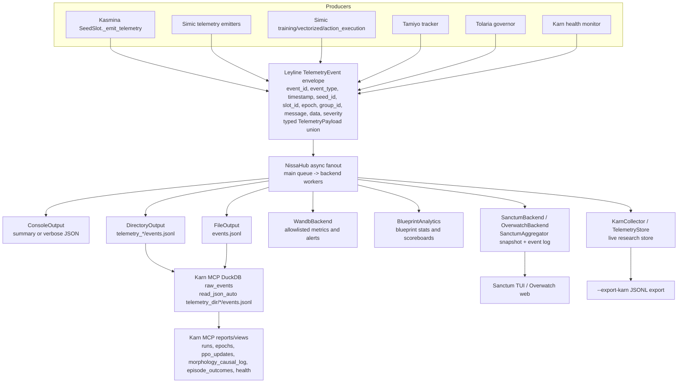

# Telemetry Topology Audit Findings

Date: 2026-06-13
Scope: `src/esper/leyline/telemetry.py`, `src/esper/nissa/`, `src/esper/scripts/train.py`, telemetry exports in `leyline`, `nissa`, and `simic.telemetry`, plus producer/consumer searches needed to validate topology.

## Summary

Nissa's raw JSONL path preserves the full `TelemetryEvent` envelope and typed payload data when `--telemetry-file` or `--telemetry-dir` is enabled. The live hub fans out to console, optional file/directory, optional W&B, optional Sanctum/Overwatch, and Karn collectors from `src/esper/scripts/train.py:536` through `src/esper/scripts/train.py:684`.

Confirmed issues:

1. `ISOLATION_VIOLATION` is explicitly dead: defined but never emitted or handled.
2. `GRADIENT_PATHOLOGY_DETECTED` has consumers, but no current production producer path.
3. `TelemetryStore.import_from_nissa_dir()` drops almost all typed payload families when reconstructing a Karn store from Nissa JSONL.
4. `MORPHOLOGY_CAUSAL_LOG` has rich join keys and raw DuckDB views, but no structured live Sanctum/Overwatch state consumer; live event log keeps only a generic message plus event id.
5. `--export-karn` wires two Karn collectors, then exports only the second/global one.

## Feed Inventory

| Event type | Payload contract | Obvious producers | Obvious backends/stores | Obvious consumers | Preservation notes |
| --- | --- | --- | --- | --- | --- |
| `SEED_GERMINATED` | `SeedGerminatedPayload` (`src/esper/leyline/telemetry.py:1103`) | `SeedSlot._emit_telemetry()` (`src/esper/kasmina/slot.py:2635`) | Nissa raw JSONL, console, W&B, `BlueprintAnalytics`, Karn collector, Sanctum/Overwatch | Blueprint analytics, Karn store, Sanctum seed state/event log, W&B | Raw JSONL preserves all payload fields. W&B stores only count, blueprint, params. Karn live state keeps core state, not morphology join ids. |
| `SEED_STAGE_CHANGED` | `SeedStageChangedPayload` (`src/esper/leyline/telemetry.py:1167`) | `SeedSlot._emit_telemetry()` (`src/esper/kasmina/slot.py:2635`) | Nissa raw JSONL, console, W&B, `BlueprintAnalytics`, Karn collector, Sanctum/Overwatch | Karn store, Sanctum seed state/event log, W&B | Raw JSONL preserves all payload fields. W&B and Karn live state keep a subset. |
| `SEED_GATE_EVALUATED` | `SeedGateEvaluatedPayload` (`src/esper/leyline/telemetry.py:1385`) | `SeedSlot._emit_telemetry()` (`src/esper/kasmina/slot.py:2635`) | Nissa raw JSONL, `BlueprintAnalytics`, Karn collector, Sanctum/Overwatch | Karn store, Sanctum seed state/event log | Not handled by W&B or console summary as a typed first-class event. |
| `SEED_FOSSILIZED` | `SeedFossilizedPayload` (`src/esper/leyline/telemetry.py:1260`) | `SeedSlot._emit_telemetry()` (`src/esper/kasmina/slot.py:2635`) | Nissa raw JSONL, console, W&B, `BlueprintAnalytics`, Karn collector, Sanctum/Overwatch | Blueprint analytics, Karn store, Sanctum seed state/event log, W&B | Raw JSONL preserves all payload fields. W&B stores improvement/params/blending delta only. |
| `SEED_PRUNED` | `SeedPrunedPayload` (`src/esper/leyline/telemetry.py:1321`) | `SeedSlot._emit_telemetry()` (`src/esper/kasmina/slot.py:2635`) | Nissa raw JSONL, console, W&B, `BlueprintAnalytics`, Karn collector, Sanctum/Overwatch | Blueprint analytics, Karn store, Sanctum seed state/event log, W&B | Raw JSONL preserves all payload fields. W&B stores count and reason only. |
| `EPOCH_COMPLETED` | `EpochCompletedPayload` (`src/esper/leyline/telemetry.py:532`) | `VectorizedEmitter.on_epoch_completed()` (`src/esper/simic/telemetry/emitters.py:162`), heuristic helper (`src/esper/simic/training/helpers.py:807`) | Nissa raw JSONL, console, W&B, Karn collector, Sanctum/Overwatch, Karn MCP raw views | Karn store, Sanctum host state, W&B env metrics, raw DuckDB views | `seeds` and `observation_stats` preserved in raw JSONL. W&B ignores seed payload and obs stats. |
| `BATCH_EPOCH_COMPLETED` | `BatchEpochCompletedPayload` (`src/esper/leyline/telemetry.py:605`) | `VectorizedEmitter.on_batch_completed()` (`src/esper/simic/telemetry/emitters.py:493`), `emit_batch_completed()` (`src/esper/simic/telemetry/emitters.py:623`) | Nissa raw JSONL, console, W&B, Karn collector, Sanctum/Overwatch, Karn MCP raw views | Karn batch state, Sanctum batch state/event log, W&B batch metrics | `TelemetryStore.import_from_nissa_dir()` does not reconstruct this event family. |
| `PLATEAU_DETECTED` | `TrendDetectedPayload` (`src/esper/leyline/telemetry.py:646`) | Trend detector in emitter (`src/esper/simic/telemetry/emitters.py:471`) | Nissa raw JSONL, `BlueprintAnalytics`, Karn MCP health/trend views | Raw DuckDB trend/health views | No first-class W&B or live UI state handler. |
| `DEGRADATION_DETECTED` | `TrendDetectedPayload` (`src/esper/leyline/telemetry.py:646`) | Trend detector in emitter (`src/esper/simic/telemetry/emitters.py:475`) | Nissa raw JSONL, `BlueprintAnalytics`, Karn MCP health/trend views | Raw DuckDB trend/health views | No first-class W&B or live UI state handler. |
| `IMPROVEMENT_DETECTED` | `TrendDetectedPayload` (`src/esper/leyline/telemetry.py:646`) | Trend detector in emitter (`src/esper/simic/telemetry/emitters.py:477`) | Nissa raw JSONL, `BlueprintAnalytics`, Karn MCP health/trend views | Raw DuckDB trend/health views | No first-class W&B or live UI state handler. |
| `TAMIYO_INITIATED` | `TamiyoInitiatedPayload` (`src/esper/leyline/telemetry.py:1072`) | Tamiyo tracker (`src/esper/tamiyo/tracker.py:158`) | Nissa raw JSONL, console, `BlueprintAnalytics` validation | Console/operator output | No first-class W&B or Karn live state handler. |
| `ISOLATION_VIOLATION` | No typed payload in `TelemetryPayload` union | None found | None found | None found | Confirmed dead contract. |
| `GRADIENT_ANOMALY` | `AnomalyDetectedPayload` (`src/esper/leyline/telemetry.py:1818`) | Fallback anomaly event (`src/esper/simic/training/vectorized.py:509`) | Nissa raw JSONL, console, `BlueprintAnalytics`, Karn collector, raw DuckDB health views | Dense trace trigger, console, raw views | Fallback for unknown anomaly types. |
| `PERFORMANCE_DEGRADATION` | `PerformanceDegradationPayload` (`src/esper/leyline/telemetry.py:1873`) | `check_performance_degradation()` (`src/esper/simic/telemetry/emitters.py:1219`) | Nissa raw JSONL, `BlueprintAnalytics`, raw DuckDB health views | Blueprint analytics console/status path, raw views | No W&B or live UI state handler. |
| `PPO_UPDATE_COMPLETED` | `PPOUpdatePayload` (`src/esper/leyline/telemetry.py:675`) | `emit_ppo_update_event()` (`src/esper/simic/telemetry/emitters.py:908`) | Nissa raw JSONL, console, W&B, Karn collector, Sanctum/Overwatch, Karn MCP raw views | Sanctum Tamiyo state, Karn store policy subset, W&B core metrics, raw views | Payload is very wide. Sanctum consumes most diagnostics; W&B and Karn store retain only subsets. |
| `MEMORY_WARNING` | `MemoryWarningPayload` (`src/esper/leyline/telemetry.py:1910`) | Karn health monitor (`src/esper/karn/health.py:198`) | Nissa raw JSONL, `BlueprintAnalytics` validation, raw DuckDB health views | Raw views/logs | No W&B or live UI state handler in the audited paths. |
| `REWARD_HACKING_SUSPECTED` | `RewardHackingSuspectedPayload` (`src/esper/leyline/telemetry.py:1940`) | Contribution reward checks (`src/esper/simic/rewards/contribution.py:1357`, `src/esper/simic/rewards/contribution.py:1395`) | Nissa raw JSONL, `BlueprintAnalytics` validation, raw DuckDB health views | Raw views/logs | No W&B or live UI state handler in the audited paths. |
| `RATIO_EXPLOSION_DETECTED` | `AnomalyDetectedPayload` (`src/esper/leyline/telemetry.py:1818`) | Anomaly map (`src/esper/simic/training/vectorized.py:496`) | Nissa raw JSONL, console, W&B alert, Karn collector, raw DuckDB health views | W&B alerts, dense traces, raw views, console | Preserved in raw JSONL; W&B logs count/alert only. |
| `RATIO_COLLAPSE_DETECTED` | `AnomalyDetectedPayload` (`src/esper/leyline/telemetry.py:1818`) | Anomaly map (`src/esper/simic/training/vectorized.py:496`) | Nissa raw JSONL, console, W&B alert, Karn collector, raw DuckDB health views | W&B alerts, dense traces, raw views, console | Preserved in raw JSONL; W&B logs count/alert only. |
| `VALUE_COLLAPSE_DETECTED` | `AnomalyDetectedPayload` (`src/esper/leyline/telemetry.py:1818`) | Anomaly map (`src/esper/simic/training/vectorized.py:496`) | Nissa raw JSONL, console, W&B alert, Karn collector, raw DuckDB health views | W&B alerts, dense traces, raw views, console | Preserved in raw JSONL; W&B logs count/alert only. |
| `GRADIENT_PATHOLOGY_DETECTED` | `AnomalyDetectedPayload` (`src/esper/leyline/telemetry.py:1818`) | None found | Nissa raw JSONL if emitted, console, W&B alert, Karn collector, raw DuckDB health views | Consumers are present, producer absent | Defined as supported by payload docs, but current anomaly map never emits it. |
| `NUMERICAL_INSTABILITY_DETECTED` | `AnomalyDetectedPayload` (`src/esper/leyline/telemetry.py:1818`) | Anomaly map (`src/esper/simic/training/vectorized.py:496`), PPO finiteness gate (`src/esper/simic/training/ppo_coordinator.py:294`) | Nissa raw JSONL, console, W&B alert, Karn collector, raw DuckDB health views | W&B alerts, dense traces, raw views, console | Preserved in raw JSONL; W&B logs count/alert only. |
| `GOVERNOR_ROLLBACK` | `GovernorRollbackPayload` (`src/esper/leyline/telemetry.py:2128`) | Tolaria governor (`src/esper/tolaria/governor.py:518`), Simic action execution (`src/esper/simic/training/action_execution.py:633`) | Nissa raw JSONL, console, `BlueprintAnalytics` validation, Sanctum/Overwatch | Console, Sanctum rollback state, raw views | Karn live store does not persist rollback as a first-class store record; raw JSONL does. |
| `MORPHOLOGY_CAUSAL_LOG` | `MorphologyCausalLogPayload` (`src/esper/leyline/telemetry.py:2065`) | Simic action execution (`src/esper/simic/training/action_execution.py:665`, `src/esper/simic/training/action_execution.py:770`, `src/esper/simic/training/action_execution.py:1184`) | Nissa raw JSONL, Karn MCP `morphology_causal_log` view | Raw DuckDB view when telemetry dir is queried | Live Sanctum/Overwatch state path does not structure the causal keys. |
| `TRAINING_STARTED` | `TrainingStartedPayload` (`src/esper/leyline/telemetry.py:426`) | Vectorized train (`src/esper/simic/training/vectorized.py:1078`), heuristic helper (`src/esper/simic/training/helpers.py:521`) | Nissa raw JSONL, W&B config, Karn collector, Sanctum/Overwatch, Karn MCP raw views | Run context, W&B config, Sanctum run state, raw views | W&B config stores only `n_envs`, `max_epochs`, and `task`. |
| `CHECKPOINT_LOADED` | `CheckpointLoadedPayload` (`src/esper/leyline/telemetry.py:519`) | Vectorized resume (`src/esper/simic/training/vectorized.py:1015`) | Nissa raw JSONL, console | Console/operator output | Not imported into Karn store or W&B. |
| `COUNTERFACTUAL_MATRIX_COMPUTED` | `CounterfactualMatrixPayload` (`src/esper/leyline/telemetry.py:1427`) | `VectorizedEmitter.on_counterfactual_matrix()` (`src/esper/simic/telemetry/emitters.py:231`) | Nissa raw JSONL, Sanctum/Overwatch | Sanctum counterfactual snapshot | Not handled by W&B or `TelemetryStore.import_from_nissa_dir()`. |
| `ANALYTICS_SNAPSHOT` | `AnalyticsSnapshotPayload` (`src/esper/leyline/telemetry.py:1537`) | Counterfactual attribution and Simic emitters (`src/esper/simic/telemetry/emitters.py:1071`, `src/esper/simic/telemetry/emitters.py:1094`, `src/esper/simic/telemetry/emitters.py:1134`) | Nissa raw JSONL, `BlueprintAnalytics`, Karn collector, Sanctum/Overwatch, Karn MCP views | Policy/reward/throughput/mask/decision views | Payload is a union-by-`kind`; consumers handle only selected kinds in each backend. |
| `EPISODE_OUTCOME` | `EpisodeOutcomePayload` (`src/esper/leyline/telemetry.py:1988`) | Simic action execution (`src/esper/simic/training/action_execution.py:1558`) | Nissa raw JSONL, Sanctum/Overwatch, Karn MCP `episode_outcomes` view | Sanctum outcome metrics, raw DuckDB views | Not imported into `TelemetryStore.import_from_nissa_dir()`. |

## Data-Flow Graph

## Confirmed Findings

### TT-001: `ISOLATION_VIOLATION` is a dead event type

Severity: P3

Failure mode: The enum exposes a health event that has no typed payload in `TelemetryPayload`, no producer, and no consumer. A future caller could assume the contract is supported because it is in `TelemetryEventType`, but the current source itself marks it dead.

Evidence:

- `src/esper/leyline/telemetry.py:82` says `ISOLATION_VIOLATION` is defined but never emitted or handled.
- `src/esper/leyline/telemetry.py:84` defines `ISOLATION_VIOLATION`.
- `src/esper/leyline/telemetry.py:2188` through `src/esper/leyline/telemetry.py:2210` lists the typed payload union and includes no isolation payload.

Tracker-ready title: Remove or implement the dead `ISOLATION_VIOLATION` telemetry event type.

### TT-002: `GRADIENT_PATHOLOGY_DETECTED` has consumers but no producer

Severity: P2

Failure mode: Consumers and analytics views advertise support for `GRADIENT_PATHOLOGY_DETECTED`, but the current anomaly producer map cannot emit it. Gradient pathology incidents will be collapsed into the fallback `GRADIENT_ANOMALY`, losing the more specific feed even though downstream consumers are ready for it.

Evidence:

- `src/esper/leyline/telemetry.py:97` defines `GRADIENT_PATHOLOGY_DETECTED`.
- `src/esper/leyline/telemetry.py:1818` through `src/esper/leyline/telemetry.py:1827` documents `AnomalyDetectedPayload` as used by `GRADIENT_PATHOLOGY_DETECTED`.
- `src/esper/simic/training/vectorized.py:496` through `src/esper/simic/training/vectorized.py:500` maps only `ratio_explosion`, `ratio_collapse`, `value_collapse`, and `numerical_instability` to specific events.
- `src/esper/simic/training/vectorized.py:509` through `src/esper/simic/training/vectorized.py:512` routes unmapped anomaly types to `GRADIENT_ANOMALY`.
- `src/esper/nissa/wandb_backend.py:192` through `src/esper/nissa/wandb_backend.py:199` and `src/esper/karn/mcp/views.py:511` through `src/esper/karn/mcp/views.py:512` show downstream consumers include `GRADIENT_PATHOLOGY_DETECTED`.

Tracker-ready title: Wire `GRADIENT_PATHOLOGY_DETECTED` into the anomaly producer map or remove the advertised feed.

### TT-003: Nissa DirectoryOutput import into Karn store drops most typed payload families

Severity: P2

Failure mode: `DirectoryOutput` writes the full event envelope and typed payload data to JSONL, but `TelemetryStore.import_from_nissa_dir()` reconstructs only `TRAINING_STARTED`, `EPOCH_COMPLETED`, and selected `ANALYTICS_SNAPSHOT` fields. Lifecycle events, batch summaries, PPO updates, episode outcomes, counterfactual matrices, governor rollbacks, morphology causal logs, and health events are silently absent from the reconstructed store.

Evidence:

- `src/esper/nissa/output.py:99` through `src/esper/nissa/output.py:109` serializes all event envelope fields plus `data`.
- `src/esper/nissa/output.py:516` through `src/esper/nissa/output.py:537` defines `DirectoryOutput` as timestamped directories containing `events.jsonl`.
- `src/esper/karn/store.py:856` through `src/esper/karn/store.py:860` says `import_from_nissa_dir()` reconstructs a `TelemetryStore` from Nissa `events.jsonl`.
- `src/esper/karn/store.py:891` through `src/esper/karn/store.py:913` handles only `TRAINING_STARTED`, `EPOCH_COMPLETED`, and `ANALYTICS_SNAPSHOT`.
- `src/esper/leyline/telemetry.py:2188` through `src/esper/leyline/telemetry.py:2210` lists 21 typed payload families in the current union.

Tracker-ready title: Make `TelemetryStore.import_from_nissa_dir()` preserve all supported telemetry payload families or fail loudly on unsupported event types.

### TT-004: Morphology causal logs are raw-file queryable but not live structured UI state

Severity: P2

Failure mode: Simic emits `MORPHOLOGY_CAUSAL_LOG` rows with joinable proposal/verdict/mutation/watch identity, RNG, topology, and governor fields. Raw DuckDB views can query those fields when pointed at Nissa JSONL, but the live Sanctum/Overwatch path has no structured route for this event type; the event log falls back to generic message handling with only `event_id` metadata. During live debugging, the causal join keys are effectively invisible unless the operator also writes and queries raw telemetry files.

Evidence:

- `src/esper/leyline/telemetry.py:2065` through `src/esper/leyline/telemetry.py:2090` defines the causal log payload fields.
- `src/esper/simic/training/action_execution.py:770` through `src/esper/simic/training/action_execution.py:779` emits the proposal phase.
- `src/esper/simic/training/action_execution.py:1184` through `src/esper/simic/training/action_execution.py:1223` emits watch, commit/fossilization, and audit phases.
- `src/esper/karn/mcp/views.py:280` through `src/esper/karn/mcp/views.py:297` projects the causal fields from `raw_events` into the DuckDB `morphology_causal_log` view.
- `src/esper/karn/sanctum/aggregator.py:346` through `src/esper/karn/sanctum/aggregator.py:363` routes live events but has no `MORPHOLOGY_CAUSAL_LOG` handler.
- `src/esper/karn/sanctum/aggregator.py:2043` through `src/esper/karn/sanctum/aggregator.py:2044` initializes event-log metadata with only `event_id`, and `src/esper/karn/sanctum/aggregator.py:2119` through `src/esper/karn/sanctum/aggregator.py:2120` falls back to `event.message or event_type`.

Tracker-ready title: Add a live structured consumer for `MORPHOLOGY_CAUSAL_LOG` causal identity fields.

### TT-005: `--export-karn` registers a duplicate Karn collector and exports only the global collector

Severity: P3

Failure mode: When `--export-karn` is set, `train.py` creates and registers a local `KarnCollector`, then later overwrites `karn_collector` with `get_collector()` and registers that global collector too. The export path writes only the second collector's store. This is unnecessary duplicated backend work and makes the topology ambiguous when reasoning about which store is authoritative.

Evidence:

- `src/esper/scripts/train.py:578` through `src/esper/scripts/train.py:583` creates a local `KarnCollector()` only when `--export-karn` is set and adds it to the Nissa hub.
- `src/esper/scripts/train.py:680` through `src/esper/scripts/train.py:684` unconditionally overwrites `karn_collector` with `get_collector()` and adds the global collector.
- `src/esper/scripts/train.py:998` through `src/esper/scripts/train.py:1003` exports `karn_collector.store`, which is the later global collector after the overwrite.

Tracker-ready title: Avoid duplicate Karn collector registration when `--export-karn` is enabled.

## Tracker-Ready Issue Rows

| Priority | Title | Failure mode | Evidence | Suggested acceptance criteria |
| --- | --- | --- | --- | --- |
| P3 | Remove or implement the dead `ISOLATION_VIOLATION` telemetry event type | Public enum advertises an event with no payload, producer, or consumer | `src/esper/leyline/telemetry.py:82`, `src/esper/leyline/telemetry.py:84`, `src/esper/leyline/telemetry.py:2188` | Either delete the enum member or add typed payload, producer, backend handling, and tests. |
| P2 | Wire `GRADIENT_PATHOLOGY_DETECTED` into the anomaly producer map or remove the advertised feed | Specific anomaly feed has consumers but cannot be emitted by the current producer map | `src/esper/leyline/telemetry.py:97`, `src/esper/simic/training/vectorized.py:496`, `src/esper/simic/training/vectorized.py:509`, `src/esper/nissa/wandb_backend.py:192` | A real gradient-pathology anomaly emits `GRADIENT_PATHOLOGY_DETECTED`, or downstream advertised support is removed. |
| P2 | Make `TelemetryStore.import_from_nissa_dir()` preserve all supported telemetry payload families or fail loudly | Reconstructing a store from Nissa JSONL silently drops most event families | `src/esper/nissa/output.py:99`, `src/esper/karn/store.py:856`, `src/esper/karn/store.py:891`, `src/esper/leyline/telemetry.py:2188` | Import either maps every supported event type needed by the store or raises/records unsupported event types with counts. |
| P2 | Add a live structured consumer for `MORPHOLOGY_CAUSAL_LOG` causal identity fields | Live UI path drops proposal/verdict/mutation/watch join keys into a generic event entry | `src/esper/leyline/telemetry.py:2065`, `src/esper/simic/training/action_execution.py:770`, `src/esper/karn/sanctum/aggregator.py:346`, `src/esper/karn/sanctum/aggregator.py:2119` | Sanctum/Overwatch snapshot or event detail exposes phase, action/proposal/verdict/mutation ids, RNG stream/seed, topology, and linked event id. |
| P3 | Avoid duplicate Karn collector registration when `--export-karn` is enabled | CLI registers a local export collector and a global collector, then exports only the global collector | `src/esper/scripts/train.py:578`, `src/esper/scripts/train.py:680`, `src/esper/scripts/train.py:998` | A run with `--export-karn` registers one authoritative Karn collector and exports that same store. |

## Uncertainties

- I treated raw JSONL plus Karn MCP DuckDB views as a valid backend/store consumer path for event families such as `MORPHOLOGY_CAUSAL_LOG` and `EPISODE_OUTCOME`. That path exists only when the run writes `--telemetry-dir` or equivalent JSONL files and a Karn MCP server is pointed at that directory.
- W&B appears intentionally metric-oriented rather than a full-fidelity store. I recorded its lossy field coverage in the inventory but did not classify every omitted payload field as a defect.
- Console summary output is intentionally compact. I did not treat missing console fields as defects unless the event also lacked an obvious structured live or store consumer.

## Verification Notes

- Source was read-only. No source files were edited.
- Loomweave was used for initial orientation, but its index reported stale; all evidence above was verified with current line-numbered source reads.
- No tests were run; this was a read-only topology audit.
