# Architecture Diagrams: Esper V1.0

## Level 1: System Context

The System Context diagram shows Esper as a black-box system with external actors and high-level interactions. This level abstracts away all internal complexity and shows only the system boundary and major external dependencies.

**What the diagram shows:**
- **Esper System** as a unified box at the center
- **External Actors**: 
  - Developer (user interacting with CLI)
  - CIFAR-10 Dataset (training/test data source)
  - GPU Hardware (computational resource)
- **Interactions**: Data flows between actors and the system

---

## Level 2: Container Diagram

The Container diagram shows the major technical containers (packages/modules) within Esper and their relationships. This is the zoomed-in view of the system boundary showing how Esper is decomposed into deployable/runnable units.

**What the diagram shows:**
- **6 Core Packages** (containers):
  - Leyline (Protocol/Contract Layer)
  - Kasmina (Seed Mechanics Layer)
  - Tamiyo (Decision Engine Layer)
  - Simic (RL Training Layer)
  - Nissa (Telemetry Layer)
  - Scripts (CLI Entry Points)
- **Orchestrator**: simic_overnight.py integrates all containers
- **Dependencies**: Arrows show how containers depend on each other

```mermaid
graph TB
    subgraph "Esper Containers"
        Leyline["📋 Leyline<br/>(Protocol Layer)<br/>1,057 LOC<br/>---<br/>Data contracts,<br/>Enums, Schemas<br/>Acts as lingua franca"]
        
        Kasmina["🔧 Kasmina<br/>(Seed Mechanics)<br/>1,210 LOC<br/>---<br/>Seed lifecycle,<br/>Gradient isolation,<br/>Alpha blending"]
        
        Tamiyo["🎯 Tamiyo<br/>(Decision Engine)<br/>501 LOC<br/>---<br/>Strategic decisions,<br/>Heuristic policy,<br/>Signal tracking"]
        
        Simic["🤖 Simic<br/>(RL Training)<br/>4,615 LOC<br/>---<br/>PPO/IQL algorithms,<br/>Episode collection,<br/>Feature extraction"]
        
        Nissa["📊 Nissa<br/>(Telemetry)<br/>358 LOC<br/>---<br/>Gradient health,<br/>Loss landscape,<br/>Metrics collection"]
        
        Scripts["🖥️ Scripts<br/>(CLI Entry Points)<br/>---<br/>train.py<br/>generate.py<br/>evaluate.py"]
        
        Orchestrator["🎪 simic_overnight.py<br/>(Orchestrator)<br/>859 LOC<br/>---<br/>Integrates all subsystems,<br/>Generates episodes,<br/>Trains & evaluates"]
    end
    
    subgraph "External"
        PyTorch["⚙️ PyTorch<br/>(Deep Learning)"]
        CIFAR["📊 CIFAR-10<br/>(Dataset)"]
    end
    
    %% Dependency flow: everything depends on Leyline
    Kasmina -->|imports| Leyline
    Tamiyo -->|imports| Leyline
    Simic -->|imports| Leyline
    Nissa -->|imports| Leyline
    Scripts -->|imports| Leyline
    Orchestrator -->|imports| Leyline
    
    %% Integration dependencies
    Orchestrator -->|uses| Kasmina
    Orchestrator -->|uses| Tamiyo
    Orchestrator -->|uses| Simic
    Orchestrator -->|uses| Nissa
    Orchestrator -->|uses| Scripts
    
    %% Intelligence dependencies
    Simic -->|imports HeuristicTamiyo<br/>for PPO/IQL training| Tamiyo
    
    %% Mechanics dependencies
    Tamiyo -->|issues commands to| Kasmina
    
    %% External dependencies
    Kasmina -->|uses| PyTorch
    Simic -->|uses| PyTorch
    Orchestrator -->|loads| CIFAR
    
    style Leyline fill:#E8F4F8,stroke:#2E5C8A,stroke-width:2px
    style Kasmina fill:#FFF4E6,stroke:#996600,stroke-width:2px
    style Tamiyo fill:#F0E6FF,stroke:#663399,stroke-width:2px
    style Simic fill:#E6F4FF,stroke:#1E40AF,stroke-width:2px
    style Nissa fill:#FFF0F5,stroke:#C41E3A,stroke-width:2px
    style Scripts fill:#F0FFF4,stroke:#22863A,stroke-width:2px
    style Orchestrator fill:#FFFACD,stroke:#DAA520,stroke-width:3px
    style PyTorch fill:#FFE4E1,stroke:#8B0000
    style CIFAR fill:#FFE4B5,stroke:#8B4513
```

---

## Level 3: Component Diagrams

### Leyline Components

**Location**: `src/esper/leyline/`  
**Responsibility**: Define the data contracts, enums, and protocols that enable type-safe communication across all subsystems. This is the "lingua franca" of Esper.

**What the diagram shows:**
- **6 Core Modules**: actions, stages, signals, schemas, reports, telemetry
- **Key Abstractions**: Enums (SimicAction, SeedStage), Dataclasses (SeedMetrics), Protocols (BlueprintProtocol)
- **Dependencies**: All other subsystems import from here

---

### Kasmina Components

**Location**: `src/esper/kasmina/`  
**Responsibility**: Manage seed module lifecycle through germination, training, blending, and fossilization. Implement gradient isolation and alpha-blending for safe integration with host model.

**What the diagram shows:**
- **4 Core Modules**: slot, blueprints, host, isolation
- **Key Classes**: SeedSlot (lifecycle), HostCNN (host model), BlueprintCatalog (architecture registry), GradientIsolationMonitor
- **Data Flow**: Seeds progress through lifecycle stages via quality gates and alpha scheduling

---

### Tamiyo Components

**Location**: `src/esper/tamiyo/`  
**Responsibility**: Observe training signals and make strategic decisions about seed lifecycle management. Provides both heuristic baseline and learned policy implementations.

**What the diagram shows:**
- **3 Core Modules**: decisions, tracker, heuristic
- **Key Types**: TamiyoAction (enum), TamiyoDecision (dataclass), TamiyoPolicy (Protocol)
- **Decision Loop**: Observe signals → Make decision → Convert to command → Execute on Kasmina

---

### Simic Components

**Location**: `src/esper/simic/`  
**Responsibility**: Train neural network policies to improve Tamiyo's seed lifecycle decisions. Provides PPO (online) and IQL/CQL (offline) training algorithms, episode collection, reward computation, and feature extraction.

**What the diagram shows:**
- **7 Core Modules**: episodes, features, rewards, networks, ppo, iql, __init__
- **Key Classes**: PolicyNetwork (nn.Module), PPOAgent, IQL (offline learner), EpisodeCollector
- **Data Pipeline**: TrainingSignals → Features → Episodes → Rewards → Training

---

### Nissa Components

**Location**: `src/esper/nissa/`  
**Responsibility**: Cross-cutting telemetry collection system. Gathers gradient health, loss landscape analysis, per-class metrics and routes to configurable output backends.

**What the diagram shows:**
- **3 Core Modules**: config, tracker, output
- **Key Classes**: TelemetryConfig (Pydantic), DiagnosticTracker (nn.Module), NissaHub (observer)
- **Pattern**: Configuration → Collection → Output routing

---

## Data Flow Diagram

**What the diagram shows:** How data flows through the Esper system from raw training signals through decisions and actions to updated model states.

**Flow**: Training Signals → Features → Policy Decisions → Seed Commands → Model Updates → Metrics

```mermaid
graph LR
    subgraph "Data Flow Pipeline"
        Input["🔄 TrainingSignals<br/>(27 features)<br/>epoch, loss, accuracy<br/>gradient metrics"]
        
        Features["➡️ Feature Extraction<br/>(simic/features.py)<br/>obs_to_base_features()<br/>27-dim vector"]
        
        Decision["🎯 Policy Decision<br/>Heuristic or Learned<br/>TamiyoAction enum<br/>Action + metadata"]
        
        Command["⚙️ Seed Command<br/>AdaptationCommand<br/>SeedStage transition<br/>RiskLevel assignment"]
        
        Execute["🔧 Execute on Seed<br/>(kasmina/slot.py)<br/>SeedSlot.update_stage()<br/>Alpha blending"]
        
        Feedback["📊 Metrics & Telemetry<br/>(nissa/*)<br/>Gradient health<br/>Training progress"]
        
        Loop["↩️ Next Epoch<br/>(Loop back)"]
    end
    
    Input -->|quality| Features
    Features -->|inference| Decision
    Decision -->|maps to| Command
    Command -->|executes| Execute
    Execute -->|emits events| Feedback
    Feedback -->|observes<br/>in next epoch| Loop
    Loop -->|continues| Input
    
    style Input fill:#FFE4B5,stroke:#8B4513,stroke-width:2px
    style Features fill:#BFDBFE,stroke:#1E40AF,stroke-width:2px
    style Decision fill:#E6D5FF,stroke:#663399,stroke-width:2px
    style Command fill:#FFF4E6,stroke:#996600,stroke-width:2px
    style Execute fill:#FFF4E6,stroke:#996600,stroke-width:2px
    style Feedback fill:#FFE4ED,stroke:#C41E3A,stroke-width:2px
    style Loop fill:#E8F4F8,stroke:#2E5C8A,stroke-width:2px
```

---

## Dependency Graph

**What the diagram shows:** Package-level dependencies showing which subsystems depend on which others. This helps understand the architecture's layering and identifies potential circular dependency risks.

**Key Insight**: Leyline is the foundation - everything depends on it. No other subsystem has universal dependents.

---

## Lifecycle State Machine Diagram

**What the diagram shows:** The finite state machine governing seed lifecycle transitions from germination through fossilization, including failure paths.

**Key States**: DORMANT → GERMINATED → TRAINING → BLENDING → SHADOWING → PROBATIONARY → FOSSILIZED (success) or CULLED/EMBARGOED (failure)

---

## Training Loop Orchestration Diagram

**What the diagram shows:** The high-level training loop orchestration showing how simic_overnight.py integrates all subsystems through a complete training cycle.

---

## Architectural Patterns Reference

### 1. Contract-Based Design (Leyline)
All subsystems communicate through Leyline data contracts:
- **Enums**: SimicAction, SeedStage, TelemetryEventType
- **Dataclasses**: SeedMetrics, TrainingSignals, SeedState
- **Protocols**: BlueprintProtocol, TamiyoPolicy, OutputBackend

### 2. Finite State Machine (Seed Lifecycle)
SeedStage forms an explicit FSM with:
- 11 states (DORMANT through FOSSILIZED)
- Valid transition rules enforced by `is_valid_transition()`
- Terminal and failure states clearly marked

### 3. Gradient Isolation Pattern (Kasmina)
Safe integration of new seeds into host model:
- Alpha-blending schedule (0 → 1 over epochs)
- Hook-based gradient interception
- Prevents catastrophic forgetting

### 4. Hot Path Isolation (Simic Features)
Feature extraction isolated for performance:
- `simic/features.py` imports only Leyline
- O(1) 27-dimensional feature computation
- Enables future JIT compilation

### 5. Strategy Pattern (Policies)
Pluggable decision implementations:
- **TamiyoPolicy** protocol defines interface
- **HeuristicTamiyo** baseline rule-based implementation
- **PolicyNetwork** learned neural implementation
- Enable side-by-side comparison and gradual migration

### 6. Observer Pattern (Telemetry)
Decoupled event emission and handling:
- **NissaHub** multiplexes to multiple backends
- **OutputBackend** protocol for pluggable outputs
- Multiple output backends (Console, File, future: Cloud)

### 7. Configuration Profiles (Nissa)
Pydantic-based configuration with presets:
- "diagnostic" - rich telemetry, high overhead
- "minimal" - sparse telemetry, low overhead
- "production" - moderate telemetry, balanced

---

## Summary

Esper V1.0 employs a **layered architecture** with clear separation of concerns:

1. **Foundation (Leyline)**: Type-safe data contracts enable loose coupling
2. **Mechanics (Kasmina)**: Seed lifecycle and gradient isolation ensure safe integration
3. **Intelligence (Tamiyo + Simic)**: Heuristic baseline + learned policies for seed management
4. **Monitoring (Nissa)**: Rich telemetry for debugging and optimization
5. **Integration (Scripts + simic_overnight.py)**: Orchestration layer ties everything together

**Key Design Principles**:
- No circular dependencies - clean layering
- Performance-aware: Hot path isolation (features.py), lazy imports, named tuples
- Type-safe: Heavy use of enums, dataclasses, protocols
- Extensible: Protocol-based design allows new implementations
- Observable: Comprehensive telemetry without polluting core logic

---

**Diagram Generation**: 2025-11-29  
**Analysis Basis**: Discovery findings (01-discovery-findings.md) and subsystem catalog (02-subsystem-catalog.md)  
**C4 Levels Covered**: Level 1 (Context), Level 2 (Container), Level 3 (Components × 4 subsystems)  
**Additional Diagrams**: Data Flow, Dependency Graph, State Machine, Orchestration Sequence

