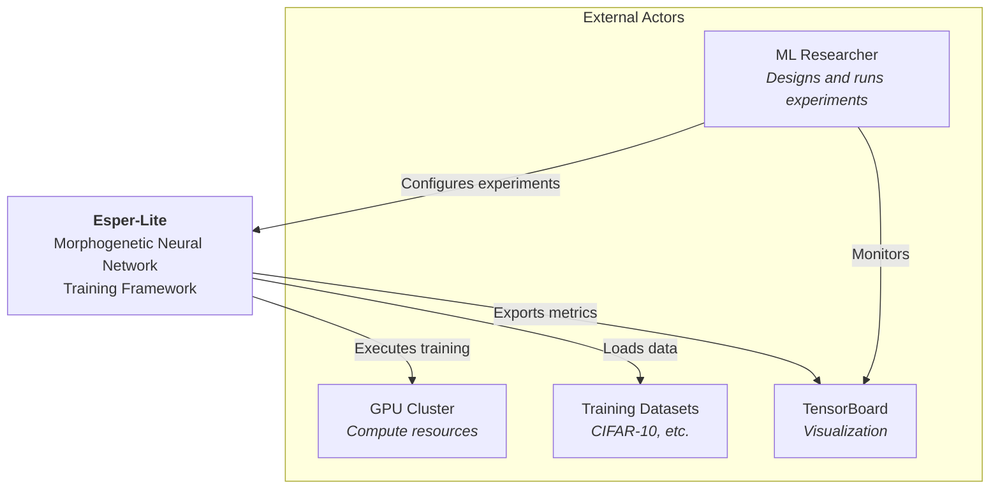
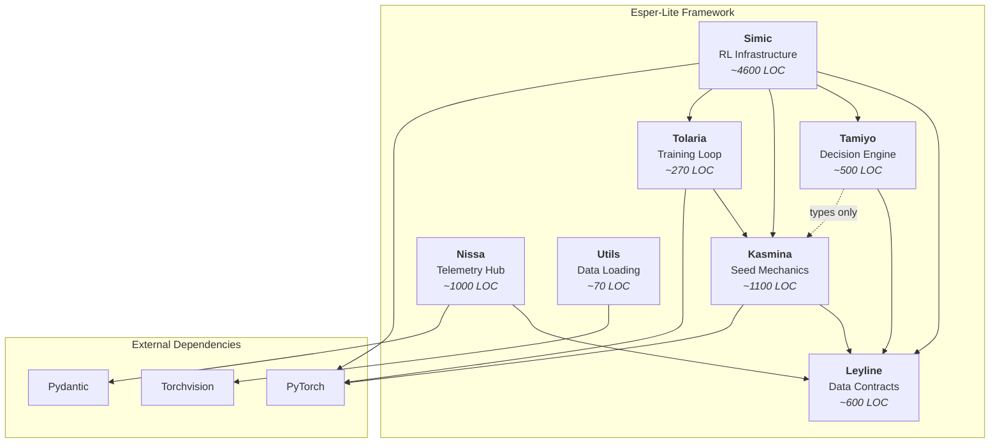
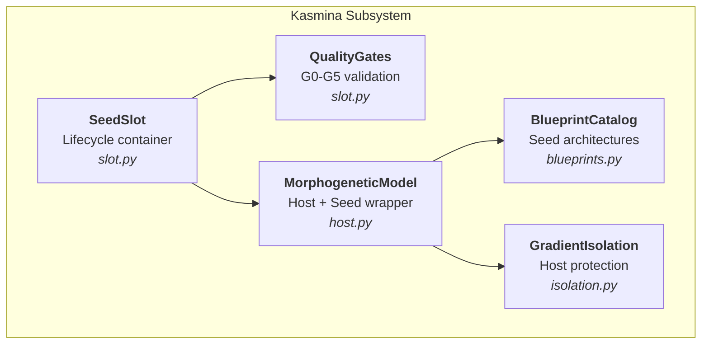
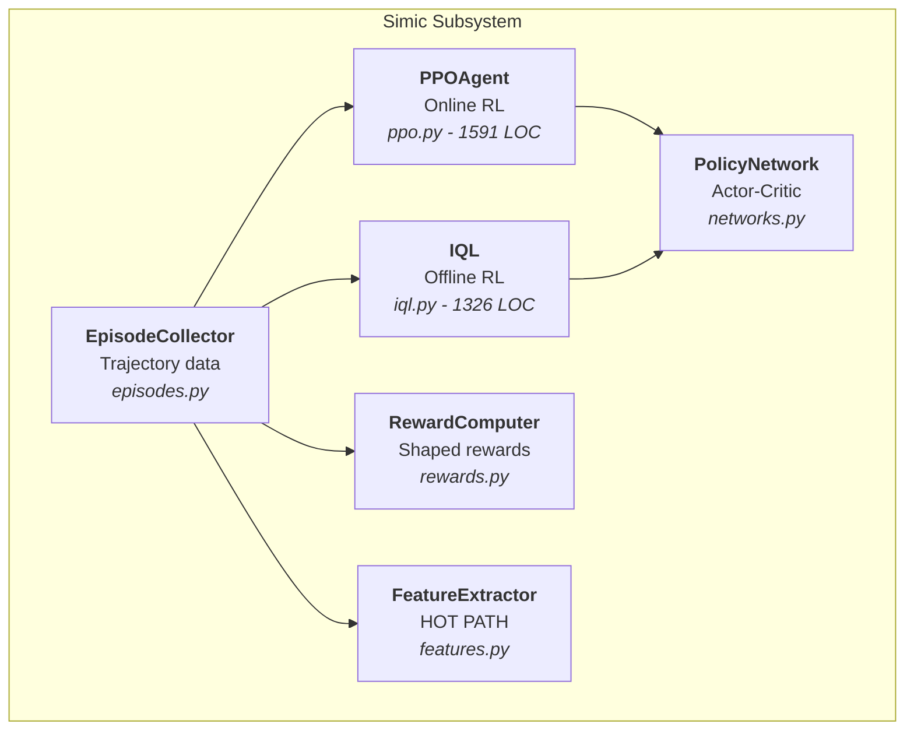
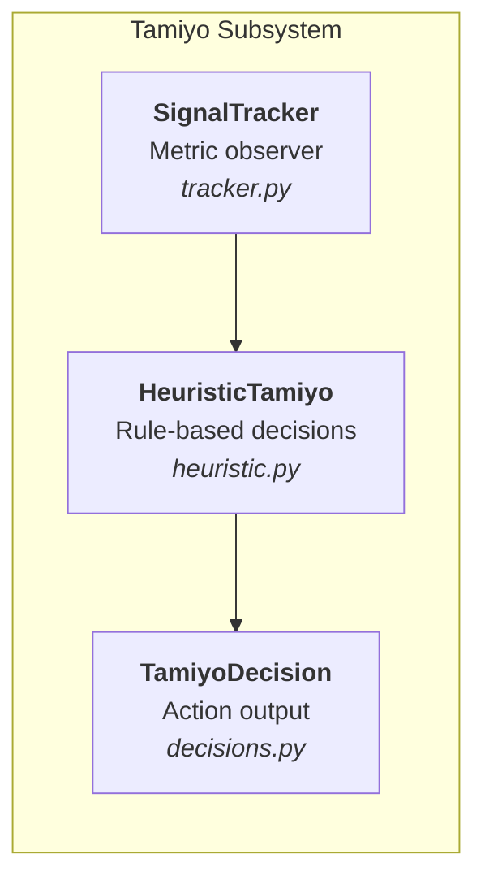
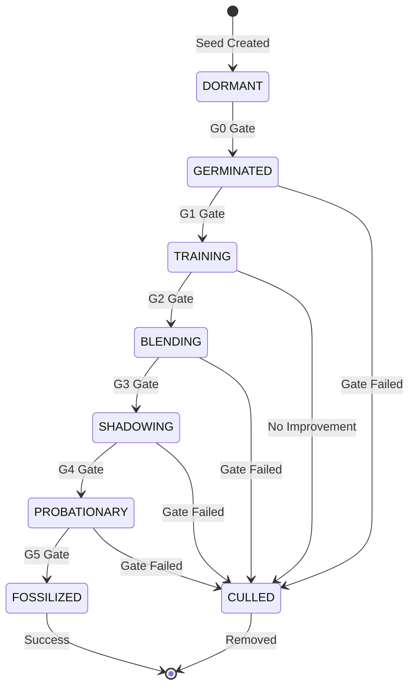
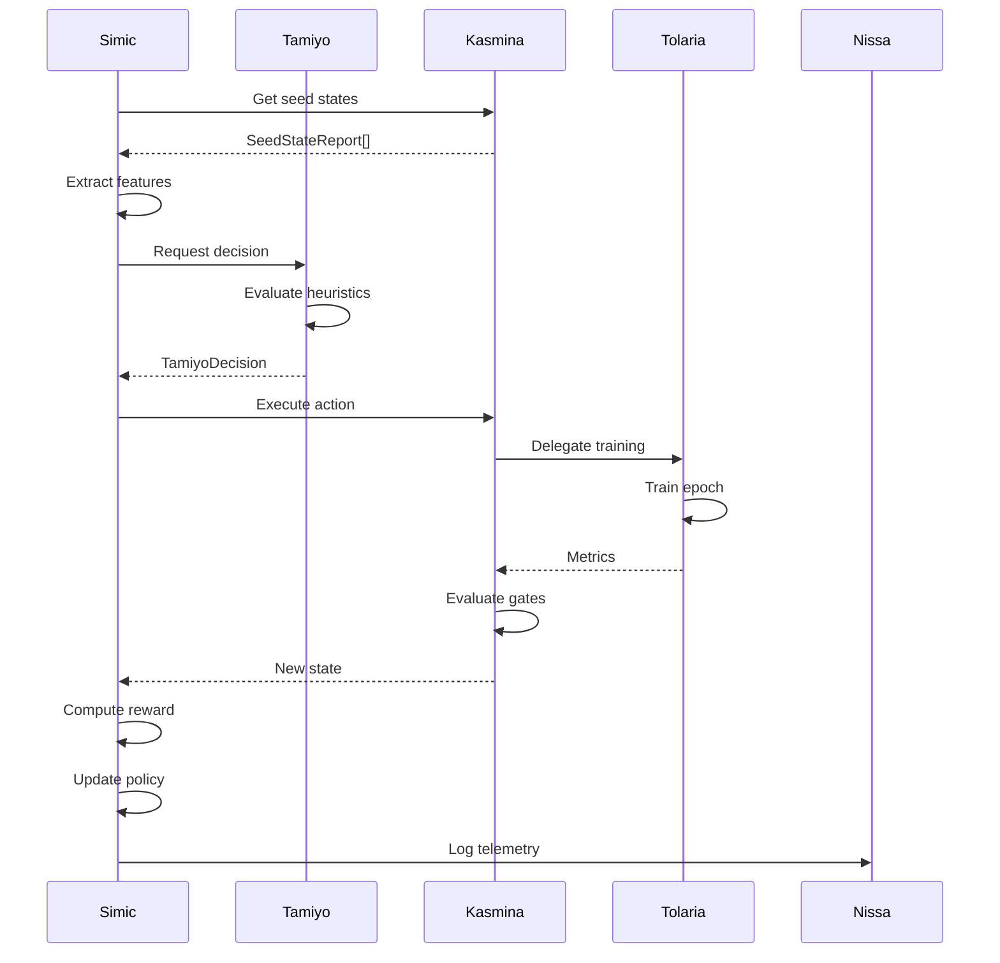

# Architecture Diagrams - Esper-Lite

## Diagram Key

This document presents the architecture of esper-lite using the C4 model (Context, Containers, Components, Code).

**C4 Levels:**
- **Level 1 (Context)**: System boundary and external actors
- **Level 2 (Container)**: Major subsystems/modules within esper-lite
- **Level 3 (Component)**: Internal components within key subsystems
- **Level 4 (Code)**: Detailed code-level structures (state machines, classes)

**Color Scheme:**
- **Blue**: Core domain subsystems (Kasmina, Leyline)
- **Green**: RL infrastructure (Simic)
- **Purple**: Decision-making (Tamiyo)
- **Orange**: Observability (Nissa)
- **Yellow**: Training orchestration (Tolaria)
- **Gray**: Utilities and external dependencies

---

## Level 1: System Context Diagram



### Description

**Esper-Lite** is a morphogenetic neural network training framework that enables ML researchers to evolve neural architectures through a lifecycle-based approach. The system orchestrates training across GPU resources, automatically promoting or culling network variants (seeds) based on performance metrics.

---

## Level 2: Container Diagram



### Description

The framework is organized into 7 subsystems:

| Layer | Subsystem | Responsibility |
|-------|-----------|----------------|
| Foundation | **Leyline** | Contract-first types and protocols |
| Core Domain | **Kasmina** | Seed lifecycle, quality gates |
| Decision | **Tamiyo** | Heuristic action selection |
| RL | **Simic** | PPO/IQL training, orchestration |
| Training | **Tolaria** | Supervised learning loops |
| Observability | **Nissa** | Telemetry and metrics |
| Data | **Utils** | Dataset loading |

---

## Level 3: Component Diagrams

### Kasmina (Core Domain)



### Simic (RL Infrastructure)



### Tamiyo (Decision Making)



---

## Level 4: Seed Lifecycle State Machine



### Gate Requirements

| Gate | Stage Transition | Requirements |
|------|------------------|--------------|
| G0 | DORMANT → GERMINATED | seed_id, blueprint_id present |
| G1 | GERMINATED → TRAINING | germination complete |
| G2 | TRAINING → BLENDING | improvement ≥0.5%, violations ≤10 |
| G3 | BLENDING → SHADOWING | ≥3 epochs, alpha ≥0.95 |
| G4 | SHADOWING → PROBATIONARY | shadowing complete |
| G5 | PROBATIONARY → FOSSILIZED | positive improvement, healthy |

---

## Data Flow Diagram



### Training Loop Summary

1. **State Extraction**: Simic reads seed states from Kasmina
2. **Feature Extraction**: Convert metrics to RL observation
3. **Decision**: Tamiyo selects action (train/advance/cull)
4. **Execution**: Kasmina delegates to Tolaria for training
5. **Gate Evaluation**: Kasmina checks quality gates
6. **Reward**: Simic computes reward from improvement
7. **Policy Update**: PPO/IQL updates neural networks
8. **Telemetry**: Nissa logs all metrics

---

## Dependency Matrix

| Subsystem | Leyline | Kasmina | Tamiyo | Simic | Tolaria | Nissa | Utils |
|-----------|:-------:|:-------:|:------:|:-----:|:-------:|:-----:|:-----:|
| Leyline | - | | | | | | |
| Kasmina | ✓ | - | | | | | |
| Tamiyo | ✓ | (t) | - | | | | |
| Simic | ✓ | ✓ | ✓ | - | ✓ | | |
| Tolaria | | ✓ | | | - | | |
| Nissa | ✓ | | | | | - | |
| Utils | | | | | | | - |

**Legend:** ✓ = runtime dependency, (t) = type-only

### Dependency Layers

```
Layer 0: External (PyTorch, Pydantic, Torchvision)
Layer 1: Leyline, Utils (foundation)
Layer 2: Kasmina, Nissa (core + observability)
Layer 3: Tamiyo, Tolaria (decisions + training)
Layer 4: Simic (orchestrator)
```

---

## Architecture Principles

| Principle | Implementation |
|-----------|---------------|
| **Separation of Concerns** | 7 distinct subsystems with clear boundaries |
| **Dependency Inversion** | All depend on Leyline abstractions |
| **Single Responsibility** | Each subsystem has one purpose |
| **Layered Architecture** | Foundation → Domain → Orchestration |
| **State Machine Clarity** | Explicit lifecycle with quality gates |
