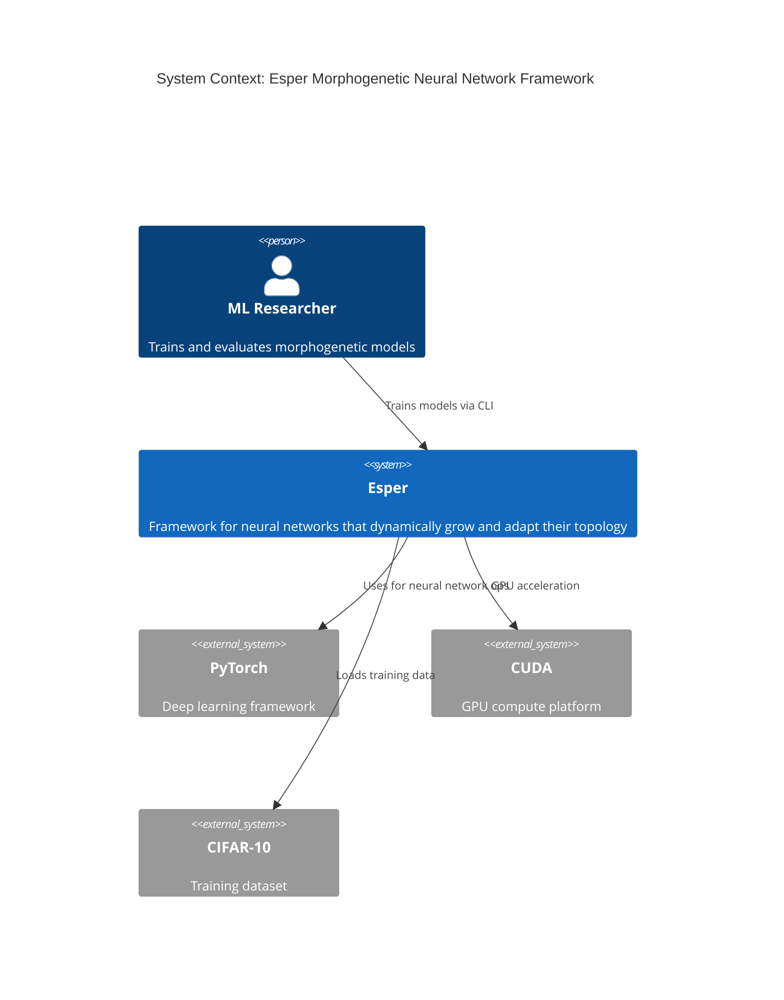
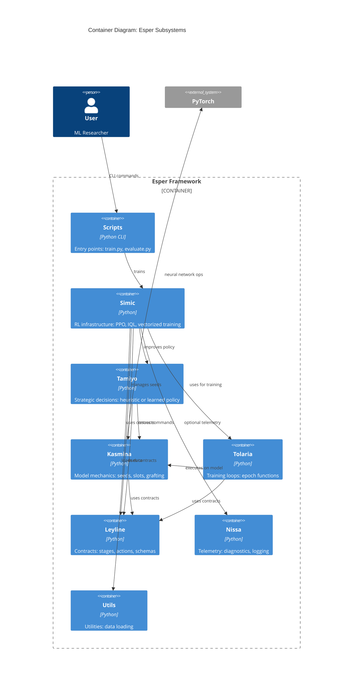
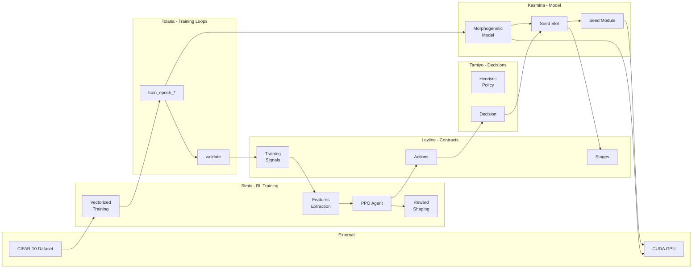
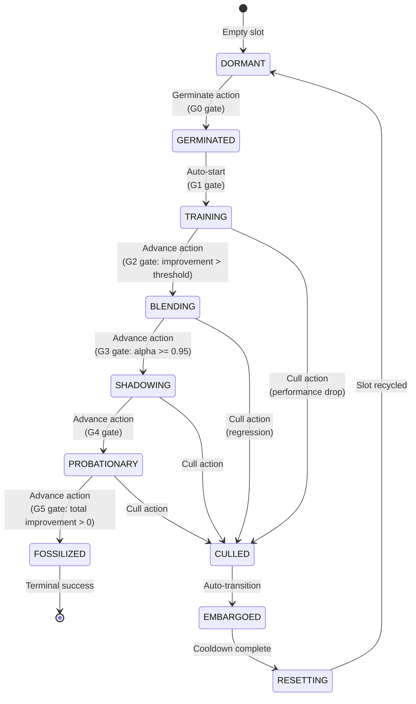
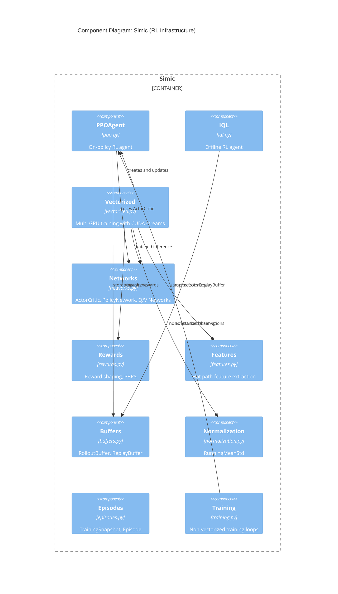
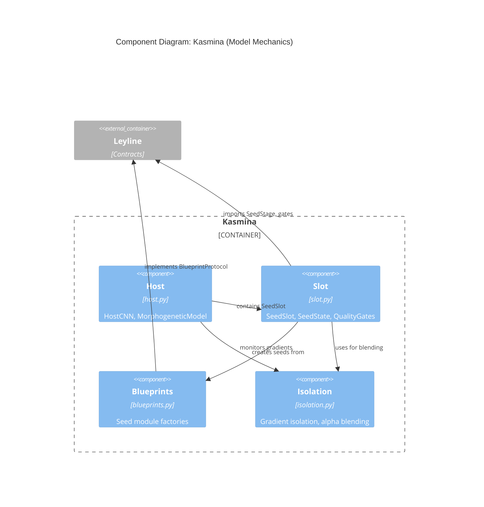

# Architecture Diagrams - Esper Morphogenetic Neural Networks

## Overview

This document contains C4-style architecture diagrams for Esper at multiple abstraction levels:
1. **Context**: System boundary and external interactions
2. **Container**: Internal subsystems and their relationships
3. **Component**: Detailed views of key subsystems

All diagrams use Mermaid syntax for easy rendering in GitHub, VS Code, etc.

---

## 1. System Context Diagram

Shows Esper as a black box and its interactions with external systems.



### Text Representation

```
┌─────────────────────────────────────────────────────────────────┐
│                                                                 │
│   ┌──────────────┐                                              │
│   │ ML Researcher│                                              │
│   └──────┬───────┘                                              │
│          │ trains via CLI                                       │
│          ▼                                                      │
│   ┌──────────────────────────────────────┐                     │
│   │             ESPER                     │                     │
│   │  Morphogenetic Neural Network         │                     │
│   │  Framework                            │                     │
│   └──────────────────────────────────────┘                     │
│          │                │                │                    │
│          ▼                ▼                ▼                    │
│   ┌──────────┐    ┌──────────┐    ┌──────────┐                │
│   │  PyTorch │    │   CUDA   │    │ CIFAR-10 │                │
│   │(ML ops)  │    │  (GPU)   │    │ (Data)   │                │
│   └──────────┘    └──────────┘    └──────────┘                │
│                                                                 │
└─────────────────────────────────────────────────────────────────┘
```

---

## 2. Container Diagram

Shows the major subsystems (containers) within Esper and their relationships.



### Text Representation

```
┌─────────────────────────────────────────────────────────────────────────────┐
│                              ESPER FRAMEWORK                                │
│                                                                             │
│  ┌─────────┐                                                               │
│  │ Scripts │◄── User (CLI)                                                 │
│  └────┬────┘                                                               │
│       │                                                                     │
│       ▼                                                                     │
│  ┌─────────────────────────────────────────────────────────────────────┐  │
│  │                              SIMIC (Gym)                             │  │
│  │  PPO, IQL, Vectorized Training, Rewards, Features, Networks         │  │
│  └──────────────────────┬───────────────┬──────────────────────────────┘  │
│                         │               │                                   │
│            ┌────────────┴───────┐       └──────────┐                       │
│            ▼                    ▼                  ▼                        │
│  ┌─────────────────┐  ┌─────────────────┐  ┌─────────────────┐            │
│  │  TAMIYO (Brain) │  │ TOLARIA (Hands) │  │   UTILS (Data)  │            │
│  │  Heuristic/RL   │  │  Training Loops │  │   CIFAR-10      │            │
│  │  Decisions      │  │  Epoch Funcs    │  └─────────────────┘            │
│  └────────┬────────┘  └────────┬────────┘                                  │
│           │                    │                                            │
│           └────────┬───────────┘                                            │
│                    ▼                                                        │
│  ┌─────────────────────────────────────────────────────────────────────┐  │
│  │                          KASMINA (Body)                              │  │
│  │  MorphogeneticModel, SeedSlot, Blueprints, Isolation, QualityGates  │  │
│  └──────────────────────────────────┬──────────────────────────────────┘  │
│                                     │                                       │
│                                     ▼                                       │
│  ┌─────────────────────────────────────────────────────────────────────┐  │
│  │                          LEYLINE (Contracts)                         │  │
│  │  SeedStage, Action, TrainingSignals, TensorSchema, Telemetry        │  │
│  └─────────────────────────────────────────────────────────────────────┘  │
│                                                                             │
│  ┌─────────────────┐                                                       │
│  │  NISSA (Senses) │◄── optional telemetry from Simic                     │
│  │  Diagnostics    │                                                       │
│  └─────────────────┘                                                       │
│                                                                             │
└─────────────────────────────────────────────────────────────────────────────┘
                    │
                    ▼
             ┌──────────┐
             │  PyTorch │
             └──────────┘
```

---

## 3. Data Flow Diagram

Shows how data flows through the system during training.



### Text Representation

```
                    TRAINING DATA FLOW

CIFAR-10 ──► Vectorized Training (Simic)
                    │
                    ▼
            train_epoch_* (Tolaria)
                    │
                    ▼
            MorphogeneticModel (Kasmina)
            ├── Host CNN
            └── SeedSlot ──► Seed Module
                    │
                    ▼
            validate() (Tolaria)
                    │
                    ▼
            TrainingSignals (Leyline)
                    │
                    ▼
            Feature Extraction (Simic)
                    │
                    ▼
            PPO Agent (Simic)
                    │
                    ▼
            Action (Leyline)
                    │
                    ▼
            Decision (Tamiyo)
                    │
                    ▼
            SeedSlot (Kasmina) ──► Stage Transition
```

---

## 4. Seed Lifecycle State Diagram

Shows the state machine for seed modules.



### Text Representation

```
                          SEED LIFECYCLE STATE MACHINE

                    ┌─────────────────────────────────────────┐
                    │                                         │
                    ▼                                         │
    [*] ──► DORMANT ──► GERMINATED ──► TRAINING ──► BLENDING │
                │            │              │           │     │
                │            │              │           │     │
                │            │              ▼           ▼     │
                │            │           CULLED ◄──────┤     │
                │            │              │          │     │
                │            │              ▼          │     │
                │            │         EMBARGOED       │     │
                │            │              │          │     │
                │            │              ▼          │     │
                │            │         RESETTING ──────┘     │
                │            │                               │
                │            ▼                               │
                │     SHADOWING ──► PROBATIONARY ──► FOSSILIZED ──► [*]
                │          │              │
                │          └──────┬───────┘
                │                 ▼
                │              CULLED
                └─────────────────┘

    Quality Gates:
    G0: Basic sanity (seed_id, blueprint_id)
    G1: Training readiness (germinated)
    G2: Blending readiness (improvement > threshold)
    G3: Shadowing readiness (alpha >= 0.95)
    G4: Probation readiness (shadowing complete)
    G5: Fossilization readiness (total improvement > 0)
```

---

## 5. Component Diagram: Simic

Detailed view of the Simic RL subsystem components.



### Text Representation

```
┌─────────────────────────────────────────────────────────────────────────┐
│                          SIMIC SUBSYSTEM                                │
│                                                                         │
│  ┌───────────────────────────────────────────────────────────────┐     │
│  │                    VECTORIZED TRAINING                        │     │
│  │    vectorized.py - Multi-GPU, CUDA streams, inverted control  │     │
│  └─────────────────────────────┬─────────────────────────────────┘     │
│                                │                                        │
│         ┌──────────────────────┼──────────────────────┐                │
│         ▼                      ▼                      ▼                │
│  ┌─────────────┐      ┌──────────────┐      ┌─────────────┐           │
│  │   PPOAgent  │      │   Networks   │      │  Buffers    │           │
│  │   ppo.py    │◄────►│ networks.py  │      │ buffers.py  │           │
│  │             │      │ ActorCritic  │      │ Rollout/    │           │
│  │             │      │ Q/V Networks │      │ Replay      │           │
│  └─────────────┘      └──────────────┘      └─────────────┘           │
│         │                                                              │
│         ▼                                                              │
│  ┌─────────────┐      ┌──────────────┐      ┌─────────────┐           │
│  │   Rewards   │      │   Features   │      │Normalization│           │
│  │ rewards.py  │      │ features.py  │      │  norm.py    │           │
│  │ PBRS, config│      │ HOT PATH     │      │RunningMean  │           │
│  └─────────────┘      └──────────────┘      └─────────────┘           │
│                                                                        │
│  ┌─────────────┐      ┌──────────────┐                                │
│  │     IQL     │      │   Episodes   │                                │
│  │   iql.py    │      │ episodes.py  │                                │
│  │ Offline RL  │      │ Snapshots    │                                │
│  └─────────────┘      └──────────────┘                                │
│                                                                        │
└─────────────────────────────────────────────────────────────────────────┘
```

---

## 6. Component Diagram: Kasmina

Detailed view of the Kasmina model mechanics subsystem.



### Text Representation

```
┌─────────────────────────────────────────────────────────────────────────┐
│                         KASMINA SUBSYSTEM                               │
│                                                                         │
│  ┌───────────────────────────────────────────────────────────────┐     │
│  │                         HOST (host.py)                         │     │
│  │  ┌─────────────────┐     ┌────────────────────────────┐      │     │
│  │  │     HostCNN     │     │    MorphogeneticModel      │      │     │
│  │  │  - block1/2/3   │     │  - host: HostCNN           │      │     │
│  │  │  - classifier   │     │  - seed_slot: SeedSlot     │      │     │
│  │  │  - injection_pt │     │  - isolation_monitor       │      │     │
│  │  └─────────────────┘     └────────────┬───────────────┘      │     │
│  └───────────────────────────────────────┼───────────────────────┘     │
│                                          │                              │
│                                          ▼                              │
│  ┌───────────────────────────────────────────────────────────────┐     │
│  │                        SLOT (slot.py)                          │     │
│  │  ┌─────────────┐  ┌─────────────┐  ┌─────────────────────┐   │     │
│  │  │  SeedSlot   │  │  SeedState  │  │   QualityGates      │   │     │
│  │  │ - germinate │  │ - stage     │  │ - G0-G5 checks      │   │     │
│  │  │ - advance   │  │ - metrics   │  │ - transition rules  │   │     │
│  │  │ - cull      │  │ - history   │  └─────────────────────┘   │     │
│  │  │ - forward   │  └─────────────┘                            │     │
│  │  └──────┬──────┘                                              │     │
│  └─────────┼─────────────────────────────────────────────────────┘     │
│            │                                                            │
│            ▼                                                            │
│  ┌─────────────────────────────────────────────────────────────────┐  │
│  │  BLUEPRINTS (blueprints.py)      ISOLATION (isolation.py)       │  │
│  │  ┌─────────────────────────┐     ┌───────────────────────────┐ │  │
│  │  │ ConvEnhanceSeed         │     │ AlphaSchedule             │ │  │
│  │  │ AttentionSeed           │     │ blend_with_isolation()    │ │  │
│  │  │ NormSeed                │     │ GradientIsolationMonitor  │ │  │
│  │  │ DepthwiseSeed           │     └───────────────────────────┘ │  │
│  │  │ BlueprintCatalog        │                                   │  │
│  │  └─────────────────────────┘                                   │  │
│  └─────────────────────────────────────────────────────────────────┘  │
│                                                                        │
└─────────────────────────────────────────────────────────────────────────┘
                    │
                    ▼
           ┌─────────────────┐
           │     LEYLINE     │
           │  SeedStage      │
           │  GateLevel      │
           │  GateResult     │
           └─────────────────┘
```

---

## 7. Deployment View

Shows how components map to runtime environments.

```
┌─────────────────────────────────────────────────────────────────────────┐
│                         RUNTIME DEPLOYMENT                              │
│                                                                         │
│  ┌─────────────────────────────────────────────────────────────────┐  │
│  │                      User Environment                            │  │
│  │                                                                   │  │
│  │   $ PYTHONPATH=src python -m esper.scripts.train ppo \           │  │
│  │       --vectorized --n-envs 4 --device cuda:0                    │  │
│  │                                                                   │  │
│  └─────────────────────────────────────────────────────────────────┘  │
│                              │                                         │
│                              ▼                                         │
│  ┌─────────────────────────────────────────────────────────────────┐  │
│  │                     Python Process                               │  │
│  │                                                                   │  │
│  │  ┌─────────────────────────────────────────────────────────┐    │  │
│  │  │                   Main Thread                            │    │  │
│  │  │  - CLI argument parsing                                  │    │  │
│  │  │  - Vectorized training orchestration                     │    │  │
│  │  │  - PPO updates                                           │    │  │
│  │  └─────────────────────────────────────────────────────────┘    │  │
│  │                                                                   │  │
│  │  ┌─────────────────────────────────────────────────────────┐    │  │
│  │  │               DataLoader Workers (4)                     │    │  │
│  │  │  - Parallel data prefetching                             │    │  │
│  │  │  - Independent generators per environment                │    │  │
│  │  └─────────────────────────────────────────────────────────┘    │  │
│  │                                                                   │  │
│  └─────────────────────────────────────────────────────────────────┘  │
│                              │                                         │
│                              ▼                                         │
│  ┌─────────────────────────────────────────────────────────────────┐  │
│  │                         GPU (cuda:0)                             │  │
│  │                                                                   │  │
│  │  ┌──────────────────────────────────────────────────────────┐   │  │
│  │  │  CUDA Stream 0   │  CUDA Stream 1   │  CUDA Stream 2/3   │   │  │
│  │  │  - Env 0         │  - Env 1         │  - Env 2/3         │   │  │
│  │  │  - Model forward │  - Model forward │  - Model forward   │   │  │
│  │  │  - Backward      │  - Backward      │  - Backward        │   │  │
│  │  └──────────────────┴──────────────────┴────────────────────┘   │  │
│  │                                                                   │  │
│  │  ┌──────────────────────────────────────────────────────────┐   │  │
│  │  │                    Shared GPU Memory                      │   │  │
│  │  │  - Policy network (ActorCritic)                           │   │  │
│  │  │  - Observation normalizer (RunningMeanStd)                │   │  │
│  │  └──────────────────────────────────────────────────────────┘   │  │
│  │                                                                   │  │
│  └─────────────────────────────────────────────────────────────────┘  │
│                                                                        │
└─────────────────────────────────────────────────────────────────────────┘
```

---

## Diagram Legend

| Symbol | Meaning |
|--------|---------|
| `──►` | Data flow direction |
| `◄──►` | Bidirectional relationship |
| `[*]` | Initial/terminal state |
| Solid box | Internal component |
| Dashed box | External system |
| `Container_Boundary` | Logical grouping |

---

## Confidence Level

**HIGH** - All diagrams are derived from verified subsystem catalog and direct code analysis. Data flows and state transitions match implementation.
