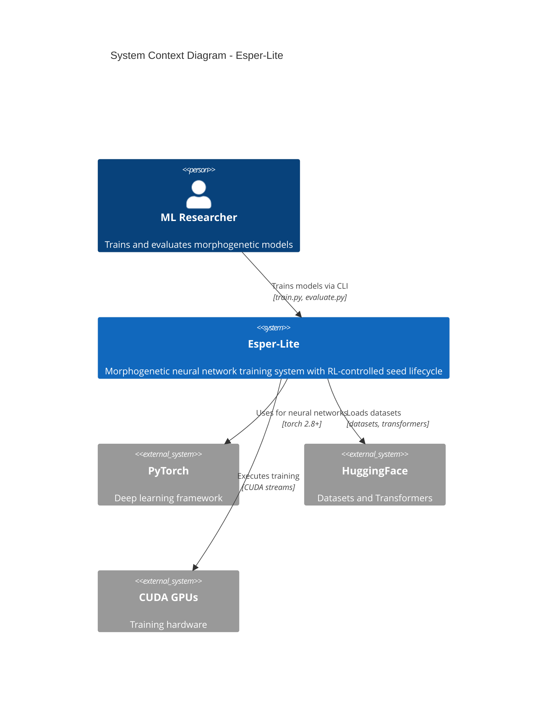
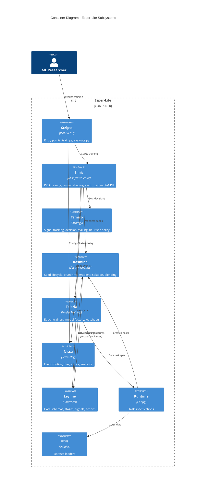
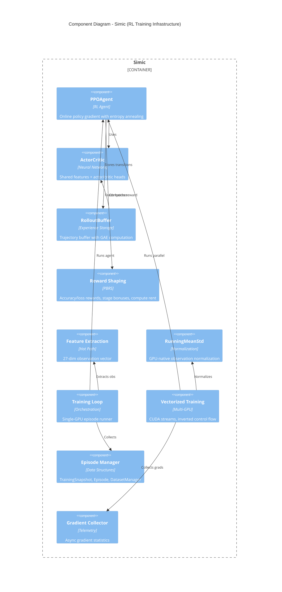
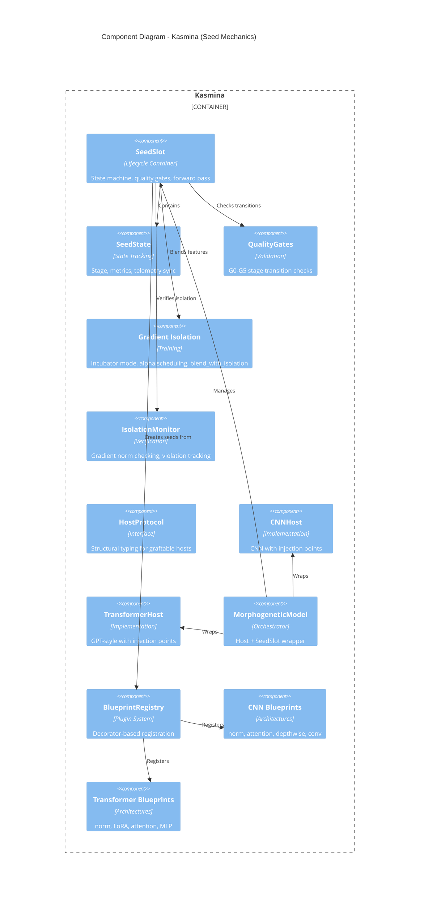
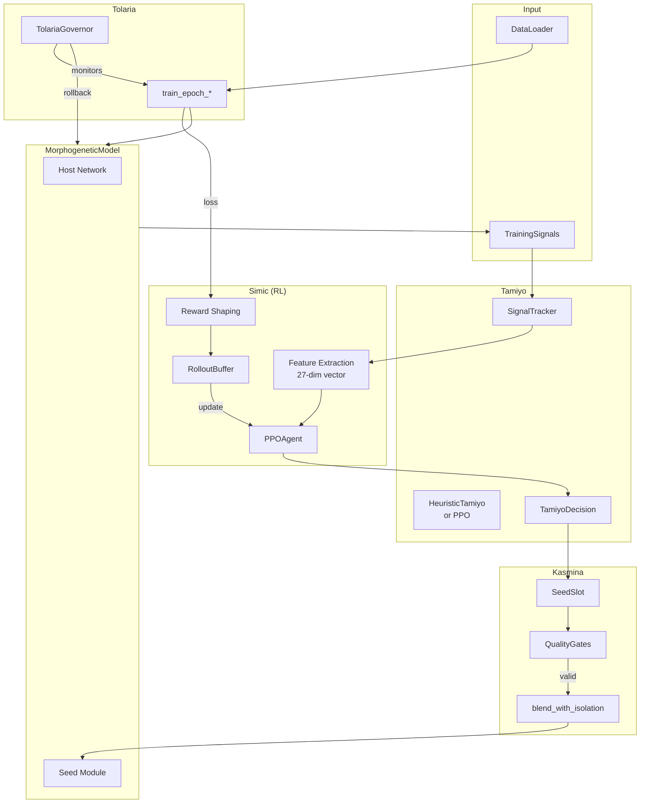
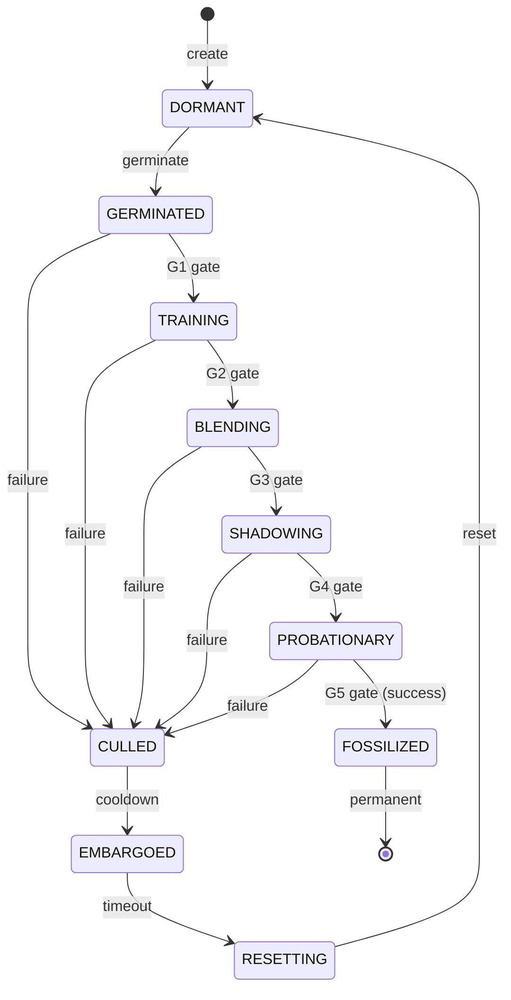
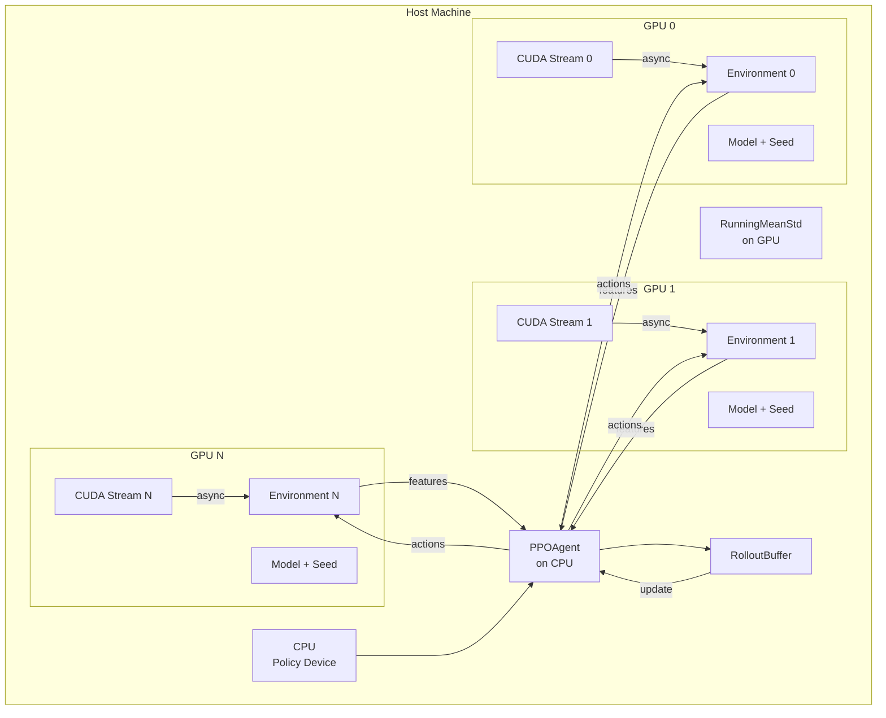
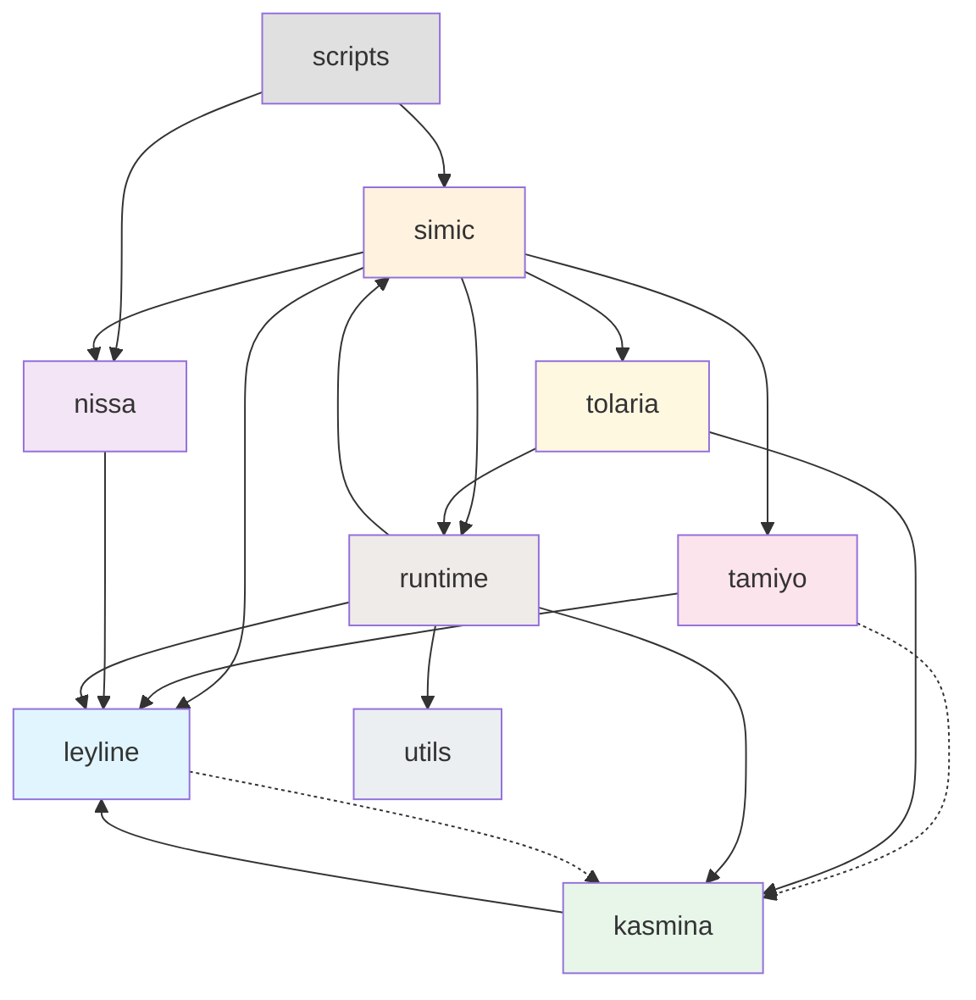

# Architecture Diagrams

**Project:** esper-lite
**Analysis Date:** 2025-12-02
**Notation:** C4 Model with Mermaid syntax

---

## C4 Level 1: System Context

Shows esper-lite in its environment with external actors and systems.

### Context Description

| Element | Description |
|---------|-------------|
| **Esper-Lite** | Core system implementing morphogenetic seed lifecycle with RL control |
| **ML Researcher** | Primary user who initiates training and evaluates results |
| **PyTorch** | Underlying deep learning framework (torch 2.8.0+) |
| **HuggingFace** | External data source (CIFAR-10, TinyStories via datasets) |
| **CUDA GPUs** | Hardware for training acceleration |

---

## C4 Level 2: Container Diagram

Shows the major subsystems (packages) within esper-lite and their relationships.

### Container Descriptions

| Container | Technology | Responsibility |
|-----------|------------|----------------|
| **Scripts** | Python CLI | Entry points for training (PPO, heuristic) and evaluation |
| **Simic** | PPO, PyTorch | Core RL infrastructure - agents, buffers, rewards, vectorized training |
| **Tamiyo** | Python | Strategic decision-making - signal tracking, heuristic policy |
| **Kasmina** | PyTorch nn.Module | Seed lifecycle mechanics - blueprints, isolation, blending |
| **Tolaria** | PyTorch | Model training infrastructure - epoch trainers, watchdog |
| **Nissa** | Python | Telemetry hub - event routing, diagnostics, analytics |
| **Leyline** | Python dataclasses | Data contracts - stages, signals, actions, schemas |
| **Runtime** | Python | Task specifications and wiring |
| **Utils** | PyTorch DataLoader | Dataset loading utilities |

---

## C4 Level 3: Component Diagram - Simic (RL Core)

Shows internal components of the most complex subsystem.

### Simic Component Descriptions

| Component | Responsibility | Hot Path? |
|-----------|----------------|-----------|
| **PPOAgent** | PPO algorithm with clip ratio, entropy, value loss | Yes |
| **ActorCritic** | Shared MLP features → actor/critic heads | Yes |
| **RolloutBuffer** | Trajectory storage, GAE computation | Per-episode |
| **Reward Shaping** | PBRS-based multi-component rewards | Yes |
| **Feature Extraction** | 27-dim observation from signals | **Critical** |
| **RunningMeanStd** | GPU-native normalization | Yes |
| **Training Loop** | Single-env episode orchestration | Yes |
| **Vectorized Training** | Multi-GPU with CUDA streams | **Critical** |
| **Episode Manager** | Trajectory data structures | No |
| **Gradient Collector** | Async gradient stats for telemetry | No |

---

## C4 Level 3: Component Diagram - Kasmina (Seed Mechanics)

Shows internal components of the seed lifecycle subsystem.

### Kasmina Component Descriptions

| Component | Responsibility |
|-----------|----------------|
| **SeedSlot** | Lifecycle container - germinate, advance, cull, forward |
| **SeedState** | Tracks stage, metrics, syncs telemetry |
| **QualityGates** | G0-G5 validation for stage transitions |
| **Gradient Isolation** | Incubator mode STE, alpha schedules, blending |
| **IsolationMonitor** | Verifies gradient separation, tracks violations |
| **HostProtocol** | Structural typing for injection point discovery |
| **CNNHost** | Convolutional host with block injection points |
| **TransformerHost** | GPT-style host with layer injection points |
| **MorphogeneticModel** | Orchestrates host + seed lifecycle |
| **BlueprintRegistry** | Plugin system for seed architectures |
| **CNN/Transformer Blueprints** | Concrete seed module factories |

---

## Data Flow Diagram: Training Loop

Shows how data flows through the system during one training step.

---

## State Machine: Seed Lifecycle

Shows the seed stage transitions from Leyline.

### Stage Descriptions

| Stage | Description | Gate Required |
|-------|-------------|---------------|
| **DORMANT** | Slot empty, ready for germination | - |
| **GERMINATED** | Seed created from blueprint | G0 (sanity) |
| **TRAINING** | Incubator mode - STE isolation | G1 (readiness) |
| **BLENDING** | Alpha ramp 0→1, co-adaptation | G2 (improvement) |
| **SHADOWING** | Alpha ≈ 1, monitoring | G3 (alpha threshold) |
| **PROBATIONARY** | Final validation | G4 (shadowing complete) |
| **FOSSILIZED** | Permanent integration (success) | G5 (positive improvement) |
| **CULLED** | Removed (failure) | - |
| **EMBARGOED** | Cooldown after cull | - |
| **RESETTING** | Cleanup before reuse | - |

---

## Deployment Diagram: Multi-GPU Training

Shows how vectorized training distributes across GPUs.

### Multi-GPU Training Notes

| Aspect | Implementation |
|--------|----------------|
| **Parallelism** | Each GPU runs independent environment |
| **Synchronization** | CUDA streams with epoch-boundary sync |
| **Control Flow** | Inverted: batch-first iteration |
| **DataLoaders** | Independent per-environment to avoid GIL |
| **Policy Device** | Agent on CPU for cross-GPU coordination |
| **Normalization** | GPU-native RunningMeanStd |

---

## Package Dependency Graph

Shows import relationships between packages.

**Legend:**
- Solid arrows: Direct imports
- Dashed arrows: TYPE_CHECKING or lazy imports
- Colors: Package domains (blue=contracts, orange=RL, green=seeds, pink=strategy, purple=telemetry, yellow=training)

---

## Confidence Level

**HIGH** - All diagrams derived from validated subsystem catalog and verified source code structure. Mermaid notation chosen for portability and version control compatibility.
