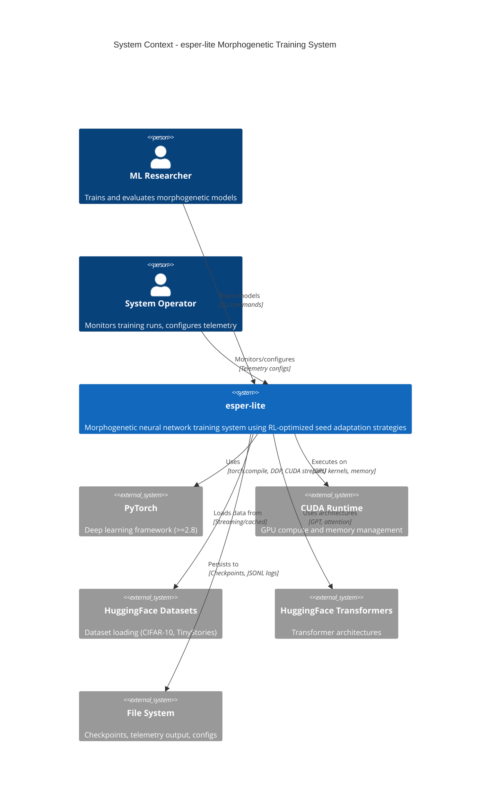
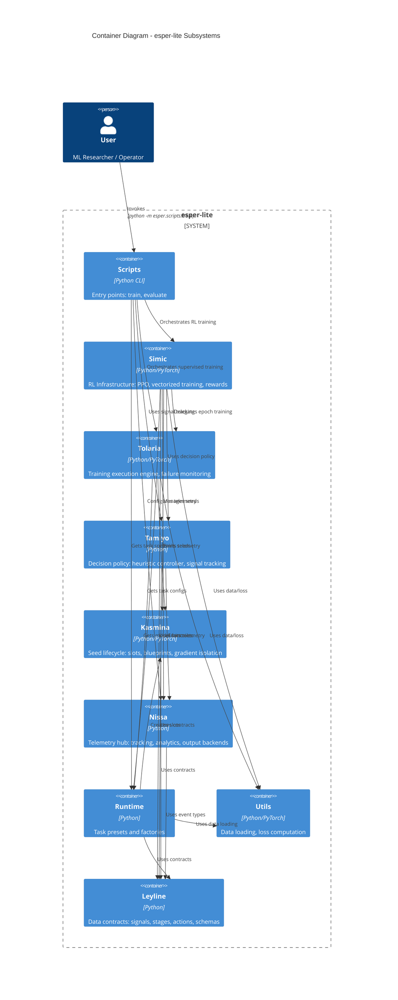
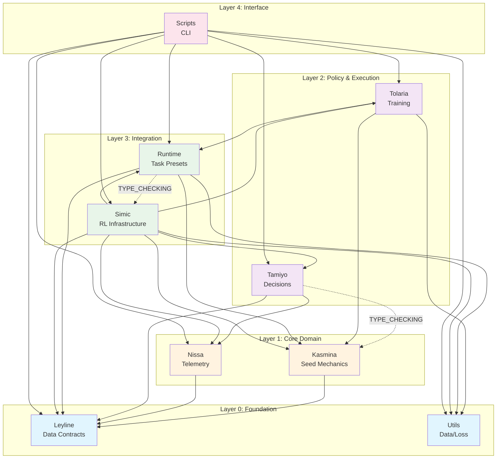
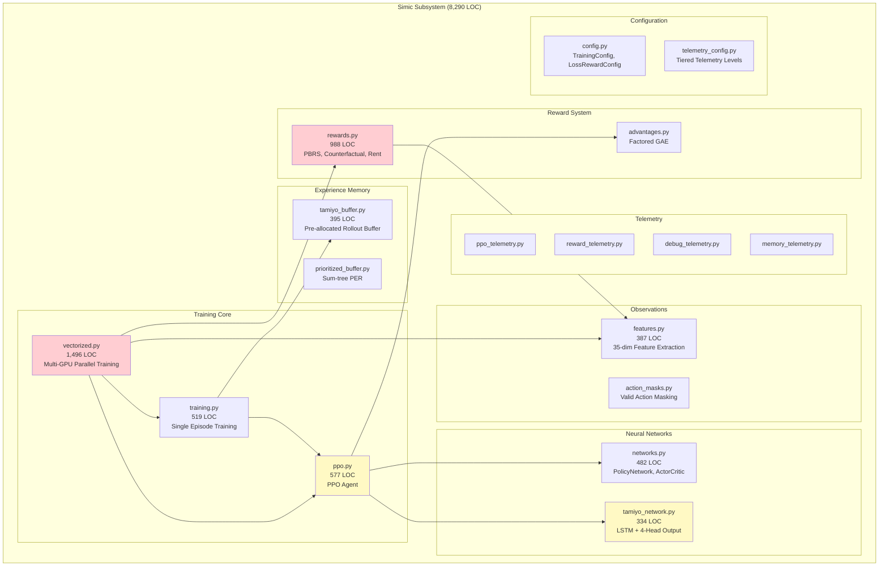
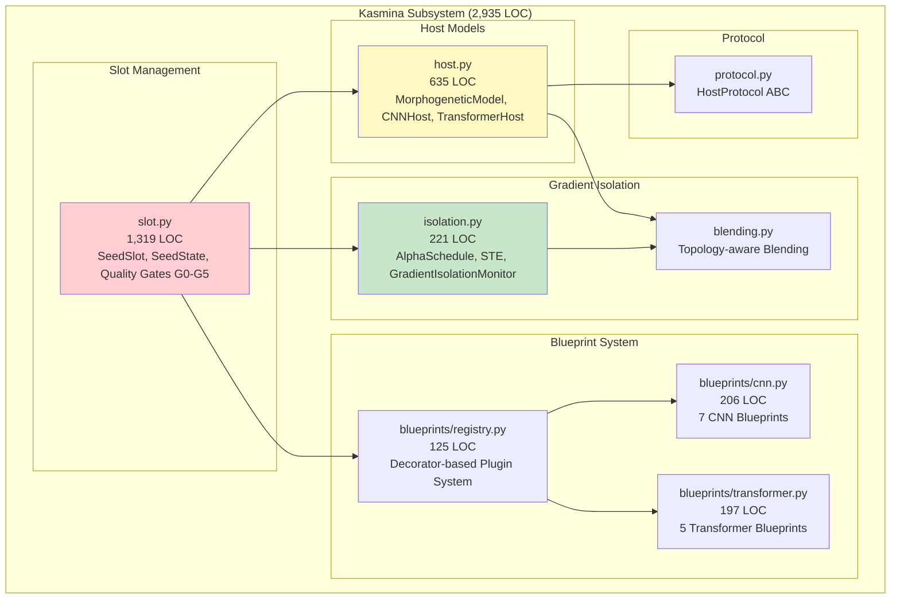
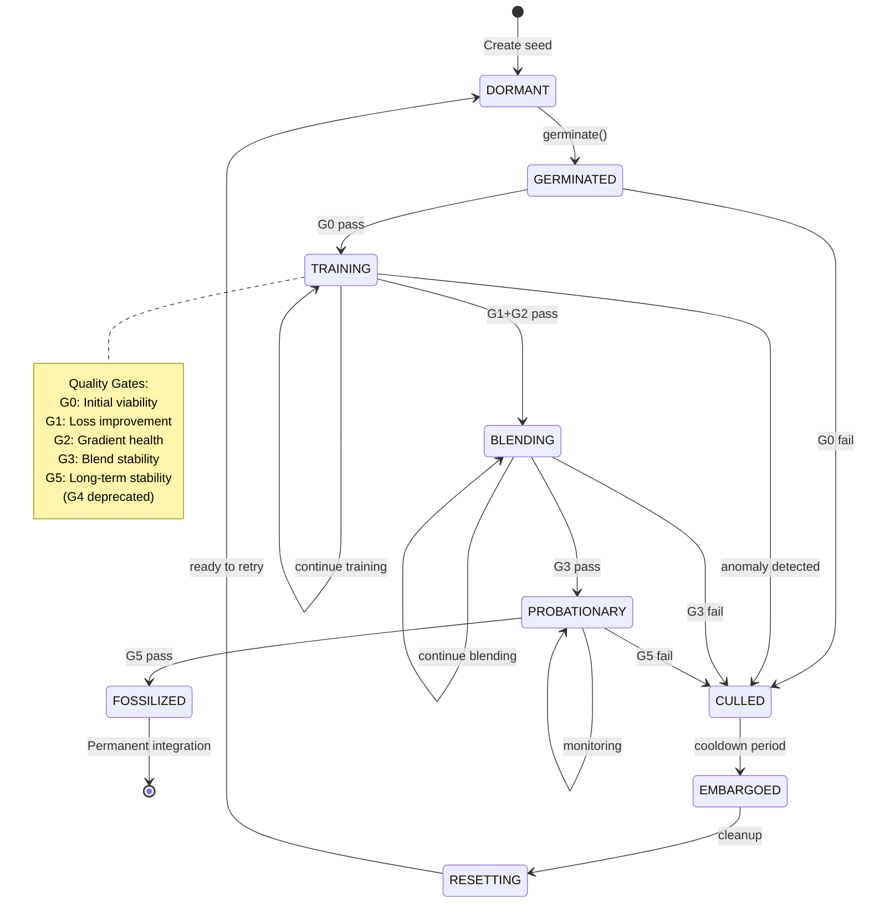
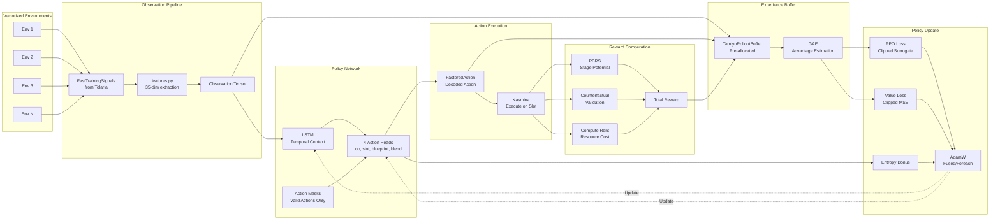
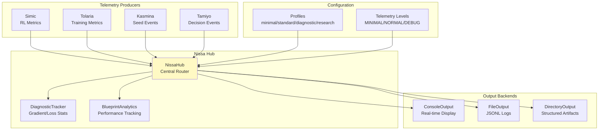
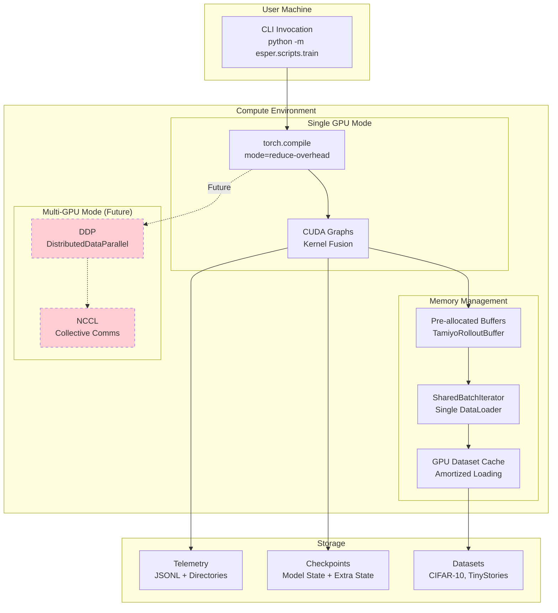

# Architecture Diagrams - esper-lite

**Analysis Date:** 2025-12-13
**Diagram Format:** Mermaid (C4 Model)
**Source:** Validated subsystem catalog (02-subsystem-catalog.md)

---

## 1. C4 Context Diagram

Shows esper-lite in its operational context with external systems and users.

---

## 2. C4 Container Diagram

Shows the major subsystems (containers) within esper-lite and their relationships.

---

## 3. Dependency Graph (Acyclic)

Simplified view showing the strict acyclic dependency structure.

---

## 4. Component Diagram: Simic (RL Infrastructure)

Detailed view of the largest subsystem (8,290 LOC).

---

## 5. Component Diagram: Kasmina (Seed Mechanics)

Detailed view of the seed lifecycle management (2,935 LOC).

---

## 6. Seed Lifecycle State Machine

State transitions managed by Kasmina with quality gates.

---

## 7. Data Flow: PPO Training Loop

Shows the flow of data through the RL training system.

---

## 8. Telemetry Flow

Shows how telemetry flows through the Nissa hub.

---

## 9. Deployment View

Shows how esper-lite is deployed and executed.

---

## 10. Issue Hotspots (from Expert Reviews)

Visual representation of where critical issues were identified.

```mermaid
flowchart TB
    subgraph critical["CRITICAL Issues"]
        c1[training.py:30-31<br/>Global Mutable State<br/>USE_COMPILED_TRAIN_STEP]
    end

    subgraph high["HIGH Issues"]
        h1[training.py:193-197<br/>Missing Imports<br/>BLUEPRINT_IDS, etc.]
        h2[slot.py:1150-1270<br/>DDP Deadlock Risk<br/>Stage Divergence]
        h3[ppo.py, vectorized.py<br/>No AMP Support<br/>Missing 30-50% Speedup]
        h4[signals.py:152<br/>Counterfactual Clamping<br/>Missing Symmetry]
        h5[slot.py:190<br/>SeedState slots=True<br/>Memory Inefficiency]
    end

    subgraph medium["MEDIUM Issues"]
        m1[ppo.py:158<br/>Large value_clip=10.0]
        m2[rewards.py:549-560<br/>Reward Scale Asymmetry]
        m3[isolation.py:145<br/>Private API Usage<br/>torch._foreach_norm]
    end

    simic[Simic Subsystem] --> c1 & h1 & h3 & m1 & m2
    kasmina[Kasmina Subsystem] --> h2 & h5
    leyline[Leyline Subsystem] --> h4
    tolaria[Tolaria Subsystem] --> m3

    style c1 fill:#d32f2f,color:#fff
    style h1 fill:#f57c00,color:#fff
    style h2 fill:#f57c00,color:#fff
    style h3 fill:#f57c00,color:#fff
    style h4 fill:#f57c00,color:#fff
    style h5 fill:#f57c00,color:#fff
```

---

## Diagram Index

| # | Diagram | Type | Purpose |
|---|---------|------|---------|
| 1 | System Context | C4 Context | External systems and users |
| 2 | Container Diagram | C4 Container | Subsystem relationships |
| 3 | Dependency Graph | Flowchart | Acyclic dependency structure |
| 4 | Simic Components | C4 Component | RL infrastructure details |
| 5 | Kasmina Components | C4 Component | Seed mechanics details |
| 6 | Seed Lifecycle | State Diagram | Stage transitions and gates |
| 7 | PPO Data Flow | Flowchart | Training loop data movement |
| 8 | Telemetry Flow | Flowchart | Observability pipeline |
| 9 | Deployment View | Flowchart | Execution environment |
| 10 | Issue Hotspots | Flowchart | Critical issue locations |

---

## Notes

- All diagrams use Mermaid syntax for portability
- C4 diagrams follow the C4 model conventions (Context, Container, Component)
- Dashed lines indicate TYPE_CHECKING or future/planned features
- Color coding: Red = critical path, Yellow = important, Green = stable
