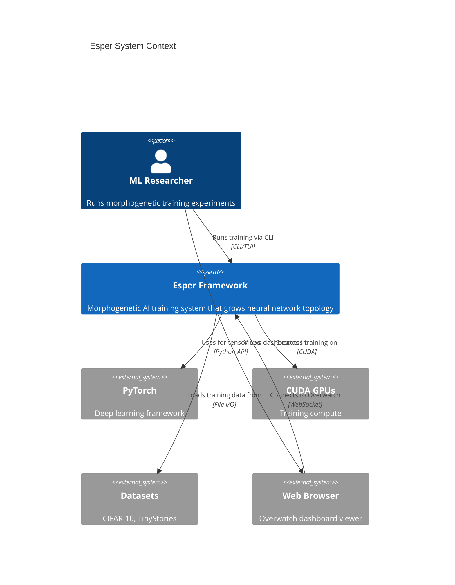
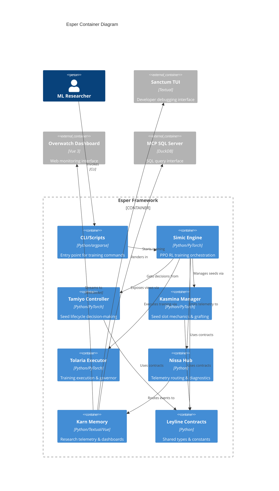
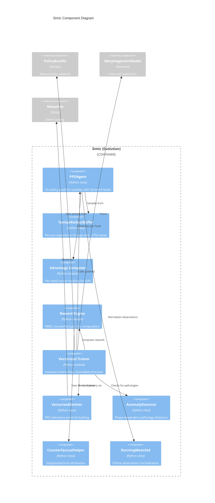
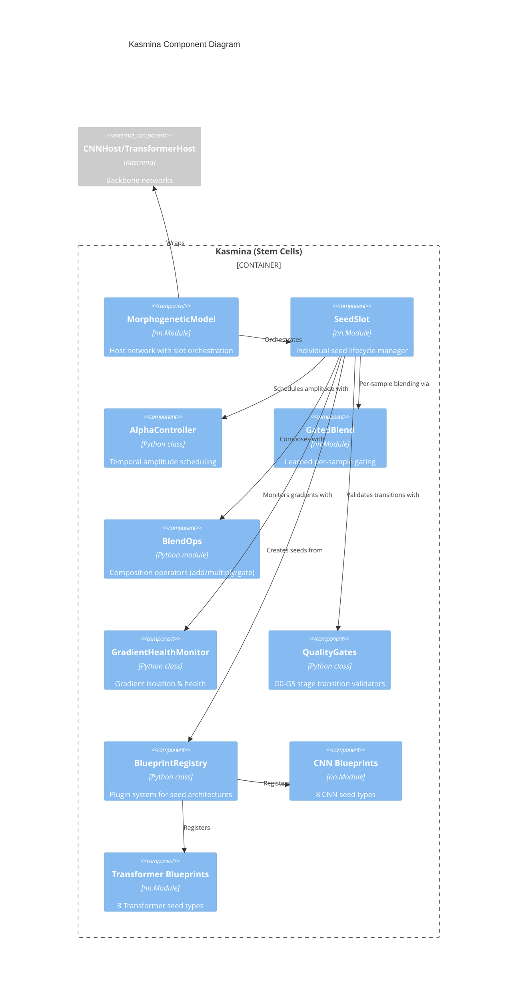
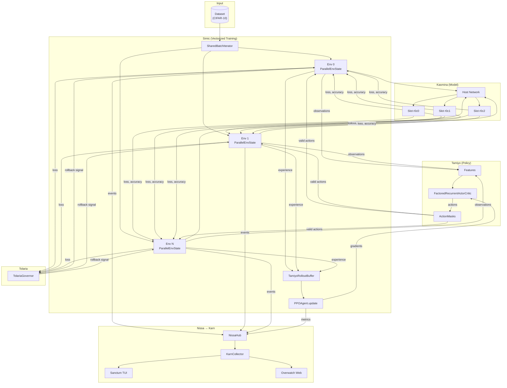
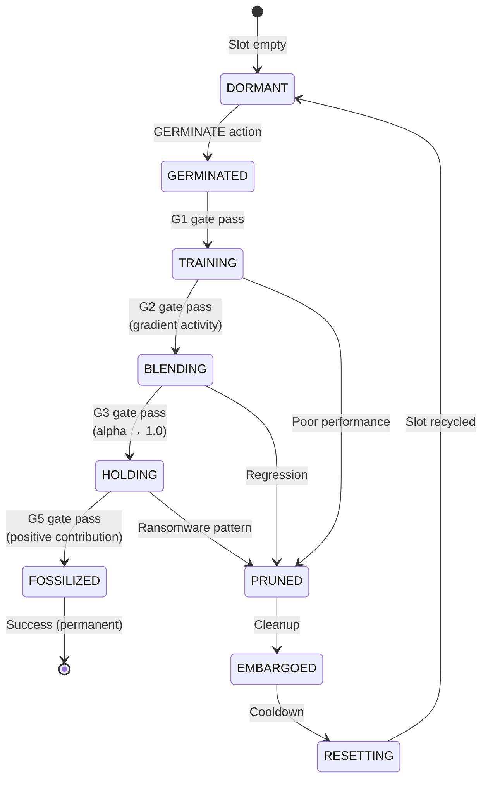
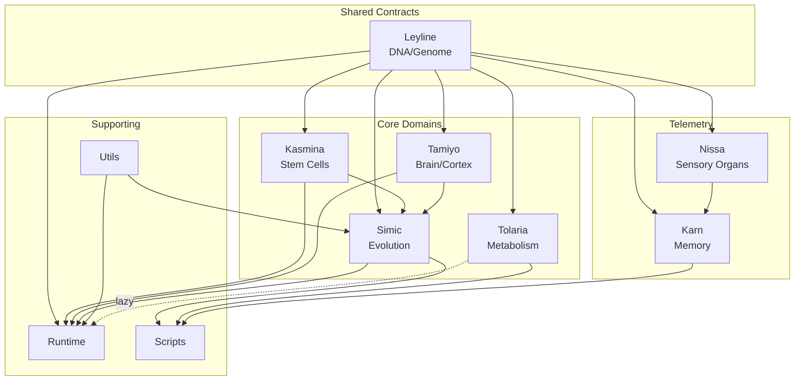
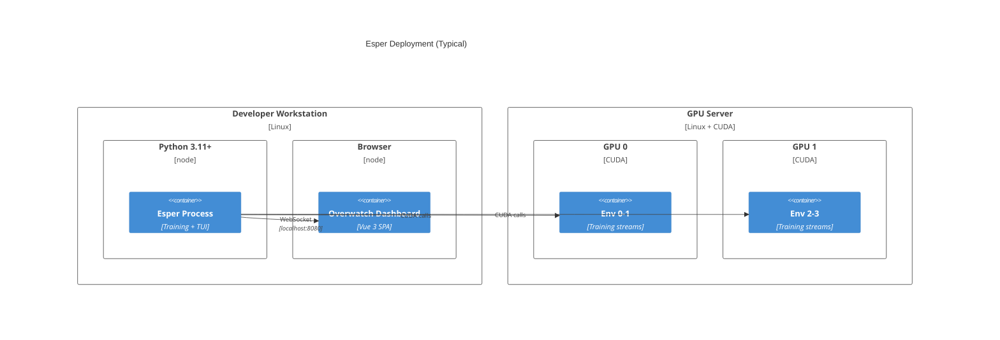
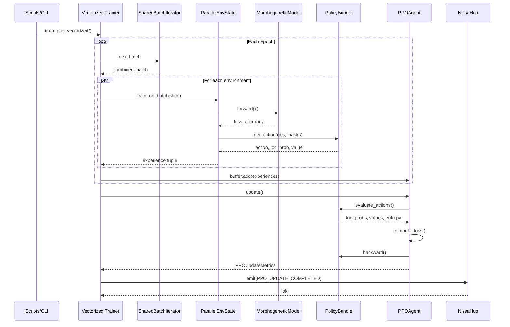

# Esper Architecture Diagrams

**Analysis Date:** 2025-12-30
**Diagram Notation:** C4 Model (Context, Container, Component)

---

## 1. System Context Diagram (C1)

High-level view of Esper and its external interactions.



---

## 2. Container Diagram (C2)

Major runtime components of Esper.



---

## 3. Component Diagram - Simic (C3)

Internal structure of the RL training engine.



---

## 4. Component Diagram - Kasmina (C3)

Internal structure of the seed lifecycle manager.



---

## 5. Component Diagram - Karn (C3)

Internal structure of the telemetry and visualization system.

```mermaid
C4Component
    title Karn Component Diagram

    Container_Boundary(karn, "Karn (Memory)") {
        Component(collector, "KarnCollector", "Python class", "Central event hub & routing")
        Component(store, "TelemetryStore", "Python class", "In-memory event database")
        Component(health, "HealthMonitor", "Python class", "System vitals tracking")
        Component(triggers, "AnomalyDetector", "Python class", "Dense trace triggers")

        Component_Boundary(sanctum, "Sanctum TUI") {
            Component(sanctum_backend, "SanctumBackend", "OutputBackend", "Event → aggregator bridge")
            Component(aggregator, "SanctumAggregator", "Python class", "Stateful event processor")
            Component(sanctum_app, "SanctumApp", "Textual App", "Terminal UI application")
            Component(widgets, "Widgets", "Textual Widgets", "20+ visualization widgets")
        }

        Component_Boundary(overwatch, "Overwatch Web") {
            Component(overwatch_backend, "OverwatchBackend", "Python class", "WebSocket server + static files")
            Component(vue_app, "Vue App", "Vue 3 SPA", "Browser dashboard")
            Component(vue_components, "Components", "Vue components", "15+ visualization components")
        }

        Component_Boundary(mcp_sql, "MCP SQL") {
            Component(mcp_server, "KarnMCPServer", "Python class", "SQL query interface")
            Component(duckdb, "DuckDB Views", "SQL", "7 pre-defined views")
        }
    }

    Component_Ext(nissa_hub, "NissaHub", "Nissa", "Event source")

    Rel(nissa_hub, collector, "Routes events to")
    Rel(collector, store, "Stores in")
    Rel(collector, sanctum_backend, "Feeds")
    Rel(collector, overwatch_backend, "Feeds")
    Rel(collector, health, "Updates")
    Rel(collector, triggers, "Checks")
    Rel(sanctum_backend, aggregator, "Updates")
    Rel(aggregator, sanctum_app, "Renders in")
    Rel(sanctum_app, widgets, "Composes")
    Rel(overwatch_backend, vue_app, "Streams to", "WebSocket")
    Rel(vue_app, vue_components, "Renders")
    Rel(store, mcp_server, "Exposes via")
    Rel(mcp_server, duckdb, "Queries")
```

---

## 6. Data Flow Diagram

How data flows through Esper during training.



---

## 7. Seed Lifecycle State Machine

State transitions for neural module seeds.



---

## 8. Dependency Graph

Domain import relationships.



---

## 9. Deployment View

How Esper runs on hardware.



---

## 10. Sequence Diagram - PPO Training Round

One round of PPO training.



---

## Diagram Legend

| Symbol | Meaning |
|--------|---------|
| Rectangle | Container/Component |
| Cylinder | Database/Store |
| Person | External user |
| Dashed arrow | Async/lazy dependency |
| Solid arrow | Synchronous call |
| `-->` | Data flow direction |
