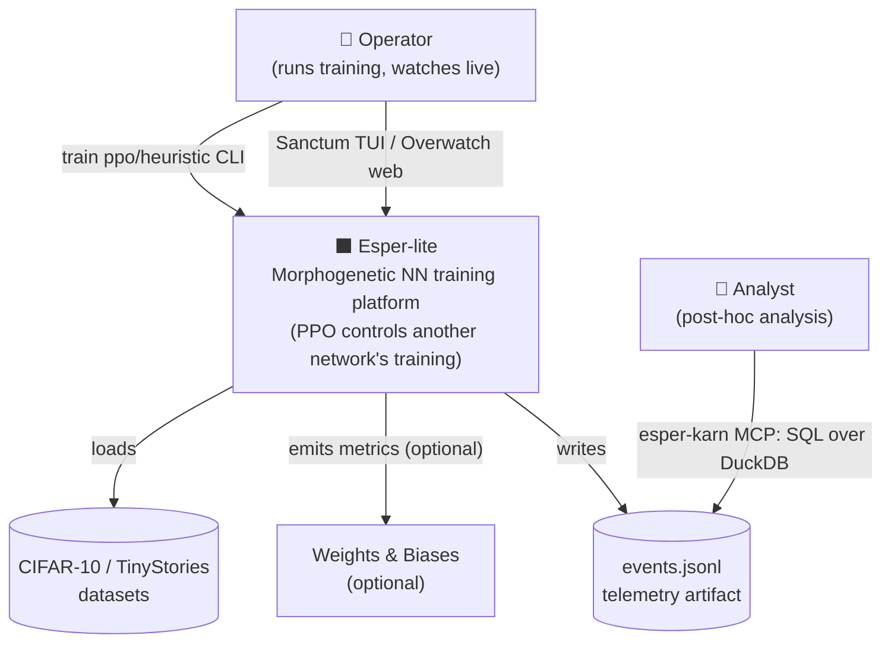
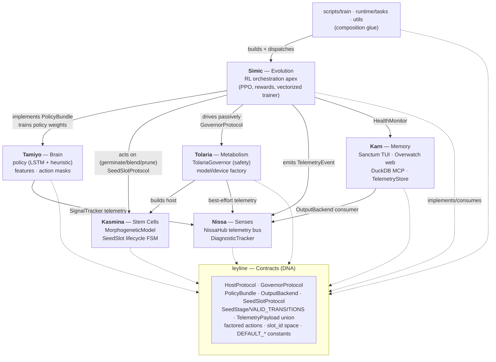
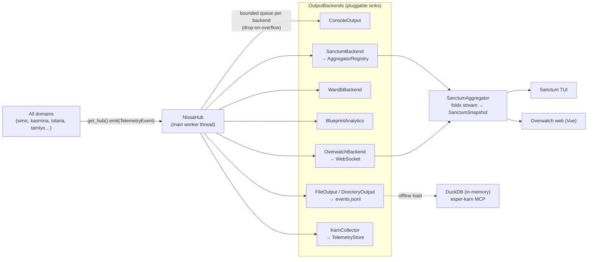
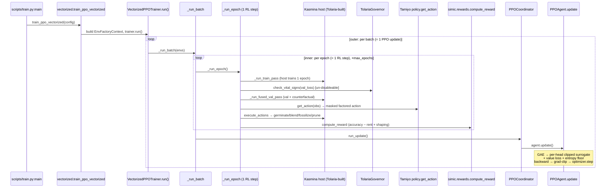
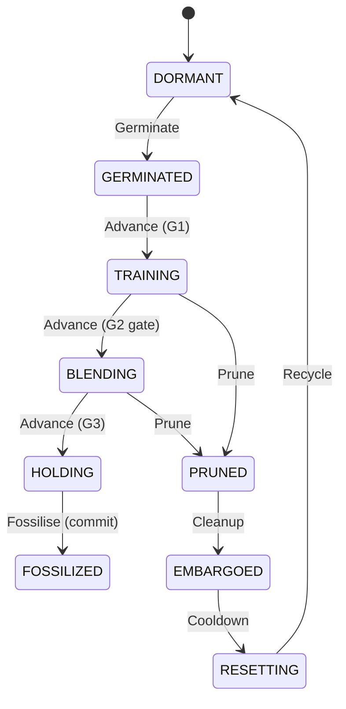

# 03 — Architecture Diagrams (C4)

All edges below are evidence-backed from the dependency-map cross-cutting pass (concrete import/call sites verified). Diagrams use Mermaid.

---

## C1 — System Context

Esper-lite is a single-process research platform. The "users" are an operator (CLI + live dashboards) and an analyst (post-hoc SQL).

---

## C2 — Container / Domain View

The 8 domains as containers, annotated with the **Protocol** each cross-domain edge implements. leyline is the shared contracts substrate (no outbound runtime arrows).

**Key reading:** Simic is the single integration apex (imports tamiyo ×20, kasmina ×7, tolaria ×4, nissa ×6, karn ×2, runtime ×7, utils ×7). Every other domain depends only on leyline plus small, well-justified cross-links (tamiyo→nissa, tolaria→{nissa, kasmina}, karn→nissa). **Zero import cycles** across 27,976 edges.

---

## C3 — Component View: the Telemetry Path

Telemetry flows one-way from every domain into the Nissa bus, then fans out to pluggable sinks. This is the realization of the "telemetry as a contract" principle.

**Two read paths from one contract:** the *live* path (Sanctum/Overwatch share one `AggregatorRegistry`+`SanctumSnapshot`) and the *offline* path (DuckDB SQL over `events.jsonl`). Both originate from the same leyline `TelemetryEvent`. **Note:** the MCP/DuckDB surface is currently *orphaned* — a standalone post-hoc CLI, not wired as a live backend.

---

## C4 — Dynamic View: One PPO Update (the nested-loop spine)

The system's defining feature: each RL step *is* one host training epoch. Verified call chain.

**The load-bearing seam (Commandment 3, CONFIRMED):** the entire inner loop runs in **one sequential thread** with the PPO policy embedded inline. There is **no producer/consumer queue, `threading.Lock`, or multiprocessing primitive** between host-training (Tolaria) and the policy (Simic). Per-env work runs on persistent per-env CUDA streams, accumulates into device-resident tensors, and synchronizes **once per phase** before any `.item()`. The single irreducible D2H sync is `actions_stacked.cpu().numpy()` at action dispatch (the on-policy control boundary), already consolidated into one transfer for all heads/envs.

---

## Seed lifecycle FSM (botanical metaphor — the only place it applies)

Single source of truth: `leyline/stages.py::VALID_TRANSITIONS`. Enforced by `SeedState.transition()` (kasmina) and mirrored into Tamiyo's action masks — so the legal action set is *derived from* the FSM, never hand-coded. (`SHADOWING`, value 5, was removed; the gap is intentional, documented, not shimmed.)

---

## Diagram provenance & confidence

- **C2/C4 spine and the telemetry path: High** — call sites and method bodies were read directly (train.py → vectorized → trainer.run → _run_batch → _run_epoch → ppo_coordinator.run_update → agent.update).
- **C2 full fan-out: Medium** — domain-level edge *counts* are grep-derived; the load-bearing edges were source-verified, but not all ~110 simic-internal edges were opened.
- The `tamiyo→kasmina` edge (tamiyo imports kasmina once, in `action_masks` under TYPE_CHECKING for `SeedState`) is intentionally **not** drawn as a first-class runtime edge in C2.
