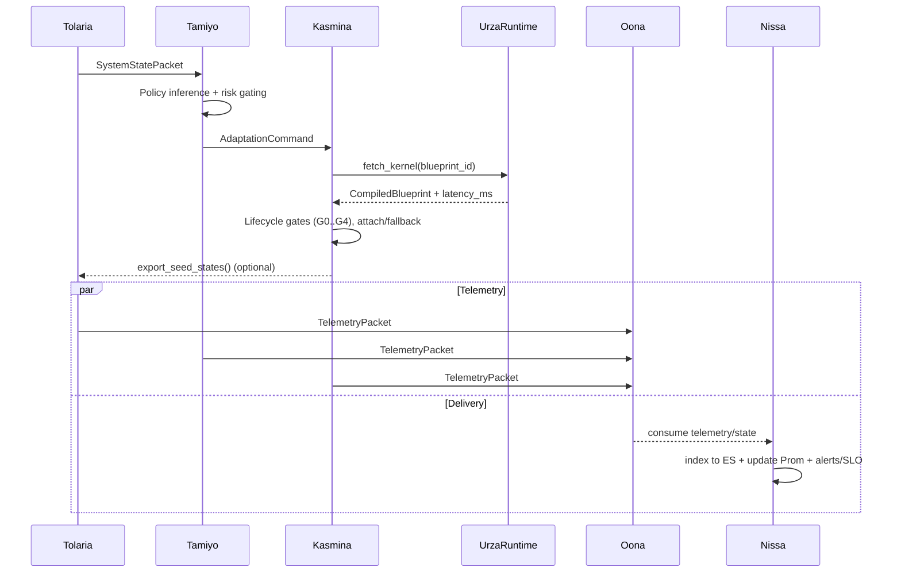

# Esper‑Lite Architecture Diagrams

This document contains Mermaid diagrams that illustrate major integration points and end‑to‑end flows. View directly on GitHub or paste into any Mermaid‑enabled viewer.

## 1) System Context & Integrations

## 2) Epoch Sequence (Training → Decision → Execution)

## 3) Kernel Prefetch Flow

## 4) Tezzeret Compilation Pipeline

## 5) Offline Policy Improvement (Simic)

## 6) Observability & SLOs

## Notes

- Edge labels in the context diagram indicate primary message types.
- All inter‑service payloads are Leyline protobuf messages; avoid shadow enums.
- Circuit breakers and conservative modes are omitted for clarity in diagrams but are enforced in code paths (see architecture summary).
