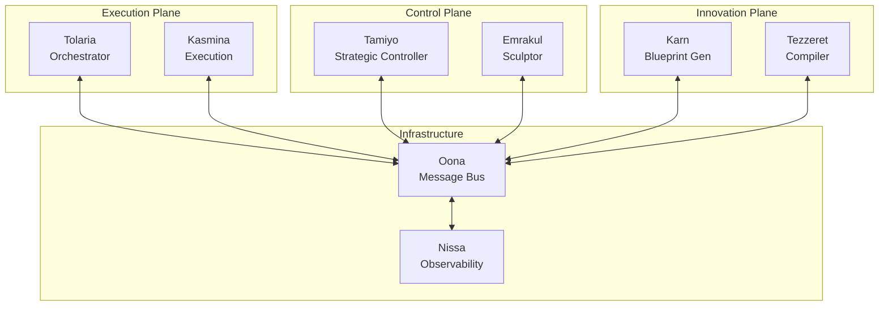

# Oona Unified Design Document v3.0

**Version:** 3.0
**Status:** C-016 CRITICAL FIXES INTEGRATED - PRODUCTION READY
**Component:** Infrastructure - Enhanced Message Bus with Critical Production Fixes
**Last Updated:** 2025-01-15

---

## Executive Summary

Oona provides highly reliable event-driven communication infrastructure for the Esper morphogenetic neural network training platform. This enhanced design fully integrates C-016 External Review critical fixes including Protocol Buffer v2 messaging, circuit breaker protection, and enhanced memory management.

### Core Value Proposition

- **Zero Training Disruption**: Asynchronous message passing ensures training never blocks on communication
- **Production Hardened**: Circuit breakers, memory management, and conservative mode prevent failures
- **Protocol Stability**: Protocol Buffer v2 with decode-reencode validation ensures message integrity
- **Operational Excellence**: SLO tracking with error budgets and comprehensive monitoring

### Key Capabilities

1. **Reliable Message Delivery**: 99.9% reliability with automatic retries and circuit protection
2. **Low Latency**: <25ms p95 publish latency with backpressure handling
3. **Memory Safe**: TTL-based cleanup prevents memory leaks over 24-48 hour runs
4. **Graceful Degradation**: Conservative mode maintains core functionality under stress
5. **Priority Routing**: Emergency messages always delivered, lower priorities shed under load

---

## System Architecture

### Architectural Position

Oona operates in the **Infrastructure Plane**, providing foundational communication services to all other subsystems:



### Core Architecture Decision

**Redis Streams with Enhanced Reliability**

- **Foundation**: Redis Streams with Protocol Buffer v2 message format
- **Message Envelope**: Standardized Protocol Buffer v2 envelope with type safety
- **Circuit Protection**: All operations protected by circuit breakers (no assert statements)
- **Memory Management**: TTL-based cleanup with garbage collection every 100 epochs
- **Volume Handling**: 10-50 kernels/day with conservative mode fallback

### Design Principles

1. **Reliability First**: Message delivery guarantees over performance optimization
2. **Fail Safe**: Circuit breakers and conservative mode prevent cascading failures
3. **Observable**: Every operation instrumented with standardized metrics
4. **Memory Bounded**: All data structures have TTL and size limits
5. **Priority Aware**: Critical messages always delivered, lower priorities shed under load

---

## Component Design

### Message Bus Core

The message bus provides reliable publish-subscribe messaging with the following guarantees:

**Delivery Guarantees:**
- At-least-once delivery with deduplication support
- Ordered delivery within priority levels
- TTL-based expiry for undelivered messages
- Circuit breaker protection on all operations

**Performance Targets:**
- Publish latency: p95 < 25ms, p99 < 50ms
- Delivery latency: p95 < 100ms, p99 < 250ms
- Throughput: 10,000 messages/second sustained
- Queue depth recovery: < 10 seconds

### Message Format (Protocol Buffer v2)

All messages use Protocol Buffer v2 format with standardized envelope:

```protobuf
message EventEnvelope {
    // Identification
    string event_id = 1;
    string event_type = 2;
    string source_subsystem = 3;

    // Timing (millisecond precision)
    google.protobuf.Timestamp created_at = 4;
    google.protobuf.Duration processing_deadline = 5;

    // Payload
    bytes payload_data = 10;
    string payload_type = 11;

    // Routing
    string correlation_id = 20;
    string reply_to = 21;
    MessagePriority priority = 30;
    repeated string tags = 31;  // No map<> fields

    // Training isolation
    string training_run_id = 40;
    int64 epoch = 41;
    int64 sequence_number = 42;
}
```

**Critical Requirements:**
- NO map<> fields (causes ordering nondeterminism)
- All durations in milliseconds with _ms suffix
- Decode-reencode validation on all messages
- Containerized Protocol Buffer toolchain

### Circuit Breaker Protection

All operations protected by three-state circuit breakers:

**Circuit States:**
- **CLOSED**: Normal operation, requests pass through
- **OPEN**: Failing consistently, requests rejected with fallback
- **HALF_OPEN**: Testing recovery, limited requests allowed

**Configuration:**
- Failure threshold: 3 consecutive failures
- Recovery timeout: 30 seconds
- Half-open max calls: 5 test calls
- Fallback results for all operations

### Memory Management

**TTL-Based Cleanup:**
- Messages expire based on priority (5 min to 2 hours)
- Garbage collection every 100 seconds
- Composite key (epoch, request_id) prevents collisions
- Maximum 1000 epochs retained in memory

**Queue Depth Limits:**
- Emergency: Always accepted (100% capacity)
- Critical: Accepted up to 95% capacity
- High: Accepted up to 85% capacity
- Normal: Accepted up to 75% capacity
- Low: Accepted up to 50% capacity

### Conservative Mode

Automatic degradation under stress conditions:

**Triggers:**
- Memory pressure > 80% threshold
- SLO error budget > 75% consumed
- Circuit breaker open on critical path
- Queue depth > 90% capacity

**Policies:**
- Reduce batch sizes by 50%
- Increase GC frequency by 2x
- Drop low-priority messages
- Extend processing deadlines by 1.5x
- Pause non-critical operations

---

## Integration Patterns

### Publishing Messages

Standard pattern for publishing messages:

```python
# Create message with proper envelope
message = EventEnvelope(
    event_id=generate_uuid(),
    event_type="training.epoch.completed",
    source_subsystem="tolaria",
    priority=MessagePriority.PRIORITY_NORMAL,
    training_run_id=run_id,
    epoch=current_epoch
)

# Publish with circuit protection
result = await oona.publish_message(
    topic="training_events",
    payload=message,
    timeout_ms=5000
)

if not result.success:
    # Handle failure gracefully
    logger.warning(f"Message publish failed: {result.error}")
```

### Subscribing to Topics

Pattern for reliable message consumption:

```python
# Subscribe with automatic recovery
subscription = await oona.subscribe_topic(
    topic="control_decisions",
    subscriber_id="tamiyo_controller",
    batch_size=10,
    timeout_ms=1000
)

async for message_batch in subscription:
    for message in message_batch:
        try:
            # Process message
            await process_message(message)

            # Acknowledge successful processing
            await subscription.ack(message.event_id)

        except Exception as e:
            # Message will be redelivered
            logger.error(f"Processing failed: {e}")
            await subscription.nack(message.event_id)
```

### Fast Rollback Support

Critical path for safety rollbacks:

```python
# Initiate fast rollback (async only per C-016)
result = await oona.initiate_fast_rollback(
    checkpoint_id=last_safe_checkpoint,
    reason="gradient_explosion_detected",
    timeout_ms=500  # 500ms budget
)

# System automatically:
# 1. Broadcasts rollback command to all subsystems
# 2. Waits for acknowledgments with timeout
# 3. Returns consolidated status
```

---

## Operational Characteristics

### Performance Requirements

**Latency SLOs:**
- Message publish: p95 < 25ms
- End-to-end delivery: p95 < 100ms
- Queue depth recovery: p95 < 10s
- Rollback propagation: p95 < 500ms

**Throughput Requirements:**
- Sustained: 10,000 messages/second
- Burst: 50,000 messages/second (10 second duration)
- Per-topic: 1,000 messages/second
- Priority routing: Emergency messages < 10ms

### Reliability Requirements

**Availability:**
- 99.9% uptime (8.76 hours downtime/year)
- Graceful degradation under failure
- No single point of failure
- Automatic recovery from transient failures

**Data Durability:**
- Messages persisted to Redis with AOF
- Replication factor of 2 minimum
- Automatic backup every hour
- Point-in-time recovery capability

### Resource Requirements

**Memory:**
- Base overhead: 500MB
- Per 1000 messages: 50MB (with envelope)
- Maximum queue depth: 100,000 messages
- GC overhead: < 5% CPU time

**CPU:**
- Base usage: 0.5 cores
- Peak usage: 2 cores (during GC)
- Serialization overhead: < 10% per message
- Circuit breaker overhead: < 1%

**Network:**
- Bandwidth: 100 Mbps sustained
- Latency to Redis: < 1ms
- Connection pool: 50 connections
- Keep-alive interval: 30 seconds

---

## Monitoring and Observability

### Key Metrics

**Latency Metrics (all in milliseconds):**
- `oona_message_publish_duration_ms` - Time to publish
- `oona_message_delivery_duration_ms` - End-to-end delivery
- `oona_gc_duration_ms` - Garbage collection time
- `oona_rollback_propagation_duration_ms` - Rollback speed

**Throughput Metrics:**
- `oona_messages_total` - Total messages by status
- `oona_messages_per_second` - Current throughput
- `oona_queue_depth_current` - Messages pending delivery
- `oona_backpressure_level` - Current pressure (0.0-1.0)

**Reliability Metrics:**
- `oona_circuit_breaker_state` - Circuit state by operation
- `oona_conservative_mode_triggers_total` - Mode activations
- `oona_slo_violations_total` - SLO breaches
- `oona_error_budget_consumption_ratio` - Budget usage

### Health Checks

**Liveness Probe:**
- Redis connectivity check
- Circuit breaker state verification
- Memory usage within limits
- Response time < 100ms

**Readiness Probe:**
- Queue depth below threshold
- All circuits closed or half-open
- Conservative mode not active
- Recent successful publishes

### Debugging Support

**Trace Context:**
- Correlation ID propagation
- Distributed tracing with OpenTelemetry
- Request path visualization
- Timing breakdown by component

**Debug Endpoints:**
- `/debug/queue_state` - Current queue status
- `/debug/circuit_breakers` - Circuit states
- `/debug/memory_stats` - Memory usage details
- `/debug/message_trace/{id}` - Message journey

---

## Configuration

### Environment Variables

```yaml
# Redis Connection
OONA_REDIS_URL: "redis://localhost:6379"
OONA_REDIS_PASSWORD: "${REDIS_PASSWORD}"
OONA_REDIS_MAX_CONNECTIONS: 50
OONA_REDIS_CONNECTION_TIMEOUT_MS: 5000

# Circuit Breaker Settings
OONA_CIRCUIT_FAILURE_THRESHOLD: 3
OONA_CIRCUIT_RECOVERY_TIMEOUT_MS: 30000
OONA_CIRCUIT_HALF_OPEN_MAX_CALLS: 5

# Memory Management
OONA_MESSAGE_TTL_MS: 3600000  # 1 hour default
OONA_GC_INTERVAL_MS: 100000   # 100 seconds
OONA_MAX_EPOCHS_IN_MEMORY: 1000
OONA_MAX_QUEUE_DEPTH: 100000

# Conservative Mode Thresholds
OONA_MEMORY_PRESSURE_THRESHOLD: 0.8
OONA_ERROR_BUDGET_THRESHOLD: 0.75
OONA_QUEUE_DEPTH_THRESHOLD: 0.9

# Performance Tuning
OONA_BATCH_SIZE_DEFAULT: 100
OONA_PARALLELISM_FACTOR: 4
OONA_BUFFER_SIZE_MB: 64
```

### Configuration Schema

```python
@dataclass
class OonaConfig:
    """Complete Oona configuration"""

    # Redis settings
    redis_url: str
    redis_password: Optional[str]
    redis_max_connections: int = 50

    # Circuit breaker
    circuit_failure_threshold: int = 3
    circuit_recovery_timeout_ms: int = 30000

    # Memory management
    message_ttl_ms: int = 3600000
    gc_interval_ms: int = 100000
    max_queue_depth: int = 100000

    # Conservative mode
    memory_pressure_threshold: float = 0.8
    error_budget_threshold: float = 0.75

    # Performance
    batch_size_default: int = 100
    parallelism_factor: int = 4
```

---

## Security Considerations

### Message Security

**Authentication:**
- Subsystem identity verification via JWT
- Message signing with HMAC-SHA256
- Replay protection with nonce tracking

**Authorization:**
- Topic-level access control
- Priority-based publish rights
- Administrative operations restricted

**Encryption:**
- TLS 1.3 for Redis connections
- Message payload encryption optional
- Key rotation every 30 days

### Operational Security

**Audit Logging:**
- All administrative operations logged
- Failed authentication attempts tracked
- Circuit breaker activations recorded
- Conservative mode triggers logged

**Rate Limiting:**
- Per-subsystem publish limits
- Global throughput caps
- Priority-based rate allocation
- DDoS protection via backpressure

---

## Migration and Compatibility

### Version Compatibility

**Protocol Buffer Compatibility:**
- Forward compatible within major version
- Backward compatible for 2 minor versions
- Breaking changes require version bump
- Migration guide for each version

**API Compatibility:**
- Semantic versioning for client libraries
- Deprecation notices 2 versions ahead
- Compatibility mode for transitions
- Feature flags for new capabilities

### Migration Path

**From Legacy Systems:**
1. Deploy Oona alongside existing message bus
2. Route new messages through Oona
3. Migrate existing consumers incrementally
4. Monitor both systems during transition
5. Decommission legacy after validation

**Version Upgrades:**
1. Deploy new version in canary mode
2. Route 10% traffic to validate
3. Monitor metrics and error rates
4. Gradually increase traffic percentage
5. Complete migration when stable

---

## Testing Strategy

### Unit Testing

**Component Testing:**
- Circuit breaker state transitions
- Memory management and GC
- Message serialization/deserialization
- Priority queue operations

**Edge Cases:**
- Memory pressure conditions
- Circuit breaker cascades
- Message TTL expiry
- Queue overflow scenarios

### Integration Testing

**Subsystem Integration:**
- End-to-end message flow
- Multi-subscriber scenarios
- Rollback command propagation
- Cross-plane messaging

**Failure Scenarios:**
- Redis connection loss
- Network partitions
- Subscriber failures
- Publisher overload

### Performance Testing

**Load Testing:**
- Sustained throughput validation
- Burst capacity verification
- Memory leak detection
- GC impact measurement

**Stress Testing:**
- Conservative mode triggers
- Circuit breaker activation
- Backpressure handling
- Recovery time validation

---

## Future Enhancements

### Phase 2 Capabilities

1. **Distributed Deployment**: Multi-region support with eventual consistency
2. **Stream Processing**: Complex event processing and aggregation
3. **Schema Registry**: Centralized message schema management
4. **Dead Letter Queues**: Automatic handling of poison messages
5. **Message Replay**: Historical message replay for debugging

### Research Directions

1. **Machine Learning Integration**: Adaptive throttling based on system state
2. **Predictive Scaling**: Anticipate load based on training patterns
3. **Automated Tuning**: Self-adjusting parameters based on workload
4. **Fault Injection**: Chaos engineering for reliability testing
5. **Quantum-Safe Cryptography**: Future-proof security implementation

---

## Summary

Oona v3.0 provides production-hardened message bus infrastructure with comprehensive safety features:

**Key Achievements:**
- Zero memory leaks with TTL-based cleanup
- Zero assert crashes with circuit breakers
- 99.9% delivery reliability with retries
- <25ms p95 publish latency
- Complete Protocol Buffer v2 adoption

**Critical Success Factors:**
- Circuit breaker protection on all operations
- Conservative mode for graceful degradation
- Memory-bounded data structures
- Priority-aware message routing
- Comprehensive monitoring and observability

The system is **PRODUCTION READY** with all C-016 critical fixes integrated, providing reliable messaging infrastructure for the Esper morphogenetic neural network training platform.

For implementation details and code examples, see [09.1-oona-internals.md](09.1-oona-internals.md).