# Esper HLD - Reference Architecture Overview (AI-Optimized)

**Context:** This is part 5 of the Esper High Level Design document breakdown. Complete reference: `/home/john/esper/docs/architecture/hld-sections/`

**Cross-References:**
- **Previous:** [Scientific Context & Validation](./004-scientific-context-validation.md)
- **Next:** [System Design & Data Flow](./006-system-design-data-flow.md)
- **Implementation:** [Component Specifications](./007-component-specifications.md)
- **Detailed:** [Data Contracts & API Specifications](./008-data-contracts-api-specifications.md)

---

## AI Processing Metadata

**Document Type:** Technical Architecture Specification  
**Primary Audience:** System Architects, Implementation Teams, AI Development Agents  
**Processing Priority:** CRITICAL - Core system understanding required  
**Dependencies:** [Conceptual Framework](./003-conceptual-framework-value-proposition.md)  
**Estimated Reading Time:** 12 minutes  

**Key Concepts Defined:**
- 12-Subsystem Architecture
- Three Functional Planes
- Seed-Based Evolution
- Asynchronous Compilation Pipeline
- Multi-Stage Validation

---

## 4. Reference Architecture Overview

### Architecture Philosophy

The Esper reference implementation enables morphogenetic evolution of neural architectures through a sophisticated **12-subsystem architecture** designed around three core principles:

1. **Zero Training Disruption** - Asynchronous compilation ensures main training never pauses
2. **Separation of Concerns** - Distinct functional planes for training, control, and innovation
3. **Evolutionary Safety** - Multi-stage validation prevents system failures

### 4.1 High-Level Architecture

The system organizes **twelve specialized subsystems** across **three functional planes**, ensuring clear separation between training execution, intelligent control, and continuous innovation.

```mermaid
graph TB
    subgraph "🎯 Training Plane - Core Learning Execution"
        Tolaria[🏛️ Tolaria<br/>Training Orchestrator<br/>Master Loop Controller]
        Kasmina[⚡ Kasmina<br/>Execution Layer<br/>Kernel Runtime Engine]
        Tolaria -.->|epoch boundaries| Kasmina
        Kasmina -.->|seed telemetry| Tolaria
    end
    
    subgraph "🧠 Control Plane - Intelligent Decision Making"
        Tamiyo[🎯 Tamiyo<br/>Strategic Controller<br/>GNN Policy Network]
        Simic[🧬 Simic<br/>Policy Sculptor<br/>Experience Replay Trainer]
        Emrakul[🔄 Emrakul<br/>Architectural Sculptor<br/>Large-Scale Modifications]
        Jace[📚 Jace<br/>Curriculum Coordinator<br/>Task & Strategy Alignment]
        Simic -->|trained policies| Tamiyo
        Tamiyo -->|field reports| Simic
        Jace -->|coordination| Tamiyo
        Jace -->|coordination| Simic
    end
    
    subgraph "🔬 Innovation Plane - Asynchronous R&D"
        Karn[🎨 Karn<br/>Generative Architect<br/>Blueprint Designer]
        Tezzeret[⚙️ Tezzeret<br/>Compilation Forge<br/>Optimization Engine]
        Urabrask[🔍 Urabrask<br/>Evaluation Engine<br/>Validation Crucible]
        Urza[📚 Urza<br/>Central Library<br/>Asset Repository]
        
        Karn -->|BlueprintIR| Urza
        Tezzeret <.->|polls/pushes| Urza
        Urabrask <.->|validates/reports| Urza
    end
    
    subgraph "🔧 Infrastructure Plane - Foundation Services"
        Oona[📡 Oona<br/>Message Bus<br/>Event Distribution]
        Nissa[📊 Nissa<br/>Observability<br/>Monitoring & Audit]
    end
    
    %% Critical Data Flows
    Kasmina -.->|telemetry stream| Oona
    Tamiyo -.->|adaptation commands| Oona
    Oona -.->|all events| Nissa
    Tamiyo -.->|kernel queries| Urza
    Kasmina -.->|kernel loading| Urza
    Tolaria -->|system state| Tamiyo
    Tamiyo -->|adaptation signals| Tolaria
```



### 4.2 Functional Plane Responsibilities

#### 🎯 Training Plane: Execution Core
**Purpose:** Manage the fundamental training process with zero disruption

| Component | Primary Function | Key Interfaces |
|-----------|------------------|----------------|
| **Tolaria** | Training orchestration, system heartbeat | `tamiyo.step()`, `AdaptationSignal` |
| **Kasmina** | Pure kernel execution, seed lifecycle | `load_kernel()`, seed telemetry |

#### 🧠 Control Plane: Intelligence Layer  
**Purpose:** Provide learned decision-making and strategic control

| Component | Primary Function | Key Interfaces |
|-----------|------------------|----------------|
| **Tamiyo** | Strategic analysis and adaptation targeting | `SystemStatePacket`, `KernelQuery` |
| **Simic** | Policy training from operational experience | `FieldReport`, policy updates |
| **Emrakul** | Large-scale architectural modifications | Architecture transformation APIs |
| **Jace** | Curriculum coordination between Tamiyo and Simic | `CurriculumEvent`, coordination signals |

#### 🔬 Innovation Plane: R&D Engine
**Purpose:** Continuous asynchronous improvement and validation

| Component | Primary Function | Key Interfaces |
|-----------|------------------|----------------|
| **Karn** | Blueprint generation (generative AI planned) | `BlueprintIR` generation |
| **Tezzeret** | Asynchronous compilation and optimization | Blueprint → Kernel compilation |
| **Urabrask** | Rigorous validation and characterization | Performance validation reports |
| **Urza** | Centralized asset storage and retrieval | Query API, version management |

#### 🔧 Infrastructure Plane: Foundation
**Purpose:** Provide reliable communication and observability

| Component | Primary Function | Key Interfaces |
|-----------|------------------|----------------|
| **Oona** | Event-driven communication bus | Message publish/subscribe |
| **Nissa** | System observability and audit trail | Metrics, logs, dashboards |

---

## 4.3 Core Concepts Deep Dive

### 4.3.1 Seeds: The Unit of Evolution

**Definition:** Seeds represent the fundamental atom of neural evolution change - localized agents that monitor, adapt, and evolve specific neural network regions.

#### Seed Characteristics
```python
class SeedProperties:
    """Core properties that define a seed's behavior"""
    
    # Monitoring Scope
    neuron_chunk: Tensor          # Specific neurons under seed control
    activation_region: Region     # Local activation space monitored
    
    # Intelligence Integration  
    telemetry_signals: List[str]  # Metrics reported to Tamiyo
    adaptation_triggers: Dict     # Conditions for evolution
    
    # Safety Constraints
    interface_contract: Contract  # Preserved input/output dimensions
    gradient_isolation: bool      # Prevents interference with base model
    rollback_checkpoint: State    # Restoration point for failed adaptations
```

#### Seed Lifecycle Management
Each seed operates as an autonomous agent through the **11-stage lifecycle**:

**Stage Categories:**
- **Monitoring Stages (1-3):** Passive observation and opportunity detection
- **Integration Stages (4-6):** Active adaptation with safety monitoring  
- **Resolution Stages (7-11):** Final determination and permanent integration

**Critical Property:** Seeds maintain **interface contract preservation** - input/output dimensions remain unchanged, ensuring backward compatibility throughout evolution.

### 4.3.2 Blueprints & Kernels: Design vs Execution

The architecture maintains a strict separation between **abstract design** and **executable artifacts**:

#### Blueprint (Design Phase)
```python
class BlueprintIR:
    """Intermediate Representation of architectural design"""
    
    # Design Specification
    architecture_graph: NetworkGraph    # Neural architecture definition
    parameter_schema: ParameterSpec     # Expected parameter structure
    computational_profile: Profile     # Estimated resource requirements
    
    # Metadata
    design_intent: str                  # Human-readable purpose
    theoretical_basis: str              # Research foundation
    target_optimization: Objective     # Performance goal
    
    # Validation Status
    status: BlueprintStatus            # UNVALIDATED, COMPILING, INVALID
    compilation_attempts: int          # Track optimization efforts
```

#### Compiled Kernel (Execution Phase)
```python
class CompiledKernelArtifact:
    """Optimized, validated, executable neural module"""
    
    # Executable Components
    compiled_module: torch.nn.Module   # Optimized PyTorch module
    binary_artifact: bytes            # Serialized kernel for fast loading
    optimization_profile: Dict        # Applied optimizations
    
    # Performance Characteristics (from Urabrask validation)
    latency: float                    # Measured execution time
    memory_usage: float               # Memory footprint
    accuracy_impact: float            # Performance effect on base model
    
    # Empirical Tags (data-driven categorization)
    performance_tags: List[str]       # ['high_speed', 'low_memory', etc.]
    
    # Deployment Metadata
    status: KernelStatus             # VALIDATED, REJECTED, PENDING_BENCHMARKING
    deployment_count: int            # Production usage tracking
```

### 4.3.3 Asynchronous Compilation Pipeline

**Critical Innovation:** The compilation pipeline operates completely independently of the main training loop, ensuring **zero training disruption**.

#### Pipeline Flow


#### Timeline Independence
- **Main Training:** Continuous, never blocked
- **Background Compilation:** Asynchronous, high-throughput
- **Validation:** Rigorous, but non-blocking
- **Deployment:** Atomic, instantaneous

### 4.3.4 Three-Phase Validation System

The **11-stage lifecycle** implements **three distinct validation phases** to ensure safety:

#### Phase 1: Pre-Integration (Stages 1-3)
```
DORMANT → GERMINATED → TRAINING
```
**Purpose:** Safe experimentation in complete isolation

**Validation Criteria:**
- Blueprint trains successfully on sample data
- No resource constraint violations
- Architectural compatibility verified
- Early failure detection and rejection

#### Phase 2: Controlled Integration (Stages 4-6)
```
GRAFTING → STABILIZATION → EVALUATING
```  
**Purpose:** Gradual integration with continuous monitoring

**Validation Criteria:**
- Gradient isolation maintained
- Host model performance stability
- No interference with existing capabilities
- Rollback capability continuously available

#### Phase 3: Final Determination (Stages 7-11)
```
FINE_TUNING → FOSSILIZED | CULLED | CANCELLED | ROLLED_BACK
```
**Purpose:** Permanent decision with complete resolution

**Validation Criteria:**
- Final performance validation against acceptance criteria
- Long-term stability assessment
- Complete integration or complete removal (no partial states)
- Audit trail completion

---

## 4.4 System Boundaries & Scope

### 4.4.1 Within Architectural Scope

**✅ Core Capabilities:**

1. **In-Training Adaptation**
   - Structural modifications during active training loops
   - Gradient isolation for safe integration
   - Continuous learning while evolving architecture

2. **Asynchronous Innovation Pipeline**
   - Background blueprint compilation
   - Non-blocking validation processes
   - Zero-disruption deployment mechanisms

3. **Policy-Governed Evolution**
   - Tamiyo's learned strategic control
   - Karn's generative architectural design
   - Data-driven adaptation decisions

4. **Multi-Architecture Support**
   - Validated on MLPs, CNNs, Transformers
   - Extensible to new architectures
   - Hardware-agnostic design principles

5. **Production-Grade Safety**
   - Comprehensive audit trails
   - Emergency rollback capabilities
   - Cryptographic verification of all changes

**✅ Deployment Scenarios:**
- Single-node research environments (Phase 1)
- Distributed production systems (Phase 2)
- Cloud-native Kubernetes deployments
- On-premises enterprise installations

### 4.4.2 Outside Architectural Scope

**❌ Excluded Capabilities:**

1. **Global Architecture Search**
   - Framework assumes stable base topology
   - Focuses on localized adaptations only
   - Not a replacement for NAS systems

2. **Weight-Only Adaptation**
   - Emphasis on structural, not parametric changes
   - Complements but doesn't replace fine-tuning
   - Structural evolution is the primary focus

3. **Unsupervised Discovery**
   - All adaptations guided by performance signals
   - Requires explicit optimization objectives
   - Not autonomous exploration without guidance

4. **Real-Time Inference Adaptation**
   - Current design targets training-time evolution
   - Inference-time adaptation is future capability
   - Focus on training-phase improvements

5. **Cross-Model Knowledge Transfer**
   - Seeds operate within single model boundaries
   - No inter-model evolutionary sharing
   - Model-specific adaptation only

### 4.4.3 External Integration Interfaces

**🔌 Required External Systems:**

#### Training Frameworks
```python
# PyTorch nn.Module Compatibility
class EsperCompatibleModel(nn.Module):
    """Standard PyTorch module with Esper seed integration"""
    
    def __init__(self):
        super().__init__()
        self.base_layers = nn.Sequential(...)
        self.kasmina_seeds = KasminaLayerArray(...)
    
    def forward(self, x):
        return self.kasmina_seeds(self.base_layers(x))
```

#### Hardware Accelerators  
- **CUDA/ROCm:** GPU acceleration through PyTorch device abstraction
- **TPU:** Google Cloud TPU support via PyTorch/XLA
- **Custom Accelerators:** Extensible device interface

#### Monitoring & Observability
```python
# Prometheus/Grafana Compatible Metrics
esper_adaptation_total = Counter('esper_adaptations_total')
esper_compilation_duration = Histogram('esper_compilation_seconds')
esper_validation_success_rate = Gauge('esper_validation_success_ratio')
```

#### Storage & Persistence
- **Model Checkpoints:** Standard PyTorch state_dict compatibility
- **Artifact Storage:** S3/GCS/Azure Blob for kernel artifacts
- **Metadata Storage:** PostgreSQL/MySQL for system state

---

## 4.5 Technology Stack & Dependencies

### 4.5.1 Core Platform Requirements

**🐍 Python Ecosystem:**
```yaml
python: ">=3.12"        # Latest stable with performance improvements
pytorch: ">=2.7"        # Dynamic graph manipulation, torch.compile
numpy: ">=1.24"         # Numerical computing foundation
scipy: ">=1.10"         # Statistical analysis and optimization
pydantic: ">=2.0"       # Runtime data validation
```

**🔧 Infrastructure Services:**
```yaml
message_bus:
  development: "Redis Streams 7.0+"    # Single-node Phase 1
  production: "Apache Pulsar 3.0+"     # Distributed Phase 2
  
coordination:
  distributed: "etcd 3.5+ | Consul 1.15+"  # Multi-node deployments
  
storage:
  metadata: "PostgreSQL 16+"              # Transactional data
  artifacts: "S3 API Compatible"          # Object storage
  cache: "Redis 7.0+"                     # High-speed cache
```

**☸️ Container & Orchestration:**
```yaml
containerization: "Docker 24.0+"
orchestration: "Kubernetes 1.28+"
service_mesh: "Istio 1.18+ (optional)"
monitoring: "Prometheus + Grafana"
```

### 4.5.2 Research & Development Assumptions

**📊 Model Behavior Assumptions:**
1. **Bottleneck Detection:** Models exhibit identifiable performance bottlenecks through telemetry analysis
2. **Local Learning Effectiveness:** Targeted adaptations can address computational deficiencies without global interference
3. **Gradient Isolation Feasibility:** Architectural design can programmatically maintain gradient separation
4. **Interface Contract Preservation:** Mechanisms like residual connections enable structural changes while preserving compatibility

**🧠 Learning System Assumptions:**
1. **Evolutionary Pressure Effectiveness:** Learned reward signals guide useful architectural innovations
2. **Policy Convergence:** Tamiyo's strategic policies converge to effective intervention strategies
3. **Generative Architecture Quality:** Karn can learn to design architecturally sound blueprints
4. **Transfer Learning Success:** Policies learned on simple tasks transfer to complex domains

**⚡ Performance Assumptions:**
1. **Compilation Amortization:** Asynchronous compilation overhead is amortized across multiple deployments
2. **Cache Effectiveness:** GPU-resident kernel cache achieves high hit rates
3. **Validation Throughput:** Urabrask can validate kernels faster than Karn generates blueprints
4. **Network Overhead:** Message bus latency remains negligible compared to training time

---

## 4.6 Implementation Architecture Notes

### 4.6.1 Phase 1: Single-Node Co-location

**🏗️ Deployment Strategy:**
- All 11 subsystems deployed as **logical separation** within single application
- **Process isolation** for critical components (Tezzeret, Urabrask)
- **Shared memory** for high-frequency data (seed telemetry)
- **Local Redis** for message bus functionality

**📈 Scalability Limitations:**
- Single GPU memory constraints
- CPU-bound compilation throughput
- Local storage capacity limits
- No horizontal scaling capability

### 4.6.2 Phase 2: Distributed Production

**🌐 Distributed Architecture:**
- **Kubernetes-native** deployment with Helm charts
- **Horizontal scaling** for Tezzeret compilation farms
- **Multi-GPU** Kasmina execution clusters
- **Geographically distributed** Urza storage layers

**🔒 Production Hardening:**
- **mTLS** for all inter-service communication
- **RBAC** with fine-grained permissions
- **Network policies** for traffic isolation
- **Comprehensive audit logging** with tamper resistance

---

## 4.7 Architecture Decision Records (ADRs)

### ADR-001: Asynchronous Compilation Pipeline
**Decision:** Separate compilation (Tezzeret) from execution (Kasmina)  
**Rationale:** Ensures zero training disruption while maintaining optimization quality  
**Alternatives Considered:** Synchronous JIT compilation, pre-compilation only  
**Trade-offs:** Increased system complexity for training loop stability  

### ADR-002: Event-Driven Communication (Oona)
**Decision:** Message bus for inter-component communication  
**Rationale:** Enables loose coupling and independent subsystem evolution  
**Alternatives Considered:** Direct API calls, shared memory  
**Trade-offs:** Network latency for architectural flexibility  

### ADR-003: Three-Phase Validation System
**Decision:** 11-stage lifecycle with distinct validation phases  
**Rationale:** Provides multiple safety checkpoints and rollback opportunities  
**Alternatives Considered:** Binary validation, continuous validation  
**Trade-offs:** Adaptation latency for safety guarantees  

### ADR-004: Centralized Asset Management (Urza)
**Decision:** Single source of truth for blueprints and kernels  
**Rationale:** Ensures consistency and enables sophisticated query capabilities  
**Alternatives Considered:** Distributed storage, component-local storage  
**Trade-offs:** Central point of dependency for simplified management  

---

## 4.8 Success Metrics & Validation Criteria

### 4.8.1 Technical Performance Metrics

**🎯 Core Functionality:**
- **Zero Training Disruption:** minimal adaptation deployment latency
- **Validation Accuracy:** High accuracy in acceptance/rejection decisions
- **Rollback Reliability:** Complete successful emergency rollbacks
- **Audit Completeness:** Full traceability of all system modifications

**⚡ Performance Targets:**
- **Kernel Load Latency:** sub-microsecond (cached), sub-millisecond (uncached)
- **Decision Latency:** sub-second for Tamiyo policy decisions
- **Compilation Throughput:** high-throughput compilation per Tezzeret instance
- **Memory Overhead:** minimal additional memory per seed

### 4.8.2 System Quality Metrics

**🔒 Safety & Reliability:**
- **Adaptation Success Rate:** high success rate of adaptations improve performance
- **System Stability:** exceptional system stability training runs require emergency rollback
- **Error Recovery:** rapid for complete system restoration
- **Data Integrity:** Complete cryptographic verification of all changes

**📊 Operational Excellence:**
- **Observability Coverage:** Complete capture of all system events
- **Deployment Success:** exceptional success rate successful kernel deployments
- **Resource Utilization:** highly efficient use of compilation resources
- **Documentation Accuracy:** Complete API coverage with working examples

---

This reference architecture provides the foundation for implementing autonomous neural network evolution while maintaining the safety, performance, and operational characteristics required for production deployment. The 12-subsystem design ensures clear separation of concerns while enabling sophisticated interactions between training, control, and innovation processes.