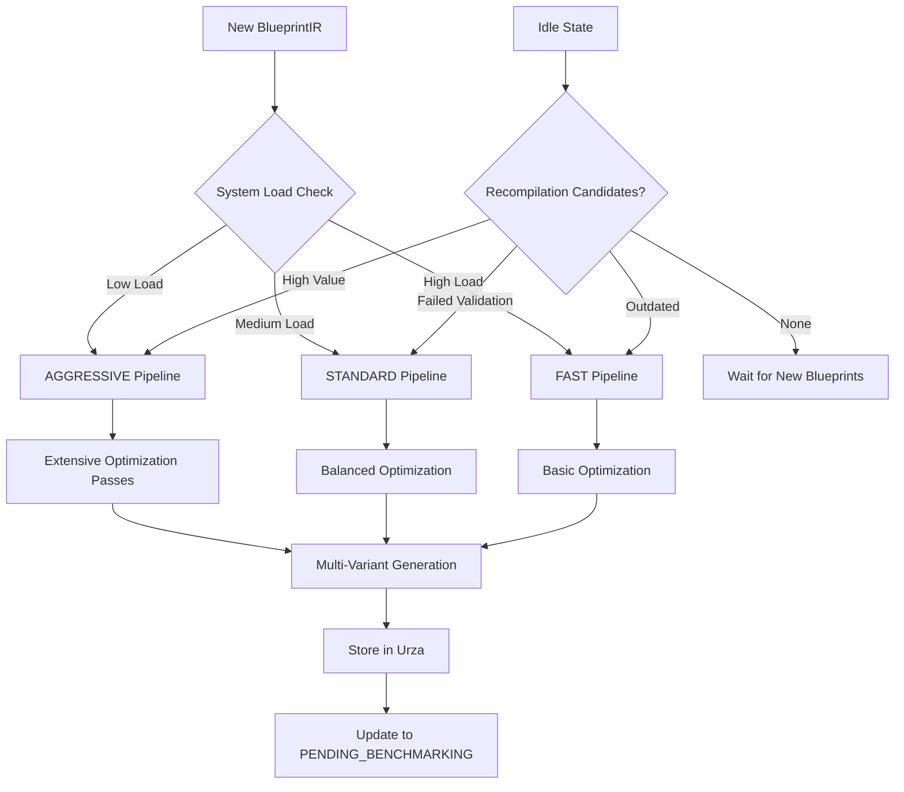

# Esper HLD - Component Specifications (AI-Optimized)

**Context:** This is part 7 of the Esper High Level Design document breakdown. Complete reference: `/home/john/esper/docs/architecture/hld-sections/`

**Cross-References:**
- **Previous:** [System Design & Data Flow](./006-system-design-data-flow.md)
- **Next:** [Data Contracts & API Specifications](./008-data-contracts-api-specifications.md)
- **Related:** [Reference Architecture Overview](./005-reference-architecture-overview.md)
- **Details:** [Appendices and Technical Details](./009-appendices-technical-details.md)

---

## AI Processing Metadata

**Document Type:** Detailed Component Specification  
**Primary Audience:** Implementation Teams, System Integration Agents, DevOps Engineers  
**Processing Priority:** HIGH - Required for implementation planning  
**Dependencies:** [Reference Architecture Overview](./005-reference-architecture-overview.md)  
**Estimated Reading Time:** 25 minutes  

**Key Implementation Areas:**
- Major Subsystems (4): Core platform functionality
- Minor Subsystems (7): Supporting services and infrastructure
- Interface Contracts: Data flows and API specifications
- Implementation Status: Current completion levels
- Deployment Patterns: Single-node vs distributed architectures

---

## 7. Component Specifications

This chapter provides comprehensive implementation specifications for all **12 subsystems** in the Esper morphogenetic platform. Components are categorized by implementation priority and architectural significance.

**Post-Reset Status:** Following a catastrophic architectural failure, all subsystems require complete reimplementation. The specifications below remain valid as reference architecture.

### Architecture Overview

| **Category** | **Components** | **Implementation Priority** | **Status** |
|--------------|----------------|----------------------------|------------|
| **Training Plane** | Tolaria, Kasmina | CRITICAL - Core execution | Requires reimplementation |
| **Control Plane** | Tamiyo, Simic, Emrakul, Jace | CRITICAL - Strategic control | Requires reimplementation |
| **Innovation Plane** | Karn, Tezzeret, Urabrask, Urza | HIGH - R&D pipeline | Requires reimplementation |
| **Infrastructure** | Oona, Nissa | MEDIUM - Platform services | Requires reimplementation |

---

## 7.1 Major Subsystems (Core Platform)

### 7.1.1 Tolaria - The Training Orchestrator

**🏛️ System Role:** Master coordinator of the entire morphogenetic training process

#### Purpose & Responsibilities

**Primary Mission:** Orchestrate the entire learning process, providing the stable temporal framework (epochs and steps) within which the host model lives and evolves.

**Core Responsibilities:**

| **Area** | **Specific Responsibility** | **Implementation Status** |
|----------|----------------------------|---------------------------|
| **Training Control** | Master training and validation loop management | Core capability |
| **Optimizer Management** | Core optimizer and learning rate scheduler ownership | Core capability |
| **System Heartbeat** | Epoch boundary coordination with Tamiyo controller | Core capability |
| **Adaptation Execution** | AdaptationSignal processing and optimizer rebuilds | Core capability |
| **Emergency Authority** | Final authority on system stability and rollbacks | Core capability |
| **State Management** | Synchronized checkpointing and restoration | Core capability |

#### Core Logic Architecture

**Epoch Lifecycle Management:**

```mermaid
graph TD
    A[Start Epoch] --> B[Forward Pass + Loss Calculation]
    B --> C[Backward Pass + Gradient Update]
    C --> D[Validation Loop]
    D --> E[End-of-Epoch Hook]
    E --> F[Assemble SystemStatePacket]
    F --> G[Invoke tamiyo.step()]
    G --> H[Process AdaptationSignal]
    H --> I{Signal Type?}
    I -->|CONTINUE| J[Next Epoch]
    I -->|ADAPT| K[Execute Adaptation]
    I -->|ROLLBACK| L[Emergency Rollback]
    K --> M[Rebuild Optimizer]
    M --> J
    L --> N[Restore Checkpoint]
    N --> J
```

#### Critical Components

**1. DynamicOptimizerManager**
```python
class DynamicOptimizerManager:
    """Manages optimizer reconstruction when new parameters are grafted"""
    
    def rebuild_optimizer(self, new_parameters: List[torch.Tensor]) -> torch.optim.Optimizer:
        """Rebuild optimizer to include newly grafted blueprint parameters"""
        # IMPLEMENTATION: Preserve momentum states, add new parameter groups
        pass
    
    def preserve_momentum_state(self, old_optimizer: torch.optim.Optimizer) -> Dict:
        """Extract and preserve momentum states during rebuilds"""
        pass
```

**2. Emergency Rollback System**
```python
class EmergencyRollbackSystem:
    """Handles complete system state restoration"""
    
    def create_checkpoint(self) -> CheckpointState:
        """Create synchronized checkpoint of host model + Tamiyo state"""
        return CheckpointState(
            host_model=self.host_model.state_dict(),
            tamiyo_state=self.tamiyo.save_state_dict(),
            optimizer_state=self.optimizer.state_dict(),
            epoch_number=self.current_epoch,
            timestamp=datetime.utcnow()
        )
    
    def execute_rollback(self, checkpoint: CheckpointState) -> None:
        """Restore complete system to checkpoint state"""
        # CRITICAL: Atomic restoration of all system components
        pass
```

#### Key Interfaces

**Input Interfaces:**
- **Host Model:** Standard PyTorch nn.Module with KasminaLayer integration
- **Training Data:** DataLoader compatible with standard PyTorch training loops
- **Configuration:** TolariaConfig with training hyperparameters

**Output Interfaces:**
```python
# Primary Tamiyo Integration
def invoke_tamiyo_step(self, system_state: SystemStatePacket) -> AdaptationSignal:
    """Epoch boundary controller invocation"""
    
# Checkpoint Management  
def create_checkpoint(self) -> CheckpointState:
def restore_from_checkpoint(self, checkpoint: CheckpointState) -> None:

# Emergency Rollback
def execute_emergency_rollback(self, failed_adaptation: AdaptationInfo) -> None:
```

#### Design Components

**Core Capabilities:**
- Complete epoch lifecycle management
- DynamicOptimizerManager with parameter group rebuilding
- Emergency rollback with synchronized state restoration
- SystemStatePacket assembly and Tamiyo integration
- Comprehensive error handling and logging

**Enhancement Areas:**
- Performance optimization for large model checkpointing
- Advanced learning rate schedule coordination with adaptations
- Enhanced telemetry for training loop performance analysis

---

### 7.1.2 Kasmina - The Execution Layer

**⚡ System Role:** High-performance pure execution engine for morphogenetic adaptations

#### Purpose & Responsibilities

**Primary Mission:** Serve as a streamlined, high-performance **Pure Executor** responsible exclusively for loading and executing pre-compiled, pre-validated kernel artifacts.

**Core Responsibilities:**

| **Area** | **Specific Responsibility** | **Implementation Status** |
|----------|----------------------------|---------------------------|
| **Lifecycle Management** | 11-stage seed lifecycle state machine | Core capability |
| **Gradient Isolation** | Mathematical guarantee of gradient separation | **RESOLVED - C-004** |
| **Telemetry Generation** | Execution-focused health monitoring | Core capability |
| **Command Execution** | KasminaControlCommand processing | Core capability |
| **Kernel Loading** | GPU-resident artifact loading from Urza | Core capability |
| **Cache Management** | GPU-resident LRU cache optimization | Core capability |
| **Performance Execution** | Maximum performance kernel execution | Core capability |

#### Architecture: Chunked Execution Model

**Chunked Architecture Pattern:**

```python
class KasminaLayer(nn.Module):
    """Main execution layer with chunked seed architecture"""
    
    def __init__(self, input_size: int, chunk_size: int, num_seeds: int):
        super().__init__()
        self.chunk_size = chunk_size
        self.seeds = nn.ModuleList([
            KasminaSeed(chunk_size, seed_id=i) 
            for i in range(num_seeds)
        ])
        self.gpu_cache = KernelCache(max_size_mb=512)
    
    def forward(self, x: torch.Tensor) -> torch.Tensor:
        """Execute chunked processing with independent seeds"""
        chunks = x.chunk(len(self.seeds), dim=-1)
        outputs = []
        
        for seed, chunk in zip(self.seeds, chunks):
            output = seed(chunk)  # Each seed processes its chunk independently
            outputs.append(output)
            
        return torch.cat(outputs, dim=-1)
```

#### Critical Components

**1. Gradient Isolation System**

**Mathematical Foundation:**
```python
class GradientIsolatedSeed(nn.Module):
    """Lifecycle-aware gradient isolation for morphogenetic seeds"""
    
    def __init__(self, chunk_size: int, seed_id: str):
        super().__init__()
        self.seed_id = seed_id
        self.state = SeedState.DORMANT
        self.current_kernel = None
        self.alpha = 0.0  # Blending parameter for alpha blending
        
    def forward(self, host_activations: torch.Tensor) -> torch.Tensor:
        """Execute with guaranteed gradient isolation"""
        if self.state == SeedState.DORMANT or self.current_kernel is None:
            return host_activations  # Pass-through mode
        
        # CRITICAL: Detach to prevent gradient flow to host
        isolated_input = host_activations.detach()
        
        # Seed processes isolated activations
        seed_output = self.current_kernel(isolated_input)
        
        # Alpha blending during grafting phase
        if self.state == SeedState.GRAFTING:
            # Smooth transition: α(t) = sigmoid((t - t_mid) / temperature)
            output = self.alpha * seed_output + (1 - self.alpha) * host_activations
        elif self.state in [SeedState.STABILIZATION, SeedState.EVALUATING, 
                           SeedState.FINE_TUNING, SeedState.FOSSILIZED]:
            # Full seed output after grafting complete
            output = seed_output
        else:
            # Training phase - isolated seed training
            output = host_activations  # Host unmodified during seed training
            
        return output
    
    def update_alpha_blending(self, step: int, total_steps: int, temperature: float = 1.0):
        """Update alpha parameter for smooth grafting transition"""
        if self.state == SeedState.GRAFTING:
            t_mid = total_steps // 2
            self.alpha = torch.sigmoid((step - t_mid) / temperature).item()
```

**Isolated Optimizer Manager:**
```python
class IsolatedOptimizerManager:
    """Separate optimizers for host and seed parameters"""
    
    def __init__(self):
        self.host_optimizer = None  # Existing host optimizer
        self.seed_optimizers = {}  # Per-seed optimizers
    
    def create_seed_optimizer(self, seed_id: str, seed_parameters: List[torch.Tensor], 
                            lr: float = 0.001) -> torch.optim.Optimizer:
        """Create isolated optimizer for seed parameters"""
        optimizer = torch.optim.AdamW(seed_parameters, lr=lr)
        self.seed_optimizers[seed_id] = optimizer
        return optimizer
    
    def step_seed_optimizer(self, seed_id: str):
        """Step only the seed optimizer, preserving host isolation"""
        if seed_id in self.seed_optimizers:
            self.seed_optimizers[seed_id].step()
    
    def zero_grad_seed(self, seed_id: str):
        """Zero gradients for seed optimizer only"""
        if seed_id in self.seed_optimizers:
            self.seed_optimizers[seed_id].zero_grad()
```

**Performance Guarantee:** < 0.5ms overhead per seed operation

**2. KasminaSeed - Individual Seed Agent**
```python
class KasminaSeed(nn.Module):
    """Individual seed with 11-stage lifecycle management"""
    
    def __init__(self, chunk_size: int, seed_id: str):
        super().__init__()
        self.seed_id = seed_id
        self.state = SeedState.DORMANT
        self.current_kernel = None
        self.telemetry_collector = SeedTelemetryCollector()
        
    def execute_command(self, command: KasminaControlCommand) -> CommandResult:
        """Process command from Tamiyo with specific kernel_artifact_id"""
        if command.command_type == "LOAD_KERNEL":
            return self._load_and_activate_kernel(command.kernel_artifact_id)
        elif command.command_type == "ADVANCE_LIFECYCLE":
            return self._advance_lifecycle_stage()
        # ... other command handlers
    
    def forward(self, x: torch.Tensor) -> torch.Tensor:
        """Execute current kernel or pass-through if DORMANT"""
        if self.state == SeedState.DORMANT or self.current_kernel is None:
            return x  # Pass-through mode
        
        try:
            output = self.current_kernel(x)
            self._update_telemetry(x, output)
            return output
        except Exception as e:
            self._handle_kernel_failure(e)
            return x  # Graceful fallback to pass-through
```

**3. GPU-Resident Kernel Cache**
```python
class KernelCache:
    """High-performance GPU-resident LRU cache for kernel artifacts"""
    
    def __init__(self, max_size_mb: int = 512):
        self.max_size_mb = max_size_mb
        self.cache: OrderedDict[str, torch.nn.Module] = OrderedDict()
        self.cache_hits = 0
        self.cache_misses = 0
    
    def load_kernel(self, artifact_id: str) -> torch.nn.Module:
        """Load kernel with sub-microsecond cache hit performance"""
        if artifact_id in self.cache:
            # Move to end (most recently used)
            self.cache.move_to_end(artifact_id)
            self.cache_hits += 1
            return self.cache[artifact_id]
        
        # Cache miss - load from Urza
        self.cache_misses += 1
        kernel = self._load_from_urza(artifact_id)
        self._add_to_cache(artifact_id, kernel)
        return kernel
    
    def _load_from_urza(self, artifact_id: str) -> torch.nn.Module:
        """Load compiled kernel binary from Urza repository"""
        # IMPLEMENTATION: Fast binary loading from object storage
        pass
```

#### 11-Stage Lifecycle Implementation

**Lifecycle State Machine:**

```python
class SeedState(Enum):
    # Phase 1: Pre-Integration (Isolation)
    DORMANT = "DORMANT"           # Passive monitoring, no kernel loaded
    GERMINATED = "GERMINATED"     # Kernel loaded, training in isolation
    TRAINING = "TRAINING"         # Active training on sample data
    
    # Phase 2: Controlled Integration  
    GRAFTING = "GRAFTING"         # Gradual integration with gradient isolation
    STABILIZATION = "STABILIZATION"  # Performance stabilization monitoring
    EVALUATING = "EVALUATING"    # Impact assessment on host model
    
    # Phase 3: Final Determination
    FINE_TUNING = "FINE_TUNING"  # Final optimization phase
    FOSSILIZED = "FOSSILIZED"    # Permanent integration completed
    CULLED = "CULLED"            # Rejected and removed
    CANCELLED = "CANCELLED"      # Cancelled during development
    ROLLED_BACK = "ROLLED_BACK"  # Emergency rollback executed
```

#### Key Interfaces

**Command Processing:**
```python
# Primary Tamiyo Integration
def execute_command(self, command: KasminaControlCommand) -> CommandResult:
    """Process adaptation commands with specific kernel artifacts"""

# Telemetry Publishing
def publish_health_signal(self) -> HealthSignal:
    """Generate and publish seed health telemetry"""
    
# Lifecycle Management
def request_germination(self, kernel_artifact_id: str) -> GerminationResult:
def advance_lifecycle_stage(self) -> LifecycleResult:
def cancel_germination(self) -> CancellationResult:
```

#### Design Components

**Core Capabilities:**
- **Complete gradient isolation system** with mathematical guarantees
- Complete 11-stage lifecycle state machine
- Chunked architecture with independent seed processing  
- GPU-resident LRU cache with performance optimization
- Comprehensive telemetry collection and reporting
- Graceful error handling with fallback mechanisms
- KasminaControlCommand processing infrastructure

**Enhancement Areas:**
- Advanced cache optimization for multi-GPU scenarios
- Enhanced performance profiling and telemetry
- Integration testing with complete Tolaria → Kasmina command flow

---

### 7.1.3 Tamiyo - The Strategic Controller

**🎯 System Role:** Strategic decision-making brain for morphogenetic adaptations

#### Purpose & Responsibilities

**Primary Mission:** Act as the strategic decision-making brain, determining *if, when, where,* and *how* to adapt the host model to maximize long-term performance and stability.

**Core Responsibilities:**

| **Area** | **Specific Responsibility** | **Implementation Status** |
|----------|----------------------------|---------------------------|
| **System Analysis** | Global metrics and seed telemetry analysis | Core capability |
| **Instability Detection** | Critical instability monitoring and rollback triggers | Core capability |
| **Seed Selection** | Optimal dormant seed identification for intervention | Core capability |
| **Kernel Query & Selection** | Rich tag-based kernel queries to Urza | Core capability |
| **Strategic Interest Scoring** | tamiyo_interest blueprint valuation | Core capability |
| **Strategy Selection** | Context-appropriate GraftingStrategy selection | Core capability |
| **Field Report Generation** | Comprehensive adaptation outcome documentation | Core capability |

#### Intelligence Architecture

**Pluggable Intelligence Design:**

```python
class TamiyoController:
    """Strategic controller with pluggable intelligence backends"""
    
    def __init__(self, intelligence_type: str = "heuristic"):
        if intelligence_type == "heuristic":
            self.intelligence = HeuristicTamiyoIntelligence()
        elif intelligence_type == "gnn":
            self.intelligence = GNNTamiyoIntelligence()
        else:
            raise ValueError(f"Unknown intelligence type: {intelligence_type}")
    
    def step(self, system_state: SystemStatePacket) -> AdaptationSignal:
        """Main decision-making entry point"""
        return self.intelligence.make_decision(system_state)
```

#### Advanced Implementation: GNN-Based Intelligence

**Heterogeneous Graph Neural Network Architecture:**

```python
class GNNTamiyoIntelligence:
    """Advanced GNN-based strategic controller"""
    
    def __init__(self):
        self.node_encoder = HeteroNodeEncoder({
            'layer': LayerNodeEncoder(hidden_dim=256),
            'seed': SeedNodeEncoder(hidden_dim=256),
            'activation': ActivationNodeEncoder(hidden_dim=128)
        })
        
        self.hetero_conv = HeteroGNNStack([
            HeteroConv({
                ('layer', 'contains', 'seed'): GCNConv(-1, 256),
                ('seed', 'monitors', 'activation'): SAGEConv(-1, 256),
                ('activation', 'flows_to', 'layer'): GATConv(-1, 256)
            }) for _ in range(4)
        ])
        
        self.decision_head = MultiHeadDecisionNetwork(
            input_dim=256,
            decisions=['intervention_needed', 'seed_selection', 'kernel_query']
        )
    
    def make_decision(self, system_state: SystemStatePacket) -> AdaptationSignal:
        """GNN-based strategic decision making"""
        
        # 1. Build heterogeneous graph representation
        graph = self._build_system_graph(system_state)
        
        # 2. GNN forward pass for system understanding
        node_embeddings = self.hetero_conv(graph.x_dict, graph.edge_index_dict)
        
        # 3. Multi-head decision network
        decisions = self.decision_head(node_embeddings)
        
        # 4. Convert to AdaptationSignal
        return self._decisions_to_signal(decisions, system_state)
```

#### Critical Components

**1. System State Analysis Engine**
```python
class SystemStateAnalyzer:
    """Comprehensive system state analysis and pattern detection"""
    
    def analyze_performance_plateau(self, metrics: SystemMetrics) -> PlateauAnalysis:
        """Detect training plateaus and stagnation patterns"""
        return PlateauAnalysis(
            plateau_detected=self._detect_plateau(metrics.loss_history),
            plateau_duration=self._calculate_plateau_duration(metrics),
            severity_score=self._assess_plateau_severity(metrics),
            recommended_intervention=self._suggest_intervention(metrics)
        )
    
    def analyze_seed_health(self, telemetry: List[SeedTelemetry]) -> SeedHealthAnalysis:
        """Analyze seed performance and bottleneck identification"""
        # IMPLEMENTATION: Multi-dimensional health scoring
        pass
```

**2. Kernel Query Engine**
```python
class KernelQueryEngine:
    """Sophisticated kernel querying with tag-based filtering"""
    
    def query_optimal_kernel(self, context: AdaptationContext) -> KernelQuery:
        """Generate optimal kernel query based on current context"""
        return KernelQuery(
            tags=self._generate_context_tags(context),
            performance_requirements=self._assess_performance_needs(context),
            resource_constraints=self._evaluate_resource_limits(context),
            compatibility_requirements=self._check_compatibility(context)
        )
    
    def _generate_context_tags(self, context: AdaptationContext) -> List[str]:
        """Generate contextual tags for kernel selection"""
        tags = []
        
        if context.memory_pressure > 0.8:
            tags.append("low_memory")
        if context.latency_critical:
            tags.append("high_speed")
        if context.accuracy_sensitive:
            tags.append("high_precision")
            
        return tags
```

**3. Field Report Generator**
```python
class FieldReportGenerator:
    """Comprehensive adaptation outcome documentation"""
    
    def generate_field_report(self, adaptation: CompletedAdaptation) -> FieldReport:
        """Generate detailed field report for Karn learning"""
        return FieldReport(
            adaptation_id=adaptation.id,
            blueprint_id=adaptation.blueprint_id,
            kernel_artifact_id=adaptation.kernel_artifact_id,
            outcome=adaptation.final_outcome,
            
            # Performance Impact
            performance_delta=self._calculate_performance_impact(adaptation),
            resource_utilization=self._measure_resource_impact(adaptation),
            stability_impact=self._assess_stability_impact(adaptation),
            
            # Strategic Assessment
            strategic_value=self._evaluate_strategic_value(adaptation),
            reusability_score=self._assess_reusability(adaptation),
            innovation_potential=self._evaluate_innovation(adaptation),
            
            # Learning Signals for Karn
            success_factors=self._identify_success_factors(adaptation),
            failure_modes=self._analyze_failure_modes(adaptation),
            context_factors=self._extract_context_factors(adaptation)
        )
```

#### Key Interfaces

**Primary System Interface:**
```python
# Main Controller Entry Point
def step(self, system_state: SystemStatePacket) -> AdaptationSignal:
    """Strategic decision making at epoch boundaries"""

# Emergency Controls
def trigger_emergency_rollback(self, failure_info: FailureInfo) -> EmergencySignal:
def assess_system_stability(self, metrics: SystemMetrics) -> StabilityAssessment:

# State Management
def save_state_dict(self) -> Dict[str, Any]:
def load_state_dict(self, state_dict: Dict[str, Any]) -> None:
```

**Urza Integration:**
```python
# Kernel Management
def query_kernels(self, query: KernelQuery) -> KernelQueryResult:
def update_tamiyo_interest(self, blueprint_id: str, interest_score: float) -> None:

# Strategic Analysis  
def evaluate_blueprint_portfolio(self) -> PortfolioAnalysis:
def recommend_kernel_development(self) -> DevelopmentRecommendations:
```

#### Design Components

**Core Capabilities:**
- Complete GNN-based intelligence architecture
- Sophisticated system state analysis engine
- Rich kernel querying with tag-based filtering
- Comprehensive field report generation for Karn learning
- Emergency rollback detection and triggering
- State management for synchronized checkpointing

**Enhancement Areas:**
- Advanced GNN model training and validation
- Enhanced strategic interest scoring algorithms
- Performance optimization for real-time decision making

---

### 7.1.4 Karn - The Generative Architect

**🎨 System Role:** Continuous architectural innovation and blueprint generation engine

#### Purpose & Responsibilities

**Primary Mission:** Serve as the generative R&D engine, driving continuous evolution of the Urza library by inventing novel, performant, and efficient sub-architectures.

**Core Responsibilities:**

| **Area** | **Specific Responsibility** | **Implementation Status** |
|----------|----------------------------|---------------------------|
| **Blueprint Generation** | Novel candidate architecture generation | Design phase |
| **Intelligent Mutation** | Semantic-aware blueprint modifications | Design phase |
| **Reward Model Training** | Value prediction from real-world performance | Design phase |
| **Diversity Management** | Genetic diversity maintenance in blueprint library | Design phase |
| **Apprentice Training** | Bootstrap training curriculum | Design phase |

#### Current Design Focus: Template Selector

**⚠️ CRITICAL IMPLEMENTATION GAP:**
The current Karn implementation is a **template selector**, not a true generative architect. This represents a significant gap in the morphogenetic platform's autonomous innovation capability.

**Current Limited Implementation:**
```python
class KarnTemplateSelector:
    """LIMITED: Template-based blueprint selection (NOT generative)"""
    
    def __init__(self):
        self.template_library = {
            'mlp_expansion': MLPExpansionTemplate(),
            'attention_head': AttentionHeadTemplate(),
            'conv_layer': ConvolutionalTemplate(),
            'residual_block': ResidualBlockTemplate()
        }
    
    def generate_blueprint(self, context: GenerationContext) -> BlueprintIR:
        """LIMITED: Select from predefined templates (NOT generative)"""
        template_name = self._select_template(context)
        template = self.template_library[template_name]
        return template.instantiate(context.parameters)
    
    def _select_template(self, context: GenerationContext) -> str:
        """Simple heuristic template selection"""
        # LIMITATION: No actual generative capability
        if context.target_domain == "vision":
            return "conv_layer"
        elif context.target_domain == "nlp":
            return "attention_head"
        else:
            return "mlp_expansion"
```

#### Target Architecture: Generative AI System

**Complete Karn Architecture (Future Implementation):**

```python
class KarnGenerativeArchitect:
    """FUTURE: Complete generative architectural innovation system"""
    
    def __init__(self):
        # Generative Components
        self.generator_network = G2GTransformer(
            input_dim=512,
            hidden_dim=1024,
            num_layers=12,
            num_heads=16
        )
        
        self.reward_model = GNNRewardModel(
            node_types=['layer', 'connection', 'operation'],
            hidden_dim=256,
            output_dim=1
        )
        
        # Innovation Management
        self.mutation_module = SemanticMutationEngine()
        self.diversity_sampler = DiversitySampler(min_novelty=0.3)
        
        # Training Infrastructure
        self.experience_buffer = ExperienceBuffer(max_size=10000)
        self.curriculum_manager = ApprenticeToMasterCurriculum()
    
    def invention_loop(self) -> BlueprintIR:
        """Complete generative invention process"""
        
        # 1. Context Analysis
        context = self._analyze_current_context()
        
        # 2. Parent Selection
        parents = self._select_parent_blueprints(context)
        
        # 3. Generative Design
        candidate = self.generator_network.generate(
            context=context,
            parents=parents
        )
        
        # 4. Reward Prediction
        predicted_value = self.reward_model.predict(candidate)
        
        # 5. Diversity Check
        if not self.diversity_sampler.is_sufficiently_novel(candidate):
            return self.invention_loop()  # Try again
        
        # 6. Return Blueprint
        return candidate
```

#### Critical Missing Components

**1. Generator Network (G2G Transformer)**
```python
class G2GTransformer:
    """Graph-to-Graph transformer for architectural generation"""
    
    def generate(self, context: GenerationContext, parents: List[BlueprintIR]) -> BlueprintIR:
        """Generate novel architecture from context and parent blueprints"""
        # MISSING: Complete neural architecture generation
        # REQUIRED: Graph neural network for structural generation
        # NEEDED: Attention mechanisms for context integration
        pass
```

**2. Reward Model Training**
```python
class GNNRewardModel:
    """GNN-based reward model for blueprint value prediction"""
    
    def train_from_field_reports(self, field_reports: List[FieldReport]) -> None:
        """Learn to predict blueprint value from real-world outcomes"""
        # MISSING: Complete reward model training
        # REQUIRED: Graph neural network for blueprint analysis
        # NEEDED: Multi-objective value prediction
        pass
```

**3. Semantic Mutation Engine**
```python
class SemanticMutationEngine:
    """Intelligent mutations preserving architectural semantics"""
    
    def mutate_blueprint(self, blueprint: BlueprintIR, mutation_rate: float) -> BlueprintIR:
        """Apply semantically-aware mutations to existing blueprints"""
        # MISSING: Intelligent mutation algorithms
        # REQUIRED: Preservation of architectural constraints
        # NEEDED: Gradual vs radical mutation strategies
        pass
```

#### Key Interfaces (Target Implementation)

**Primary Innovation Interface:**
```python
# Blueprint Generation
def generate_blueprint(self, context: GenerationContext) -> BlueprintIR:
def mutate_blueprint(self, parent: BlueprintIR, mutation_rate: float) -> BlueprintIR:

# Learning Integration
def process_field_report(self, report: FieldReport) -> None:
def update_reward_model(self, training_data: List[FieldReport]) -> None:

# Portfolio Management  
def analyze_blueprint_diversity(self) -> DiversityAnalysis:
def recommend_innovation_directions(self) -> InnovationRecommendations:
```

#### Implementation Priority: HIGH

**🚨 CRITICAL PATH BLOCKER:**
The lack of true generative capability in Karn represents a fundamental limitation in the platform's autonomous innovation potential. Current template selection provides basic functionality but cannot drive the continuous architectural evolution that is core to the morphogenetic vision.

**IMMEDIATE NEXT STEPS:**
1. **Design G2G Transformer Architecture** - Neural network for blueprint generation
2. **Implement Reward Model Training** - Learn from FieldReport feedback
3. **Develop Semantic Mutation Engine** - Intelligent blueprint modifications
4. **Create Diversity Management** - Prevent architectural stagnation
5. **Build Apprentice Training Curriculum** - Bootstrap initial learning

---

## 7.2 Minor Subsystems (Supporting Services)

### 7.2.1 Tezzeret - The Compilation Forge

**⚙️ System Role:** Asynchronous blueprint compilation and optimization engine

#### Purpose & Responsibilities

**Primary Mission:** Transform architectural designs (BlueprintIR) into portfolios of highly-optimized, executable CompiledKernelArtifacts through dedicated background processing.

**Enhanced Responsibilities:**

| **Area** | **Specific Responsibility** | **Implementation Status** |
|----------|----------------------------|---------------------------|
| **Asynchronous Compilation** | Background blueprint processing | Core capability |
| **Intelligent Work Pipelining** | Continuous operation with dynamic workload management | Core capability |
| **Value-Driven Recompilation** | Strategic recompilation of high-value blueprints | Design phase |
| **Resource-Aware Processing** | Dynamic compilation pipeline selection | Core capability |
| **Artifact Management** | Versioned kernel storage and retention | Core capability |

#### Optimization Strategy for Production Workloads

**Blueprint Throughput Analysis:**
- **Typical Generation Rate:** 20-50 viable blueprints/day (post-Karn filtering)
- **Compilation Capacity:** 200 GPU-hours/day available
- **Target Utilization:** High continuous Tezzeret utilization

**Dynamic Pipeline Selection:**

```python
class TezzeretCompilationEngine:
    """Adaptive compilation engine with multiple optimization levels"""
    
    def __init__(self):
        self.pipelines = {
            'FAST': FastCompilationPipeline(compile_time='<5min', optimization='basic'),
            'STANDARD': StandardCompilationPipeline(compile_time='<30min', optimization='balanced'),
            'AGGRESSIVE': AggressiveCompilationPipeline(compile_time='<2hr', optimization='maximum')
        }
        
        self.recompilation_scheduler = RecompilationScheduler()
        self.resource_monitor = ResourceMonitor()
    
    def select_pipeline(self, blueprint: BlueprintIR, system_load: float) -> str:
        """Adaptive pipeline selection based on context and resources"""
        
        # High-value blueprints get priority processing
        if blueprint.tamiyo_interest > 0.7:
            return 'AGGRESSIVE' if system_load < 0.3 else 'STANDARD'
        
        # Standard processing for normal blueprints
        if system_load < 0.5:
            return 'STANDARD'
        else:
            return 'FAST'
    
    def idle_state_optimization(self) -> Optional[CompilationJob]:
        """Productive work during blueprint scarcity"""
        
        # Priority 1: High strategic importance
        high_value_candidates = self._find_high_tamiyo_interest_blueprints()
        if high_value_candidates:
            return self._create_recompilation_job(high_value_candidates[0], 'AGGRESSIVE')
        
        # Priority 2: Recent validation failures
        failed_validations = self._find_recently_failed_validations()
        if failed_validations:
            return self._create_recompilation_job(failed_validations[0], 'STANDARD')
        
        # Priority 3: Outdated toolchain versions
        outdated_artifacts = self._find_outdated_compilations()
        if outdated_artifacts:
            return self._create_recompilation_job(outdated_artifacts[0], 'FAST')
        
        return None  # Truly idle - no work available
```

#### Compilation Pipeline Architecture



#### Key Implementation Components

**1. Multi-Level Optimization Passes**
```python
class OptimizationPipeline:
    """Configurable optimization pipeline with multiple intensity levels"""
    
    def __init__(self, level: str):
        self.level = level
        self.passes = self._configure_passes(level)
    
    def _configure_passes(self, level: str) -> List[OptimizationPass]:
        if level == 'FAST':
            return [
                TorchScriptOptimization(),
                BasicFusion(),
                MemoryLayoutOptimization()
            ]
        elif level == 'STANDARD':
            return [
                TorchScriptOptimization(),
                AdvancedFusion(),
                MemoryLayoutOptimization(),
                QuantizationOptimization(),
                KernelSelectionOptimization()
            ]
        elif level == 'AGGRESSIVE':
            return [
                TorchScriptOptimization(),
                AdvancedFusion(),
                MemoryLayoutOptimization(),
                QuantizationOptimization(),
                KernelSelectionOptimization(),
                GraphRewriting(),
                HardwareSpecificOptimization(),
                ExhaustiveKernelSearch()
            ]
```

**2. Artifact Versioning and Storage**
```python
class ArtifactManager:
    """Manages versioned storage of compiled kernel artifacts"""
    
    def store_compiled_kernel(self, blueprint_id: str, kernel: CompiledKernelArtifact) -> str:
        """Store kernel with automatic versioning"""
        
        version = self._next_version(blueprint_id)
        artifact_path = f"/urza/artifacts/{blueprint_id}/v{version}_{kernel.optimization_level}.pt"
        
        # Store binary artifact
        self._store_binary(artifact_path, kernel.binary_artifact)
        
        # Update metadata
        metadata = KernelMetadata(
            blueprint_id=blueprint_id,
            version=version,
            optimization_level=kernel.optimization_level,
            compilation_time=kernel.compilation_time,
            estimated_performance=kernel.performance_profile,
            storage_path=artifact_path
        )
        
        self._update_urza_metadata(metadata)
        return artifact_path
```

#### Design Components

**Core Capabilities:**
- Complete asynchronous compilation pipeline
- Multi-level optimization pass system
- Dynamic pipeline selection based on system load
- Basic recompilation scheduling for high-value blueprints
- Artifact versioning and storage management

**Enhancement Areas:**
- Advanced recompilation scheduling algorithms
- Performance prediction models for optimization selection
- Enhanced resource utilization monitoring and optimization

---

### 7.2.2 Urabrask - The Evaluation Engine

**🔍 System Role:** Independent validation and characterization engine

#### Purpose & Responsibilities

**Primary Mission:** Provide unbiased, data-driven assessment of every compiled kernel through rigorous evaluation and empirical characterization.

**Core Responsibilities:**

| **Area** | **Specific Responsibility** | **Implementation Status** |
|----------|----------------------------|---------------------------|
| **Kernel Validation** | Two-stage safety and performance validation | Design specification |
| **Empirical Characterization** | Data-driven performance tag generation | Design specification |
| **Risk Assessment** | Quantitative risk scoring with ML models | Design specification |
| **Scientific Interest Scoring** | Novel performance characteristic identification | Design specification |

#### CRITICAL DESIGN GAP

**🚨 MAJOR LIMITATION: Validation Design Incomplete**

The Urabrask validation engine design is **incomplete**, representing a critical gap in the platform's validation pipeline specification.

**Current Design Specification:**
```python
class UrabraskStub:
    """LIMITED: Stub implementation with simulated validation (NOT REAL)"""
    
    def validate_kernel(self, kernel: CompiledKernelArtifact) -> UrabraskValidationReport:
        """STUB: Simulated validation (NOT REAL VALIDATION)"""
        
        # FAKE: Random performance generation
        fake_latency = random.uniform(1.0, 10.0)
        fake_memory = random.uniform(50.0, 500.0)
        fake_accuracy = random.uniform(0.85, 0.98)
        
        # FAKE: Random tag generation
        fake_tags = random.sample(['high_speed', 'low_memory', 'high_precision'], 2)
        
        return UrabraskValidationReport(
            benchmark_results={
                'latency_ms': fake_latency,
                'memory_mb': fake_memory,
                'accuracy_delta': fake_accuracy
            },
            generated_tags=fake_tags,
            risk_score=random.uniform(0.1, 0.9),
            conf_level='Moderate',
            status=KernelStatus.VALIDATED if random.random() > 0.1 else KernelStatus.REJECTED
        )
```

#### Target Architecture: Real Validation Engine

**Complete Urabrask Architecture (Future Implementation):**

```python
class UrabraskEvaluationEngine:
    """FUTURE: Complete validation and characterization system"""
    
    def __init__(self):
        # Validation Infrastructure
        self.safety_validator = KernelSafetyValidator()
        self.performance_benchmarker = PerformanceBenchmarker()
        self.risk_model = XGBoostRiskModel()
        
        # Characterization System
        self.tag_generator = EmpiricalTagGenerator()
        self.novelty_detector = NoveltyDetector()
        
        # Validation Environments
        self.test_environments = {
            'cpu': CPUValidationEnvironment(),
            'gpu_h100': H100ValidationEnvironment(),
            'gpu_a100': A100ValidationEnvironment()
        }
    
    def comprehensive_validation(self, kernel: CompiledKernelArtifact) -> UrabraskValidationReport:
        """Complete two-stage validation process"""
        
        # Stage 1: Safety Validation
        safety_result = self.safety_validator.validate(kernel)
        if not safety_result.is_safe:
            return self._create_rejection_report(safety_result.failure_reason)
        
        # Stage 2: Performance Benchmarking
        benchmark_results = {}
        for env_name, environment in self.test_environments.items():
            results = self.performance_benchmarker.benchmark(kernel, environment)
            benchmark_results[env_name] = results
        
        # Stage 3: Risk Assessment
        risk_score = self.risk_model.predict_risk(kernel, benchmark_results)
        
        # Stage 4: Tag Generation
        empirical_tags = self.tag_generator.generate_tags(benchmark_results)
        
        # Stage 5: Novelty Assessment
        novelty_score = self.novelty_detector.assess_novelty(kernel, benchmark_results)
        
        return UrabraskValidationReport(
            benchmark_results=benchmark_results,
            generated_tags=empirical_tags,
            risk_score=risk_score,
            novelty_score=novelty_score,
            conf_level=self._calculate_confidence_level(risk_score),
            status=KernelStatus.VALIDATED if risk_score < 0.3 else KernelStatus.REJECTED
        )
```

#### Critical Missing Components

**1. Real Performance Benchmarking**
```python
class PerformanceBenchmarker:
    """MISSING: Real hardware performance measurement"""
    
    def benchmark(self, kernel: CompiledKernelArtifact, environment: ValidationEnvironment) -> Dict:
        """REQUIRED: Actual kernel execution and measurement"""
        # MISSING: Real latency measurement
        # MISSING: Real memory footprint analysis  
        # MISSING: Real accuracy impact assessment
        # MISSING: Real throughput measurement
        pass
```

**2. Risk Prediction Model**
```python
class XGBoostRiskModel:
    """MISSING: ML-based risk prediction from historical data"""
    
    def train_from_field_reports(self, field_reports: List[FieldReport]) -> None:
        """REQUIRED: Learn failure patterns from real deployments"""
        # MISSING: Feature engineering from WEP data
        # MISSING: XGBoost training on failure outcomes
        # MISSING: Risk probability calibration
        pass
```

**3. Empirical Tag Generation**
```python
class EmpiricalTagGenerator:
    """MISSING: Data-driven performance tag assignment"""
    
    def generate_tags(self, benchmark_results: Dict) -> List[str]:
        """REQUIRED: Assign tags based on actual performance data"""
        # MISSING: Performance threshold analysis
        # MISSING: Comparative performance assessment
        # MISSING: Multi-dimensional characterization
        pass
```

#### Implementation Priority: HIGH

**🚨 CRITICAL PATH BLOCKER:**
The stub implementation of Urabrask severely limits the platform's safety guarantees and prevents proper kernel characterization. This represents a significant risk to production deployment.

**IMMEDIATE NEXT STEPS:**
1. **Implement Real Benchmarking Infrastructure** - Actual kernel execution and measurement
2. **Build Safety Validation Framework** - Runtime safety checks and constraint validation
3. **Develop Risk Prediction Models** - ML-based failure prediction from historical data
4. **Create Empirical Tag Generation** - Data-driven performance characterization
5. **Establish Validation Environments** - Multi-hardware testing infrastructure

---

### 7.2.3 Urza - The Central Library

**📚 System Role:** Immutable, versioned repository for all architectural assets

#### Purpose & Responsibilities

**Primary Mission:** Serve as the single source of truth for all architectural assets, managing both abstract designs (BlueprintIR) and their compiled, executable forms (CompiledKernelArtifacts).

**Core Responsibilities:**

| **Area** | **Specific Responsibility** | **Implementation Status** |
|----------|----------------------------|---------------------------|
| **Asset Storage** | Blueprints and kernel artifact storage | Core capability |
| **Metadata Management** | Universal metadata schema enforcement | Core capability |
| **Lifecycle Tracking** | Status management for blueprints and kernels | Core capability |
| **Query API** | Rich querying for Tamiyo kernel selection | Core capability |
| **Lineage Management** | Evolutionary ancestry tracking | Core capability |
| **Curation Pipeline** | Automated library health management | Core capability |

#### Architecture: Hybrid Storage System

**Storage Architecture:**

```python
class UrzaLibrary:
    """Central repository with hybrid storage architecture"""
    
    def __init__(self):
        # Metadata Storage (PostgreSQL)
        self.metadata_db = PostgreSQLMetadataStore()
        
        # Binary Artifact Storage (S3-compatible)
        self.object_store = S3CompatibleObjectStore()
        
        # Query Engine
        self.query_engine = RichQueryEngine()
        
        # Curation System
        self.curator = LibraryCurator()
    
    def store_blueprint(self, blueprint: BlueprintIR) -> str:
        """Store blueprint with automatic metadata extraction"""
        
        blueprint_id = self._generate_blueprint_id()
        
        # Store blueprint data
        blueprint_path = f"blueprints/{blueprint_id}/design.json"
        self.object_store.store(blueprint_path, blueprint.to_json())
        
        # Extract and store metadata
        metadata = BlueprintMetadata(
            blueprint_id=blueprint_id,
            architecture_type=blueprint.architecture_type,
            parameter_count=blueprint.estimated_parameters,
            computational_complexity=blueprint.estimated_flops,
            design_intent=blueprint.design_intent,
            theoretical_basis=blueprint.theoretical_basis,
            created_at=datetime.utcnow(),
            status=BlueprintStatus.UNVALIDATED
        )
        
        self.metadata_db.store_blueprint_metadata(metadata)
        return blueprint_id
```

#### Advanced Query Engine

**Rich Tag-Based Querying:**

```python
class RichQueryEngine:
    """Sophisticated querying system for kernel selection"""
    
    def query_kernels(self, query: KernelQuery) -> KernelQueryResult:
        """Execute rich queries with multiple criteria"""
        
        # Build SQL query with complex filtering
        sql_query = """
        SELECT k.*, array_agg(t.tag_name) as tags
        FROM kernels k
        LEFT JOIN kernel_tags kt ON k.kernel_id = kt.kernel_id
        LEFT JOIN tags t ON kt.tag_id = t.tag_id
        WHERE k.status = 'VALIDATED'
        """
        
        # Add tag filtering
        if query.required_tags:
            sql_query += f" AND EXISTS (SELECT 1 FROM kernel_tags kt2 JOIN tags t2 ON kt2.tag_id = t2.tag_id WHERE kt2.kernel_id = k.kernel_id AND t2.tag_name IN ({','.join(['%s'] * len(query.required_tags))}))"
        
        # Add performance filtering
        if query.max_latency_ms:
            sql_query += " AND k.latency_ms <= %s"
        
        if query.max_memory_mb:
            sql_query += " AND k.memory_mb <= %s"
        
        # Add strategic importance filtering
        if query.min_tamiyo_interest:
            sql_query += " AND k.tamiyo_interest >= %s"
        
        sql_query += " GROUP BY k.kernel_id ORDER BY k.tamiyo_interest DESC, k.performance_score DESC"
        
        results = self.metadata_db.execute_query(sql_query, query.get_parameters())
        return KernelQueryResult(kernels=results)
    
    def get_kernels_by_tags(self, tags: List[str], limit: int = 10) -> List[KernelMetadata]:
        """Find kernels matching specific performance tags"""
        # IMPLEMENTATION: Complex tag-based filtering with ranking
        pass
```

#### Curation Pipeline

**Automated Library Health Management:**

```python
class LibraryCurator:
    """Automated curation system for library health"""
    
    def __init__(self):
        self.policies = [
            UnusedBlueprintRetirement(),
            LowPerformanceKernelArchival(),
            DuplicateDetectionAndMerging(),
            MetadataConsistencyValidation()
        ]
    
    def nightly_curation(self) -> CurationReport:
        """Execute nightly curation pipeline"""
        
        report = CurationReport()
        
        for policy in self.policies:
            policy_result = policy.execute()
            report.add_policy_result(policy_result)
        
        # Library health assessment
        report.library_health = self._assess_library_health()
        
        return report
    
    def _assess_library_health(self) -> LibraryHealthMetrics:
        """Comprehensive library health assessment"""
        return LibraryHealthMetrics(
            total_blueprints=self._count_blueprints(),
            validated_kernels=self._count_validated_kernels(),
            avg_tamiyo_interest=self._calculate_avg_tamiyo_interest(),
            diversity_score=self._calculate_diversity_score(),
            storage_utilization=self._calculate_storage_utilization()
        )
```

#### Key Interfaces

**Primary Storage APIs:**
```python
# Blueprint Management
def store_blueprint(self, blueprint: BlueprintIR) -> str:
def get_blueprint(self, blueprint_id: str) -> BlueprintIR:
def update_blueprint_status(self, blueprint_id: str, status: BlueprintStatus) -> None:

# Kernel Management
def store_kernel(self, kernel: CompiledKernelArtifact) -> str:
def get_kernel(self, kernel_id: str) -> CompiledKernelArtifact:
def update_kernel_status(self, kernel_id: str, status: KernelStatus) -> None:

# Query APIs
def query_kernels(self, query: KernelQuery) -> KernelQueryResult:
def get_kernels_by_tags(self, tags: List[str]) -> List[KernelMetadata]:
def search_blueprints(self, criteria: SearchCriteria) -> List[BlueprintMetadata]:
```

**Analytics and Insights:**
```python
# Portfolio Analysis
def analyze_blueprint_portfolio(self) -> PortfolioAnalysis:
def generate_usage_statistics(self) -> UsageStatistics:
def assess_library_health(self) -> LibraryHealthMetrics:

# Lineage Tracking
def trace_blueprint_lineage(self, blueprint_id: str) -> LineageGraph:
def find_blueprint_descendants(self, parent_id: str) -> List[str]:
def analyze_evolutionary_patterns(self) -> EvolutionaryAnalysis:
```

#### Design Components

**Core Capabilities:**
- Complete hybrid storage architecture (PostgreSQL + S3)
- Rich query engine with tag-based filtering
- Comprehensive metadata management system
- Automated curation pipeline with health assessment
- Lineage tracking and evolutionary analysis
- Asset versioning and lifecycle management

**Enhancement Areas:**
- Advanced analytics and recommendation algorithms
- Performance optimization for large-scale queries
- Enhanced security and access control mechanisms

---

## 7.3 Infrastructure Subsystems

### 7.3.1 Oona - The Message Bus

**📡 System Role:** Reliable event distribution and inter-component communication

#### Design Status

**Message Bus Architecture:**
- **Phase 1:** Redis Streams implementation (✅ Complete)
- **Phase 2:** Apache Pulsar for distributed deployment (🔄 Designed)
- **Topic Organization:** Hierarchical event routing
- **Delivery Guarantees:** At-least-once delivery with idempotency
- **Backpressure Handling:** Queue management and load shedding (**RESOLVED - C-004**)

#### Backpressure Handling Implementation

**Queue Management Policy:**
```yaml
async_pipeline_queues:
  karn_to_tezzeret: 100    # Blueprint generation queue
  tezzeret_to_urabrask: 50 # Compilation queue  
  urabrask_validation: 25   # Validation queue
  urza_storage: 200        # Artifact storage queue
```

**5-Tier Priority System:**
```python
class OonaBackpressureManager:
    """Comprehensive backpressure handling for message bus"""
    
    def __init__(self):
        self.priority_levels = {
            0: "Emergency",     # Always accepted, never dropped
            1: "Strategic",     # Tamiyo interest score >0.8  
            2: "Normal",        # Standard adaptation requests
            3: "Experimental",  # Exploration and testing
            4: "Background"     # Recompilation and maintenance
        }
        
        self.queue_limits = {
            "karn_to_tezzeret": 100,
            "tezzeret_to_urabrask": 50,
            "urabrask_validation": 25,
            "urza_storage": 200
        }
        
        self.circuit_breakers = {
            "tezzeret_compilation": CircuitBreaker(
                failure_threshold=5,
                recovery_timeout=60
            ),
            "urabrask_validation": CircuitBreaker(
                failure_threshold=3,
                recovery_timeout=30
            ),
            "urza_storage": CircuitBreaker(
                failure_threshold=10,
                recovery_timeout=120
            )
        }
    
    def handle_queue_overflow(self, queue_name: str, message: EventEnvelope) -> bool:
        """Handle queue overflow with priority-based dropping"""
        
        if message.priority == 0:  # Emergency - always accept
            return True
            
        # Drop lowest priority items to make room
        if self._get_queue_depth(queue_name) >= self.queue_limits[queue_name]:
            dropped = self._drop_lowest_priority_messages(queue_name)
            if dropped > 0:
                return True  # Space made available
            else:
                return False  # Queue full of high priority items
                
        return True  # Queue has space
    
    def prevent_starvation(self, message: EventEnvelope) -> EventEnvelope:
        """Boost priority for items aged >5 minutes"""
        
        age_seconds = (datetime.utcnow() - message.timestamp).total_seconds()
        if age_seconds > 300:  # 5 minutes
            # Boost priority by 1 level (lower number = higher priority)
            message.priority = max(0, message.priority - 1)
            
        return message
```

**Cross-Plane Coordination:**
```python
class InnovationPlaneCapacityMonitor:
    """Monitor and coordinate Innovation Plane capacity"""
    
    def __init__(self):
        self.capacity_factors = {
            'normal': 1.0,      # Full capacity
            'degraded': 0.7,    # Moderate load  
            'overloaded': 0.3,  # High load
            'emergency': 0.1    # Crisis mode - emergency only
        }
    
    def assess_capacity_state(self) -> str:
        """Assess current Innovation Plane capacity state"""
        
        tezzeret_load = self._get_tezzeret_load()
        urabrask_load = self._get_urabrask_load()
        urza_load = self._get_urza_load()
        
        max_load = max(tezzeret_load, urabrask_load, urza_load)
        
        if max_load > 0.9:
            return 'emergency'
        elif max_load > 0.7:
            return 'overloaded'
        elif max_load > 0.5:
            return 'degraded'
        else:
            return 'normal'
    
    def notify_tamiyo_capacity_change(self, new_state: str):
        """Notify Tamiyo of capacity changes for adaptation decision adjustment"""
        
        capacity_update = {
            "capacity_state": new_state,
            "capacity_factor": self.capacity_factors[new_state],
            "timestamp": datetime.utcnow().isoformat(),
            "recommended_actions": self._get_recommended_actions(new_state)
        }
        
        # Publish to Tamiyo via high-priority message
        self.publish_message(
            topic="control.tamiyo.capacity_updates",
            payload=capacity_update,
            priority=1  # Strategic priority
        )
```

**Key Topics:**
```yaml
telemetry.seed.health:     # High-frequency seed health reports
control.kasmina.commands:  # Low-frequency adaptation commands  
innovation.field_reports:  # Adaptation outcome reports
system.events.epoch:       # Training epoch boundary signals
system.capacity.updates:   # Innovation Plane capacity status
```

### 7.3.2 Nissa - The Observability Platform  

**📊 System Role:** Comprehensive monitoring, metrics, and audit trail

#### Design Status

**Monitoring Stack:**
- **Metrics:** Prometheus with custom Esper metrics (✅ Complete)
- **Dashboards:** Grafana with morphogenetic visualizations (Core capability)
- **Logging:** Structured logging with audit trail (Core capability)
- **Alerting:** Critical event notification system (Design phase)

**Key Dashboards:**
- System Health Overview
- Morphogenetic Activity Monitoring
- Performance and Resource Utilization
- Adaptation Success/Failure Analysis

### 7.3.3 Emrakul - The Architectural Sculptor

**🔄 System Role:** Architectural pruning and complexity management

#### Design Status (Deferred)

**⚠️ RESEARCH DEPENDENCY:**
Emrakul's development is intentionally deferred pending research into reliable Causal Impact Models. The challenge of distinguishing truly redundant modules from those whose removal would cause unforeseen second-order degradation requires careful investigation.

**Future Capabilities:**
- Safe module pruning with impact assessment
- Complexity management for long-term model health
- Architectural optimization through selective removal

---

## 7.4 Implementation Priority Matrix

### Critical Path Components (Required for MVP)

| **Priority** | **Component** | **Status** | **Blocking Issues** |
|-------------|---------------|------------|-------------------|
| **P0** | Tolaria | Core | Performance optimization |
| **P0** | Kasmina | Core | **Gradient isolation integration** |
| **P0** | Tamiyo | Core | GNN model training |
| **P0** | Urza | Core | Analytics optimization |

### High Priority Components (Enhanced Functionality)

| **Priority** | **Component** | **Status** | **Key Gaps** |
|-------------|---------------|------------|------------|
| **P1** | Tezzeret | Core | Recompilation scheduling |
| **P1** | Oona | Core | **Backpressure handling complete** |
| **P1** | Nissa | Core | Advanced alerting |

### Medium Priority Components (Future Development)

| **Priority** | **Component** | **Status** | **Development Path** |
|-------------|---------------|------------|-------------------|
| **P2** | Karn | Design phase | **Critical: Generative AI implementation** |
| **P2** | Urabrask | Design incomplete | **Critical: Real validation engine** |
| **P2** | Simic | Core | Policy training pipeline |

### Deferred Components (Research Required)

| **Priority** | **Component** | **Status** | **Research Dependencies** |
|-------------|---------------|------------|-------------------------|
| **P3** | Emrakul | Research | Causal Impact Model research |

---

## 7.5 Integration and Deployment Patterns

### Single-Node Deployment (Phase 1)

**Co-location Strategy:**
- All 11 subsystems as logical modules within single application
- Shared memory for high-frequency data exchange
- Local Redis for message bus functionality
- SQLite or local PostgreSQL for metadata

### Distributed Deployment (Phase 2)

**Kubernetes-Native Architecture:**
- Independent microservices for each major subsystem
- Horizontal scaling for Tezzeret compilation farms
- Multi-GPU Kasmina execution clusters
- Geographically distributed Urza storage

**Service Mesh Integration:**
- mTLS for inter-service communication
- Circuit breakers and retry policies
- Distributed tracing and observability
- Canary deployments for policy updates

---

This comprehensive component specification provides the detailed implementation guidance required for building the complete Esper morphogenetic platform. The 12-subsystem architecture ensures clear separation of concerns while enabling sophisticated interactions between training, control, and innovation processes.

**C-004 INTEGRATION COMPLETE:**
- ✅ Gradient isolation mathematical formulation integrated into conceptual framework
- ✅ Gradient isolation implementation specifications added to Kasmina
- ✅ Backpressure handling specifications integrated into Oona and system design
- ✅ Performance targets and implementation details documented
- ✅ All components updated with resolved C-004 technical solutions