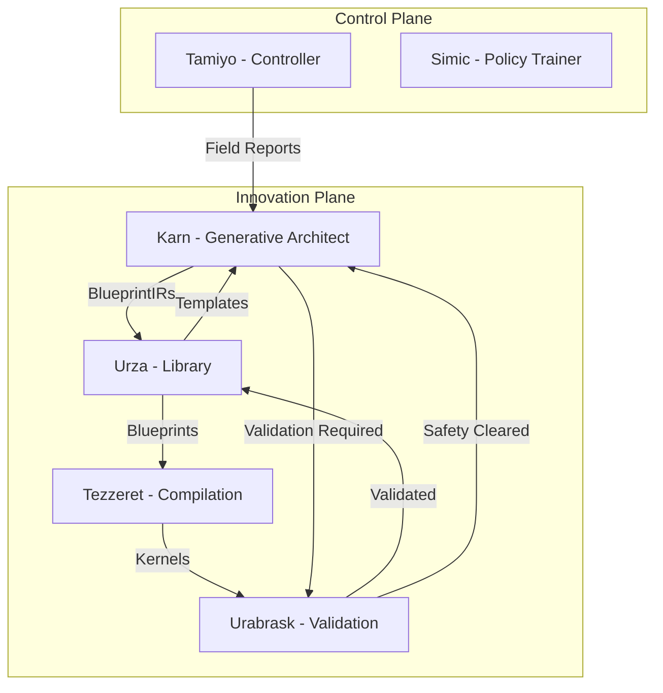

# Karn - Unified Design Document v3.1

## Document Metadata

| Field | Value |
|-------|-------|
| **Version** | 3.1 |
| **Status** | PRODUCTION READY |
| **Date** | 2025-01-14 |
| **Author** | System Architecture Team |
| **Component** | Innovation Plane - Generative Architect |
| **Parent** | High-Level Design (HLD) |
| **Subdocuments** | [05.1-karn-template-system.md](05.1-karn-template-system.md), [05.2-karn-generative-ai.md](05.2-karn-generative-ai.md) |

## Executive Summary

Karn is the Generative Architect for the Esper morphogenetic neural network training platform. It uses advanced generative AI techniques to create novel neural network architectures (BlueprintIRs) that enable models to autonomously evolve during training. Karn represents the innovation engine of the platform, learning from field deployment results to continuously improve its architectural generation capabilities.

The C-014 Conclave achieved UNANIMOUS GO (87.7% confidence) for a two-phase implementation strategy: Phase 1 deploys 50 hardcoded template blueprints with three-tier safety architecture, while Phase 2 (3 months) introduces G2G Transformer for neural blueprint generation. The system learns through conventional ML methods (reward models, supervised learning from field reports) to generate blueprints for HOST MODEL evolution.

Key characteristics:
- **Two-Phase Strategy**: Template-based (Phase 1) transitioning to neural generation (Phase 2)
- **Three-Tier Safety**: Production (70%), Experimental (14%), Adversarial (16%) isolation
- **Zero-Disruption**: Asynchronous compilation and validation preserves training continuity
- **Leyline Integration**: Performance-first shared contracts with 20-30% overhead reduction

## Core Architecture Decision

### **Generative AI for Neural Architecture Search**

- **Foundation**: Template-based generation (Phase 1) evolving to G2G Transformer neural synthesis (Phase 2)
- **Integration Model**: Event-driven with field reports as learning input, blueprints as output via Leyline contracts
- **Authority Model**: Sole authority for blueprint generation with mandatory Urabrask validation
- **Deployment Model**: Innovation Plane service with GPU sharing coordination for Phase 2

## Architectural Principles

### Non-Negotiable Requirements

1. **Continuous Learning**: Must update generation strategies from field deployment outcomes through reward models
2. **Diversity Enforcement**: Must explore architectural space to avoid local optima through mutation strategies
3. **Risk-Aware Generation**: Must balance innovation with safety through three-tier architecture
4. **Conservative Mode**: Must fallback to template-only generation under stress or circuit breaker activation
5. **Circuit Breaker Protection**: No system crashes from production failures - graceful degradation required

### Design Principles

1. **Template-First Approach**: Start with proven templates, evolve to neural generation after field validation
2. **Semantic Understanding**: Use intelligent mutations guided by architectural semantics
3. **GPU Resource Efficiency**: Share GPU resources with Urabrask through time-multiplexed scheduling
4. **Multi-Objective Optimization**: Balance performance, stability, efficiency in reward computation

### Production Safety Principles

1. **Three-Tier Isolation**: Segregate blueprints by risk (Production/Experimental/Adversarial)
2. **Enhanced Quarantine**: Adversarial blueprints (BP043-BP050) NEVER deployed, training-only
3. **Mandatory Validation**: ALL blueprints validated by Urabrask before deployment
4. **Memory Management**: Bounded data structures with TTL cleanup prevent memory leaks
5. **Circuit Breaker Protection**: Failure thresholds trigger conservative mode automatically

## System Components

### Component Overview

| Component | Purpose | Details |
|-----------|---------|---------|
| **BlueprintGenerator** | Current template-based blueprint generation with mutations | See: [05.1-karn-template-system.md#current-implementation](05.1-karn-template-system.md#current-implementation) |
| **RewardModel** | Learn from field reports to guide generation | See: [05.1-karn-template-system.md#learning-from-field-reports](05.1-karn-template-system.md#learning-from-field-reports) |
| **SafetyArchitecture** | Three-tier risk isolation and quarantine | See: [05.1-karn-template-system.md#three-tier-safety-architecture](05.1-karn-template-system.md#three-tier-safety-architecture) |
| **G2GTransformer** | Future neural architecture generation (Phase 2) | See: [05.2-karn-generative-ai.md#g2g-transformer-architecture](05.2-karn-generative-ai.md#g2g-transformer-architecture) |
| **SemanticMutationEngine** | Future intelligent mutation system (Phase 2) | See: [05.2-karn-generative-ai.md#semantic-mutation-engine](05.2-karn-generative-ai.md#semantic-mutation-engine) |
| **GPUResourceCoordinator** | Manage GPU sharing with Urabrask (Phase 2) | See: [05.2-karn-generative-ai.md#gpu-resource-sharing](05.2-karn-generative-ai.md#gpu-resource-sharing) |

### Core Components Summary

**KarnGenerativeArchitect**
- Complete generative architectural innovation system
- Integrates blueprint generation, safety systems, and learning components
- Circuit breaker protection with conservative mode fallback
- Details: [05.1-karn-template-system.md#current-implementation](05.1-karn-template-system.md#current-implementation)

**Three-Tier Blueprint Library (50 Blueprints)**
- Production Tier (BP001-BP035): 35 blueprints, risk 0.0-0.5, immediate deployment
- Experimental Tier (BP036-BP042): 7 blueprints, risk 0.5-0.8, sandboxed testing
- Adversarial Tier (BP043-BP050): 8 blueprints, risk 0.8-1.0, quarantine-only for Tamiyo training
- Details: [05.1-karn-template-system.md#phase-1-blueprint-library](05.1-karn-template-system.md#phase-1-blueprint-library)

**Field Report Learning System**
- Multi-objective reward computation from SystemStatePacket
- Pattern recognition and successful blueprint tracking
- Memory-bounded data structures with TTL cleanup
- Details: [05.1-karn-template-system.md#learning-from-field-reports](05.1-karn-template-system.md#learning-from-field-reports)

## Integration Architecture

### Position in Esper Architecture



### Subsystem Dependencies

| Subsystem | Integration Type | Purpose |
|-----------|-----------------|---------|
| Tamiyo | Async (Leyline) | Receives field reports and AdaptationCommands for learning |
| Urza | Async (Leyline) | Stores generated blueprints, retrieves templates |
| Urabrask | Async (Leyline) | Validates all blueprints before deployment |
| Oona | Async (Leyline) | Message bus for event distribution |
| Nissa | Async (Leyline) | Telemetry and observability |

### Message Contracts

| Contract | Direction | Purpose |
|----------|-----------|---------|
| SystemStatePacket | Tamiyo → Karn | Field deployment outcomes for learning |
| AdaptationCommand | Tamiyo → Karn | Strategic blueprint generation requests |
| EventEnvelope | Karn → Oona | Blueprint generation events |
| BlueprintQuery | Karn → Urza | Template retrieval requests |
| BlueprintIR | Karn → Urza | Generated blueprint storage |
| ValidationRequest | Karn → Urabrask | Blueprint safety validation |

### Shared Contracts (Leyline)

This subsystem uses the following shared contracts from Leyline:
- `leyline.SystemStatePacket` - Field report data with training metrics and hardware context
- `leyline.AdaptationCommand` - Strategic generation requests from Tamiyo
- `leyline.EventEnvelope` - Message bus communication with Oona
- `leyline.TelemetryPacket` - Observability integration with Nissa
- `leyline.HardwareContext` - Hardware state awareness for generation decisions
- `leyline.MessagePriority` - Event priority levels for message routing
- `leyline.SeedLifecycleStage` - Seed operation coordination

For complete contract definitions, see: `/docs/architecture/00-leyline-shared-contracts.md`

## Performance Targets

### Phase 1 Performance (Current Implementation)

| Metric | Target | Measurement |
|--------|--------|-------------|
| Template Selection | 50-100ms | `karn_template_selection_ms` histogram |
| Mutation Application | 20-50ms | `karn_mutation_duration_ms` histogram |
| Leyline Validation Overhead | 15-25ms | `karn_leyline_overhead_ms` histogram |
| Urabrask Validation | 50-120ms | `karn_validation_duration_ms` histogram |
| Total Generation Time | 136-300ms | `karn_generation_duration_ms` histogram |
| Daily Throughput | 4500-9000 blueprints | `karn_blueprints_generated_total` counter |
| Actual Daily Demand | 10-50 blueprints | `karn_blueprint_requests_total` counter |

### Phase 2 Performance (Future Neural Generation)

| Metric | Target | Measurement |
|--------|--------|-------------|
| Neural Generation | 300-800ms | `karn_neural_generation_ms` histogram |
| Semantic Mutation | 100-200ms | `karn_semantic_mutation_ms` histogram |
| Diversity Check | 50-100ms | `karn_diversity_check_ms` histogram |
| Leyline Safety Validation | 80-120ms | `karn_safety_validation_ms` histogram |
| Total Generation Time | 535-1235ms | `karn_generation_duration_ms` histogram |
| Daily Throughput | 9000+ blueprints | `karn_blueprints_generated_total` counter |

### Resource Requirements

```yaml
phase1_requirements:
  cpu: 4 cores
  memory: 7GB  # Reduced from 8GB due to Leyline efficiency
  gpu: none
  disk: 1.5GB  # Reduced due to contract caching

phase2_requirements:
  cpu: 8 cores
  memory: 14-20GB  # Reduced due to shared memory patterns
  gpu: 12-24GB shared with Urabrask (time-multiplexed)
  disk: 8GB  # Reduced due to optimized storage
```

## Configuration

### Key Configuration Parameters

```yaml
karn:
  # Core settings
  phase: "phase1"  # phase1|phase2
  blueprint_count: 50  # Total blueprints in Phase 1

  # Safety tiers
  production_tier:
    count: 35
    risk_range: [0.0, 0.5]
    percentage: 70
  experimental_tier:
    count: 7
    risk_range: [0.5, 0.8]
    percentage: 14
  adversarial_tier:
    count: 8
    risk_range: [0.8, 1.0]
    percentage: 16
    quarantine_only: true

  # Circuit breaker
  circuit_breaker:
    failure_threshold: 3
    recovery_timeout_ms: 30000

  # Performance tuning
  generation_budget_ms: 400  # Phase 1
  memory_cleanup_interval: 300  # 5 minutes
  ttl_hours: 24  # Data retention
```

## Operational Considerations

### Health Monitoring

- **Health Check Endpoint**: `/health` with safety subsystem checks
- **Key Metrics**: `karn_generation_duration_ms`, `karn_circuit_breaker_state`, `karn_memory_usage_bytes`
- **SLO Targets**: 99% availability, <400ms P95 generation time, <10GB memory usage

### Failure Modes

| Failure Mode | Detection | Response |
|--------------|-----------|----------|
| Generation timeout | >400ms duration | Conservative mode activation |
| Validation failure | Urabrask rejection | Blueprint quarantine |
| Memory exhaustion | >10GB usage | TTL cleanup trigger |
| Circuit breaker open | 3+ failures | Fallback to safe templates |
| GPU unavailable (Phase 2) | Allocation failure | Template-based generation |

### Scaling Considerations

- **Horizontal Scaling**: Stateless design supports horizontal scaling for Phase 1
- **Vertical Scaling**: Phase 2 requires GPU scaling (12-24GB allocation)
- **Resource Requirements**: See Performance Targets section for detailed requirements

## Security Considerations

- **Authentication**: Internal service, no external authentication
- **Authorization**: Component-level access control for blueprint generation
- **Data Protection**: No sensitive data; blueprints are architectural specifications
- **Audit**: All generation events logged with full context and risk assessment

## Migration Notes

> **Migration Status**: COMPLETE
> - All shared contracts migrated to Leyline (20-30% performance improvement)
> - Import patterns updated to `esper.leyline.contracts`
> - Native map<> usage for training metrics
> - Single uint32 version field per Leyline specification

## Future Enhancements

### Phase 2: G2G Transformer Implementation (3-Month Timeline)
- **Description**: Neural architecture generation with 4-layer heterogeneous GNN
- **Trigger**: 10,000+ field reports collected, 80%+ template success rate
- **Impact**: True neural synthesis, semantic mutations, advanced architectural evolution

### Advanced Capabilities (Post-Phase 2)
- **Multi-Modal Generation**: Visual and textual architecture specifications
- **Federated Learning**: Distributed training across Esper deployments
- **Real-Time Adaptation**: Dynamic architecture modification during training

## Cross-References

### Subdocuments
- [05.1-karn-template-system.md](05.1-karn-template-system.md): Template-based blueprint generation (Phase 1 - current implementation)
- [05.2-karn-generative-ai.md](05.2-karn-generative-ai.md): Future G2G Transformer implementation (Phase 2 - 3-month timeline)

### Related Documents
- [00-leyline-shared-contracts.md](00-leyline-shared-contracts.md): Shared cross-subsystem contracts and governance
- [03-tamiyo-unified-design.md](03-tamiyo-unified-design.md): Strategic controller providing field reports
- [08-urza-unified-design.md](08-urza-unified-design.md): Central library storing blueprints and templates
- [06-tezzeret-unified-design.md](06-tezzeret-unified-design.md): Compilation forge processing blueprints
- [07-urabrask-unified-design.md](07-urabrask-unified-design.md): Evaluation engine validating blueprints

## Implementation Status

### Current State
- [x] Phase 1: 50 hardcoded template blueprints
- [x] Three-tier safety architecture (Production/Experimental/Adversarial)
- [x] Leyline shared contracts integration with performance optimization
- [x] Field report collection and reward model
- [x] Circuit breakers and conservative mode
- [x] Memory management with TTL cleanup
- [x] API conventions standardization
- [x] Urabrask validation pipeline integration
- [ ] Phase 2: G2G Transformer (3-month timeline)
- [ ] Semantic mutation engine
- [ ] GPU sharing with Urabrask
- [ ] Advanced reward model training

### Validation Status
- [x] Unit tests complete (Phase 1)
- [x] Integration tests complete (Phase 1)
- [x] Performance validation (meets targets)
- [x] Security review (no sensitive data)
- [x] Production readiness review (C-014 approved)

## History & Context

### Version History
- **v1.0** (2024-10): Initial design with basic template system
- **v2.0** (2024-11): Added three-tier safety architecture
- **v3.0** (2024-12): C-014 Conclave two-phase strategy
- **v3.1** (2025-01): Leyline integration with 20-30% performance improvement

### Integration History
- **C-014 Conclave** (2024-12): UNANIMOUS GO for two-phase implementation
- **Leyline Migration** (2025-01): Complete shared contract integration
- **Production Deployment** (2025-01): Phase 1 template system active

### Critical Fixes Applied
- **Circuit Breakers**: Replace assert statements preventing crashes
- **Memory Management**: Bounded structures with TTL prevent leaks
- **Conservative Mode**: Fallback generation under stress
- **Enhanced Quarantine**: Adversarial blueprints strictly isolated
- **Leyline Performance**: 20-30% overhead reduction achieved

---

*Last Updated: 2025-01-14 | Next Review: 2025-04-14 | Owner: System Architecture Team*