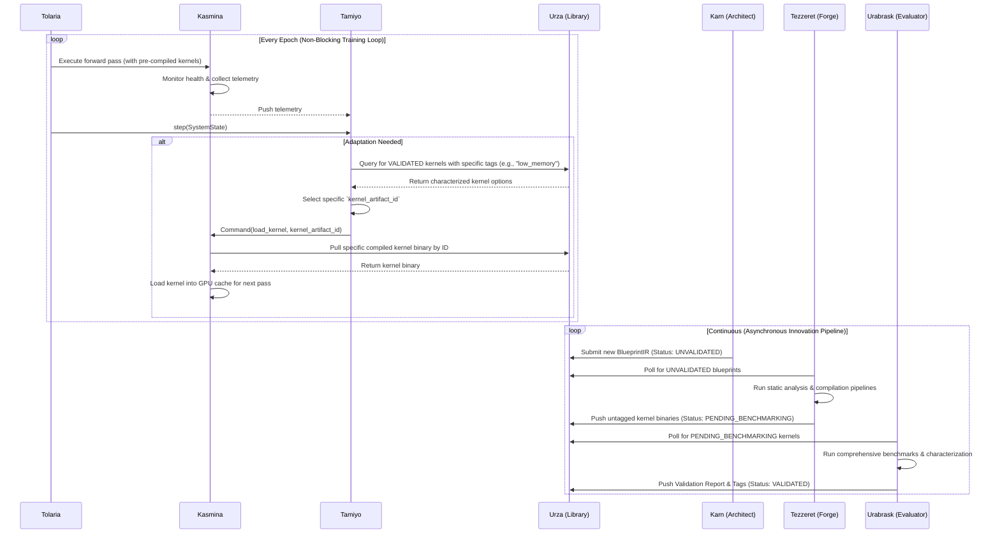
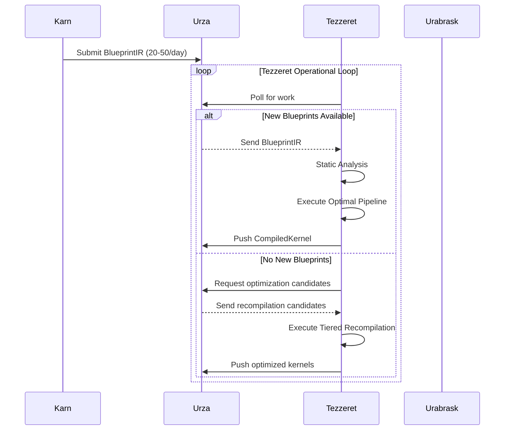

# Esper HLD - System Design & Data Flow

**Context:** This is part 6 of the Esper High Level Design document breakdown. Complete reference: `/home/john/esper/docs/architecture/hld-sections/`

**Cross-References:**
- Previous: [Reference Architecture Overview](./005-reference-architecture-overview.md)
- Next: [Component Specifications](./007-component-specifications.md)
- Related: [Data Contracts & API Specifications](./008-data-contracts-api-specifications.md)
- Appendices: [Appendices and Technical Details](./009-appendices-technical-details.md)

---

## 5. Architecture Principles & Patterns

The design of a system capable of autonomous neural network evolution demands a principled approach that transcends traditional software engineering practices. An architecture based on this framework emerges from the intersection of distributed systems theory, machine learning research, and biological inspiration, synthesizing insights from each domain. This section articulates the fundamental principles, patterns, and standards that should govern the design and implementation of any such system.

These architectural decisions are not merely technical choices but reflect deep commitments to safety, scientific rigor, and operational excellence. By establishing clear principles and adhering to proven patterns, a system can be built to safely navigate the uncharted territory of morphogenetic computing while remaining comprehensible, maintainable, and extensible. The architecture must simultaneously support cutting-edge research experimentation and production-grade reliability—a duality that influences every design decision documented herein.

### 5.1. Core Principles

A morphogenetic architecture should be governed by seven foundational principles that ensure the system remains safe, effective, and scientifically rigorous throughout its operation. These principles emerge from the fundamental tension between enabling dynamic structural evolution and maintaining the predictability required for production deployment. Together, they form the philosophical backbone that guides platform design.

1. **Separation of Concerns**
   - Execution (`Kasmina`) is isolated from strategy (`Tamiyo`).
   - Innovation (`Karn`) is decoupled from operations.
   - **Compilation (`Tezzeret`) and Validation (`Urabrask`) are performed in an asynchronous pipeline, completely separate from the execution layer (`Kasmina`).**
   - Each subsystem should have a single, well-defined responsibility.

2. **Zero-Disruption Training**
   - The primary training loop must never be blocked by expensive, non-essential operations.
   - All blueprint compilation, optimization, and characterization is offloaded to asynchronous background services.
   - This ensures predictable training schedules and preserves the model's learning momentum, which is critical for achieving stable convergence.

3. **Integrity First**
   - A **rigorous, multi-stage validation pipeline** must occur before any compiled artifact has production impact.
   - The system must support automatic rollback upon detecting instability.
   - Default behaviors should be conservative and favor stability over aggressive adaptation.

4. **Evolutionary Design**
   - The system must enable continuous learning from operational outcomes for all intelligent agents.
   - `Tamiyo` and `Karn` learn from `FieldReports`, while `Tezzeret` and `Urabrask` learn from compilation and benchmarking results to improve their respective processes.
   - Mechanisms should exist to preserve architectural diversity and prevent premature convergence.

5. **Operational Transparency**
   - All architectural modifications must be traceable to a specific trigger and decision.
   - The state of all assets—from `BlueprintIR` to `CompiledKernelArtifact`—should be observable in real-time.
   - Comprehensive audit trails are required for analysis and accountability.

6. **Phased Implementation & Progressive Complexity**
   - The framework is designed to be realized in phases. **Phase 1** focuses on validating the core morphogenetic mechanics on smaller models within a **single-server environment**.
   - The logical architecture is designed from the outset to support future distribution, but the initial physical deployment prioritizes simplicity and rapid validation.
   - **Phase 2** has been completed with production-ready intelligence systems. Future phases will address full distribution, high-throughput performance, and enterprise-grade hardening.

7. **Designed for Extensibility**
   - The system must be designed with clear extension points.
   - Core components should be swappable. For example, the `Strategic Controller` should be able to test different selection policies, and the `Generative Architect` should support different generative models.
   - Adding support for new hardware backends or deep learning frameworks should not require a fundamental re-architecture.

### 5.2. Design Patterns

The implementation of morphogenetic architectures requires sophisticated coordination between components. The following design patterns provide proven solutions to recurring challenges, from managing asynchronous communication to ensuring deterministic state transitions. These patterns were selected for their ability to make the complex interactions within a morphogenetic system comprehensible, debuggable, and extensible.

- **Event-Driven Architecture:** For loose coupling via asynchronous message passing and creating a complete, auditable system history through event sourcing. This is essential for the asynchronous compilation pipeline.
- **State Machine Pattern:** To ensure deterministic lifecycle transitions for each `Seed`, `BlueprintIR`, and `CompiledKernelArtifact`, with explicit validation at state boundaries.
- **Strategy Pattern:** To allow for pluggable behaviors, such as different `Grafting Strategies` or `Blueprint` selection policies for the controller.
- **Observer Pattern:** To enable non-blocking, real-time telemetry streaming from `Seeds` to multiple consumers (e.g., the controller and observability platform).

### 5.3. Reference Technology Stack

The following technology stack is recommended for a reference implementation (like `Esper`) to balance research flexibility with production readiness. Each technology choice reflects specific requirements emerging from the unique challenges of adaptive neural architectures.

#### 5.3.1. Core Runtime

- **Language**: Python (`~3.12` or later) for its rich scientific ecosystem.
- **Deep Learning Framework**: PyTorch (`~2.7` or later) for its dynamic graph manipulation capabilities.
- **Type System**: Pydantic for runtime data validation and clear schema enforcement.

#### 5.3.2. Scientific Computing & Experimentation

- **Numerical**: NumPy for efficient array operations.
- **Machine Learning**: Scikit-learn for evaluation metrics and classical ML models.
- **Configuration**: YAML for human-readable experiment configuration.
- **Tracking & Visualization**: MLflow for experiment tracking and TensorBoard for real-time metrics.
- **Data Versioning**: DVC for creating reproducible data pipelines.

#### 5.3.3. System Infrastructure

- **API Framework**: FastAPI for high-performance, async-native REST endpoints.
- **ASGI Server**: Uvicorn for production-grade serving of async applications.
- **Metrics**: Prometheus client libraries for standardized observability.
- **CLI**: Rich for creating powerful and user-friendly command-line interfaces.

#### 5.3.4. Messaging System

- **Phase 1 (Single-Node):** Redis Streams, for its simplicity, persistence, and ordering guarantees in a single-node setup.
- **Phase 2 (Distributed):** Apache Pulsar, for its multi-tenancy, geo-replication, built-in schema registry, and tiered storage, which are highly advantageous for a scaled-out, multi-tenant morphogenetic system.

#### 5.3.5. Persistence & Storage

- **Metadata Store:** PostgreSQL (`~16` or later), for its robust transactional support and relational integrity, ideal for tracking the complex lineage of `Blueprints` and `Kernels`.
- **Artifact Store:** S3-compatible object storage (e.g., MinIO), for storing large, immutable binary artifacts like model checkpoints and compiled kernels in a scalable, environment-agnostic way.
- **Caching & Volatile Storage:** Redis, for high-speed access to frequently requested data, such as hot kernel metadata or for use as the Phase 1 message broker.

#### 5.3.6. Protocol Standards

- **Inter-component**: JSON for debugging transparency, with Protobuf as a production optimization.
- **Metrics**: OpenMetrics / Prometheus exposition format.
- **API**: OpenAPI 3.0 specification.

### 5.4. Architectural Patterns

Beyond the component-level design patterns, a robust implementation should employ several higher-level architectural patterns to shape the overall system structure and information flow.

- **Hexagonal Architecture:** To keep the core domain logic (the morphogenetic algorithms) independent of infrastructure (databases, message brokers), making it highly testable.
- **Repository Pattern:** To abstract the storage of `Blueprints`, `CompiledKernelArtifacts`, and model checkpoints, allowing for pluggable backends (e.g., local filesystem, PostgreSQL/S3).
- **Command Query Responsibility Segregation (CQRS):** To create separate, optimized paths for state-changing commands (e.g., `germinate`, `submit_for_compilation`) and state-reading queries (e.g., system telemetry, `query_kernels_by_tag`).
- **Circuit Breaker Pattern:** To prevent cascading failures between distributed components, especially during high-load operations like blueprint testing or policy training.

## 6. System Architecture of the Reference Implementation

The translation of morphogenetic principles into a functioning system requires careful orchestration of complex interactions between autonomous components. This chapter details how the `Esper` reference architecture, with its twelve specialized subsystems, coordinates to achieve controlled structural evolution while maintaining system integrity and operational safety.

This architecture is designed to solve the fundamental challenges of morphogenetic computing: maintaining consistency when the computational graph itself is mutating, ensuring deterministic behavior when components operate asynchronously, and creating robust feedback loops that enable learning without compromising stability. A core tenet of this design is the complete separation of the high-latency, resource-intensive process of blueprint compilation from the main training loop, ensuring **zero training disruption**. By examining the component interactions, data flows, and state management strategies, we reveal how theoretical concepts manifest as concrete system behaviors. The architecture presented here represents a tangible blueprint for realizing the morphogenetic framework.

### 6.1 Component Interaction Model

The choreography of interactions between Esper's subsystems follows a dual-track protocol. The **Training & Adaptation Loop** operates on a fast, epoch-aligned cadence, while the **Innovation & Compilation Loop** runs fully asynchronously in the background. This ensures the training process is never blocked.

The sequence diagram below captures this dual-loop model. The top half shows the continuous, non-blocking training and adaptation cycle. The bottom half shows the parallel, asynchronous pipeline that prepares new architectural solutions for deployment.



The enhanced Tezzeret workflow is shown below, illustrating how it interacts with the `Urza` library to compile and validate new architectural designs. This asynchronous compilation pipeline operates independently of the main training loop, ensuring that kernel compilation does not block training progress.



### 6.2 Data Flow Architecture

The movement of information through Esper follows four distinct pathways, each optimized for its purpose. These flows embody the principle of separation of concerns, ensuring that high-frequency monitoring data, discrete control commands, asynchronous innovation feedback, and the new compilation pipeline traverse independent channels.

### 6.3 Backpressure Handling & Flow Control

Critical to the system's stability is a comprehensive backpressure handling mechanism that prevents cascading failures during high-load operations. The Innovation Plane's asynchronous pipeline includes sophisticated queue management and load shedding capabilities.

#### 6.3.1 Queue Management Policy

**Queue Depth Limits:**
```yaml
async_pipeline_queues:
  karn_to_tezzeret: 100    # Blueprint generation queue
  tezzeret_to_urabrask: 50 # Compilation queue  
  urabrask_validation: 25   # Validation queue
  urza_storage: 200        # Artifact storage queue
```

**Overflow Behavior:**
- Queue full → Drop lowest priority items
- Make room for higher priority items  
- Notify upstream services of capacity reduction

#### 6.3.2 Load Shedding Strategy

**5-Tier Priority System:**
```yaml
priorities:
  0: Emergency      # Always accepted, never dropped
  1: Strategic      # Tamiyo interest score >0.8  
  2: Normal         # Standard adaptation requests
  3: Experimental   # Exploration and testing
  4: Background     # Recompilation and maintenance
```

**Starvation Prevention:**
- Items >5 minutes old get priority boost
- Prevents indefinite queuing of lower priorities

#### 6.3.3 Circuit Breaker Configuration

**Service-Specific Breakers:**
```yaml
circuit_breakers:
  tezzeret_compilation:
    failure_threshold: 5
    recovery_timeout: 60s
    
  urabrask_validation:  
    failure_threshold: 3
    recovery_timeout: 30s
    
  urza_storage:
    failure_threshold: 10
    recovery_timeout: 120s
```

#### 6.3.4 Cross-Plane Coordination

**Innovation Plane Capacity Factors:**
```python
capacity_factors = {
    'normal': 1.0,      # Full capacity
    'degraded': 0.7,    # Moderate load  
    'overloaded': 0.3,  # High load
    'emergency': 0.1    # Crisis mode - emergency only
}
```

**Tamiyo Coordination:**
- Real-time capacity updates
- Adaptation decision adjustments  
- Graceful degradation recommendations

The backpressure system ensures that under high load, the Innovation Plane gracefully degrades performance while maintaining critical functionality, preventing system-wide failure and preserving the zero training disruption guarantee.