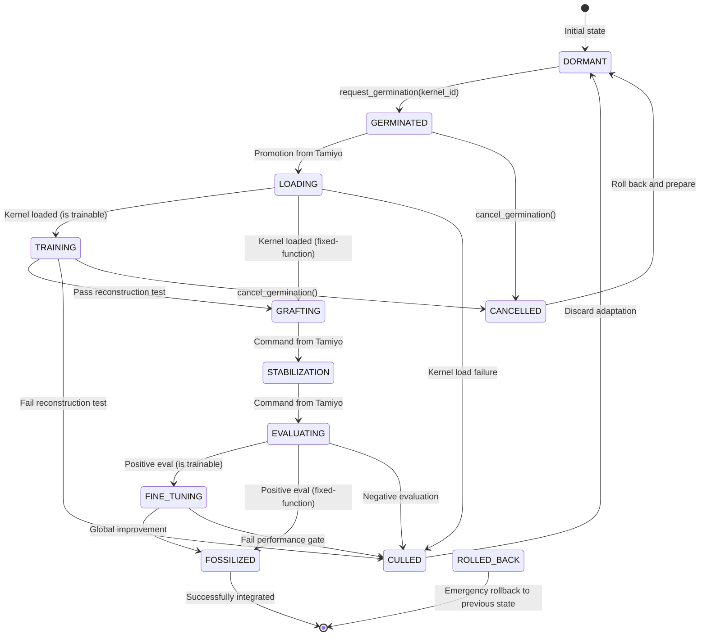

# Esper HLD - Appendices & Technical Details

**Context:** This is part 9 (final) of the Esper High Level Design document breakdown. Complete reference: `/home/john/esper/docs/architecture/hld-sections/`

**Cross-References:**
- Previous: [Data Contracts & API Specifications](./008-data-contracts-api-specifications.md)
- Architecture: [Reference Architecture Overview](./005-reference-architecture-overview.md)
- Components: [Component Specifications](./007-component-specifications.md)

---

## 11. Infrastructure & Deployment

The `Esper` reference architecture is designed to be deployed in distinct phases, moving from a simplified single-node environment for initial validation (Phase 1) to a fully distributed, scalable, and resilient architecture for production use (Phase 2). This chapter details the deployment topology, hardware requirements, and scalability strategy for both phases, incorporating the asynchronous compilation pipeline that is central to the platform's design.

## 12. Development Roadmap

This chapter outlines the development plan for the `Esper` reference implementation, reflecting the "Phased Implementation" principle. The roadmap is divided into the current state, near-term goals focused on completing the Phase 1 MVP, and a long-term vision for building out the distributed, production-ready Phase 2 system.

### 12.1 Current State (As of June 2025)

The project has successfully established its foundational architecture and initial capabilities. The following milestones have been achieved:

- **Foundational Concepts Validated:** The core morphogenetic concepts have been implemented and tested on toy models, demonstrating the feasibility of the architecture.
- **Core Architecture Designed:** The logical architecture and data models for all eleven subsystems (`Tolaria`, `Kasmina`, `Tezzeret`, etc.) have been specified.
- **Heuristic Policies Operational:** `Tamiyo` is operational with a v1.0 heuristic-based policy, capable of executing the full germination lifecycle based on simple, threshold-based triggers.
- **Single-Node Deployment Functional:** A Phase 1 single-node deployment using `docker-compose` is functional. This setup can run the end-to-end morphogenetic process on toy models (e.g., MLPs on `make_moons`).
- **Initial Blueprint Library Established:** An initial `Urza` blueprint library containing a catalogue of standard, human-designed primitives (e.g., residual blocks, attention heads) has been created and can be queried.

### 12.2 Near-Term Goals: Phase 1 Completion (3-Month Roadmap)

The primary objective for the next quarter is to deliver a robust, functional MVP that validates the core asynchronous compilation and execution pipeline, ensuring zero training disruption. This prioritizes establishing the foundational infrastructure required for stable morphogenetic evolution.

- **Month 1: Foundation for Asynchronous Compilation**
  - **`Tezzeret`:** Implement the basic background compilation service. It will perform initial static validation and a single, `FAST` compilation pass for each blueprint.
  - **`Urza`:** Enhance to function as the central asset hub, storing both `BlueprintIRs` and `CompiledKernelArtifacts`. Pre-load with a standard set of 5-10 human-designed blueprints.
  - **`Karn`:** Implement as a stubbed, no-op "listener" service that logs incoming `FieldReports` to build a dataset for future training, but does not generate new blueprints.
  - **`Kasmina`:** Begin refactoring to remove all JIT compilation logic and implement the kernel artifact consumption interface.

- **Month 2: End-to-End Kernel Execution & Validation**
  - **Integration:** Complete the integration of the full asynchronous pipeline. `Kasmina` will be a pure executor, loading pre-compiled kernels from `Urza` based on commands from `Tamiyo`.
  - **`Urabrask`:** Implement the initial "Gatekeeper" functionality, performing basic runtime validation to ensure compiled kernels from `Tezzeret` execute without errors before they are marked as `VALIDATED`.
  - **Benchmarking:** Conduct comprehensive benchmarks of the new execution layer, validating the "Performance & Scalability" targets for kernel loading and demonstrating zero compilation-related pauses in the `Tolaria` training loop.

- **Month 3: Hardening, Policy Integration & Documentation**
  - **`Simic` & `Tamiyo`:** Begin training the initial GNN-based `Tamiyo` policy by imitating the v1.0 heuristic policy's decisions, now using the stable, pre-compiled kernels.
  - **Security:** Implement the baseline security architecture for the Phase 1 deployment, including authentication for all APIs and strict validation of all external inputs.
  - **Testing:** Develop a comprehensive integration and end-to-end testing suite for the full asynchronous pipeline.
  - **Documentation:** Finalize the v1.0 documentation, including detailed API references for the new component interactions and user guides for the Python SDK.
  - **Goal:** Achieve all defined Phase 1 validation criteria, proving the viability of the core morphogenetic mechanics in a controlled, non-disruptive environment.

### 12.3 Long-Term Vision: Phase 2 Build-Out (12-Month Roadmap)

The long-term vision focuses on evolving `Esper` from a validated MVP into a robust, scalable, and fully-featured distributed platform, progressively enabling full autonomy.

- **Q3 2025: Foundation for Distribution & Advanced Compilation**
  - **Infrastructure:** Begin the Phase 2 build-out by implementing the Kubernetes deployment architecture on a cloud provider.
  - **Data Services:** Migrate the `Urza` backend from SQLite/local files to a managed PostgreSQL instance and S3 object storage. Deploy a production-grade `Oona` message bus using Apache Pulsar.
  - **`Tezzeret`:** Enable the "Multi-Objective Forge" capability, allowing it to generate a rich portfolio of kernel variants targeting `speed`, `memory`, and `power`.
  - **CI/CD:** Establish a full CI/CD pipeline for automated testing and deployment of the containerized subsystems.

- **Q4 2025: Scalability & Production Hardening**
  - **`Urabrask`:** Mature into the "Characterization Engine" by implementing comprehensive benchmarking and the ability to generate empirical tags (`low_memory`, `high_speed`).
  - **Security:** Implement the full distributed security model, including a service mesh (e.g., Istio) for mTLS and fine-grained network policies.
  - **Scalability:** Implement autoscaling for `Tezzeret` and `Urabrask` workers using KEDA.
  - **MLOps:** Mature the `Simic` policy training pipeline into a fully automated MLOps workflow for continuous improvement of the `Tamiyo` agent.

- **Q1 2026: Activating Autonomous Innovation**
  - **`Karn`:** Activate the fully generative `Karn` architect. It will begin consuming the historical `FieldReport` data to train its Reward Model and start submitting novel `BlueprintIRs` to `Urza`, kicking off the autonomous innovation loop.
  - **Multi-Model Support:** Onboard larger and more diverse model architectures, including Large Language Models (e.g., Llama-class models) and Vision Transformers.
  - **Observability:** Build out comprehensive `Nissa` dashboards to provide deep insights into the behavior of the learning-based agents and the evolutionary health of the blueprint library.

- **Q2 2026: Exploring the Frontier**
  - **Federated Learning Integration:** Begin research and prototyping for a Phase 3 capability to operate `Esper` in a federated learning setting, where adaptations are proposed centrally but executed securely on decentralized clients.
  - **AutoML Capabilities:** Explore deeper integration with AutoML pipelines, where `Karn` not only evolves sub-modules but can also propose modifications to the macro-architecture of the host model.
  - **Advanced Controllers:** Begin development on advanced controller features, such as the `Hierarchical Attentional Controller` for massive-scale models and `Temporal Graph Networks (TGNs)` for `Tamiyo` to better handle non-stationary environments.

## 13. Risk Assessment

A comprehensive risk assessment is essential for navigating the challenges inherent in developing a novel and complex platform like `Esper`. This chapter identifies potential risks and outlines the primary mitigation strategy for each.

### 13.1 Technical Risks

These are risks related to the technology, architecture, and implementation of the platform itself.

| Risk | Probability | Impact | Mitigation Strategy |
| :--- | :--- | :--- | :--- |
| **Unstable Adaptations** | Low | High | **Multi-stage Validation Pipeline:** The architecture mandates a rigorous, two-stage validation process. `Tezzeret` performs static analysis, and `Urabrask` performs comprehensive dynamic benchmarking on real hardware. A kernel artifact must be fully characterized and validated by `Urabrask` before it can ever be selected by `Tamiyo`, preventing unstable modules from being integrated. |
| **Control Policy Instability**| Medium | High | **Phased Curriculum & Safety Fallbacks:** `Tamiyo` and `Karn`'s neural policies are trained via the `Simic` curriculum, which safely builds complexity. `Tamiyo` also includes a heuristic fallback to veto any dangerous actions proposed by a nascent policy. |
| **Compilation Pipeline Backpressure** | Low | Medium | **Asynchronous Queuing & Elastic Scaling:** The pipeline is fully asynchronous. If `Karn` generates blueprints faster than `Tezzeret`/`Urabrask` can process them, they enter a queue in `Urza`. The `Tezzeret` and `Urabrask` services are designed as horizontally scalable worker pools that can be scaled up to meet demand. |
| **Kernel Cache Coherency** | Low | Medium | **Atomic, Versioned Artifacts:** All compiled kernels are stored in `Urza` as immutable artifacts with unique, hash-based IDs. `Kasmina` loads kernels by this specific ID, and `Urza` manages status updates atomically. This ensures `Kasmina` can never accidentally load a stale or partially-written kernel. |
| **Blueprint Quality Convergence** | Medium | Medium | **Diversity-Enforced Generation:** `Karn`'s `Diversity Sampler` actively monitors the genetic diversity of the `Urza` library and incentivizes the generation of "exotic" blueprints to prevent the system from settling on a local optimum. |
| **Graceful Rollback Failure**| Low | Critical | **Synchronized Checkpointing:** `Tolaria`'s checkpointing mechanism saves the state of *both* the host model and the `Tamiyo` controller in lockstep. This ensures that a rollback restores the entire system to a consistent state, preventing erroneous post-rollback decisions. |
| **Performance Regression** | Low | High | **Continuous Monitoring & Characterization:** The `Nissa` platform provides continuous monitoring of global model metrics. `Urabrask`'s rigorous characterization process provides strong empirical data on kernel performance before deployment, preventing regressions. |
| **Event Bus Saturation** | Low | Medium | **Batching & Scalable Tech:** `Kasmina` seeds batch their high-frequency telemetry before publishing. The choice of `Apache Pulsar` for the Phase 2 `Oona` message bus is specifically to handle high-throughput, multi-tenant workloads. |

### 13.2 Operational Risks

These are risks related to deploying, running, and maintaining the platform.

| Risk | Probability | Impact | Mitigation Strategy |
| :--- | :--- | :--- | :--- |
| **GPU Scarcity & Cost** | Medium | High | **Phased Implementation & Resource Pooling:** The Phase 1 single-node design minimizes initial hardware costs. The Phase 2 Kubernetes architecture uses resource pooling to efficiently schedule GPU-intensive `Karn` and `Tolaria` jobs, maximizing utilization of available hardware. The asynchronous `Tezzeret` pipeline can also be scheduled on cheaper, off-peak compute. |
| **High System Complexity** | High | Medium | **Modularity & High-Level SDK:** The system is designed with strong modularity and clear interfaces between the eleven subsystems. The researcher-facing Python SDK abstracts away most of the internal complexity, allowing users to leverage the system without needing to be experts in all of its parts. |
| **Difficult Onboarding for New Models** | Medium | Medium | **Standardized Wrapping Utility:** The framework provides an `esper.wrap()` utility designed to automatically inject `KasminaSeeds` into standard PyTorch layers (`nn.Linear`, `nn.Conv2d`, etc.), simplifying the process of making a new model "morphable." |
| **Difficulty Proving Value** | High | High | **Rigorous Benchmarking & Clear Use Cases:** The `Scientific Validation Criteria` (Chapter 3) define a set of concrete benchmarks to prove the system's parameter efficiency and performance gains over simpler methods. The initial focus is on domains where continuous adaptation is a clear requirement (e.g., edge AI, continual learning). |

## Appendix A: Glossary

This glossary defines key terms and concepts used throughout the `Esper` architecture documentation. It serves as a reference for understanding the specialized vocabulary associated with the platform.

| Term | Definition |
| :--- | :--- |
| **AdaptationSignal** | A data structure returned by `Tamiyo` to `Tolaria` after its end-of-epoch `step`, indicating if an optimizer rebuild or emergency rollback is required. |
| **Blueprint** | A high-level concept for a self-contained, versioned, and validated neural network module with a standardized interface, designed to be grafted into a host model. It is represented as a `BlueprintIR`. |
| **BlueprintIR** | (Blueprint Intermediate Representation) The pure, un-compiled architectural design of a blueprint. This is the artifact generated by `Karn` and submitted to `Urza`. |
| **Chunk** | A contiguous slice of neurons or a feature dimension within a model layer that is monitored and operated upon by a single `Seed`. |
| **CompiledKernelArtifact**| The final, runnable binary artifact generated by `Tezzeret` from a `BlueprintIR`. It is validated by `Urabrask` and stored in `Urza` for execution by `Kasmina`. |
| **conf_level** | (Confidence Level) A qualitative tag ('High', 'Moderate', 'Speculative') assigned by `Urabrask` to a `Blueprint`, derived from its `risk_score` to guide deployment decisions. |
| **CQRS** | (Command Query Responsibility Segregation) An architectural pattern that separates state-changing operations (Commands, e.g., `germinate`) from state-reading operations (Queries, e.g., health telemetry). |
| **Culling** | The lifecycle outcome where a failed or underperforming adaptation and its associated `Blueprint` are deactivated and discarded. |
| **EWC** | (Elastic Weight Consolidation) A continual learning technique used to prevent catastrophic forgetting by regularizing changes to weights important for previous tasks. Used by `Simic` to train policies. |
| **FieldReport** | A data structure sent from `Tamiyo` to `Karn` containing the real-world performance outcome (e.g., `FOSSILIZED`, `CULLED`) of a deployed `Blueprint`, serving as a key reinforcement learning signal. |
| **Frozen Base** | The host network, whose parameters are held constant during the local training of a germinated Blueprint. This ensures gradient isolation but does not preclude the host model from being concurrently trained by the main Tolaria orchestrator. |
| **Gradient Isolation** | The architectural principle ensuring that gradients from control system training (Tamiyo, Simic, Karn) NEVER flow back into Model Alpha, and gradients from Model Alpha training never affect control systems. This maintains clean separation between the evolving host network and the static control plane. |
| **Fossilization** | The lifecycle outcome where a successful adaptation's parameters are permanently frozen and integrated into the host model. |
| **Generative Architect** | The conceptual role of the `Karn` subsystem, responsible for autonomously inventing and refining novel `Blueprint` architectures, producing `BlueprintIRs`. |
| **Germination** | The process by which a `Seed` initiates its lifecycle, instantiating and preparing a new `Blueprint` for integration into the host model in response to a command from `Tamiyo`. |
| **GNN** | (Graph Neural Network) A type of neural network designed to operate on graph-structured data. Used by `Tamiyo` to model the host network and by `Karn` for its Reward Model. |
| **Grafting** | The delicate process of integrating a trained `Blueprint` into the host network's computational graph, typically managed by a smooth blending strategy. |
| **Karn** | The **Generative Architect** subsystem. It functions as the platform's R&D engine, responsible for the evolutionary design of new `BlueprintIRs`. |
| **Kasmina** | The **Execution Layer** subsystem. It is a pure executor that loads and runs pre-compiled, validated `CompiledKernelArtifacts` provided by `Urza` with maximum performance. |
| **Lifecycle** | The 11-stage state machine (`DORMANT`, `TRAINING`, `FOSSILIZED`, etc.) that governs every adaptation, ensuring safety, stability, and effectiveness. |
| **Lineage** | The auditable evolutionary history of a `Blueprint`, tracking its parent(s) and mutations. This genealogical record is managed by `Urza`. |
| **Model Alpha** | The host neural network being trained; the primary model subject to morphogenetic evolution. This is the only component that undergoes architectural modifications during training. Control systems (Tamiyo, Simic, Karn) use fixed, static architectures. |
| **Morphogenetic Evolution** | The process of autonomous architectural adaptation that applies ONLY to Model Alpha (the host network). Control plane subsystems use conventional, fixed neural architectures and do not undergo morphogenetic evolution themselves. |
| **LoRA** | (Low-Rank Adaptation) An efficient fine-tuning technique that freezes pre-trained model weights and injects trainable low-rank matrices. Used by `Simic` for policy updates. |
| **Nested Learning Paradigm**| Three STANDARD ML training loops running simultaneously: (1) the host model learning its task, (2) Tamiyo learning via conventional RL (trained by Simic), and (3) Karn learning via conventional supervised/reward learning. The innovation is the host model's architectural evolution, NOT the training methods for controllers. |
| **Nissa** | The **Observability Platform** subsystem, responsible for aggregating metrics and logs, providing dashboards, and managing alerts for the entire platform. |
| **Oona** | The **Message Bus** subsystem, responsible for providing reliable, asynchronous, event-driven communication between all other subsystems. |
| **risk_score** | A quantitative score (0.0-1.0) calculated by `Urabrask` from a `Blueprint`'s `WEP`. It represents the predicted probability of failure or instability upon deployment. |
| **Seed** | A stateful monitoring and adaptation agent injected into the host model. It monitors a `Chunk`, reports telemetry, and executes the `Lifecycle` upon command. |
| **Seed Operator** | The conceptual role of the `Kasmina` subsystem, responsible for the low-level mechanics of monitoring and executing adaptations within the host model. |
| **Simic** | The **Policy Sculptor** subsystem. It provides the offline MLOps environment for training, validating, and versioning the neural network policies used by `Tamiyo` and `Karn`. |
| **Strategic Controller** | The conceptual role of the `Tamiyo` subsystem, responsible for the high-level decision-making of when, where, and how to adapt the host model. |
| **SystemStatePacket** | A data structure assembled by `Tolaria` at each epoch boundary, containing a complete snapshot of the system's global state for consumption by `Tamiyo`. |
| **Tags** | Descriptive, data-driven labels (e.g., 'high_speed', 'low_memory') generated by `Urabrask` based on empirical benchmark data. Used by `Tamiyo` to select the optimal `CompiledKernelArtifact`. |
| **Tamiyo** | The **Strategic Controller** subsystem. It acts as the decision-making brain of the platform, querying `Urza` for kernels based on empirical tags to guide the morphogenetic process. |
| **Tezzeret** | The **Compilation Forge** subsystem. A background service that asynchronously transforms `BlueprintIRs` from `Urza` into a portfolio of `CompiledKernelArtifacts` using diverse compilation pipelines. |
| **Tolaria** | The **Training Academy** subsystem. It orchestrates the master training loop, manages the optimizer, and provides the "heartbeat" for the entire platform. |
| **Urabrask** | The **Evaluation Engine** or **Characterization Engine**. It pulls compiled kernels from `Urza`, subjects them to rigorous benchmarking on real hardware, and generates descriptive performance `Tags`. |
| **Urza** | The **Central Asset Hub** or **Central Library**. The immutable single source of truth for all architectural assets, including `BlueprintIRs`, `CompiledKernelArtifacts`, and their status and validation reports. |
| **WEP** | (Weighted Evaluation Profile) A rich, structured dictionary containing dozens of metrics—covering performance, stability, and resource usage—generated by `Urabrask` during a kernel's evaluation. |

## Appendix B: Seed Lifecycle

### B.1 Overview

The lifecycle is the core process model for every adaptation, ensuring a balance of safety and effectiveness. It is a state machine executed by the `Kasmina` execution layer and orchestrated by the `Tamiyo` controller. Each stage represents a gate that must be passed before proceeding.

Under the new architecture, `Kasmina` no longer performs any compilation. `Tamiyo` selects a specific, pre-compiled and validated `CompiledKernelArtifact` from `Urza` and commands `Kasmina` to execute the lifecycle using that exact artifact. This introduces a `LOADING` state and makes the `TRAINING` and `FINE_TUNING` states conditional, as some kernels may be fixed-function operators with no trainable parameters.

Major state transitions are not autonomous. A seed signals its readiness to advance to `Tamiyo`, and the controller makes the final decision to issue a transition command at the end of an epoch, ensuring all state changes are discrete and centrally managed. Further, seeds must include epoch in telemetry events matching their current training epoch. During `TRAINING`/`GRAFTING` phases, seeds must set `is_ready_for_transition=True` when their internal processing completes, indicating they are ready for the next command from Tamiyo. This ensures that all state transitions are synchronized with the training loop and epoch boundaries.

### B.2 State Transition Table

| State | Emoji | Trigger | Key Behavior | Risks Mitigated by this State | Next State |
| :---- | :---- | :---- | :---- | :---- | :---- |
| **DORMANT** | ⚪ | Initial state | Buffers activations, pushes health reports to Tamiyo at the end of each epoch. Identity pass-through in the computational graph. | Inaction; failing to detect a critical bottleneck. | GERMINATED |
| **GERMINATED** | 🌱 | `request_germination(kernel_artifact_id)` from Tamiyo | The seed is tasked by Tamiyo with a specific, pre-validated kernel. It is now awaiting execution resources to load the artifact. | Resource contention; initiating an adaptation with an invalid or unspecified kernel. | LOADING or CANCELLED |
| **LOADING** | 📥 | Promotion from queue by Tamiyo | `Kasmina` fetches the specific `CompiledKernelArtifact` from `Urza`, leveraging its LRU cache. If the kernel has trainable parameters, it is initialized. | Kernel not found; network I/O failures; cache coherency issues. A load failure leads directly to `CULLED`. | TRAINING or GRAFTING |
| **TRAINING** | 🧑‍🏫 | Successful kernel load (if kernel is trainable) | *Conditional State.* If the loaded kernel has trainable weights, it learns a self-supervised reconstruction task (e.g., MSE). It has **zero impact** on the main network's forward pass or gradients. Upon passing the test, it signals readiness to `Tamiyo` and awaits a command. | An unstable or poorly initialized kernel affecting the live model's performance. | GRAFTING, CULLED, or CANCELLED |
| **GRAFTING** | 🔗 | Command from `Tamiyo` (after passing `TRAINING` or `LOADING` for fixed-function kernels) | Blends its child network's output with the original activation via a smooth alpha ramp. Upon ramp completion, it signals readiness to `Tamiyo` and awaits a command to enter the `STABILIZATION` state. | Sudden performance drops or gradient shock caused by an abrupt change in the computational graph. | STABILIZATION |
| **STABILIZATION** | 🛠️ | Command from `Tamiyo` (after alpha ramp) | All child network parameters are temporarily frozen to allow the host network's dynamics (e.g., BatchNorm statistics) to settle. After a set number of steps, it signals readiness to `Tamiyo` and awaits a command to enter the `EVALUATING` state. | Inaccurate performance evaluation due to an unsettled network state. | EVALUATING |
| **EVALUATING** | 🔬 | Command from `Tamiyo` (after stabilization) | Measures the kernel's impact on global validation metrics without any training to get a clean performance signal. Based on the outcome, it signals readiness for `FINE_TUNING` or `CULLING` to `Tamiyo` and awaits a command. | Wasting resources fine-tuning a harmful adaptation. | FINE_TUNING or CULLED |
| **FINE_TUNING**| 📻 | Command from `Tamiyo` (after positive evaluation) | *Conditional State.* If the kernel has trainable parameters, training switches to the main task loss (e.g., Cross-Entropy) to align the adaptation with the global objective. It is evaluated continuously. | An adaptation that is good at reconstruction but useless for the main task. | FOSSILIZED or CULLED |
| **FOSSILIZED** | 🦴 | Command from `Tamiyo` (after global improvement) | Parameters are permanently frozen. The adaptation is successful and integrated into the host model. The seed's work is complete. | N/A (Success state) | *Terminal* |
| **CULLED** | 🥀 | Command from `Tamiyo` (after failing a gate, or on load failure) | **Failure state.** The adaptation is deactivated and discarded. Reasons include failing validation gates or `Kasmina` failing to load the specified kernel. The slot is placed under a temporary embargo by Tamiyo. | "Thrashing"—repeatedly trying to fix a persistently unstable part of the network. | DORMANT |
| **CANCELLED** | 🛑 | `cancel_germination()` from Tamiyo | **Stop state.** Immediately ceases all activity and discards any loaded kernel or trained state. Occurs before the parent network is impacted. | Wasting compute on a now-unnecessary adaptation; occupying a training slot needed elsewhere. | DORMANT |
| **ROLLED_BACK** | ⏪ | `emergency_rollback_required` signal from `Tamiyo` OR a critical stability threshold breach detected by `Tolaria`. | **Critical Failure State.** `Tolaria`, as the system authority, halts all activity, discards the corrupted state, and restores the entire training environment (host model, `Tamiyo` state, `Kasmina` states) from the last known-good checkpoint. After the system is restored, `Tamiyo` sends a `ROLLED_BACK` `FieldReport` to `Karn` and `Urza` to ensure the failed kernel and/or deployment decision is heavily penalized in future policy updates and disables that particular seed by setting it to ROLLED_BACK state acts as a hard lock to its DORMANT state. | A dangerously unstable adaptation permanently corrupting the model state or the entire training run. | *Terminal (for the failed epoch; system reverts to a previous state)* |

### B.3 State Transition Diagram



## Appendix C: Model Tamiyo Policy

### C.1. Overview and Mandate

This document specifies the architecture for the advanced, learned version of the **Tamiyo Controller**. In the architecture defined by ADR-002, her mandate evolves significantly. She is no longer just a strategic architect but also a discerning **logistics manager**. Her primary role is to make context-aware, strategic decisions about **where** to intervene, and then to select the optimal, pre-compiled, and empirically-validated **`CompiledKernelArtifact`** from `Urza` that best fits the specific needs of that intervention site.

She achieves this by representing the host model as a dynamic graph to decide *where* to act, and then using that context to form a rich, tag-based query to `Urza` to select the best available tool for the job.

### C.2. Architectural Vision: GNN Encoder + Contextual Query & Selection

The core of the policy is a multi-stage architecture that separates perception from action. A central GNN Encoder understands the system state, a Location Head decides *where* to act, and a sophisticated Kernel Selection Head decides *what* specific artifact to deploy.

```mermaid
graph TD
    A[Host Model State] --> B[Graph Constructor];
    B --> C[System Graph];
    C --> D[**HeteroGNN Encoder Core**<br>Processes the typed graph];
    D --> E[Contextual Seed Embeddings];

    subgraph "Decision Making"
        E --> F[**1. Location Head**<br>Scores dormant seeds -> Top-K Candidate Locations];
        F --> G{Select Best Location};
        G --> H[**2. Kernel Selection Head**];
    end

    subgraph "Kernel Selection Sub-Process"
        direction LR
        I[Context for Best Location] --> J{Generate<br>KernelQuery};
        J --> K[Query Urza<br>for matching kernels];
        K --> L[Receive<br>KernelQueryResult];
        L --> M{Score & Select<br>Best Kernel Artifact};
        M --> N[Final Action<br>(kernel_artifact_id)];
    end
    
    G -- Context for best location --> I
    H --> J
```

This design allows the policy to first identify the most critical intervention point, then use the context of that point to intelligently query the central library and select the most suitable, pre-validated kernel.

### C.3. Input Representation: The System Graph

The policy's input is a rich, dynamic graph constructed at the start of each decision cycle. This representation is unchanged.

- **Nodes:** Every KasminaSeed is a node.
- **Node Features:** [chunk_variance, dead_node_ratio, avg_correlation, is_dormant, time_since_last_graft, ...].
- **Edges:** Typed edges define the architecture. Reverse edges are explicitly added for bidirectional information flow.
  - **SEQUENTIAL:** Connects adjacent seeds within a layer.
  - **LAYER_FORWARD:** Connects layers.
  - **CONTAINS / CHILD_OF:** Links a parent seed to a nested child and vice-versa.

### C.4. Training Strategy: Reinforcement Learning

The policy is trained as an RL agent, but the action space and reward function are updated.

- **Algorithm:** An efficient off-policy algorithm like **IMPALA** is used to improve sample efficiency.
- **Action Space:** The action space is now the selection of a specific `kernel_artifact_id` from a dynamically generated list of candidates returned by `Urza`.
- **Experience Collection:** Trajectories are stored in a comprehensive experience buffer that includes the `KernelQuery` used and the `UrabraskValidationReport` of the selected kernel.

#### C.4.1. Shaped Reward Function

The reward function is updated to use the rich, empirical data from the selected kernel's validation report.

```python
def compute_reward(outcome: str, metrics: dict, selected_kernel_report: "UrabraskValidationReport") -> float:
    # Immediate local reward from the Critic Head's TD-error or final health change.
    # The latency increase is now a real, benchmarked value from the kernel's report.
    r_local = 0.1 * metrics.get('health_improvement', 0) - 0.05 * selected_kernel_report.benchmark_results.get('latency_ms', 0)
    
    # Global outcome reward from the terminal lifecycle state.
    r_global = {'FOSSILIZED': 1.0, 'CULLED': -0.5, 'ROLLED_BACK': -1.0, 'CANCELLED': -0.1}.get(outcome, 0.0)
    
    # Efficiency penalty is now based on benchmarked memory usage, not a proxy like parameter count.
    r_efficiency = -0.01 * selected_kernel_report.benchmark_results.get('memory_mb', 0)
    
    return r_local + r_global + r_efficiency
```

## Appendix D: Model Karn Policy

### D.1. Overview and Mandate

**Karn** is the generative R&D engine of the Esper Morphogenetic Platform. Its sole mandate is to drive the continuous, intelligent evolution of the Urza library. It accomplishes this by functioning as an autonomous neural architecture designer that invents, refines, and proposes novel **`BlueprintIRs`** (Intermediate Representations).

Karn does not produce runnable code. Instead, it creates architectural *designs*. These designs are then passed to the asynchronous compilation and validation pipeline (`Tezzeret` and `Urabrask`) to be forged into deployable `CompiledKernelArtifacts`. Karn's goal is to learn which architectural patterns lead to designs that are not only theoretically elegant but also result in compiled kernels that are performant, efficient, and ultimately useful in real-world training, as judged by `Tamiyo`.

### D.2. Core Components: The Inventor's Toolkit

Karn's intelligence is distributed across four learning-based components that work in concert.

#### D.2.1. Generator Network

The primary creative engine, responsible for designing novel `BlueprintIRs` from scratch.

- **Architecture:** A conditional Graph-to-Graph (G2G) Transformer. It is conditioned on a context vector summarizing desired characteristics and generates a complete `BlueprintIR` graph.
- **Training:** It is trained with a hybrid approach, learning to generate designs that are predicted by the Reward Model to be of high value.

#### D.2.2. Reward Model

A learned model that predicts the "value" of a given `BlueprintIR`, providing the core reward signal for training the Generator and Mutation Policy.

- **Architecture:** A Graph Neural Network (GNN).
- **Input:** A `BlueprintIR`'s architectural graph and the aggregated `ValidationReports` from `Urabrask` for all kernels derived from it.
- **Output:** A single scalar value representing the predicted long-term value, or "reward," of that architectural design. This allows Karn to learn the complex relationships between a design, its compiled performance characteristics, and its eventual success in the field.

#### D.2.3. Mutation Policy

Responsible for making small, intelligent modifications to existing high-performing `BlueprintIRs`. This is often more efficient than generating every design from scratch.

- **Architecture:** A small RL agent (e.g., a multi-armed bandit or a simple MLP).
- **Action Space:** A discrete set of graph mutation operators (add_attention_head, substitute_activation, change_layer_width, etc.).
- **Function:** This policy *learns* which mutation is most likely to produce a higher-value `BlueprintIR` given the context of its parent, using feedback from the Reward Model.

#### D.2.4. Diversity Sampler

The curator of genetic health. Its role is to prevent architectural stagnation by actively encouraging exploration of the design space.

- **Function:** It monitors the library's diversity score. If diversity drops, it provides a "novelty bonus" signal that is temporarily added to the Reward Model's output. This incentivizes the Generator and Mutation Policy to explore less-traveled regions of the architectural design space.

### D.3. Training Curriculum: From Apprentice to Master Inventor

Karn is educated via a formal, staged curriculum that safely builds its capabilities over time, leveraging the new pipeline structure.

| Stage | Title | Key Active Component | Learning Goal | Success Criteria |
| :--- | :--- | :--- | :--- | :--- |
| **0** | **The Apprentice** | Generator (Imitation) | **Learn the Grammar.** Train the Generator to accurately reproduce the `BlueprintIRs` of the known-good, human-designed blueprints in the initial library. | High graph reconstruction accuracy on the initial `BlueprintIR` set. |
| **1** | **The Tinkerer** | Mutation Policy | **Learn Incremental Improvement.** Activate the Mutation Policy. Karn learns to make small modifications to `BlueprintIRs`. | Mutated children consistently produce kernels that receive a higher average `WEP` score from `Urabrask` than their parents' kernels. |
| **2** | **The Journeyman** | Generator (Guided) | **Learn Safe Innovation.** Activate the Generator with RL, guided by the fast-feedback loop from `Urabrask`. | Generate novel `BlueprintIRs` that consistently pass `Tezzeret`'s static analysis and whose kernels are certified as `VALIDATED` by `Urabrask`. |
| **3** | **The Master Inventor** | All Components | **Autonomous R&D.** Full activation. The Reward Model is now fine-tuned with the slow-feedback loop from `Tamiyo`'s `FieldReports`, allowing Karn to optimize for true, real-world utility. | Consistently increase the average `FieldReport` success rate for blueprints originating from its designs, generation over generation. |

## Appendix E: Model Urabrask Policy (Characterization Engine)

### E.1. Mandate: The Guardian of Empirical Truth

With the adoption of the asynchronous compilation pipeline (ADR-002), the role of **Urabrask** has fundamentally evolved. It is no longer a speculative tester of blueprint designs, but the platform's **Characterization Engine** and the guardian of empirical truth.

Its mandate is to take untagged, unproven `CompiledKernelArtifacts` generated by `Tezzeret` and forge them into trusted, well-understood assets for the platform. It achieves this by subjecting each kernel to a rigorous benchmarking gauntlet on real hardware. Its primary outputs are not just pass/fail signals, but rich, data-driven **Validation Reports** and a set of descriptive **empirical tags** (e.g., `high_speed`, `low_memory`) that describe what the kernel *actually does*, not what it was intended to do. It ensures that `Tamiyo`'s strategic decisions are always based on objective, measured reality.

### E.2. The Urabrask Validation Report

The `UrabraskValidationReport` is the primary data artifact produced by Urabrask. It is a comprehensive, structured profile of a kernel's measured performance on a specific hardware target.

#### E.2.1. Category 1: Quantitative Performance Metrics

These are direct measurements taken from running the kernel on benchmark tasks.

- **Latency & Throughput:**
  - `latency_ms_mean`: Average execution time.
  - `latency_ms_p99`: 99th percentile latency, indicating tail performance.
  - `throughput_ops_per_sec`: How many times the kernel can be executed per second.
- **Resource Consumption:**
  - `memory_mb_peak`: The peak GPU memory consumed by the kernel.
  - `power_watts_avg`: Average power draw during execution.
- **Numerical Stability:**
  - `precision_drift_vs_fp32`: The numerical deviation compared to a standard, high-precision baseline.

#### E.2.2. Category 2: Qualitative Empirical Tags

This is the most critical output for `Tamiyo`. These are simple, human-readable strings that are **algorithmically generated** based on the kernel's relative performance against its peers.

- **Example Tags:** `high_speed`, `medium_speed`, `low_speed`, `high_memory`, `low_memory`, `high_power`, `low_power`, `numerically_stable`.

For the first validated kernels of a given hardware type, Urabrask will use a conservative, rule-based tagging system based on fixed thresholds (if known) or a baseline established by the first model. Once the population exceeds a defined threshold, it will transition to the dynamic statistical profiling method, ensuring tag stability from the outset.

### E.3. Tag Generation Policy: Relative Performance Profiling

Tags are not generated by fixed, absolute thresholds (e.g., `latency < 10ms`). This would be brittle and hardware-dependent. Instead, Urabrask uses an adaptive, **statistical profiling** method.

1. **Maintain Distributions:** For each hardware target (e.g., A100), `Urabrask` maintains a running statistical distribution (mean, standard deviation, percentiles) for every key metric (`latency_ms`, `memory_mb`, etc.) across all kernels it has ever tested.
2. **Percentile-Based Tagging:** When a new kernel is benchmarked, its performance is compared to these historical distributions. Tags are assigned based on which percentile the kernel's performance falls into.
3. **Policy Example:**
      - If `latency_ms_mean` is in the **lowest percentile range** (i.e., faster than most peers), assign the `high_speed` tag.
      - If `latency_ms_mean` is in the **middle percentile range**, assign the `medium_speed` tag.
      - If `memory_mb_peak` is in the **highest percentile range** (i.e., uses more memory than most peers), assign the `high_memory` tag.

This adaptive, data-driven approach ensures that tags remain meaningful and relevant as new, more advanced kernels are introduced into the ecosystem over time.

### E.4. Staged Delivery Plan: From Gatekeeper to Critic

The full Urabrask system will be delivered in phases, aligned with the "Crawl, Walk, Run" strategy for the Innovation Plane.

| Stage | Title | Key Functionality | Learning Goal | Success Criteria |
| :---- | :---- | :--- | :--- | :--- |
| **0** | **The Gatekeeper** | Simple Sandbox Execution | **Ensure Basic Safety.** Validate that a compiled kernel can be loaded and run without crashing. | Complete rejection of kernels that cause segmentation faults or runtime errors. |
| **1** | **The Profiler** | Full Benchmarking Suite | **Measure Everything.** Implement the comprehensive benchmarking gauntlet to produce the full `UrabraskValidationReport` with quantitative metrics. | Low measurement variance across identical runs for all key metrics. |
| **2** | **The Characterizer** | Statistical Tag Generation | **Provide Strategic Insight.** Implement the percentile-based policy to automatically generate the empirical tags `Tamiyo` needs for intelligent selection. | `Tamiyo` can successfully query for kernels using tags (`high_speed`, `low_memory`) and receive a correctly filtered list. |
| **3** | **The Adaptive Critic** | Learned Benchmarking Policy | **Learn What Matters.** (Future Vision) Implement an RL policy that learns which benchmarks are most predictive of good `FieldReport` outcomes and dynamically prioritizes the most informative tests, optimizing the use of validation resources. | The correlation between Urabrask's evaluation scores and final in-model performance increases over time. |

This phased delivery ensures that Urabrask provides immediate value as a safety gatekeeper, then progressively evolves into the sophisticated, data-driven characterization engine that is essential for the `Esper` platform's autonomous operation.

## Appendix F: API Documentation

### F.1 Introduction

This appendix provides the consolidated API and data contract specifications for the `Esper` reference implementation. It serves as the primary technical reference for developers interacting with the platform programmatically, whether as a user (researcher), an operator, or a developer of a subsystem.

### F.2 Researcher-Facing Python SDK (Conceptual)

The primary interaction model for researchers is a high-level Python SDK designed to abstract away the complexity of the underlying compilation and validation pipeline.

#### F.2.1 Core Classes & Methods

```python
# esper/__init__.py - Conceptual SDK structure
import torch.nn as nn
from .configs import EsperConfig, TolariaConfig, TamiyoConfig, KasminaConfig
from .core import TolariaTrainer, TamiyoController, MorphableModel

def load_config(path: str) -> EsperConfig:
    """Loads a comprehensive YAML configuration file for an entire run."""
    ...

def wrap(model: nn.Module, config: KasminaConfig) -> MorphableModel:
    """
    Wraps a standard PyTorch model, injecting KasminaSeed operators
    into specified layers, making the model 'morphable'.
    """
    ...

def save_model(model: MorphableModel, path: str) -> None:
    """
    Saves the final, evolved model's state_dict and its architectural
    lineage to a companion lineage.json file.
    """
    ...
```

#### F.2.2 Example User Journey

This demonstrates the intended end-to-end workflow for a researcher using the SDK. The internal complexity of the asynchronous pipeline is hidden from the end-user.

```python
import esper
from my_models import MySimpleCNN

# 1. Load configurations for each component from a single YAML file.
#    These configs specify everything from learning rates to Tamiyo's patience.
config = esper.load_config("./configs/phase1_mnist.yaml")

# 2. Instantiate the host model and wrap it for morphogenesis.
#    The 'wrap' function injects KasminaSeeds into all 'nn.Linear' layers.
model = MySimpleCNN()
morphable_model = esper.wrap(model, config.kasmina)

# 3. Instantiate the controller and trainer.
tamiyo_controller = esper.TamiyoController(morphable_model, config.tamiyo)
tolaria_trainer = esper.TolariaTrainer(
    model=morphable_model,
    controller=tamiyo_controller,
    config=config.tolaria
)

# 4. Start the training and evolution process.
print("Starting morphogenetic training...")
final_model, training_history = tolaria_trainer.train()

# 5. Save the final, evolved model and its lineage.
esper.save_model(final_model, "./outputs/evolved_cnn")
print("Training complete. Evolved model saved.")
```

### F.3 Control & Query REST API

For operational monitoring and control, key components expose a secure, versioned REST API. All endpoints require an OIDC-issued JWT for authentication.

#### `Urza`: Central Asset Hub API

- **`POST /api/v1/kernels/query`**
  - **Description:** Retrieves a list of validated, compiled kernel artifacts based on rich, empirical criteria. This is the primary endpoint for `Tamiyo`.
  - **Request Body:** `KernelQuery`
  - **Success Response (200 OK):** `KernelQueryResult`

- **`GET /api/v1/blueprints/{blueprintId}`**
  - **Description:** Retrieves the record for a `BlueprintIR`, including the status of all its compiled artifacts.
  - **Success Response (200 OK):** `BlueprintRecord`

#### `Tamiyo`: System Control API

- **`GET /api/v1/system/status`**
  - **Description:** Gets the live status of the current training run.
  - **Success Response (200 OK):** `application/json`

```json
{
  "status": "TRAINING",
  "current_epoch": 42,
  "validation_accuracy": 0.913,
  "active_adaptations": 1,
  "active_seed_id": "[12, 3]"
}
```

### F.4 Internal Message Bus Schemas (`Oona` Topics)

The following Pydantic models define the payloads for the most critical topics on the `Oona` message bus, reflecting the new asynchronous pipeline.

#### Topic: `control.kasmina.commands`

- **Payload Model:** `KasminaControlCommand`
- **Purpose:** Low-frequency command from `Tamiyo` to a specific `Kasmina` layer, referencing a pre-validated kernel.

```python
# esper/contracts/lifecycle.py
from pydantic import BaseModel, Field
from typing import List, Optional, Tuple

class KasminaControlCommand(BaseModel):
    """Control command from Tamiyo to KasminaLayer (ADR-002 Final Revision)"""
    target_layer_id: int = Field(..., description="Target layer for adaptation")
    target_seed_id: int = Field(..., description="Specific seed within layer")
    command: str = Field(..., description="Command type: request_germination, etc.")

    # Tamiyo now provides the exact ID of the validated, characterized kernel to use
    kernel_artifact_id: str = Field(
        ...,
        description="The unique ID of the validated kernel artifact in Urza"
    )

    # Optional: Tamiyo can include the tags she used for selection (for telemetry)
    selected_for_tags: Optional[List[str]] = Field(
        None,
        description="Tags that influenced selection: ['low_memory', 'medium_speed']"
    )

    grafting_strategy: str # GraftingStrategy enum
    command_id: str = Field(..., description="Unique command identifier")
```

#### Topic: `innovation.field_reports`

- **Payload Model:** `FieldReport`
- **Purpose:** Feeds real-world adaptation outcomes from `Tamiyo` to `Karn` and `Simic`.

```python
from pydantic import BaseModel
from typing import Dict

class FieldReport(BaseModel):
    """Feedback from Tamiyo to Karn about a blueprint's real-world performance."""
    blueprint_id: str
    seed_id: str
    pre_metric: float
    post_metric: float
    outcome: str  # 'FOSSILIZED', 'CULLED', 'ROLLED_BACK'
    eval_metrics: Dict[str, float]
```

### F.5 Standard Error Codes

The REST API uses standard HTTP status codes to indicate the success or failure of a request.

| Code | Status                 | Meaning                                                                                              |
| :--- | :--------------------- | :--------------------------------------------------------------------------------------------------- |
| **200** | **OK** | The request was successful.                                                                          |
| **202** | **Accepted** | The request was accepted for processing but is not yet complete (e.g., `pause` command).               |
| **400** | **Bad Request** | The request was malformed or failed validation (e.g., invalid query parameter). The response body will contain details. |
| **401** | **Unauthorized** | The request lacks a valid authentication token (JWT).                                                |
| **403** | **Forbidden** | The authenticated user does not have the necessary permissions (RBAC role) to perform the requested action. |
| **404** | **Not Found** | The requested resource (e.g., a specific `blueprint_id`) could not be found.                       |
| **500** | **Internal Server Error**| An unexpected error occurred on the server. The response will contain a `trace_id` for debugging.   |

## Appendix G: Training Plan: A Phased Curriculum for the Tamiyo-Karn Co-Evolutionary System

### G.1 The Challenge of Co-Evolution

Training a multi-agent system where two or more agents learn and adapt simultaneously (co-evolution) is notoriously difficult. The primary challenge is **non-stationarity**: as one agent (`Karn`) changes its policy for generating `BlueprintIRs`, the set of available tools (`CompiledKernelArtifacts`) for the other agent (`Tamiyo`) becomes a moving target, making stable learning difficult. The asynchronous, multi-stage compilation pipeline introduces a significant delay in the feedback loop, further complicating training.

To overcome this, we adopt a phased training curriculum. This approach breaks the intractable problem of joint co-evolution into a sequence of more manageable, well-defined learning tasks. The goal is to progressively build agent capability and system complexity, ensuring each component is robust before it is integrated into the final, dynamic system. This plan aligns with the staged delivery of the Innovation Plane detailed in ADR-002.

### G.2 Training Phases Overview

#### Phase 1: Decoupled Controller Training (Learning the "Grammar" of Kernel Selection)

- **Objective:** To train `Tamiyo` to effectively select the optimal `CompiledKernelArtifact` from a *fixed* portfolio based on empirical `Tags` and the current system state. The goal is to teach her the fundamental "grammar" of kernel evaluation, forcing her to develop a policy that maps situational needs (e.g., high memory pressure) to kernel properties (e.g., the `low_memory` tag).
- **System Setup:**
  - **`Tamiyo`:** The agent being actively trained via Reinforcement Learning in the `Simic` environment.
  - **`Karn`:** **Stubbed (No-Op Listener).** As per the "Crawl" stage of delivery, `Karn` is inactive and only logs `FieldReports` to build a future training dataset.
  - **`Urza`, `Tezzeret`, `Urabrask`:** A functional "Phase 1" pipeline is active. `Urza` is pre-loaded with a static, human-curated library of 10-20 canonical `BlueprintIRs`. This library has been fully processed by `Tezzeret` and `Urabrask` to produce a stable, finite set of `CompiledKernelArtifacts` with corresponding empirical `Tags`.

#### Phase 2: Guided Architect Training (Learning "Good Taste" in Design)

- **Objective:** To train `Karn` to generate novel `BlueprintIRs` that result in high-value `CompiledKernelArtifacts`. This is achieved by using the expert `Tamiyo` from Phase 1 as a sophisticated, fixed evaluator to guide `Karn`'s architectural search.
- **System Setup:**
  - **`Tamiyo`:** **Frozen.** Her expert policy, trained in Phase 1, is not updated. She acts as a fixed, intelligent "curator" or "discriminator," making consistent choices based on her learned preferences.
  - **`Karn`:** **Active.** He is the agent being trained. He begins generating new `BlueprintIRs` and submitting them to the pipeline.

#### Phase 3: Joint Co-Evolution (The "Dialogue")

- **Objective:** To integrate the trained agents and fine-tune them together in the full, dynamic, co-evolutionary loop, allowing them to adapt to each other's strategies.
- **System Setup:**
  - **`Tamiyo`:** **Unfrozen (Low Learning Rate).** Her policy is now trainable again, allowing her to adapt her preferences as `Karn` invents entirely novel categories of solutions that may not fit her initial training. The learning rate is kept low to prevent catastrophic forgetting of her foundational knowledge.
  - **`Karn`:** **Active.** He continues to generate new `BlueprintIRs`, now influenced by `Tamiyo`'s evolving selection patterns.
  - **The Full System:** The complete architecture is now live. All feedback loops, including live `FieldReports`, are active.

## Appendix H: Large-Scale Adaptation: The Hierarchical Attentional Controller

### H.1 Mandate: The Challenge of Massive-Scale Models

The single-agent `Tamiyo` controller is highly effective for models with up to ~10,000 seed locations. However, for massive-scale foundation models, where the number of potential adaptation sites could reach into the millions, a monolithic controller becomes computationally intractable.

To address this, the Esper framework employs a "system of systems" architecture for large-scale deployments. This solution combines hierarchical control with an efficient attentional mechanism for resource allocation, allowing the platform to manage complexity while retaining strategic control.

### H.2 Architectural Vision: The Hybrid "System of Systems"

The solution is a hybrid architecture that treats the host model not as a single entity, but as a "system of systems." The architecture partitions the host model into logical domains, each managed by a subordinate controller (sub-Tamiyo). A top-level architect (Tamiyo-Prime) governs these subordinates, using an attentional policy to "zoom in" on the most critical domains and allocate a budget of Adaptive Training Points (ATP), which represent the license to perform an adaptation.

This approach combines two key ideas:

1. **Hierarchical Control ("Nested Tamiyo"):** The single `Tamiyo` is replaced by a council of `sub-Tamiyos`, each responsible for a specific domain, all governed by a single `Tamiyo-Prime`.
2. **Attentional Zoom ("The Lever"):** `Tamiyo-Prime` does not process the full, fine-grained telemetry of the entire system. Instead, it operates on compressed summaries from its subordinates and uses an attentional policy to "zoom in" on the most critical domains that require resources or intervention.

### H.3 Component Deep Dive

This system introduces two new roles within the `Tamiyo` control plane.

#### H.3.1 The Sub-Tamiyo (Domain Controller)

- **Role:** A standard `Tamiyo` instance responsible for managing a specific, partitioned **domain** of the host model (e.g., "the vision encoder," "the cross-attention layers," "the final classification head").
- **Function:**
  - It runs its own GNN-based policy, but only on the local subgraph of its assigned domain.
  - It continuously monitors its local seeds and aggregates their telemetry into a compressed `HealthSummaryReport`.
  - It can only initiate a deployment by "spending" from an **Adaptive Training Point (ATP)** budget allocated to it by `Tamiyo-Prime`. To do this, it queries `Urza` for a suitable, pre-validated `CompiledKernelArtifact` based on its local context and sends a `KasminaControlCommand` with the specific `kernel_artifact_id`.

#### H.3.2 Tamiyo-Prime (System Architect)

- **Role:** The top-level meta-controller that manages the "council" of sub-Tamiyos. It is the ultimate strategic authority.
- **Input:** It does not see individual seeds. Its input is a graph where the nodes are the `sub-Tamiyos`, and the features are their `HealthSummaryReport`s.
- **Function:** Its policy network (e.g., a Transformer) operates not on individual seeds, but on the sequence of HealthSummaryReports from its subordinates. It uses self-attention to calculate a "criticality score" for each domain, which then informs its ATP budget allocation.
- **Core Mechanism (Attentional Budgeting):** It uses an attentional policy (e.g., a Transformer or another GNN) to process these summary reports. The attention scores are used to identify the one or two domains that are the most critical system-wide bottlenecks (e.g., highest volatility, lowest performance).
- **Output:** It issues an `AllocationCommand` that distributes the global ATP budget among the `sub-Tamiyos`, giving a larger budget to the domains that require the most attention.

## Appendix I: Hierarchical Control Configuration

### I.1 Configuration for Large-Scale Models

For the hierarchical control system to work effectively on massive-scale models, the domain partitioning must be carefully configured. In the initial phases, this partitioning is done manually by human architects based on domain expertise and model architecture understanding.

### I.2 Manual Domain Partitioning (Phase 1-2)

The manual approach provides several advantages for early research phases:

**Example Configuration for a Large Language Model:**

```yaml
hierarchical_control:
  enabled: true
  tamiyo_prime:
    attention_window: 64  # Number of health summary reports to process
    atp_global_budget: 50  # Total adaptation budget per epoch
  
  domains:
    embedding_layer:
      # Controls the token and position embedding layers
      module_paths:
        - "transformer.wte"
        - "transformer.wpe"
      atp_initial_budget: 10
    
    early_transformer_blocks:
      # Controls the first quarter of transformer blocks
      module_paths:
        - "transformer.h.0"
        - "transformer.h.1"
        - "transformer.h.2"
        - "transformer.h.3"
      atp_initial_budget: 15
    
    mid_transformer_blocks:
      # Controls the middle layers where most processing happens
      module_paths:
        - "transformer.h.4"
        - "transformer.h.5"
        - "transformer.h.6"
        - "transformer.h.7"
      atp_initial_budget: 20
    
    final_layers:
      # Controls the final classification head
      module_paths:
        - "transformer.ln_f"
        - "lm_head"
      atp_initial_budget: 5
```

### I.3 Rationale

This manual approach is the correct strategy for the initial phases of research for three key reasons:

1. **Reduces Complexity:** It allows the team to focus entirely on solving the already difficult problems of multi-agent credit assignment and budget allocation, without the confounding variable of a dynamic partitioning algorithm.
2. **Ensures Interpretability:** The domains align with human-understandable functional modules ("the encoder," "the head"). This makes the behavior of the hierarchical system vastly easier to debug and analyze.
3. **Leverages Human Expertise:** It provides a direct mechanism for a human architect to inject valuable domain knowledge and inductive biases into the control structure of the system.

### I.4 Phase 3+ Vision: Autonomous Domain Discovery

While manual partitioning is pragmatic, the ultimate vision of the morphogenetic framework is one of complete self-organization. The long-term research goal is to make the domain partitioning process itself autonomous.

- **The Vision:** A meta-level agent would learn to partition the host model's computation graph into the most effective domains. This is analogous to a biological embryo undergoing differentiation, where cells organize into distinct tissues and organs without an external blueprint.
- **Potential Mechanisms:**
  - **Graph-Based Clustering:** At initialization, a meta-agent could apply graph partitioning algorithms (e.g., spectral clustering) to the model's computation graph to identify "natural" communities of interconnected seeds.
  - **Learned Partitioning:** Even more powerfully, a policy could be trained to dynamically redraw domain boundaries during training, merging or splitting domains to optimize the control hierarchy in response to the evolving needs of the host model.

This future work represents a grand challenge in AI: creating a system that not only learns and adapts its architecture, but also learns how to best organize its own command and control structure.

## Appendix J: Compilation Pipeline Architecture

### J.1 Mandate and Scope

This appendix details the architecture of the asynchronous compilation and validation pipeline, a cornerstone of the `Esper` platform. Its primary mandate is to **completely decouple the expensive, resource-intensive process of kernel optimization from the live training loop**, thereby ensuring zero training disruption.

The pipeline is responsible for transforming a raw architectural design (`BlueprintIR`) into a portfolio of safe, performant, and empirically characterized `CompiledKernelArtifacts` ready for execution.

### J.2 Compilation Strategies

To provide `Tamiyo` with a rich set of options, `Tezzeret` employs a multi-tiered compilation strategy. Each strategy represents a different trade-off between compilation time and potential performance gain.

| Strategy | Description | Typical Use Case | Target Time |
| :--- | :--- | :--- | :--- |
| **Fast** | A quick compilation pass with minimal optimizations. The goal is to produce a working kernel as quickly as possible for initial validation. | Prototyping new `Karn`-generated designs; ensuring a baseline kernel exists. | < 60 seconds |
| **Standard** | A balanced approach using a standard set of hardware-specific optimizations and light autotuning. Aims for good performance without excessive compilation time. | The default pipeline for most blueprints, providing solid, reliable performance. | < 5 minutes |
| **Aggressive** | A comprehensive, long-running optimization process. This involves extensive autotuning, exploring a wide range of block sizes, and potentially profile-guided optimization. | Squeezing maximum performance out of critical, frequently-used "workhorse" blueprints. | < 24 hours |

### J.3 Kernel Artifact Versioning

To ensure traceability, determinism, and safe cache invalidation, every `CompiledKernelArtifact` is assigned a unique, descriptive ID.

**Schema:** `[BlueprintIR Hash]-[Hardware Target]-[Pipeline Name]-[Version Hash]`

**Example:** `b3d4f5-h100-aggressive-a1c3b2`

- **`b3d4f5`**: The truncated SHA256 hash of the canonical `BlueprintIR`.
- **`h100`**: The target GPU architecture (e.g., h100, a100, t4).
- **`aggressive`**: The compilation strategy used (`fast`, `standard`, `aggressive`).
- **`a1c3b2`**: A hash of the compiler versions (Triton, CUDA) and key configuration parameters used in the compilation, ensuring that updates to the toolchain produce new, distinct artifacts.

## Appendix K: Kernel Execution Architecture

### K.1 Mandate and Scope

This appendix details the architecture of the `Kasmina` subsystem, which serves as the **Pure Execution Layer** for the `Esper` platform. Following the architectural separation mandated by ADR-002 and ADR-003, `Kasmina`'s sole purpose is the highest-performance execution of pre-compiled and pre-validated `CompiledKernelArtifacts`. It has been completely streamlined by offloading all compilation, validation, and characterization duties to the upstream `Tezzeret` and `Urabrask` services.

### K.2 Core Components of the KasminaLayer

The `KasminaLayer` is a monolithic module containing several specialized components designed for maximum performance.

#### K.2.1 State Management

State for all seeds is managed in a single, contiguous `State Tensor` residing on the GPU. This utilizes a **Structure-of-Arrays (SoA)** memory layout for optimal memory coalescing during kernel execution.

**Updated State Tensor Schema:**

```python
# esper/kasmina/state_layout.py
class KasminaStateLayout:
    """Structure-of-Arrays layout optimized for GPU memory coalescing"""
    lifecycle_states: torch.Tensor    # uint8: DORMANT, ACTIVE, LOADING, etc.
    active_kernel_id: torch.Tensor    # uint64: Hash of the currently loaded kernel artifact
    alpha_blend: torch.Tensor         # float16: Blending coefficient for grafting
    health_accumulator: torch.Tensor  # float32: Running statistics for telemetry
    last_update_epoch: torch.Tensor   # uint32: For staleness tracking
    exec_latency_μs: torch.Tensor     # uint16: Per-seed execution time measurement
```

#### K.2.2 Kernel Caching

To avoid the latency of repeatedly fetching kernels from `Urza`, `Kasmina` maintains an in-memory, GPU-resident LRU (Least Recently Used) cache. This is critical for achieving low-latency execution.

**Cache Logic:**

```python
# esper/kasmina/kernel_cache.py
class KernelCache:
    """GPU-resident LRU cache for pre-compiled kernel artifacts"""
    def __init__(self, max_cache_size_mb: int = 512):
        self.gpu_cache: Dict[str, torch.Tensor] = {} # Maps artifact_id to GPU-loaded kernel
        self.lru_tracker = LRUCache(maxsize=128) # Tracks usage for eviction

    async def load_kernel(self, artifact_id: str) -> torch.Tensor:
        """Load kernel from Urza with GPU caching"""
        if artifact_id in self.gpu_cache:
            self.lru_tracker.move_to_end(artifact_id)
            return self.gpu_cache[artifact_id]

        # Cache miss: load from Urza
        kernel_binary = await urza_client.get_kernel_artifact(artifact_id)
        gpu_kernel = self._load_to_gpu(kernel_binary)

        # Update cache with LRU eviction if full
        if len(self.gpu_cache) >= self.lru_tracker.maxsize:
            oldest_id, _ = self.lru_tracker.popitem(last=False)
            del self.gpu_cache[oldest_id]

        self.gpu_cache[artifact_id] = gpu_kernel
        self.lru_tracker[artifact_id] = True
        return gpu_kernel
```

### K.3 Error Handling and Fallbacks

As the final execution endpoint, `Kasmina` must be exceptionally robust.

| **Error Scenario** | **Detection** | **Mitigation Strategy** |
| :--- | :--- | :--- |
| **Kernel Load Failure** | `Urza` returns an error or artifact is invalid. | 1. Log the failure and report the faulty `kernel_artifact_id` to `Urabrask`. <br> 2. Revert the target seed's state to `DORMANT`. <br> 3. Send a message to `Tamiyo` requesting an alternative kernel. |
| **Runtime Execution Error**| The GPU kernel itself throws an error (e.g., CUDA error, memory access violation). | 1. Catch the exception immediately. <br> 2. Activate an emergency "identity" path for the failing seed to ensure the forward pass completes. <br> 3. Mark the seed's state as `ERROR_RECOVERY` and permanently evict the faulty kernel from the cache. <br> 4. Report the failure to `Tamiyo` and `Urabrask`. The training run is not halted. |
| **State Corruption** | The state tensor's CRC32 checksum fails validation at an epoch boundary. | This is a critical failure. `Kasmina` signals `Tolaria` to trigger an emergency rollback of the entire training state from the last known-good checkpoint. |