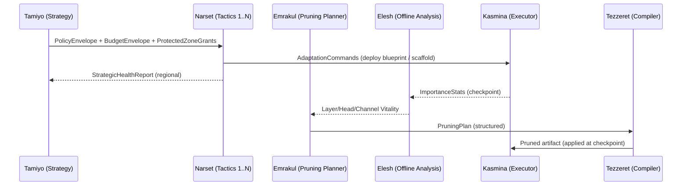

# Federated Control w/ Scaffolds & Structured Compaction — Revised

**Status:** Proposal • **Owners:** Control Plane & Execution Plane • **Date:** 2025-09-13
**Feature flags:** `scaffolds_enabled`, `inverse_throttle_enabled`, `protected_zones_enabled`

> **Reading note:** Agents should read **Urza** (blueprint library), **Karn** (blueprint generator), and **Tezzeret** (blueprint compiler) as additional context when reviewing the scaffold component and Phase‑2 compaction.

---

## TL;DR

* **Scaffolds** are **temporary, self‑sunsetting deployment profiles** for standard blueprints. Any seed can germinate into a scaffold **if the blueprint declares a scaffold profile** (`supports_scaffold: true`). Scaffolds train on‑graph with a long dwell, then **tear down automatically** (“Mary Poppins”) when success gates hold.
* **Budgets:** Tamiyo sets global **Stability Budget Units (SBUs)** per cycle; Narset spends locally; **Emrakul’s pruning budget `B_prune` is inversely throttled** by Narset’s forecast spend (`B_seed + B_scaffold`).
* **Multiplicity:** Start with **one Emrakul Prime**. Shard by Narset scopes only when checkpoint planning approaches budget limits **and** interference across scopes is low.
* **Protected zones:** While a scaffold is active, Emrakul **embargoes compaction** in/near that region; Elesh excludes it from removal candidates. Embargoes bind at the next checkpoint.

**Cost model (used everywhere budgets move):**
$\textbf{AdaptationCost} = w_{risk}\cdot\text{InherentRisk} + w_{disruption}\cdot\text{DisruptionScore}$
*Defaults:* `w_risk=0.6`, `w_disruption=0.4` (tunable per region by Narset).

**Budget smoothing & hysteresis:**
Use an EMA of spend to avoid ping‑pong:

```
spend_hat_t = EMA(spend_t, tau_cycles=3)
B_prune_t = clamp(B_prune_base − β · spend_hat_t, B_prune_min, B_prune_cap)
```

Apply 1‑cycle hysteresis before lifting quiet caps.

---

## 1) Roles & Control Topology

This proposal elevates **Tamiyo** to global strategist and introduces **Narset** as a tactical controller per region. Emrakul remains the checkpoint‑only pruning planner; Elesh are offline analysis workers; Kasmina is the executor.



### Tamiyo (strategic)

**Outputs per cycle (at checkpoint N):**

1. **PolicyEnvelope** (risk posture, quiet caps, zone rules)
2. **BudgetEnvelope** (`B_seed`, `B_scaffold`, `B_prune`) — SBUs per region and global caps
3. **ProtectedZoneGrants\[]** (regions, radius, TTLs, activation/lift checkpoints)

**Inverse throttle:**
`B_prune_t = clamp(B_prune_base − β · spend_hat_t, B_prune_min, B_prune_cap)`, where `spend_hat_t` is the EMA of `(B_seed_spend + B_scaffold_forecast)`.

### Narset (1..N tactical)

**Inputs:** `PolicyEnvelope`, `BudgetEnvelope`, `RegionTelemetry`, **Urabrask BSDS**, **Urza** catalog.
**Outputs:** `AdaptationCommands` to Kasmina (standard or `class=scaffold` deployments), `StrategicHealthReport` to Tamiyo.
**Timing:** Decisions are **prepared immediately** but **become binding at checkpoint N+1**.

### Emrakul (checkpoint‑only pruning planner)

Consumes Elesh stats and Tamiyo’s `B_prune`; respects **ProtectedZones**; emits a **structured** `PruningPlan` (channels/heads/layers). Start with **Emrakul Prime**; consider sharding (see §4).

### Elesh (offline analysis)

Computes channel/head importance and layer vitality during checkpoints; **excludes embargoed scopes** from eligible sets (may still compute diagnostics).

### Kasmina (executor)

Loads kernels, runs lifecycle, enforces gradient isolation and rollback; **no lifecycle change** for scaffolds (they are a deployment profile).

---

## 2) Scaffolds: A Blueprint **Deployment Profile**

A scaffold is **not** a different seed type; it’s a **deployment profile** for a standard blueprint. A blueprint can be deployed normally *or* as a scaffold **iff** it is **scaffold‑capable**.

### What makes a blueprint scaffold‑capable? (Checklist)

* `supports_scaffold: true`
* `sunset_policy` (e.g., `gated_ttl`, `min_dwell_epochs`, `ttl_epochs`)
* `success_gates` (stability jitter, loss drift, diversity, parity)
* **Weaning interfaces** (alpha ramp schedule; KD targets)
* **NOOP kernel id** for self‑removal
* **ProtectedZone defaults** (`radius_blocks`)
* **BSDS Scaffold Annex** (Urabrask risk specific to temporary deployment)

**Tezzeret paired manifests:** For scaffold‑capable blueprints, Tezzeret emits paired manifests: `<id>.standard` and `<id>.scaffold` (same kernel, different policy/metadata).

### Lifecycle deltas (Kasmina lifecycle unchanged)

| Stage             | Scaffold policy delta                                                    |
| ----------------- | ------------------------------------------------------------------------ |
| TRAIN\_ISOLATED   | Optional short warmup; otherwise normal.                                 |
| GRAFTING          | Longer dwell; strict gates; may draw from `B_scaffold`.                  |
| STABILISATION     | Primary dwell; success defined by **stability gates**.                   |
| WEANING           | Reduce α; **host KD** learns scaffold behavior.                          |
| ACTIVE/FOSSILISED | Prefer **self‑removal → NOOP**; keep tiny fossil only if policy demands. |

**Weaning invariant:** Blending uses `host_activations.detach()`. Only during **WEANING** may `weaning_joint_training_enabled=true` permit controlled joint training within the **RegionSpec**.

**Failure path:** If gates do not pass by `ttl_epochs`, **auto‑sunset to NOOP**, emit `scaffold_failed_sunset`, and place region in **cooldown** for `cooldown_epochs_on_fail`.

---

## 3) Contracts (Leyline) — New/Extended

```protobuf
// leyline.scaffold.v1

message RegionSpec {
  string narset_id;                // scope id
  repeated string module_ids;      // e.g., "encoder.block.9", "ffn.9"
  uint32 radius_blocks;            // embargo ring for pruning
}

message ScaffoldRequest {
  string request_id;
  string narset_id;
  RegionSpec region;
  string blueprint_id;             // Urza artifact / Karn candidate
  double risk_score;               // from Urabrask BSDS
  map<string,double> metrics;      // trigger evidence
  uint32 b_scaffold_ask;           // budget ask (SBUs)
  uint32 ttl_epochs;
  uint32 cooldown_epochs_on_fail;  // default in policy
  bool merge_ok;                   // may be merged with adjacent zones
}

message ProtectedZoneGrant {
  string grant_id;
  RegionSpec region;
  string issued_at_checkpoint_id;  // binding rules in §5
  string activates_at_checkpoint_id;
  string lift_after_checkpoint_id;
  bool pruning_embargo;            // Emrakul MUST skip while true
  string reason;                   // scaffold_active | manual | crisis_mode
}

message ScaffoldStatus {
  string scaffold_id;
  enum Phase { WARMUP=0; GRAFTING=1; STABILISING=2; WEANING=3; SUNSETTING=4; NOOP=5; }
  Phase phase;
  map<string,double> gauges;       // jitter, drift, diversity, etc.
  bool thrash_cooldown;
  bool weaning_joint_training_enabled;
  uint32 cooldown_expires_epoch;
  double alpha;                    // current blend
  string weaning_target;           // host | seed | joint
}

message ScaffoldSunsetNotice {
  string scaffold_id;
  string reason;                   // gates_passed | ttl_expired | manual
  bool converted_to_noop;
}
```

**Oona topics:**

* `scaffold.requested|approved|sunset|failed`
* `zones.granted|merged|lifted`
* `emrakul.plan_aborted|skipped`

---

## 4) Emrakul under Tamiyo/Narset — one vs many

### Pattern A — Single **Emrakul Prime** (default)

Simple consistency, clean inverse throttle, no cross‑planner conflicts.

### Pattern B — Sharded Emrakul (per Narset scope)

* Each shard receives `BudgetEnvelope(scope)` and **MUST NOT** propose cross‑scope ops.
* **Arbitration:** Tamiyo maintains a **global conflict set**; any op intersecting another shard’s **ProtectedZone** is rejected.
* **Consistency:** Two‑phase commit at checkpoint: **prepare** (each shard emits plan hash) → **commit** (checkpoint metadata records all `plan_hashes[]`). A missing/mismatched hash triggers **global abort** this cycle.
* **Timeouts:** Define `T_prepare_max = 0.25 · T_ckpt`. On timeout → global abort + rollback to prior plan.
* **Shard boundaries:** Split only along **low‑interference cuts** (from an **interference matrix**); require normalized spillover < **0.1**.

### Pattern C — Prime‑plans, shards‑execute

One brain (Prime), many hands (shard executors) materializing region‑local surgery.

**Shard/scale heuristic:** If `T_emrakul > 0.25 · T_ckpt` for 2 consecutive cycles, add 1 shard aligned to the hottest Narset scope that also meets the low‑interference rule.

---

## 5) Protected Zones & Inverse Throttle

**Geometry:** `RegionSpec ⊕ radius_blocks` is a **blockwise dilation** over the module graph. For MoE or long residual spans, the radius applies across **skip endpoints** as well.

**Binding rules:** A grant is visible immediately but becomes **binding for Emrakul** at the **next checkpoint boundary** after issuance. Lifting an embargo occurs **one full checkpoint** after `ScaffoldSunsetNotice` and only if `loss_drift ≤ δ` during that dwell.

**Zone overlap policy:** If two Narset requests overlap/adjacent and `merge_ok=true`, zones **merge** when graph distance ≤ 1 block. The merged zone uses the **max radius** and **max TTL**. Budget cost is apportioned ∝ (`ttl_epochs × radius_blocks`) of each request.

**Inverse throttle (operational):**

* `B_prune_t = clamp(B_prune_base − β · spend_hat_t, B_prune_min, B_prune_cap)` with EMA (`tau=3`).
* If any zone is `STABILISING` or `WEANING`, limit toward a **quiet cap**: `B_prune_t ← EMA(B_prune_t, target= B_prune_quiet_cap)`.
* Narset’s **success gates feed Emrakul’s priority** — recently stabilized regions become preferred compaction candidates after embargo lift.

---

## 6) Gates & Metrics (additions)

**Scaffold success gates (defaults; scale by device class):**

* `stability_p95_jitter ≤ 5%` where `stability_p95_jitter = p95(|Δy_t| / |y_t|)` over K windows.
* `loss_drift_window ≤ 0.05` where `loss_drift_window = |E_t[L] − E_{t−K}[L]|`.
* `feature_diversity_idx ≥ 0.6` measured on **specified layer** (e.g., pre‑norm MLP out); sample at ≤1/64 batches.
* During **weaning**: `host_only_parity_delta ≤ ε (0.01)`.

**Extra gauges:** `scaffold_residual_ratio = ||seed_out||/||host_out||`, `host_kd_loss`.

**Emrakul quiet gates near scaffolds:**
Active phases `{STABILISING, WEANING}` → hard embargo; `SUNSETTING` → lift after one clean checkpoint with drift ≤ `δ` (default `δ=0.01`).

**Telemetry (additions):**
`protected_zone_active{region}`, `b_prune_alloc`, `b_scaffold_alloc`, `b_scaffold_actual`, `scaffold_weaning_alpha`, `scaffold_sunset_count`, `prune_ops_skipped_due_to_embargo`, `inverse_throttle_beta`, `zone_merge_count`, `zone_conflict_resolved_count`, `emrakul_plan_skips{reason}`, `weaning_host_update_tokens_per_sec`, `host_lr_scale_effective`.

---

## 7) Interplay with Structured Compaction (Phase‑2)

* Scaffolds commonly **precede** compaction: stabilize/teach → remove temporary capacity → compact host.
* Emrakul **never** plans ops in an active zone. After `SunsetNotice`, a region becomes **eligible next cycle** **only after** one **clean checkpoint** with drift ≤ `δ` and no scaffold retry.
* Apply **progressive schedule** (channels → heads → rare layer drop). **Layer drops** in a recently scaffolded region require **Tamiyo approval**.
* Use dual checkpoints; Tezzeret recompiles as already specced for Phase‑2. If compile time threatens the checkpoint window, defer plan to next cycle (`compile_deferred` event) — never apply partial surgery.

*(Cross‑ref: C‑020 Round‑5 decision — Phase‑2 uses **structured** pruning, not sparse tensors.)*

---

## 8) Default Policy Configurations

**Inverse throttle:**

* `B_prune = clamp(B_prune_base − β · (B_seed_spend + B_scaffold_forecast)^EMA, B_prune_min, B_prune_cap)`
* Default `β = 0.6` (assumes 2–3 concurrent scaffolds); tune in Sprint‑3.
* Default `B_prune_quiet_cap = 0.3 · B_prune_base`.

**Scaffold anti‑thrash:**

```yaml
scaffold:
  max_retries_per_region: 2
  cooldown_epochs_on_fail: 3
```

**Zone radius:** default `1` block; set `2` for MoE/long‑skip models.

**Weaning schedule:** linear α decay over `W=2` windows; KD weight `λ_KD = 0.3`; L1 anchor on scaffold output `λ_L1 = 1e-4`.

**Per‑model overrides (example):**

```yaml
regions:
  encoder_9_12:
    β_override: 0.5
    radius_blocks: 2
    gates:
      jitter_p95: 0.04
      diversity_idx: 0.65
```

---

## 9) SRE/Perf Runbook (delta)

**Manual controls:**

* `zones.freeze(region, epochs)`
* `zones.extend(grant_id, epochs)`
* `scaffold.kill(scaffold_id)`
* `embargo.manual(region)`

**Dashboards (panel spec):**

* Sparkline `B_prune_t` vs. `B_prune_base`
* Active zones (count & list) with time‑to‑lift
* Scaffolds by phase (stacked), sunset rate
* `prune_ops_skipped_due_to_embargo` counter

**Crisis mode:** Tamiyo may unlock `B_scaffold_emergency` (bounded) for one cycle; halves `B_prune` target for that cycle.

---

## 10) Implementation Plan (2 sprints to wire, 1 to tune)

**Sprint 1 — control plane:**

* Tamiyo: **inverse throttle** + `ProtectedZoneGrant` issuing/expiry.
* Narset: `ScaffoldRequest` path; SOP bundling; region stability metrics.
* Oona: topics `scaffold.*`, `zones.*`.

**Sprint 2 — execution plane:**

* Kasmina: accept `supports_scaffold` manifests; add **sunset hooks** (convert to NOOP) and **zone registry** checks; ensure **identity‑kernel fallback** if NOOP conversion fails.
* Elesh: filter embargoed regions from eligible sets; compute diagnostics.
* Emrakul: consume `ProtectedZoneGrant`; down‑weight near zones; hard block inside zones.

**Sprint 3 — tuning & safety:**

* Weaning schedules; KD anchors; gate calibration; crisis drills; two protected‑zone expiries.

**Simic/Jace deltas:**

* **Simic:** add SBUs to RL state; reward shaping for successful sunsets and low drift; SOP actions.
* **Jace:** curriculum for **weaning** and **crisis drills** (scripted instability) to validate scaffold efficacy and budget dynamics.

---

## 11) CI & Verification Strategy

* **Isolation tests:** assert `∇L_host ∩ ∇L_seed = ∅` except when `weaning_joint_training_enabled=true` **and only** within RegionSpec.
* **Embargo tests:** random candidate plans → assert Emrakul never emits ops in `RegionSpec ⊕ radius` while grant active.
* **Hysteresis test:** drive `(B_seed+B_scaffold)` around thresholds; assert no oscillation in `B_prune_t` beyond one cycle.
* **Zone merge test:** two adjacent requests → single merged zone; verify budget apportioning ∝ (`ttl × radius`).
* **Prepare/commit test:** inject shard plan hash mismatch → global abort; checkpoint reverts.
* **Weaning property test:** ensure host KD loss falls below threshold before α → 0.
* **Sunset test:** synthetic unstable region → scaffold stabilizes → KD weaning → sunset → embargo lifts after one checkpoint.

---

## 12) Acceptance Criteria

* **Adaptation stability:** ≥ **30%** reduction in adaptation regressions (rollbacks) during cycles with active scaffolds vs. baseline.
* **Scaffold efficacy:** Median lifetime ≤ **50%** of TTL; ≥ **90%** end via automated **gates\_passed** (not manual/TTL expiry). TTL‑expiry sunsets ≤ **5%**.
* **Pruning throughput:** Emrakul plan rate ≥ **95%** of un‑throttled baseline when no zones are active.
* **Safety invariant:** **Zero** surgeries executed inside an active ProtectedZone (CI + audit).
* **Post‑sunset drift:** ≤ **δ = 0.01** during the embargo‑lift dwell; **parity ε = 0.01** in weaning.

---

## 13) Open Questions for Conclave

1. When to shard Emrakul — adopt the `γ` threshold now or keep manual gate initially?
2. Default `radius_blocks` — is `1` sufficient, or `2` for MoE/long‑skip?
3. Emergency pool cap — fixed by model size or adaptive from recent volatility?
4. Sunset certainty — one clean checkpoint or two before lifting embargo?
5. **Priority:** Should Narset preempt micro‑seeds when a crisis scaffold arrives?
6. **Concurrency:** Max concurrent scaffolds per region — 1 by default, or 2 with auto‑merge?

---

## 14) Compliance with Existing Specs

* **Kasmina lifecycle is unchanged.** Scaffolds use the same stages with policy deltas and metadata flags (see Kasmina briefing §2 lifecycle table).
* **Gradient isolation invariants hold** (detach discipline, two optimizers, controlled weaning).
* **Emrakul/Elesh remain checkpoint‑only.** No runtime surgery.
* **Structured compaction** remains Phase‑2; scaffolds coordinate with its budgets/gates.

---

## 15) Worked Examples

**A) Attention collapse**

1. Narset detects entropy collapse in `block 9–12` → `ScaffoldRequest(blueprint=attn_diversity_aux, radius=1, ttl=10)`.
2. Tamiyo approves, grants **ProtectedZone** and `B_scaffold`.
3. Scaffold germinates; α ramps; success gates steady; weaning KD transfers behavior to host.
4. Scaffold emits **SunsetNotice** → converts to **NOOP**; zone lifts next cycle after clean checkpoint.
5. Emrakul plans **FFN channel compaction** in `block 9–12`; Tezzeret compiles pruned artifact at checkpoint.

**B) Gradient instability crisis**

1. Loss spikes and gradient norms oscillate in `block 3–5` → Narset requests **dampening MLP scaffold**, `radius=1`, `ttl=5`, `merge_ok=true`.
2. Tamiyo issues zone grant; `B_prune` throttles toward quiet cap.
3. Scaffold stabilizes norms within 2 windows; commence **weaning** with KD (`λ_KD=0.3`).
4. Gates pass by epoch 4 → **SunsetNotice** → NOOP.
5. After one clean checkpoint without drift (`δ≤0.01`), region becomes eligible for **channel compaction**.

---

## Glossary

* **SBU (Stability Budget Unit):** Unitless change credit consumed by adaptations.
* **B\_seed / B\_scaffold / B\_prune:** SBU allocations for seeds, scaffolds, and pruning.
* **ProtectedZone:** A pruning embargo around a region (dilated by `radius_blocks`).
* **TTL:** Max dwell before forced sunset.
* **Weaning:** Scheduled reduction of scaffold α with host KD to prevent dependency.
* **Scaffold‑capable:** Blueprint exposes a scaffold profile and sunset/weaning hooks.

# Addendum A1 — Clarifications & Non-Breaking Tweaks

**Scope:** Applies to “Federated Control w/ Scaffolds & Structured Compaction — Revised” (2025-09-13).
**Intent:** Capture reviewer nits and operational clarifications without rewriting the main doc. All changes are **non-breaking**; new fields are optional.

---

## A1.1 Naming & Notation

* **Spelling:** Use **US English in prose** (“stabilizing/weaning/sunsetting”). **Enum/token names remain exactly as declared** in contracts.
* **Budgets:** **SBU = unitless change credit**. `B_seed`, `B_scaffold`, `B_prune` are *allocations*; `*_spend` are *actuals*; `*_forecast` are *forecasts*. Tamiyo’s ledger is **monotonic per cycle**; **no negative `B_prune`** (post-clamp).

---

## A1.2 Scaffold Success Gates (windowing & sampling)

Let windows be **K = 20 batches**, stride = 1, unless overridden per device/task.

* `stability_p95_jitter ≤ 5%`, where
  `stability_p95_jitter = p95_t(|Δy_t| / (|y_t| + ε))`, ε=1e-6.
* `loss_drift_window ≤ 0.05`, where
  `loss_drift_window = |E_t[L] − E_{t−K}[L]|`.
* `feature_diversity_idx ≥ 0.6` on the specified layer (e.g., pre-norm MLP out); **sample ≤ 1/64 batches**.
* **Weaning parity:** `host_only_parity_delta ≤ ε_task` (default **0.01**).

**Weaning schedule defaults:** linear α→0 over **W=2 windows**; KD weight `λ_KD=0.3`; L1 anchor on scaffold output `λ_L1 = 1e-4`; **target KD loss ≤ 0.1× baseline KD** before α hits 0.

---

## A1.3 Circuit Breakers (runtime) vs Asserts (CI)

* **Runtime “must nots”** (e.g., surgery inside an active ProtectedZone) are enforced by **circuit breakers → identity-kernel fallback** + Leyline event.
* **Asserts** are reserved for **CI/property tests** only.

---

## A1.4 Interference & Shard Cuts (concrete rule)

Define inter-region interference for regions *i, j* with module sets *M\_i, M\_j*:

```
I(i,j) = 0.5 * [ mean_val corr( Σ_{m∈M_i} ||∂L/∂h_m|| ,
                                Σ_{n∈M_j} ||∂L/∂h_n|| )
               + mean_val max_attn_spill(M_i→M_j) ]
```

**Sharding rule:** Only cut along boundaries where
`max_{i≠j} I(i,j) < 0.10` **for the last 2 checkpoints**.

---

## A1.5 Protected Zone Geometry (explicit dilation)

Given `RegionSpec.module_ids` as nodes in the module DAG *G=(V,E)*:

1. `S0 = module_ids`
2. For k = 1..`radius_blocks`:
   `S_k = S_{k−1} ∪ { v ∈ V | ∃ (u→v) or (v→u) with u ∈ S_{k−1} }`
   *For residual/skip edges, treat both endpoints as adjacent; for MoE, include experts with non-zero gating probability at p95 over the last window.*
3. **Zone = ⋃\_{k=0..radius} S\_k**

**Binding:** Grants are effective **for planning** at the **next checkpoint** after issuance; **lift** occurs **one full checkpoint after sunset** and only if drift ≤ δ (default δ=0.01).

---

## A1.6 Contracts — Optional Fields (non-breaking)

```protobuf
// Add (optional) to ProtectedZoneGrant
uint32 lease_ttl_epochs = <new>;    // explicit lease TTL
bool   renewal_required  = <new>;   // Tamiyo must renew before expiry

// Add (optional) to ScaffoldRequest
bool   is_sop            = <new>;   // route via SOP approval even if budget available
```

**Event cardinality:** All Oona topics SHOULD include `checkpoint_id` and `region_id` for correlation.

---

## A1.7 Budget Smoothing & Guardrails (exact)

* **EMA horizon:** `tau_cycles = 3`.
* **Change clamp:** `|ΔB_prune_t| ≤ 0.3 · B_prune_base` per cycle.
* **Quiet cap:** `B_prune_quiet_cap = 0.3 · B_prune_base`.
* **Concurrency defaults:** max **1 scaffold/region**, max **3 global**; allow `merge_ok=true` to coalesce adjacent zones.

---

## A1.8 Scope & Cool-offs

* **Scope guardrail:** Scaffolds may read/write only within `RegionSpec`. Expanding scope requires a **new `ScaffoldRequest`**.
* **TTL failure:** On `ttl_epochs` expiry without gates passed, **auto-sunset to NOOP**, emit `scaffold_failed_sunset`, and apply **`cooldown_epochs_on_fail`**; **no compaction** may be scheduled in that region during cooldown.

---

## A1.9 Idempotence, Replay, and Audit

* **Idempotence:** Narset→Kasmina commands carry **`request_id`**; duplicate requests MUST be no-ops.
* **Replay protection:** `ProtectedZoneGrant.issued_at_checkpoint_id` MUST be ≥ current for Emrakul to honor; stale grants are ignored.
* **Audit trail:** Tamiyo records `(BudgetEnvelope, ProtectedZoneGrants, plan_hashes[])` in checkpoint metadata; Emrakul/Elesh persist plan/application diffs.

---

## A1.10 Reminder (context)

Agents reviewing scaffolds should also read **Urza** (blueprint library), **Karn** (blueprint generator), and **Tezzeret** (blueprint compiler) for blueprint manifests, scaffold profiles, and recompilation behavior.

---

**End Addendum A1.**
