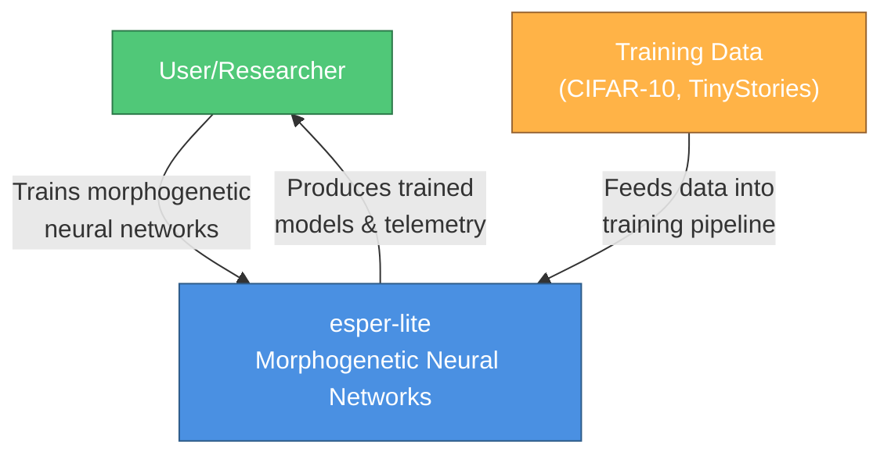
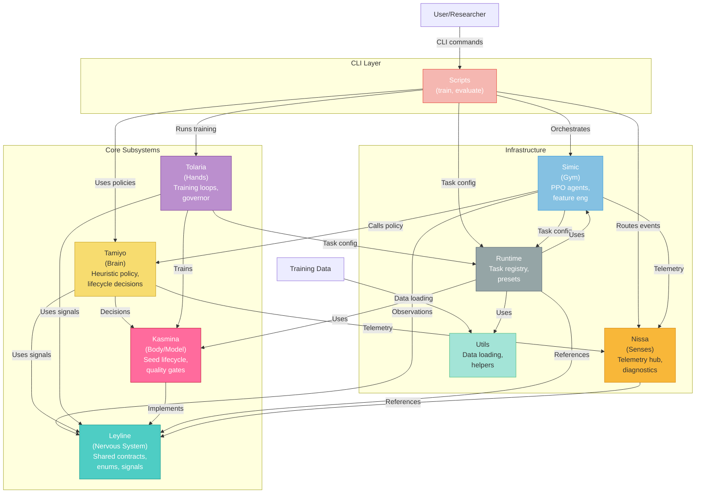
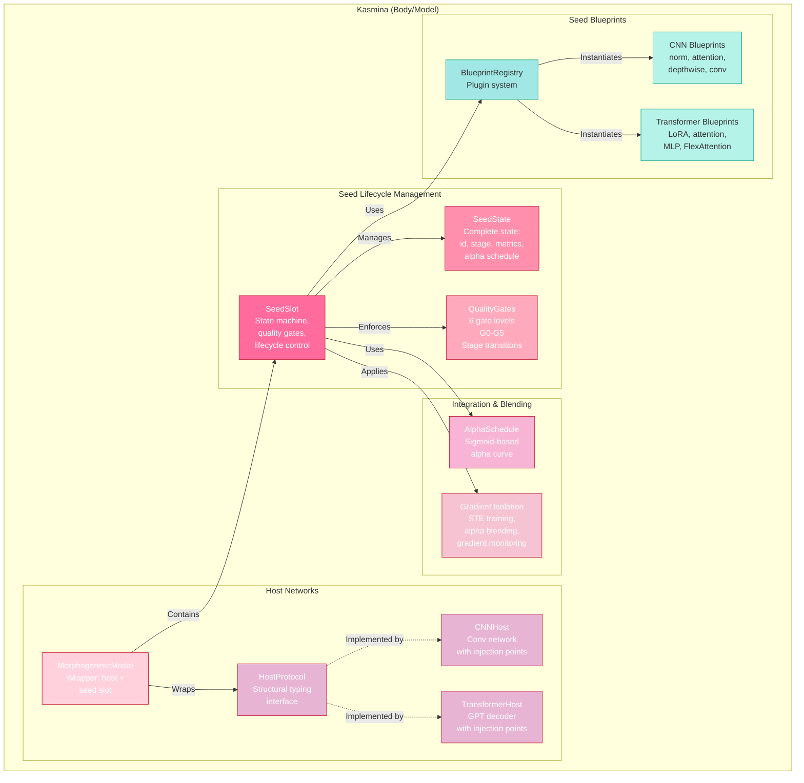

# C4 Architecture Diagrams: esper-lite

## Level 1: System Context

---

## Level 2: Container Diagram

---

## Level 3: Component Diagram - Kasmina

---

## Diagram Notes

### Key Architectural Insights

1. **Layered Architecture:**
   - **CLI Layer:** Scripts provide entry points (train, evaluate)
   - **Core Subsystems:** The five logical components handling model, decisions, training, and nervous system
   - **Infrastructure:** Supporting systems for RL, telemetry, configuration, and utilities

2. **Dependency Flow:**
   - Leyline is the foundation layer - all subsystems depend on it for contracts and enums
   - Kasmina (Body) is the central computational unit that all others manipulate
   - Tamiyo (Brain) makes decisions that influence Kasmina's state transitions
   - Tolaria (Hands) executes the PyTorch training based on Kasmina and Leyline contracts
   - Simic (Gym) provides the RL agent that learns to control the system

3. **Kasmina Internal Structure:**
   - **SeedSlot** is the core state machine managing individual seed lifecycle
   - **SeedState** holds complete state snapshot (id, stage, metrics, alpha)
   - **QualityGates** enforce gated stage transitions (G0-G5)
   - **AlphaSchedule** and **Isolation** handle gradient isolation during training
   - **Host Networks** (CNN/Transformer) are graftable injection points
   - **BlueprintRegistry** provides plugin-based seed implementations

4. **Critical Patterns:**
   - State Machine (SeedSlot with SeedState)
   - Plugin Architecture (BlueprintRegistry)
   - Structural Typing (HostProtocol)
   - Quality Gates for rollout safety
   - Gradient Isolation via STE and alpha blending
   - Telemetry-First Design (all subsystems report to Nissa)

5. **Data Flow:**
   - Training data flows through Utils into task configurations
   - Observations flow from training loops through Simic to Tamiyo
   - Decisions flow from Tamiyo to Kasmina's SeedSlot
   - Telemetry events flow to Nissa hub from all subsystems

6. **Circular Dependency Avoidance:**
   - TYPE_CHECKING imports used in Kasmina, Tamiyo, Simic
   - Lazy imports in Leyline.actions for BlueprintRegistry
   - Local imports in Runtime.tasks to break cycles
