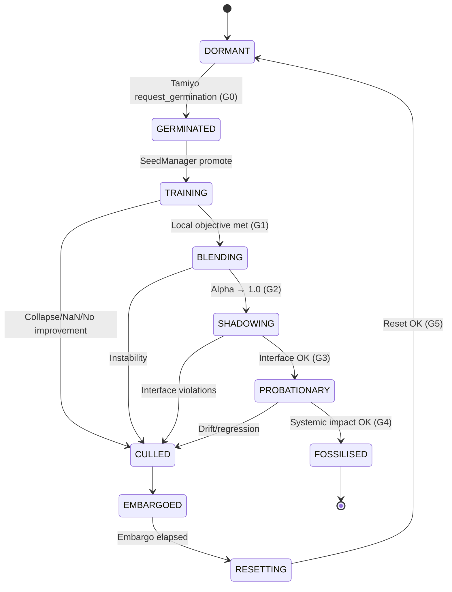
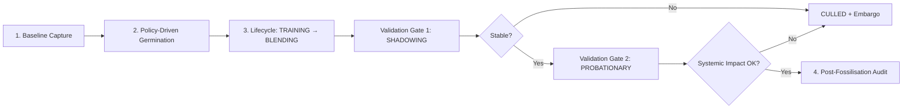

# Tables and Figures
This section provides a consolidated view of reference data and design artefacts introduced throughout the document.
## 9.1 Seed Lifecycle States
The authoritative Esper‑Lite design uses an 11‑state lifecycle managed by Kasmina’s seed manager, with validation gates G0–G5. This table reflects that contract.

| State         | Trigger                                       | Key Process                                                                  | Next State(s)             |
|---------------|-----------------------------------------------|-------------------------------------------------------------------------------|---------------------------|
| DORMANT       | Default on insertion or after reset           | Monitors telemetry for Tamiyo; forward pass is identity                       | GERMINATED                |
| GERMINATED    | `request_germination` from Tamiyo             | Placeholder registered; awaiting scheduler slot (G0: sanity)                  | TRAINING                  |
| TRAINING      | Promoted from queue by SeedManager            | Local training on buffered data; host path remains identity (G1: health)      | BLENDING or CULLED        |
| BLENDING      | Local training complete                       | Mix child output via alpha ramp; gradients stay isolated (G2: stability)      | SHADOWING or CULLED       |
| SHADOWING     | Blending complete (alpha ≈ 1.0)               | Forward inert; internal probes verify stability, interface (G3: interface)    | PROBATIONARY or CULLED    |
| PROBATIONARY  | Passes shadowing validation                   | Fully live; Tamiyo monitors systemic impact (G4: system impact)               | FOSSILISED or CULLED      |
| FOSSILISED    | Passes probationary validation                | Accept module; parameters become part of host; gradients disabled             | —                         |
| CULLED        | Fails any validation stage                    | Abort; slot embargoed                                                         | EMBARGOED                 |
| EMBARGOED     | On cull                                       | Time‑boxed hold to prevent thrashing                                          | RESETTING                 |
| RESETTING     | Embargo elapsed                               | Scrub slot; clear buffers; reset counters (G5: sanity)                        | DORMANT                   |
| TERMINATED    | Administrative                                 | Teardown/decommission terminal                                                | —                         |

### 9.1.a Lifecycle State Diagram (Mermaid)



Figure: Formal lifecycle and validation gates (see Section 5).

## 9.2 Techniques for Structural Grafting
(See: [Techniques for Grafting and Precise Editing](04-techniques-for-grafting-and-precise-editing.md))

| Technique             | Insertion Type            | Initial Behaviour        | Parameter Origin         | Best Use Case                           |
|-----------------------|---------------------------|--------------------------|--------------------------|-----------------------------------------|
| Neural Surgery        | Structural (layer/branch) | Identity / near-identity | From scratch or copied   | Custom pipelines, deep insertion        |
| Adapter Layer         | Bottleneck insert         | Identity approximation   | From scratch             | MLP/Transformer backbones               |
| Germinal Module (GM)  | Pre-trained module        | Task-optimised           | Discovered by Karn agent | Reuse under budget constraints          |
## 9.3 Architectural Patterns and Agent Roles
(See: [Architectural Patterns and Agent Roles](06-architectural-patterns-and-agent-roles.md))

| Pattern / Role                         | Governing Agent     | Description                                                                 |
|----------------------------------------|---------------------|-----------------------------------------------------------------------------|
| Blueprint as Reusable Skill (GM)       | Karn (Inventor)     | Validated architectural blueprints (GMs) as reusable subproblem solutions   |
| Seed Site as Interface Contract        | Static Architecture | Stable socket with fixed I/O contract enabling safe intervention            |
| Controller as Constraint Negotiator    | Tamiyo (Controller) | Balances performance needs against system constraints via telemetry         |
## 9.4 Prototype Validation Metrics
(See: [Prototype Implementation and Micro-Demonstration](07-prototype-implementation-and-micro-demonstration.md))
Metric Before Germination Post‑Fossilisation Comments
Validation Accuracy 93.2% 97.1% Shows improved performance after successful lifecycle.
Activation Variance (seed site) 0.0017 0.031 Suggests re-engaged feature transformation.
Seed Parameter Count 0 1,536 Added only upon germination.
Base Parameter Updates 0 0 Integrity of frozen model preserved.
Inference Latency (CPU, relative) 1.00x 1.03x Minimal performance cost.
9.5 TAMIYO CONTROLLER POLICY I/O
(See: [Controller Training: The Tamiyo Curriculum](08-controller-training-the-tamiyo-curriculum.md))

| I/O Component               | Description                                                                                                          |
|----------------------------|----------------------------------------------------------------------------------------------------------------------|
| Input: Seed Telemetry      | Real‑time vector per seed site: activation variance, interface drift, gradient norm, utilisation, age, budget, etc. |
| Output: Blueprint Choice   | Probability distribution over blueprints in Karn’s library (including a “No‑Op” action)                              |
| Output: Location Choice    | Probability distribution over available seed sites                                                                    |
| Output: Intensity          | Scalar in [0, 1] modulating initial learning rate for the germinated module’s training phase                         |
9.6 SEED-SPECIFIC OPTIMISATION CONFIG (PROTOTYPE)
(See: [Prototype Implementation and Micro-Demonstration](07-prototype-implementation-and-micro-demonstration.md))
Component Setting
Optimiser Adam
Learning Rate 1e-3 (modulated by intensity output)
Gradient Clipping 1.0
Batch Size 128
Training Steps 2000
9.7 SEED PLACEMENT: VISUAL SCHEMA (SYNTHETIC MLP)
(See: [Prototype Implementation and Micro-Demonstration](07-prototype-implementation-and-micro-demonstration.md))
```mermaid
graph TD
    A[Input 2D] --> B[Linear(2->32) --> ReLU]
    B --> C["[Seed Module]"]
    C --> D[Linear(32->32) --> ReLU]
    D --> E[Linear(32->2) --> Output]
```
Note: The above diagram can be converted to a rendered graphic in the final typeset.

## 9.8 Evaluation Pipeline Flow
(See: [Evaluation Criteria and Safety Constraints](10-evaluation-criteria-and-safety-constraints.md))



Figure: End‑to‑end evaluation flow with lifecycle gates (Section 10.3).

## 9.9 Controller Interaction Sequence
(See: [Controller Training](08-controller-training-the-tamiyo-curriculum.md), [Failure Handling](05-failure-handling-and-risk-containment.md))

```mermaid
sequenceDiagram
    participant T as Tamiyo (Controller)
    participant M as SeedManager
    participant S as Seed
    participant B as Base Model

    T->>M: request_germination(seed_site, blueprint)
    M->>S: enqueue GERMINATED
    M->>S: promote TRAINING
    S-->>B: forward pass inert; local training on buffer
    S->>S: BLENDING (alpha 0→1)
    S-->>B: SHADOWING (inert) – internal stability checks
    M-->>T: telemetry + validation results
    alt Systemic impact OK
        M->>S: PROBATIONARY → FOSSILISED
    else Drift/regression
        M->>S: CULLED; embargo slot
    end
```

Figure: Interaction during a germination episode from trigger to outcome.

## 9.10 System Overview (Conceptual)
(See: [Introduction](01-introduction.md), [Architectural Patterns](06-architectural-patterns-and-agent-roles.md))

```mermaid
flowchart LR
    subgraph TrainExec[Training & Execution]
        T[Tolaria (Training Orchestrator)]
        KAS[Kasmina (Execution Layer)]
        M[(Frozen Model\n+Seed Sockets)]
        T --> KAS
        KAS --> M
    end

    TAM["Tamiyo (Strategic Controller)"]
    SIM[Simic (Offline Policy Trainer)]
    LEY[Contracts & Governance]
    OBS[Messaging & Observability]
    LIB[Blueprint Library]

    %% Data & control flows
    T -- System State --> TAM
    KAS -- Telemetry --> TAM
    TAM -- Adaptation Command --> KAS

    TAM -- Field Reports --> SIM
    SIM -- Policy Update --> TAM

    LEY --- T
    LEY --- KAS
    LEY --- TAM

    OBS --- T
    OBS --- KAS
    OBS --- TAM

    LIB --> TAM
```

Figure: Conceptual overview of Esper‑Lite subsystems and flows. The controller analyses state/telemetry and issues adaptation commands; the execution layer applies lifecycle‑guarded changes to embedded seed sockets. Offline training improves the policy from field reports.

## 9.11 Technique Comparison Diagram
(See: [Techniques for Grafting and Precise Editing](04-techniques-for-grafting-and-precise-editing.md))

```mermaid
flowchart LR
    subgraph Surgery[Neural Network Surgery]
        A1[Input] --> S1[Layer]
        S1 -->|parallel| SNew[Inserted Module]
        S1 --> M1[Merge]
        SNew --> M1
        M1 --> O1[Output]
    end

    subgraph Adapter[Adapter Layer]
        A2[Input] --> L21[Upstream Layer]
        L21 --> ADP[Bottleneck Adapter\n+(near‑identity init)]
        ADP --> L22[Downstream Layer]
        L22 --> O2[Output]
    end

    subgraph GM[GM Injection (Pre‑trained)]
        A3[Input] --> G1[Layer]
        G1 --> GMod[Pre‑trained Module\n+ (task‑optimised)]
        GMod --> O3[Output]
    end
```

Figure: Structural comparison of techniques. Surgery inserts structure alongside existing paths; adapters provide low‑cost bottlenecks with near‑identity initialisation; GM injection deploys pre‑trained modules for targeted capability reuse.

## 9.12 Result Plot Templates
This section defines the canonical plots for reporting prototype outcomes. Plots should reflect mean ± 95% confidence bands over repeated runs, and use consistent axes and units across datasets.

### 9.12.1 Pareto Curve (Δ Performance vs Δ Parameters)

Description: For each method, plot the change in task performance (ΔAcc or ΔF1) against parameters added (ΔParams). This visualises efficiency of added capacity. Include Baseline, Adapter, Morphogenetic (policy + gates), Morphogenetic (ablations). Annotate the knee/sweet‑spot region.

Axes: X = ΔParams (log or linear as appropriate); Y = ΔAcc/F1. Error bands reflect across‑run variance.

### 9.12.2 Safety Dashboard (Multi‑Panel)

Description: A multi‑panel figure summarising safety outcomes per method:
- Drift (box or violin of interface drift metrics)
- Isolation violations (bar; proportion of steps)
- Gate pass rates (stacked bars; shadowing/probationary)
- Cull/embargo counts (bars per 1k steps or per run)

### 9.12.3 Policy Metrics

Description: For policy‑driven runs, show trigger precision/recall for “useful growth”, selection entropy over sites/blueprints, and the no‑op ratio. Use small multiples per dataset.

Figure notes: All plots should include clear legends and include consistent colour mapping across methods.
Seed Module: A site for germination, located post first hidden layer. When triggered by Tamiyo, a new module blueprint is inserted, often as a residual path. All layers except the germinated module are frozen post-pretraining.
