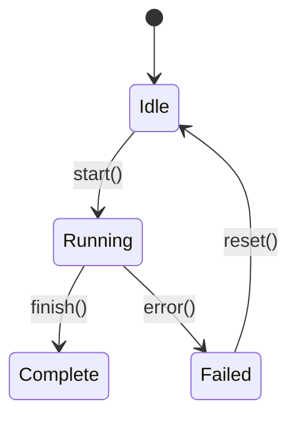

# Unified Module Bible (UMB) Specification v1.0

> **Purpose:** This document defines the canonical format for Esper module documentation.
> Each subsystem receives its own "Bible" - a semantically-dense reference optimized for AI consumption.

---

## Generation Philosophy

### Core Principles

1. **Semantic Density:** Minimize tokens while maximizing architectural intent transmission. Every sentence must carry weight.

2. **Anti-Hallucination by Design:** Explicitly define what a module does NOT do. LLMs will invent capabilities unless boundaries are stated.

3. **Machine-Parsable Metadata:** Rigid YAML frontmatter enables automated tooling, validation, and cross-referencing.

4. **No Implementation Noise:** Focus on contracts, not code. No function bodies, import lists, or boilerplate. Signatures and invariants only.

5. **Tribal Knowledge Preservation:** Capture the "gotchas" that usually live only in developers' heads or Slack threads.

6. **Living Documentation:** Bibles evolve with code. Stale documentation is worse than no documentation.

---

## Document Structure

### Section A: YAML Frontmatter

The frontmatter provides structured metadata for tooling and quick reference.

```yaml
---
# ═══════════════════════════════════════════════════════════════════
# IDENTIFICATION
# ═══════════════════════════════════════════════════════════════════
id: "module-name"                    # Unique kebab-case identifier
title: "Human Readable Name"         # Display name
aliases: ["shortname", "legacy-name"] # Alternative names, acronyms

# ═══════════════════════════════════════════════════════════════════
# CLASSIFICATION
# ═══════════════════════════════════════════════════════════════════
biological_role: "Stem Cell"         # From Esper's biological hierarchy
layer: "Core Logic"                  # Infrastructure | Core Logic | Control | Observation | Interface
criticality: "Tier-0"                # See Criticality Tiers below

# ═══════════════════════════════════════════════════════════════════
# TECHNICAL STACK
# ═══════════════════════════════════════════════════════════════════
tech_stack:
  - "Python 3.11+"
  - "PyTorch 2.x"
  - "NumPy"
primary_device: "cuda"               # Where tensors primarily live: cuda | cpu | mixed
thread_safety: "unsafe"              # safe | unsafe | read-safe

# ═══════════════════════════════════════════════════════════════════
# OWNERSHIP & COMPLIANCE
# ═══════════════════════════════════════════════════════════════════
owners: "core-team"
compliance_tags:                     # Operational constraints
  - "GPU-Resident"
  - "No-Blocking-Calls"
  - "Gradient-Aware"

# ═══════════════════════════════════════════════════════════════════
# VERSIONING
# ═══════════════════════════════════════════════════════════════════
schema_version: "1.0"                # UMB format version
last_updated: "2025-12-14"           # ISO 8601 date
last_reviewed_commit: "abc1234"      # Git short SHA at last review
---
```

### Criticality Tiers (ML Research Context)

| Tier | Name | Description | Example |
|------|------|-------------|---------|
| **Tier-0** | Training Crash | Process dies, GPU OOM, unrecoverable state | PPO update NaN, CUDA error |
| **Tier-1** | Silent Corruption | Training continues but results are invalid | Wrong gradient flow, broken reward |
| **Tier-2** | Throughput Loss | Slower training, memory pressure, degraded perf | Inefficient batching, GIL contention |
| **Tier-3** | Observability Gap | Missing telemetry, UX issues, cosmetic bugs | TUI glitch, missing metric |

---

### Section B: Prime Directive

Two sentences maximum. This is the module's reason for existence.

```markdown
# 1. Prime Directive

**Role:** [One sentence: What is the PRIMARY responsibility of this module?]

**Anti-Scope:** [One sentence: What does this module explicitly NOT do? Be specific.]
```

**Examples:**

- **Kasmina:** "Manages seed slot lifecycle, blueprint instantiation, and grafting mechanics." / "Does NOT make strategic decisions about WHEN to germinate or prune - that's Tamiyo's job."

- **Simic:** "Provides PPO training infrastructure including policy networks, rollout collection, and advantage estimation." / "Does NOT interact with the host model directly - all host operations go through Tolaria."

---

### Section C: Interface Contract

The public API surface. Use Python type hints.

```markdown
# 2. Interface Contract

## 2.1 Entry Points (Public API)

### `function_name(arg: Type, arg2: Type) -> ReturnType`
> Brief description of purpose.

- **Invariants:**
  - [Pre-condition that MUST be true]
  - [Another pre-condition]
- **Raises:** `ExceptionType` when [condition]
- **Complexity:** O(n) where n = [description]
- **Device:** Expects tensors on [device]

### `ClassName`
> Brief description of class purpose.

**Constructor:**
- `__init__(config: ConfigType, device: torch.device)`

**Key Methods:**
- `method_one(x: Tensor) -> Tensor` - [brief]
- `method_two() -> None` - [brief]

## 2.2 Configuration Schema

```python
@dataclass
class ModuleConfig:
    param_one: int      # Description, valid range [1, 100]
    param_two: float    # Description, default: 0.99
    optional: str = ""  # Description
```

## 2.3 Events (Pub/Sub via Karn/Nissa)

### Emits
| Event | Trigger | Payload |
|-------|---------|---------|
| `EVENT_NAME` | When [condition] | `{field: Type, ...}` |

### Subscribes
| Event | Handler | Action |
|-------|---------|--------|
| `EVENT_NAME` | `_on_event()` | [What happens] |
```

---

### Section D: Tensor Contracts

Critical for ML codebases. Define exact shapes and device placement.

```markdown
# 3. Tensor Contracts

## 3.1 Input Tensors

| Name | Shape | Dtype | Device | Description |
|------|-------|-------|--------|-------------|
| `observations` | `[B, obs_dim]` | `float32` | policy_device | Flattened env observations |
| `actions` | `[B, act_dim]` | `int64` | policy_device | Discrete action indices |

## 3.2 Output Tensors

| Name | Shape | Dtype | Device | Description |
|------|-------|-------|--------|-------------|
| `logits` | `[B, num_actions]` | `float32` | policy_device | Raw action logits |
| `values` | `[B]` | `float32` | policy_device | State value estimates |

## 3.3 Internal Buffers

| Name | Shape | Lifetime | Purpose |
|------|-------|----------|---------|
| `rollout_buffer` | `[steps, B, ...]` | Episode | Stores trajectory data |

## 3.4 Gradient Flow

```
[Input] → [Layer A] → [Layer B] → [Output]
              ↓ gradients flow
         [Optimizer updates these]

Frozen: [list any frozen components]
Detached: [list any .detach() boundaries]
```
```

---

### Section E: Operational Physics

How the module behaves internally - without showing implementation code.

```markdown
# 4. Operational Physics

## 4.1 State Machine

Use arrow notation or Mermaid for lifecycle states.

```
[STATE_A] --(trigger_event)--> [STATE_B]
[STATE_B] --(success)--> [STATE_C]
[STATE_B] --(failure)--> [ERROR_STATE]
[ERROR_STATE] --(recovery)--> [STATE_A]
```

Or Mermaid:


## 4.2 Data Governance

### Authoritative (Source of Truth)
- `data_type_one`: This module creates and owns this data
- `data_type_two`: Canonical source, other modules must not modify

### Ephemeral (Cached/Temporary)
- `cached_data`: Held for [duration], invalidated by [condition]

### Read-Only (Consumed)
- `external_data`: Obtained from [source], never modified

## 4.3 Concurrency Model

- **Thread Safety:** [safe | unsafe | read-safe]
- **Async Pattern:** [blocking | async | callback]
- **GPU Streams:** [Uses stream X for Y operations]
- **Synchronization:** [What locks/barriers exist]

## 4.4 Memory Lifecycle

- **Allocation:** When [condition], allocates [what]
- **Retention:** Held until [condition]
- **Cleanup:** Released by [mechanism]
- **Peak Usage:** ~[estimate] during [operation]
```

---

### Section F: Dependencies

Explicit upstream/downstream relationships with failure impact.

```markdown
# 5. Dependencies

## 5.1 Upstream (Modules that call this module)

| Module | Interaction | Failure Impact |
|--------|-------------|----------------|
| `module_name` | Calls `function()` | [What breaks] |

## 5.2 Downstream (Modules this module depends on)

| Module | Interaction | Failure Handling |
|--------|-------------|------------------|
| `leyline` | Uses `SeedStage` enum | **Fatal** - cannot function |
| `karn` | Emits telemetry | **Graceful** - continues without metrics |

## 5.3 External Dependencies

| Package | Version | Purpose | Fallback |
|---------|---------|---------|----------|
| `torch` | >=2.0 | Core tensor ops | None (required) |
| `rich` | >=13.0 | TUI rendering | Degrades to plain text |
```

---

### Section G: Esper Integration

Esper-specific architectural compliance.

```markdown
# 6. Esper Integration

## 6.1 Commandment Compliance

Map to the Nine Commandments from ROADMAP.md:

| # | Commandment | Compliance | Notes |
|---|-------------|------------|-------|
| 1 | Sensors match capabilities | ✅ | Emits [events] for [capabilities] |
| 2 | Complexity pays rent | ✅ | Param counting in [location] |
| 3 | GPU-first iteration | ✅ | All ops on CUDA, no Python blocking |
| 4 | Progressive curriculum | N/A | Not applicable to this module |
| 5 | Train Anything protocol | ✅ | Uses HostProtocol, no host-specific code |
| 6 | Morphogenetic plane | ✅ | Registers with Kasmina plane |
| 7 | Governor prevents catastrophe | ⚠️ | [Partial compliance, reason] |
| 8 | Hierarchical scaling | N/A | Future consideration |
| 9 | Frozen Core economy | N/A | Future consideration |

## 6.2 Biological Role

**Analogy:** [The biological metaphor from architecture]

**Responsibilities in the organism:**
- [Responsibility 1]
- [Responsibility 2]

**Interaction with other organs:**
- Receives signals from: [modules]
- Sends signals to: [modules]

## 6.3 CLI Integration

How this module is invoked via the Esper CLI:

| Command | Flags | Effect on Module |
|---------|-------|------------------|
| `esper ppo` | `--n-envs N` | Creates N instances of [component] |
| `esper ppo` | `--entropy-coef X` | Configures [parameter] |
```

---

### Section H: Cross-References

Explicit links to related bibles and code.

```markdown
# 7. Cross-References

## 7.1 Related Bibles

| Bible | Relationship | Integration Point |
|-------|--------------|-------------------|
| [leyline](leyline.md) | **Implements** | Uses `SeedStage`, `SlotID` types |
| [kasmina](kasmina.md) | **Consumes** | Reads `SlotObservation` |
| [karn](karn.md) | **Feeds** | Emits telemetry events |

## 7.2 Key Source Files

| File | Purpose | Key Classes/Functions |
|------|---------|----------------------|
| `src/esper/module/__init__.py` | Public exports | `MainClass`, `helper_func` |
| `src/esper/module/core.py` | Core logic | `CoreClass` |
| `src/esper/module/types.py` | Type definitions | `ConfigType`, `StateEnum` |

## 7.3 Test Coverage

| Test File | Coverage | Critical Tests |
|-----------|----------|----------------|
| `tests/test_module.py` | ~85% | `test_critical_path`, `test_edge_case` |
```

---

### Section I: Tribal Knowledge (Gotchas)

The critical operational details that usually only exist in developers' heads.

```markdown
# 8. Tribal Knowledge

## 8.1 Known Limitations

| Limitation | Impact | Workaround |
|------------|--------|------------|
| Max batch size 512 | OOM on larger | Split batches manually |
| Single-GPU only | No multi-GPU | Use `--devices` with Tolaria instead |

## 8.2 Performance Cliffs

| Operation | Trigger | Symptom | Mitigation |
|-----------|---------|---------|------------|
| `expensive_op()` | N > 10000 | 10x latency spike | Pre-filter input |
| Memory allocation | Episode boundary | GC pause | Pre-allocate buffers |

## 8.3 Common Pitfalls

| Pitfall | Why It Happens | Correct Approach |
|---------|----------------|------------------|
| Calling X before Y | Intuitive but wrong | Always call Y first because [reason] |
| Forgetting to detach | Gradient leaks | Use `with torch.no_grad()` for [operation] |

## 8.4 Historical Context / Technical Debt

| Item | Reason It Exists | Future Plan |
|------|------------------|-------------|
| Weird naming for `_foo` | Legacy from v0.1 | Rename in Phase 4 |
| Duplicate logic in X and Y | Time pressure | Consolidate to shared util |

## 8.5 Debugging Tips

- **Symptom:** [What you observe]
  - **Likely Cause:** [What's probably wrong]
  - **Diagnostic:** [How to confirm]
  - **Fix:** [What to do]
```

---

### Section J: Changelog

Track significant changes to the module (not the bible).

```markdown
# 9. Changelog

| Date | Change | Commit | Impact |
|------|--------|--------|--------|
| 2025-12-14 | Added multi-slot support | `abc1234` | New `slot_id` parameter on all methods |
| 2025-12-10 | Removed legacy reward mode | `def5678` | Breaking: `--legacy-reward` flag removed |
```

---

## Complete Template

Below is the full template to copy when creating a new bible:

```markdown
---
id: "module-name"
title: "Module Display Name"
aliases: ["alias1", "alias2"]
biological_role: "Role from hierarchy"
layer: "Core Logic"
criticality: "Tier-X"
tech_stack:
  - "Python 3.11+"
  - "PyTorch 2.x"
primary_device: "cuda"
thread_safety: "unsafe"
owners: "team-name"
compliance_tags:
  - "Tag1"
  - "Tag2"
schema_version: "1.0"
last_updated: "YYYY-MM-DD"
last_reviewed_commit: "abcdefg"
---

# Module Name Bible

# 1. Prime Directive

**Role:** [One sentence describing primary responsibility]

**Anti-Scope:** [One sentence describing what this module does NOT do]

---

# 2. Interface Contract

## 2.1 Entry Points

### `main_function(arg: Type) -> ReturnType`
> Description

- **Invariants:** [Pre-conditions]
- **Raises:** [Exceptions]

## 2.2 Configuration

```python
@dataclass
class ModuleConfig:
    param: Type  # Description
```

## 2.3 Events

### Emits
| Event | Trigger | Payload |
|-------|---------|---------|
| | | |

### Subscribes
| Event | Handler | Action |
|-------|---------|--------|
| | | |

---

# 3. Tensor Contracts

## 3.1 Inputs
| Name | Shape | Dtype | Device | Description |
|------|-------|-------|--------|-------------|
| | | | | |

## 3.2 Outputs
| Name | Shape | Dtype | Device | Description |
|------|-------|-------|--------|-------------|
| | | | | |

## 3.3 Gradient Flow
```
[Diagram or description]
```

---

# 4. Operational Physics

## 4.1 State Machine
```
[STATE] --(event)--> [STATE]
```

## 4.2 Data Governance
- **Authoritative:** [Data owned]
- **Ephemeral:** [Data cached]
- **Read-Only:** [Data consumed]

## 4.3 Concurrency Model
[Description]

---

# 5. Dependencies

## 5.1 Upstream
| Module | Interaction | Failure Impact |
|--------|-------------|----------------|
| | | |

## 5.2 Downstream
| Module | Interaction | Failure Handling |
|--------|-------------|------------------|
| | | |

---

# 6. Esper Integration

## 6.1 Commandment Compliance
| # | Commandment | Status | Notes |
|---|-------------|--------|-------|
| 1 | Sensors match capabilities | | |
| 2 | Complexity pays rent | | |
| 3 | GPU-first iteration | | |
| 5 | Train Anything protocol | | |
| 6 | Morphogenetic plane | | |
| 7 | Governor prevents catastrophe | | |

## 6.2 Biological Role
[Description]

## 6.3 CLI Integration
| Command | Flags | Effect |
|---------|-------|--------|
| | | |

---

# 7. Cross-References

## 7.1 Related Bibles
| Bible | Relationship | Integration Point |
|-------|--------------|-------------------|
| | | |

## 7.2 Key Source Files
| File | Purpose |
|------|---------|
| | |

---

# 8. Tribal Knowledge

## 8.1 Known Limitations
| Limitation | Impact | Workaround |
|------------|--------|------------|
| | | |

## 8.2 Performance Cliffs
| Operation | Trigger | Mitigation |
|-----------|---------|------------|
| | | |

## 8.3 Common Pitfalls
| Pitfall | Correct Approach |
|---------|------------------|
| | |

## 8.4 Debugging Tips
- **Symptom:** →  **Cause:** →  **Fix:**

---

# 9. Changelog

| Date | Change | Commit | Impact |
|------|--------|--------|--------|
| | | | |
```

---

## Validation Checklist

Before a bible is considered complete, verify:

- [ ] YAML frontmatter is valid and all required fields present
- [ ] Prime Directive has both Role AND Anti-Scope
- [ ] All public functions documented with invariants
- [ ] Tensor shapes specified with batch dimensions
- [ ] Device placement documented for all tensors
- [ ] State machine covers all states and transitions
- [ ] Dependencies list includes failure handling
- [ ] At least 3 items in Tribal Knowledge section
- [ ] Cross-references link to actual files that exist
- [ ] Changelog has at least the initial entry
