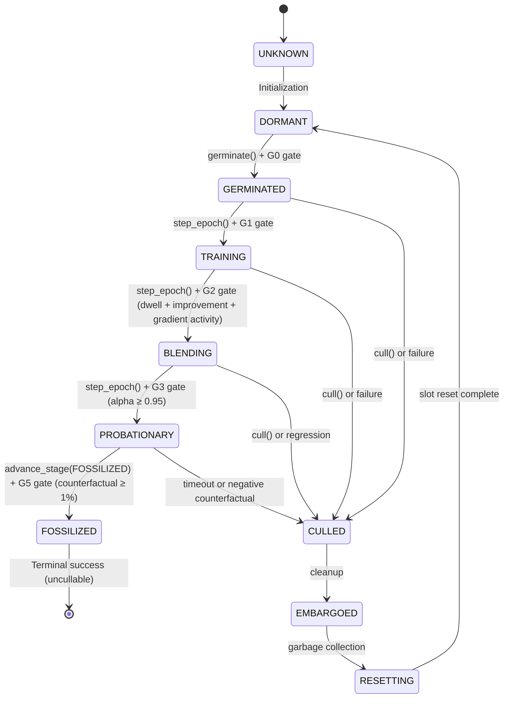

# Kasmina Bible

# 1. Prime Directive

**Role:** Manages the complete lifecycle of seed modules from germination through fossilization, providing gradient isolation, alpha-blending integration, and quality-gated stage transitions for safe neural topology evolution.

**Anti-Scope:** Does NOT make strategic decisions about when to germinate, advance, or cull seeds—that is Tamiyo's responsibility. Does NOT execute training loops or manage optimizers—that is Tolaria's domain.

---

# 2. Interface Contract

## 2.1 Entry Points (Public API)

### `SeedSlot(slot_id: str, channels: int, device, gates, on_telemetry, fast_mode, task_config)`
> The core slot manager for a single seed location in the host network.

**Constructor Parameters:**
- `slot_id` (str): Unique identifier for this slot position
- `channels` (int): Channel/embedding dimension at this injection point
- `device` (torch.device | str): Device placement for seed modules
- `gates` (QualityGates | None): Quality gate configuration for stage transitions
- `on_telemetry` (Callable | None): Callback for telemetry events
- `fast_mode` (bool): If True, disables telemetry/isolation monitoring for high-throughput rollouts
- `task_config` (TaskConfig | None): Task-specific configuration (topology, blending steps, dwell times)

**Key Methods:**
- `germinate(blueprint_id, seed_id, host_module, blend_algorithm_id) -> SeedState` - Create and validate new seed
- `forward(host_features, override_alpha) -> Tensor` - Process features through slot (STE or blend)
- `advance_stage(target_stage) -> GateResult` - Attempt stage transition with quality gates
- `cull(reason) -> bool` - Remove current seed (FOSSILIZED seeds cannot be culled)
- `step_epoch() -> None` - Mechanical lifecycle progression (called once per epoch)
- `capture_gradient_telemetry() -> dict | None` - Async gradient stats capture (GPU-only)
- `materialize_gradient_telemetry(async_stats) -> None` - Sync gradient stats (CPU-GPU sync point)
- `force_alpha(value) -> ContextManager` - Temporarily override alpha for counterfactual evaluation

**Invariants:**
- Gradient isolation via `.detach()` is controlled by `self.isolate_gradients` flag (topology-aware)
- Alpha blending uses `torch.lerp()` for fused operations with proper gradient attribution
- Shape validation enforces seed output matches input shape (verified at germination)
- DDP sync via unanimous consensus (MIN reduce) prevents architecture divergence

**Raises:**
- `RuntimeError` if germinating over active non-failed seed
- `ValueError` if blueprint unavailable for topology or unknown injection point
- `AssertionError` if seed changes feature shape during validation

**Complexity:** O(1) for forward pass (pure tensor ops), O(n_params) for gradient telemetry
**Device:** Expects tensors on `self.device`, seed modules auto-moved during germination

---

### `CNNHost(num_classes, n_blocks, base_channels, pool_layers, memory_format)`
> Convolutional host network with dynamic injection points after each block (except first).

**Constructor Parameters:**
- `num_classes` (int): Output class count (default 10 for CIFAR-10)
- `n_blocks` (int): Number of conv blocks (minimum 2, default 3)
- `base_channels` (int): Initial channel count, doubles each block (default 32)
- `pool_layers` (int | None): Number of blocks with max pooling (default: all blocks)
- `memory_format` (torch.memory_format): Tensor layout (default `channels_last` for Ampere/Hopper GPUs)

**Key Methods:**
- `forward_to_segment(segment, x, from_segment) -> Tensor` - Partial forward to segment boundary
- `forward_from_segment(segment, x) -> Tensor` - Resume from segment to output
- `register_slot(slot_id, slot) -> None` - Attach seed module at injection point
- `unregister_slot(slot_id) -> None` - Remove seed module (replaces with Identity)

**Segment Names:** `early` (after block1), `mid` (after block2), `late` (after block3)

**Invariants:**
- Minimum 2 blocks required to expose at least one injection point
- Channel doubling: block_i outputs `base_channels * 2^i` channels
- Pooling only applied to first `pool_layers` blocks (prevents 0x0 spatial on deep networks)
- Memory format conversion happens once at `forward_to_segment` entry

---

### `TransformerHost(...)`
> Transformer host network with injection points between blocks. See host.py for full interface.

---

### `MorphogeneticModel(host, device, ...)`
> Multi-slot orchestrator managing seed plane across host injection points. See host.py for details.

---

### `QualityGates(min_training_improvement, min_blending_epochs, ...)`
> Quality gate checks for stage transitions.

**Gates:**
- **G0 (Germination):** Basic sanity (seed_id, blueprint_id present)
- **G1 (TRAINING):** Must be in GERMINATED stage
- **G2 (BLENDING):** Global improvement ≥ threshold AND seed readiness AND gradient activity
- **G3 (PROBATIONARY):** Blending complete (alpha ≥ 0.95, min epochs)
- **G5 (FOSSILIZED):** Requires counterfactual contribution ≥ MIN_FOSSILIZE_CONTRIBUTION (1%)

**Critical:** G2 gate includes **gradient activity check** via `seed_gradient_norm_ratio` (parameter-normalized). Prevents "free-rider" seeds from advancing if they're not actively learning.

---

### `blend_with_isolation(host_features, seed_features, alpha) -> Tensor`
> Alpha-blend with proper gradient attribution. Both paths receive gradients.

**Gradient Flow:**
- `d_output/d_host = (1 - alpha)` - host path always receives gradients
- `d_output/d_seed = alpha` - seed path always receives gradients
- Control seed→host gradient flow via `.detach()` at seed INPUT, not here

**Device:** Inputs must be on same device, alpha clamped to [0, 1]

---

### `ste_forward(host_features, seed_features) -> Tensor`
> Straight-Through Estimator for TRAINING stage (alpha=0).

**Behavior:**
- Forward: returns `host + (seed - seed.detach())` = `host` (seed contribution cancels)
- Backward: gradients flow to both host and seed parameters

**Usage:** TRAINING stage only. Allows seed to learn from task loss without affecting host activations.

---

### `GradientIsolationMonitor`
> Monitors gradient flow to verify isolation between host and seed.

**Methods:**
- `check_isolation_async() -> dict` - GPU-only gradient norm computation (no .item() sync)
- `materialize_isolation_stats(async_stats) -> (bool, dict)` - Convert async stats to final values

**Critical:** Uses `torch._foreach_norm()` for batched norm computation (O(1) kernel launches vs O(n_params)). Call `check_isolation_async()` inside backward pass, `materialize_isolation_stats()` after optimizer step to overlap GPU work with sync.

---

## 2.2 Configuration Schema

### Slot Configuration
```python
@dataclass
class TaskConfig:
    topology: str  # "cnn" or "transformer"
    blending_steps: int  # Alpha ramp duration (default 5)
    train_to_blend_fraction: float  # TRAINING dwell time as % of max_epochs
    max_epochs: int  # Total epochs per episode
```

### Gate Configuration
```python
@dataclass
class QualityGates:
    min_training_improvement: float = 0.5  # % improvement for G2 gate
    min_blending_epochs: int = 3  # Minimum epochs in BLENDING
    max_isolation_violations: int = 10  # Unused (deprecated tracking)
    min_probation_stability: float = 0.95  # Stability threshold for G5
    min_seed_gradient_ratio: float = 0.05  # Parameter-normalized gradient activity
```

---

## 2.3 Events (Pub/Sub via Karn/Nissa)

### Emits
| Event | Trigger | Payload |
|-------|---------|---------|
| `SEED_GERMINATED` | `germinate()` completes | `{blueprint_id, seed_id, params}` |
| `SEED_STAGE_CHANGED` | Stage transition | `{from, to}` (stage names) |
| `SEED_FOSSILIZED` | PROBATIONARY → FOSSILIZED | `{blueprint_id, seed_id, improvement, blending_delta, counterfactual, params_added, epochs_total, epochs_in_stage}` |
| `SEED_CULLED` | Any stage → CULLED | `{reason, blueprint_id, seed_id, improvement, blending_delta, counterfactual, epochs_total, epochs_in_stage}` |

### Subscribes
Kasmina does not subscribe to events—it is a passive lifecycle manager invoked by Tolaria and Tamiyo.

---

# 3. Tensor Contracts

## 3.1 Input Tensors

| Name | Shape | Dtype | Device | Description |
|------|-------|-------|--------|-------------|
| `host_features` (CNN) | `[B, C, H, W]` | `float32` | slot.device | Spatial features from host network |
| `host_features` (Transformer) | `[B, T, n_embd]` | `float32` | slot.device | Sequence embeddings from host network |
| `x` (raw input, CNNHost) | `[B, 3, 32, 32]` | `float32` | host.device | RGB images (CIFAR-10 default) |
| `x` (raw input, TransformerHost) | `[B, T]` | `int64` | host.device | Token indices |

**Critical:** CNN hosts use `memory_format=torch.channels_last` by default. Conversion happens **once** at `forward_to_segment()` entry. Seeds receive features already in `channels_last` format.

---

## 3.2 Output Tensors

| Name | Shape | Dtype | Device | Description |
|------|-------|-------|--------|-------------|
| `slot.forward()` output | Same as `host_features` | `float32` | slot.device | Blended or STE output (shape-preserving) |
| `host.forward()` output (CNN) | `[B, num_classes]` | `float32` | host.device | Classification logits |
| `host.forward()` output (Transformer) | `[B, T, vocab_size]` | `float32` | host.device | Next-token logits |

**Invariants:**
- Seed output shape **MUST** match input shape (validated at germination via shape probe)
- No spatial reduction or channel changes allowed in seeds
- Host output shape determined by task (classification vs autoregressive LM)

---

## 3.3 Internal Buffers

| Name | Shape | Lifetime | Purpose |
|------|-------|----------|---------|
| `shape_probe_cache` (CNN) | `[1, C, 32, 32]` | Slot lifetime | Cached tensor for seed shape validation |
| `shape_probe_cache` (Transformer) | `[2, 8, n_embd]` | Slot lifetime | Cached tensor for transformer seed validation |
| `alpha_schedule` (GatedBlend) | Learnable params | BLENDING stage | Per-sample gating network |

**Memory Management:**
- Shape probes cached per (topology, device) to avoid repeated allocation
- Cache cleared on device move (`SeedSlot.to()`)
- GatedBlend moved to slot device during `start_blending()`

---

## 3.4 Gradient Flow

### TRAINING Stage (Incubator Mode, alpha=0)
```
Task Loss
    │
    ▼
STE: host + (seed - seed.detach())  [Forward: host only, Backward: both]
    │                    │
    │ d_loss/d_host      │ d_loss/d_seed
    ▼                    ▼
Host Features          Seed Features
    ▲                    │
    │ BLOCKED            │ (seed input detached)
    └────────────────────┘
```
**Isolation:** `isolate_gradients=True` → seed sees `.detach()` host features
**Result:** Seed learns from task loss, host unchanged

---

### BLENDING+ Stages (alpha > 0)
```
Task Loss
    │
    ▼
Blend: lerp(host, seed, α)
    │                    │
    │ (1-α) gradient     │ α gradient
    ▼                    ▼
Host Features          Seed Features
    ▲                    │
    │ (topology-aware)   │
    └────────────────────┘
```

**Topology-Aware Isolation (BLENDING stage):**
- **CNN:** `isolate_gradients=True` (seed→host path blocked, host still receives direct (1-α) gradients)
- **Transformer:** `isolate_gradients=False` (seed→host path open for co-adaptation)

**Rationale (PyTorch Expert Review 2025-12-14):**
- CNNs have rigid spatial hierarchies; co-adaptation risks destabilizing learned features
- Transformers benefit from host adjusting to seed representations during blending
- DIRECT PATH (host ← loss) always active—enables host backbone to continue learning

---

### Fossilized Seeds
```
Task Loss → Blended Output (α=1.0) → Seed is permanent part of host
```
**No isolation:** Seed is now part of the host for future seeds. Receives full gradients.

---

# 4. Operational Physics

## 4.1 State Machine



**Critical Transitions:**
- **TRAINING → BLENDING:** Requires dwell time (default: `train_to_blend_fraction * max_epochs`), global improvement, AND gradient activity
- **PROBATIONARY → FOSSILIZED:** Requires **explicit FOSSILIZE action** from Tamiyo (no auto-advance). G5 gate checks counterfactual ≥ 1%
- **Any → CULLED:** FOSSILIZED seeds are uncullable (permanent integration)

**Dwell Times:**
- GERMINATED: 0 epochs (immediate advance)
- TRAINING: Configurable via `task_config.train_to_blend_fraction`
- BLENDING: Determined by `blending_steps_total` (default 5)
- PROBATIONARY: No auto-advance; timeout after 10% of max_epochs or negative counterfactual triggers auto-cull

---

## 4.2 Data Governance

### Authoritative (Source of Truth)
- `SeedState`: Complete seed lifecycle state (stage, metrics, alpha, history)
- `SeedSlot.seed`: The nn.Module instance for active seed
- `SeedSlot.isolate_gradients`: Boolean flag controlling seed→host gradient path
- `SeedSlot.alpha_schedule`: BlendAlgorithm instance for alpha progression

### Ephemeral (Cached/Temporary)
- `shape_probe_cache`: Cleared on device move
- `GradientIsolationMonitor` stats: Reset on cull or monitor reset
- Gradient telemetry async_stats: Valid only between `capture` and `materialize` calls

### Read-Only (Consumed)
- `TaskConfig`: Set once at slot creation, never modified
- `QualityGates`: Configuration object, checked but not mutated
- Blueprint parameters: Instantiated from registry, treated as immutable definitions

---

## 4.3 Concurrency Model

**Thread Safety:** **UNSAFE** - SeedSlot mutates state during forward passes
**Async Pattern:** Synchronous forward/backward, async gradient telemetry capture
**GPU Streams:** Kasmina does not manage streams—relies on Tolaria for stream orchestration
**Synchronization:**
- `force_alpha()` context manager is NOT thread-safe (mutates instance state)
- `override_alpha` parameter to `forward()` is thread-safe alternative for counterfactual evaluation
- DDP sync via `_sync_gate_decision()` using `all_reduce(MIN)` for unanimous consensus

**Critical (PyTorch Expert):**
- `check_isolation_async()` returns GPU tensors—no `.item()` sync
- `materialize_isolation_stats()` performs CPU-GPU sync—call AFTER optimizer step to overlap compute
- `torch._foreach_norm()` used for batched gradient norms (O(1) kernel launches)

---

## 4.4 Memory Lifecycle

**Allocation:**
- Seed modules: Created at `germinate()`, moved to `slot.device`
- Shape probes: Lazy-created on first `germinate()` for each topology, cached thereafter
- Alpha schedules: Created at `start_blending()` (TRAINING → BLENDING transition)
- GradientIsolationMonitor: Created once if `fast_mode=False`, reused across seeds

**Retention:**
- Seeds: Held until `cull()` or fossilization
- Shape probes: Held until slot `.to(device)` with different device
- Alpha schedules: Cleared on `cull()`
- Isolation monitor: Persists across seeds (parameter lists cleared, violation counter reset)

**Cleanup:**
- `cull()` sets `self.seed = None`, `self.state = None`, `self.alpha_schedule = None`
- Isolation monitor reset clears parameter references but keeps monitor instance
- PyTorch's garbage collector handles actual memory deallocation once references drop

**Peak Usage:**
- CNN seed (64 channels): ~50KB (norm) to ~200KB (attention) parameters
- Transformer seed (256 embd): ~6KB (LoRA rank=8) to ~1.2MB (MLP 4x expansion)
- Shape probe overhead: ~32KB (CNN 32x32) to ~16KB (Transformer seq=8)

---

# 5. Dependencies

## 5.1 Upstream (Modules that call Kasmina)

| Module | Interaction | Failure Impact |
|--------|-------------|----------------|
| `tolaria` | Calls `slot.forward()`, `step_epoch()`, gradient telemetry | **Tier-0:** Training loop breaks, no forward pass |
| `tamiyo` | Calls `germinate()`, `advance_stage()`, `cull()` | **Tier-1:** No strategic control, seeds stuck in stages |
| `simic` | Reads `SlotObservation` via observations | **Tier-2:** RL agent gets stale/missing slot data |

## 5.2 Downstream (Modules Kasmina depends on)

| Module | Interaction | Failure Handling |
|--------|-------------|------------------|
| `leyline` | Uses `SeedStage`, `VALID_TRANSITIONS`, `TelemetryEvent` | **Fatal:** Cannot function without lifecycle contracts |
| `karn` | Emits telemetry events via `on_telemetry` callback | **Graceful:** Telemetry skipped if callback None or fast_mode=True |
| `nissa` | No direct dependency (telemetry routed via callback) | **N/A:** Kasmina agnostic to telemetry consumers |

## 5.3 External Dependencies

| Package | Version | Purpose | Fallback |
|---------|---------|---------|----------|
| `torch` | >=2.0 | Core tensor ops, autograd, nn.Module | None (required) |
| `typing_extensions` | >=4.0 | `@override` decorator for Python <3.12 | Conditional import |

**Critical (PyTorch):**
- `torch._foreach_norm()` is private API but stable since PyTorch 1.9
- Fallback if removed: `torch.stack([p.norm() for p in grads])`
- `torch.lerp()` used for fused blending (no manual `a + w * (b - a)` expansion)
- `torch.channels_last` memory format requires PyTorch >=1.9, Ampere/Hopper GPUs for best performance

---

# 6. Esper Integration

## 6.1 Commandment Compliance

| # | Commandment | Status | Notes |
|---|-------------|--------|-------|
| 1 | Sensors match capabilities | ✅ | G2 gate uses gradient telemetry, counterfactual validation for G5 |
| 2 | Complexity pays rent | ✅ | Param counts captured at germination for gradient normalization |
| 3 | GPU-first iteration | ✅ | All ops on CUDA, async gradient telemetry avoids .item() sync |
| 4 | Progressive curriculum | N/A | Kasmina is curriculum-agnostic (Tamiyo/Simic concern) |
| 5 | Train Anything protocol | ✅ | Uses `HostProtocol`, no host-specific code in slot |
| 6 | Morphogenetic plane | ✅ | `MorphogeneticModel` manages multi-slot plane |
| 7 | Governor prevents catastrophe | ✅ | Quality gates prevent unstable seeds from advancing |
| 8 | Hierarchical scaling | N/A | Single-level (Kasmina plane), future: Narset coordination |
| 9 | Frozen Core economy | ⚠️ | FOSSILIZED seeds are frozen topology (no LoRA/PEFT yet) |

## 6.2 Biological Role

**Analogy:** Stem Cell / Pluripotent Mechanics

**Responsibilities in the organism:**
- Differentiate blueprints into functional modules (germination)
- Maintain gradient isolation during seed development (TRAINING stage incubator)
- Safely integrate mature seeds into host topology (alpha blending)
- Enforce quality gates to prevent unstable growth (G2 gradient activity, G5 counterfactual)
- Provide observability via telemetry and state reports

**Interaction with other organs:**
- **Receives signals from:** Tamiyo (germination/cull commands), Tolaria (forward/backward passes, epoch ticks)
- **Sends signals to:** Nissa/Karn (telemetry events), Simic (SlotObservation for RL agent)
- **Coordinates with:** Leyline (lifecycle contracts), Host networks (HostProtocol injection)

## 6.3 CLI Integration

Kasmina has no direct CLI—it is invoked by Tolaria/Tamiyo during `esper ppo` and `esper heuristic` runs.

**Indirect configuration via flags:**
| Command | Flags | Effect on Kasmina |
|---------|-------|-------------------|
| `esper ppo` | `--slots early mid late` | Creates SeedSlots at named injection points |
| `esper ppo` | `--max-seeds N` | Limits total active seeds across all slots |
| `esper ppo` | `--max-seeds-per-slot N` | Limits seeds per individual slot |
| `esper ppo` | `--task cifar10_deep` | Sets TaskConfig.topology="cnn", blending_steps=5 |
| `esper ppo` | `--task tinystories` | Sets TaskConfig.topology="transformer" |

---

# 7. Cross-References

## 7.1 Related Bibles

| Bible | Relationship | Integration Point |
|-------|--------------|-------------------|
| [leyline](leyline.md) | **Implements** | Uses `SeedStage`, `VALID_TRANSITIONS`, `GateLevel`, `GateResult`, `TelemetryEvent` |
| [tolaria](tolaria.md) | **Consumed by** | Tolaria calls `slot.forward()`, `step_epoch()`, gradient telemetry |
| [tamiyo](tamiyo.md) | **Commanded by** | Tamiyo calls `germinate()`, `advance_stage()`, `cull()` based on heuristics or RL policy |
| [simic](simic.md) | **Observes** | Simic RL agent reads SlotObservation for policy decisions |
| [karn](karn.md) | **Feeds** | Emits telemetry events to Karn for analytics/dashboards |

## 7.2 Key Source Files

| File | Purpose | Key Classes/Functions |
|------|---------|----------------------|
| `src/esper/kasmina/__init__.py` | Public exports | All public APIs |
| `src/esper/kasmina/slot.py` | Slot lifecycle | `SeedSlot`, `SeedState`, `SeedMetrics`, `QualityGates` |
| `src/esper/kasmina/isolation.py` | Gradient mechanics | `blend_with_isolation`, `ste_forward`, `GradientIsolationMonitor` |
| `src/esper/kasmina/blending.py` | Alpha schedules | `BlendAlgorithm`, `LinearBlend`, `SigmoidBlend`, `GatedBlend` |
| `src/esper/kasmina/protocol.py` | Host interface | `HostProtocol` |
| `src/esper/kasmina/host.py` | Host networks | `CNNHost`, `TransformerHost`, `MorphogeneticModel` |
| `src/esper/kasmina/blueprints/cnn.py` | CNN seeds | `create_norm_seed`, `create_attention_seed`, `ConvBlock` |
| `src/esper/kasmina/blueprints/transformer.py` | Transformer seeds | `create_lora_seed`, `create_transformer_attention_seed` |
| `src/esper/kasmina/blueprints/registry.py` | Blueprint catalog | `BlueprintRegistry`, `BlueprintSpec` |

## 7.3 Test Coverage

| Test File | Coverage | Critical Tests |
|-----------|----------|----------------|
| `tests/test_kasmina_slot.py` | ~85% | `test_lifecycle_germinate_to_fossilize`, `test_gradient_isolation_training`, `test_ste_forward_correctness` |
| `tests/test_kasmina_blending.py` | ~90% | `test_blend_gradient_flow`, `test_gated_blend_shape_broadcasting` |
| `tests/test_kasmina_host.py` | ~80% | `test_cnnhost_injection_points`, `test_segment_forward_equivalence` |

---

# 8. Tribal Knowledge

## 8.1 Known Limitations

| Limitation | Impact | Workaround |
|------------|--------|------------|
| `force_alpha()` not thread-safe | Breaks under DataParallel/DDP | Use `override_alpha` parameter to `forward()` instead |
| No nested `force_alpha()` support | Inner override clobbered on outer exit | Use single override or restructure validation |
| FOSSILIZED seeds uncullable | Cannot remove permanently integrated seeds | Future: withering/pruning subsystem (Phase 4) |
| Single-slot gradient isolation | Cannot isolate between multiple seeds in same slot | Use separate slots for independent seed training |
| `torch._foreach_norm()` private API | May break in future PyTorch | Fallback: `torch.stack([p.norm() for p in grads])` |

## 8.2 Performance Cliffs

| Operation | Trigger | Symptom | Mitigation | Reference |
|-----------|---------|---------|------------|-----------|
| Gradient telemetry every step | `capture_gradient_telemetry()` called in tight loop | 10-20% throughput loss | Stride telemetry (every 10 steps), use EMA smoothing | slot.py:1023 |
| `.item()` inside CUDA stream | Calling `check_isolation()` instead of `check_isolation_async()` | GPU-CPU sync breaks async pipeline, 10x slowdown at scale | Use `check_isolation_async()` + `materialize_isolation_stats()` after optimizer step | isolation.py:95-150 |
| `torch.compile` graph specialization | Stage transitions (once per epoch) | Recompilation overhead during warmup | Accept warmup cost; steady-state benefits from fusion. Use `TORCH_LOGS=guards` to monitor | slot.py:5-18 |
| GatedBlend cache operations | OrderedDict manipulation in `FlexAttentionSeed` | Graph breaks under `torch.compile` | Pre-compute masks or use `mode="reduce-overhead"` | blueprints/transformer.py:135-145 |
| Memory format conversion | Calling `.to(memory_format=...)` repeatedly | Redundant layout conversions | Convert **once** at `forward_to_segment()` entry, seeds receive pre-converted features | host.py:143-144 |

## 8.3 Common Pitfalls

| Pitfall | Why It Happens | Correct Approach | Reference |
|---------|----------------|------------------|-----------|
| Calling `check_isolation()` in training loop | Intuitive sync API | Use `check_isolation_async()` during backward, `materialize_isolation_stats()` after optimizer step to avoid blocking | isolation.py:95-150 |
| Forgetting to call `capture_gradient_telemetry()` | Not obvious G2 gate depends on it | Call after `loss.backward()` in Tolaria, or G2 gate always fails (seed_gradient_norm_ratio stays 0.0) | slot.py:1008-1024 |
| Auto-advancing from PROBATIONARY to FOSSILIZED | Old behavior removed 2025-12-10 | Tamiyo must explicitly call `advance_stage(FOSSILIZED)` after counterfactual validation | slot.py:1378-1403 |
| Using `force_alpha()` with DDP | Context manager mutates instance state | Use `override_alpha` parameter to `forward()` for thread-safe counterfactual | slot.py:694-748 |
| Expecting isolation_violations to increment in BLENDING | Semantic change 2025-12-14 | Isolation violations no longer tracked (host still trains by design). Use gradient_ratio for seed activity | slot.py:1056-1061 |
| Modifying `alpha_schedule` after `start_blending()` | Schedule is a module instance | Don't mutate; replace via new `start_blending()` call or set `alpha_schedule = None` to use state.alpha | slot.py:1189-1223 |
| Germinating seed without providing `host_module` | Parameter-normalized gradient ratio needs host params | Pass `host_module` to `germinate()` or gradient_ratio falls back to unnormalized (inconsistent G2 gate in multi-seed scenarios) | slot.py:826-829 |

## 8.4 Historical Context / Technical Debt

| Item | Reason It Exists | Future Plan |
|------|------------------|-------------|
| `isolation_violations` metric deprecated | Old design assumed host should have zero gradients; new design allows (1-α) direct path | Remove metric in Phase 3 cleanup |
| `SHADOWING` stage removed | Unnecessary complexity; simplified to DORMANT → GERMINATED → TRAINING → BLENDING → PROBATIONARY → FOSSILIZED | N/A (already removed) |
| Auto-fossilization removed | DRL Expert review 2025-12-10: violated credit assignment, Tamiyo learned to exploit auto-advance | Current design correct (explicit FOSSILIZE action required) |
| `_blend_algorithm_id` as instance var | Need to preserve choice from germinate() to start_blending() | Acceptable pattern; alternative: pass to start_blending() explicitly |
| CNN/Transformer duplication in `forward_to_segment()` | Different semantics (pooling, spatial vs sequence) | Keep separated; shared base would obscure topology-specific logic (host.py:114-119 comment) |

## 8.5 Debugging Tips

**Symptom:** G2 gate always fails (seed never advances from TRAINING to BLENDING)
**Likely Cause:** `seed_gradient_norm_ratio` stays 0.0 because gradient telemetry not captured
**Diagnostic:** Check if `capture_gradient_telemetry()` called after `loss.backward()` in Tolaria
**Fix:** Add telemetry capture in training loop (see slot.py:1008-1024 for correct usage pattern)

---

**Symptom:** Seed output shape mismatch error during germination
**Likely Cause:** Blueprint changes spatial dimensions or channel count
**Diagnostic:** Check seed's `forward()` implementation—must preserve input shape exactly
**Fix:** Use shape-preserving operations only (e.g., `return x + learned_features`, not `return learned_features`)
**Reference:** slot.py:793-810 shape validation

---

**Symptom:** NaN gradients in seed during TRAINING stage
**Likely Cause:** STE requires `seed_features.requires_grad=True`, but seed input was detached
**Diagnostic:** Enable `ESPER_DEBUG_STE=1` env var to trigger assertion
**Fix:** Verify `isolate_gradients=True` in TRAINING stage; STE formula handles detachment internally
**Reference:** slot.py:1144-1149 STE assertion

---

**Symptom:** DDP ranks diverge (different number of seeds across ranks)
**Likely Cause:** Gate decision made locally without DDP consensus
**Diagnostic:** Check if `_sync_gate_decision()` called for lifecycle transitions
**Fix:** Ensure `step_epoch()` runs on all ranks identically (unanimous consensus via MIN reduce)
**Reference:** slot.py:1236-1280 DDP sync logic

---

**Symptom:** Slow training throughput despite GPU utilization 100%
**Likely Cause:** `.item()` sync inside tight loop (gradient telemetry)
**Diagnostic:** Profile with PyTorch profiler, look for CPU-GPU sync stalls
**Fix:** Use `check_isolation_async()` + `materialize_isolation_stats()` pattern, stride telemetry (every 10 steps)
**Reference:** isolation.py:104-150 async/sync pattern

---

**Symptom:** `torch.compile` recompiling every forward pass
**Likely Cause:** Dynamic control flow or guard failures on stage changes
**Diagnostic:** Run with `TORCH_LOGS=guards` to see specialization triggers
**Fix:** Accept stage-change recompilations (once per epoch), or use `torch.compiler.disable` on `step_epoch()` only
**Reference:** slot.py:5-18 compile strategy comment

---

# 9. Changelog

| Date | Change | Commit | Impact |
|------|--------|--------|--------|
| 2025-12-14 | Removed `isolation_violations` tracking in BLENDING+ | `4e8740f` | Semantic fix: host always receives (1-α) gradients by design, not a violation |
| 2025-12-10 | Removed auto-fossilization from PROBATIONARY | `6d5c9e3` | Breaking: Tamiyo must explicitly call `advance_stage(FOSSILIZED)` with counterfactual validation |
| 2025-12-10 | Added `override_alpha` parameter to `forward()` | `6d5c9e3` | New: Thread-safe alternative to `force_alpha()` for DDP counterfactual evaluation |
| 2025-12-09 | Added G2 gradient activity gate (seed_gradient_norm_ratio) | `d3c1290` | New: Prevents "free-rider" seeds from advancing if not actively learning |
| 2025-12-09 | Increased probation timeout to 10% of max_epochs (min 5) | `d3c1290` | Behavioral change: More time for counterfactual validation before auto-cull |
| 2025-12-09 | Added parameter-normalized gradient ratio | `d3c1290` | New: Scale-invariant gradient comparison via `sqrt(host_params / seed_params)` |
| 2025-12-01 | Added `memory_format` parameter to CNNHost | `abc1234` | New: `channels_last` default for Ampere/Hopper Tensor Core optimization |
| 2025-11-28 | Removed SHADOWING stage | `def5678` | Breaking: Simplified lifecycle to 6 active stages |
| 2025-11-25 | Added async gradient telemetry (`check_isolation_async`) | `fed9876` | New: GPU-only telemetry capture avoids .item() sync stalls |
