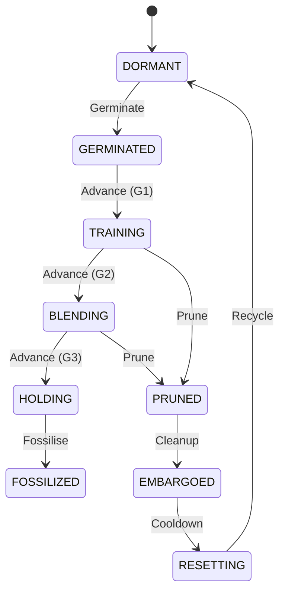

# Architecture Overview

Esper's architecture is a complex blend of meta-learning, reinforcement learning (RL), and morphogenetic structural changes. It involves controlling the training process of a neural network using another neural network.

## System Mapping

The system is decoupled into several subsystems:
*   **Kasmina** controls the actual model parameters, the "host", and handles the physical integration of "seeds" (new neural modules).
*   **Tamiyo** acts as the agent/policy that decides *what* to do with the seeds (germinate, prune, fossilise) by observing the host.
*   **Simic** provides the reward signals and drives the PPO updates for Tamiyo.
*   **Tolaria** manages the execution logic safely.
*   **Leyline** handles the boundaries and type definitions shared across all these systems.

## Nested Training Loops

Esper uses PPO (Proximal Policy Optimization) to control the host neural network's training process. This creates a nested loop architecture:

1.  **Outer Loop (PPO Rounds/Updates):** Composed of several parallel environments (e.g., 200 batches).
2.  **Batch:** A collection of parallel episodes used for one PPO update. For example, if `n_envs=10`, one batch equals 10 parallel episodes.
3.  **Environment (Episode):** A complete host training run (e.g., 150 steps). This is the RL trajectory.
4.  **Step:** At each step, the **host trains for 1 epoch**, and **Tamiyo makes 1 policy decision** (e.g., WAIT, GERMINATE) based on the new host state.

## The Seed Lifecycle

Seeds exist in a highly controlled state machine, managed primarily by Kasmina and decided upon by Tamiyo. The transitions are:

### Lifecycle Phases
1.  **Dormant:** Seed does not exist yet.
2.  **Germinated:** The module is created, but its influence is completely isolated.
3.  **Training:** The seed learns from task gradients "behind the host" safely, without destabilizing the host.
4.  **Blending:** The seed's output is slowly ramped in with controlled alpha schedules.
5.  **Holding:** A stabilization window before permanent commitment.
6.  **Fossilized:** The seed is permanently accepted as part of the model's committed structure.
7.  **Pruned/Embargoed/Resetting:** If a seed fails to prove its worth, it is cut, cleaned up, and recycled back to Dormant.
